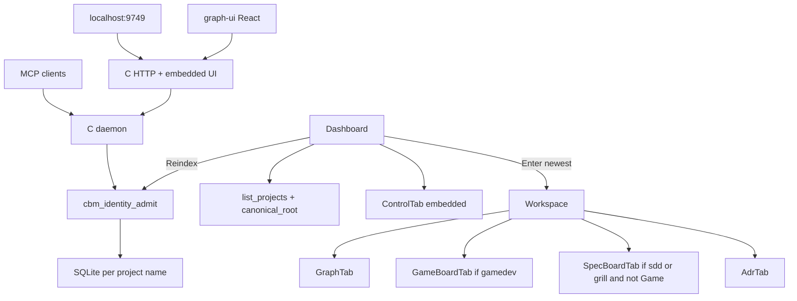

# Project Context — codebase-memory-mcp
Last Updated: 2026-09-03 / Current Spec: none (idle) / Completed Specs: spec-001-w3q-executive-dashboard … spec-017-b4w-game-debt-chrome / Total Features Completed: 17

## What This Project Does
Native C MCP server that indexes a repo into a persistent knowledge graph (tree-sitter + optional Hybrid LSP). Agents query structure via 15 MCP tools. A daemon-owned HTTP UI at localhost:9749 (default) embeds a React 3D graph explorer.

Account home is an executive Dashboard (project list + Control, grayscale chrome). Enter opens Graph. Workspace tabs: Graph always; Game if `.gamedev/` is a directory (one-shot GET `/api/game-board`; Specs omitted — silent win); Specs if `.sdd-skill/` or `.grill/` and Game is not shown (one-shot GET `/api/spec-board`); ADR always. Game is a map: four always-visible columns (exist-only artifact cards + unconverted grill Inbox) plus chrome (phase, focus, copyable `/gamedev-skill continue`). Cards expand in place; done artifacts archive into CBM `game_archive`; a Blocked strip lists live state.md blocked lines. Not a launcher. Empty `.gamedev/` still shows Game (`state.md missing`) with empty columns (headers only). Leftover `?tab=specs` on a gamedev path becomes `tab=game`. Specs cards expand in place; Todo Mixed: unconverted grill epics then planned/draft specs; Done archives into CBM `spec_archive`. Specs chrome lists open TECH_DEBT.md rows (Status ≠ resolved, cap 16) in an Open tech debt strip when `debt` is non-empty; Todo EpicCard id wraps the full grill path (title truncate stays). Path↔Project is 1:1 at admission. User-triggered index fills ADR generated from the gamedev trio when `.gamedev/` is a directory, else the sdd-skill trio; watcher does not. AdrTab stamp stays `formatIndexedAt(indexed_at)` with the generic replace warning (no cycle stamp). Last-indexed visible text is runtime-local Intl; store `indexed_at` stays ISO Z. Game pane chrome has Show Dones (default hide done) + Track A/B/All; archived done needs both toggles; Inbox unfiltered by those toggles. When `{root}/.gamedev/epics_registry.md` is a regular file, Inbox hide is that table only (skip Companion-to/roadmap); absent/dir keeps spec-011. InboxCard id wraps; Artifact truncate stays. Specs does not read the registry. On Game, open `{root}/.gamedev/backlog.md` `debt:*` rows (closed iff `resolved-by` in the entry) sit after Blocked when GET `debt` is non-empty; dead text; filters do not hide them. Specs debt stays TECH_DEBT.md. CBM never creates `backlog.md`.

## Architecture Overview
Stack: graph-ui React 19 + Vite 6 + Tailwind 4 + Three.js ~0.183 / engine C11 (Makefile.cbm -Wall -Wextra -Werror) / per-project SQLite under ~/.cache/codebase-memory-mcp/ / tests: C suite + graph-ui Vitest / deploy: scripts/build.sh [--with-ui], GitHub releases
Key Modules:
- src/: indexer, daemon, HTTP UI server, MCP tools, spec_board.c, game_board.c, adr/adr_fill.c, foundation/identity.c, store/identity_catalog.c
- graph-ui/: App.tsx (TabId dashboard|graph|specs|adr|game), Dashboard, WorkspaceHeader + WorkspaceTabStrip, GraphTab, GameBoardTab, SpecBoardTab (EpicCard), AdrTab
- ~/.cache/codebase-memory-mcp/: one .db per project name (admission enforces Path 1:1; no UNIQUE root_path)

## Completed Features
| Spec | Feature | Date Closed | KPI Achieved |
| spec-001 … spec-012 | Dashboard, workspace, Path 1:1, ADR fill, spec expand, spec archive, last-indexed local, grill Mixed Todo, Specs tab grill presence, Game tab silent win, Game phase board, Game expand/archive/deps | 2026-08-29…31 | Yes — recap in each specs/{id}/ |
| spec-013-r9w-adr-fill-gamedev-trio | ADR fill from gamedev trio | 2026-08-31 | Yes — `.gamedev/` dir fills gamedev trio only; leftover sdd omitted; no merge/fallback; AdrTab generic; watcher skip |
| spec-014-x7m-filters | Game visibility filters | 2026-09-01 | Yes — Show Dones default hide done; Track A/B/All exclusive All includes H; archived done AND; Inbox unfiltered; client React state; Specs lock |
| spec-015-s5k-specs-debt-and-path | Specs debt chrome + EpicCard path wrap | 2026-09-02 | Yes — GET debt[{id,title}] cap 16; heading Status wins; Specs-only strip; EpicCard id wraps; 0 skill writes |
| spec-016-d9v-game-inbox-registry | Game Inbox registry hide + InboxCard wrap | 2026-09-03 | Yes — regular file sole hide; absent/dir keeps spec-011; Inbox wrap; 0 skill writes |
| spec-017-b4w-game-debt-chrome | Game debt chrome | 2026-09-03 | Yes — GET debt[{id,title}] cap 16 from backlog.md; Game strip after Blocked; parseGameBoard keeps debt; 0 skill writes; never create backlog.md |

## Current Development
Idle. Last closed: spec-017-b4w-game-debt-chrome. Ready: /sdd-skill feature new <name>

## Key Decisions Made
| Decision | ADR | Spec | Reason |
| Same GET always-emit game debt[{id,title}]; cap 16; no has_more | SDD-ADR-072 | spec-017 | no second route; overflow omit |
| Parse backlog.md in game_board.c; no spec_board helper | SDD-ADR-073 | spec-017 | HTTP/spec_board no backlog fopen |
| Game-only strip after BlockedStrip; reuse specBoard.openTechDebt | SDD-ADR-074 | spec-017 | header would leak onto Graph/ADR |
| Registry regular file is sole Game Inbox hide; skip Companion-to/roadmap when present | SDD-ADR-069 | spec-016 | absent/dir keeps spec-011 |
| Parse last-wins NNN exact slug hide-set in game_board.c | SDD-ADR-070 | spec-016 | HTTP no registry fopen |
| InboxCard id wraps break-all; Artifact truncate locked | SDD-ADR-071 | spec-016 | Specs does not read the registry |
| Always-emit debt[{id,title}] cap 16; no has_more; same GET | SDD-ADR-065 | spec-015 | no second route |
| Parse TECH_DEBT.md in spec_board.c; heading Status wins | SDD-ADR-066 | spec-015 | HTTP no debt fopen |
| Specs-only strip; aria-label; dead text; omit [] | SDD-ADR-067 | spec-015 | Game/header do not host Specs strip |
| EpicCard id wraps break-all; other ids truncate locked | SDD-ADR-068 | spec-015 | title truncate stays |
| Client React state only; remount/?project= reset; GET refetch keeps; Inbox unfiltered | SDD-ADR-062 | spec-014 | no GET query / localStorage |
| Hide work_state done unless Show Dones; archived done AND Show archived | SDD-ADR-063 | spec-014 | spec-012 Show archived alone leaked finished archived |
| Exclusive aria-pressed Track A/B/All; keep specBoard.showArchived; Specs lock | SDD-ADR-064 | spec-014 | radiogroup fails Gherkin; Specs must not copy Game keys |
| XOR trio: gamedev dir wins; no sdd merge or fallback | SDD-ADR-058 | spec-013 | leftover sdd must not sit next to Game |
| Local cbm_is_dir in adr_fill; no spec_board import | SDD-ADR-059 | spec-013 | fill must not link to the UI board reader |
| NULL means neither skill dir; empty gamedev dir still marks | SDD-ADR-060 | spec-013 | empty Game dir must not leave leftover sdd generated |
| Do not ALWAYS_SKIP .gamedev this spec | SDD-ADR-061 | spec-013 | fill is fopen; adding skip would drop GDD/state.md File nodes |
| spec-001…012 Dashboard / workspace / Path 1:1 / ADR fill / expand / archive / last-indexed TZ / grill Mixed Todo / Specs grill presence / Game silent win / Game phase board / Game expand+archive+deps | SDD-ADR-002..057 | spec-001…012 | recap; full: each specs/{id}/ + baseline/ARCHITECTURE_ADR.md |
(full list: baseline/ARCHITECTURE_ADR.md + .grill/plans/)

## Technical Debt & Known Issues
See baseline/TECH_DEBT.md. TD-001/002/003/004 resolved. Store files remain name-keyed.

## Conventions & Standards
Follows docs/constitution.md (draft; IV.1–IV.4 spec-003; IX.2 + IX.5 XOR spec-013; IX.2 spec-005..017 append). graph-ui: TypeScript, functional components, i18n en+zh, Vitest+Testing Library. C: cbm_ prefix, explicit errors, no language runtime. Do not index .sdd-skill/ as code graph. `.gamedev` is not ALWAYS_SKIP this cycle.

## Onboarding sequence for a new agent
context_ai.md → specs/{spec_active}/spec.md → specs/{spec_active}/plan.md → state.md → prompts/prompt-[role].agent → execute

## Pointers
grill plan=.grill/plans/tech-debt-and-epics-registry/ | active spec=none | last closed spec=specs/spec-017-b4w-game-debt-chrome/ | constitution.md=rules (draft; IV + IX.5 XOR + IX.2 spec-017 confirmed) | baseline/TECH_STACK.md | baseline/ARCHITECTURE_ADR.md
