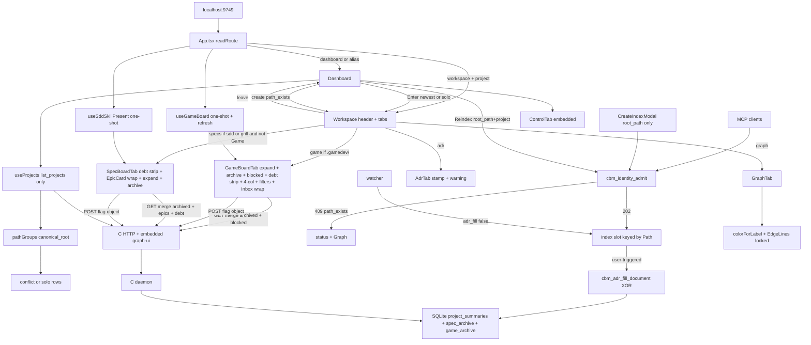

# codebase-memory-mcp — Overview
Last updated: 2026-09-03 — spec-017-b4w-game-debt-chrome closed | Reading time: 5-7min

## What Does This Project Do?

This product indexes a source repository into a local knowledge graph. Operators and agents then query that graph (who calls what, what a file contains, architecture shape) instead of grepping the tree blindly.

The engine is a C daemon. It speaks MCP tools to agents and also serves a React UI on localhost:9749 (default). Account home is an executive Dashboard: indexed folders plus daemon Control on one screen, last-indexed visible on each row as the browser local clock (hover/`dateTime` stay the stored ISO). Enter opens a project workspace: Graph, Game if the repo has `.gamedev/`, Specs if the repo has `.sdd-skill/` or `.grill/` and Game is not shown, and ADR. Game is a map: four always-visible phase columns (existing artifact cards plus leftover grill Inbox), chrome (phase, focus, copyable continue, Show Dones, Track A/B/All), in-place expand, CBM archive of done artifacts, a blocked-by strip, and open backlog.md debt:* rows after Blocked when GET debt is non-empty. Not a launcher. Cards cannot be dragged. First Game paint hides done artifacts. Show Dones reveals them. Track A or B isolates that track; All includes H. Inbox is never filtered. When `{root}/.gamedev/epics_registry.md` is a regular file, that table is the sole Inbox hide (Plan slug + Epic NNN + Status in_progress/closed/parked); Companion-to/roadmap must not also hide. Absent or a directory keeps spec-011 Companion-to/roadmap. InboxCard id wraps `break-all`; Artifact truncate stays. Specs still does not read the registry — a leftover marked closed there still sits in Todo. Specs does not copy Show Dones or Track. Filter state is React-only: remount or project change resets; a GET refetch does not. On Specs, open TECH_DEBT.md items (Status not the exact word resolved) sit in a chrome strip above the three columns when GET `debt` is non-empty (this-repo all-resolved omits the strip). Todo lists unconverted grill epics (letter E, title, summary, plan, wrapping full path) then planned/draft specs. Epic cards do not expand or archive. Spec card titles still expand in place (blurb + column-appropriate tasks; Todo = pending only). A Done spec can be archived into CBM-owned state without writing `.sdd-skill/`. Specs is omitted when Game is shown, when neither sdd nor grill is present, or when the spec-board one-shot is not 200. Chrome is dark grayscale except the discreet E hue; the graph canvas stays colorful.

Path and project are 1:1 going forward. Indexing a folder that already has a project does not create a second name — you land on the existing Graph with a notice. Refresh is a Dashboard Reindex on that row (same name, stay home). Leftover aliases from before this rule show as a Path conflict: enter the newest, delete older only after confirm.

On a user-triggered index only (Dashboard Reindex, first create-index, or `index_repository`), ADR generated Purpose/Stack/Decisions come from the gamedev trio if `.gamedev/` is a directory, otherwise from the sdd-skill trio if that directory exists. Leftover sdd strings are omitted on a Game path. Hand-written notes stay in a manual region. Watcher and incremental jobs do not fill. `.sdd-skill` is not graph source; `.gamedev` is not added to ALWAYS_SKIP this spec.

Primary users:
- Operator: sees which folders are indexed and how fresh they are, starts or deletes index jobs, resolves leftover same-folder clones, reindexes a row, and watches daemon CPU/RAM/logs. After Reindex of a gamedev or sdd-skill repo, the ADR tab shows generated excerpts plus a generic replace warning (no cycle stamp). Enter still opens Graph. If the repo has `.gamedev/`, Game is in the strip and Specs is hidden. Otherwise Specs is in the strip when the repo has sdd-skill or grill-skill (grill-only included). On Game, four columns show existing artifacts and leftover grill Inbox. First paint hides done cards. Show Dones (off by default) reveals unarchived dones. Track A / B / All (All by default; All includes H) filters phase columns only. Inbox is never filtered. When the registry regular file is present, Inbox omit is that table only; when it is absent, Companion-to/roadmap stay. Inbox leftover ids wrap; Artifact ids still truncate. An archived done card needs Show Dones and Show archived both on. Those three controls are React state: remount or project change resets them; a GET refetch after Archive does not. Specs does not copy Show Dones or Track and does not read the registry. Click a card title to expand in place (Track A blurb+tasks+Inputs; Track B header; Inbox summary already on the card). Archive a done artifact to hide it; Show archived is for this visit only. A Blocked strip lists live state.md blocked lines. Open backlog.md `debt:*` rows (id then title) sit after Blocked when GET `debt` is non-empty; they are dead text and filters do not hide them. Copy a card continue (`/gamedev-skill continue @role`, or inbox without @). Chrome continue stays selectable text. No launch, drag, or skill-file write. CBM never creates `epics_registry.md` or `backlog.md`. On Specs, Todo shows the grill funnel above sdd planned/draft work. Open tech debt rows (id then title) sit above the columns when GET `debt` is non-empty; they are dead text and come from TECH_DEBT.md only. Epic id wraps the full grill path; spec id still truncates. Click a spec card title to expand in place; a later poll does not collapse an opened card. Archive a Done spec to hide history; Show archived is for this visit only. Epic cards are scan-only.
- Agent (MCP client): calls tools such as `list_projects`, `index_repository`, `search_graph`, `trace_path` against the same daemon. `index_repository` cannot mint a second identity for an owned folder; a successful run fills the same ADR blob `manage_adr` get returns. There is no archive MCP tool.

## High-Level Architecture



| Module | What it does | Stack | Key files | Last updated |
|---|---|---|---|---|
| Engine / daemon | Index, store, MCP + HTTP; Path-keyed jobs | C11, SQLite | `src/`, `Makefile.cbm` | spec-003 Task #2 |
| Identity catalog + admit | Scan cache `.db`; create vs reindex; 409 codes | C11 | `src/foundation/identity.*`, `src/store/identity_catalog.c` | spec-003 Task #1/#2 |
| ADR fill | XOR trio extract + marker splice on user-triggered persist | C11 | `src/adr/adr_fill.*`, `src/pipeline/pipeline*.c` | spec-004 #1/#2 / spec-013 #1 |
| Archive store | `spec_archive` + `game_archive` flags in the project `.db` | C11, SQLite | `src/store/store.c`, `store.h` | spec-006 #1 / spec-012 #1 |
| graph-ui shell | Dashboard home; workspace Graph / Game (if `.gamedev/`) / Specs (sdd or grill, hidden when Game) / ADR; dual one-shot; leftover tab=specs → game | React 19, Vite 6 | `graph-ui/src/App.tsx` | spec-010 Task #4 |
| Dashboard | Rows + conflict groups + Reindex + Control | React | `graph-ui/src/components/Dashboard.tsx` | spec-003 Task #5 |
| Path groups | Group by `canonical_root`; pick newest | TypeScript | `graph-ui/src/lib/pathGroups.ts` | spec-003 Task #3 |
| Project list hook | Load indexed projects (no schema RPC) | TypeScript hook + `callTool` | `graph-ui/src/hooks/useProjects.ts` | spec-001 Task #1 |
| Last-indexed helper | Browser-local Intl from `indexed_at`; `dateTime`/`title` stay ISO | TypeScript | `graph-ui/src/lib/formatIndexedAt.ts` | spec-007 Task #1 |
| Chrome tokens | Grayscale surfaces; graph hex locked; E mark #7d8ec9 | Tailwind `@theme` | `graph-ui/src/styles/globals.css` | spec-008 Task #3 |
| Graph | 3D constellation | Three / R3F | `graph-ui/src/components/GraphTab.tsx` | chrome only |
| Control | CPU/RAM, processes, logs (3s / 2s polls) | React | `graph-ui/src/components/ControlTab.tsx` | spec-001 Task #4 |
| Specs presence hook | One-shot GET; present = 200 and (sdd OR grill) | TypeScript hook | `graph-ui/src/hooks/useSddSkillPresent.ts` | spec-009 Task #1 |
| Specs board | Kanban on sdd OR grill; Mixed Todo epics + expand + CBM archive + Open tech debt strip + EpicCard id wrap (GET merge / POST spec-only; additive `debt[]`) | React + C reader + store | `graph-ui/src/components/SpecBoardTab.tsx`, `src/ui/spec_board.c`, `src/ui/http_server.c` | spec-015 Task #3 |
| Game board GET+POST | Presence + chrome + exist-only cards + Inbox + expand fields + blocked overlay + additive `debt[]` from backlog.md; GET merge `game_archive`; POST flag object; fopen rb; registry regular file is sole Inbox hide when present (skip Companion-to/roadmap); absent/dir keeps spec-011; spec-board stays gamedev-free and does not read the registry or backlog.md | C11 | `src/ui/game_board.c`, `src/ui/http_server.c` | spec-011 #1/#2 / spec-012 #2/#3 / spec-016 #1/#2 / spec-017 #1/#2 |
| Game presence hook | One-shot GET `/api/game-board` + `refresh()` never unset settled; typed cards skip !artifact\|epic; `parseGameBoard` keeps `debt` | TypeScript hook | `graph-ui/src/hooks/useGameBoard.ts` | spec-011 #4 / spec-012 #4/#5 / spec-017 #3 |
| Game pane | Chrome + four columns + title expand + blocked strip + Open tech debt strip + Archive/Unarchive + session Show archived + Show Dones + Track A/B/All; InboxCard id wrap; Artifact truncate locked; card continue copies; no drag | React | `graph-ui/src/components/GameBoardTab.tsx` | spec-011 #3/#4 / spec-012 #4/#5 / spec-014 #1 / spec-016 #3 / spec-017 #3 |
| ADR pane | Workspace tab; stamp + generic warning when generated; no cycle stamp | React | `graph-ui/src/components/AdrTab.tsx` | spec-004 #4 / spec-013 #3 |

## Folder Map

```
src/adr/adr_fill.h|.c           # XOR trio extract + marker splice — spec-004 #1 / spec-013 #1
src/pipeline/pipeline.c         # adr_fill after capture; spec_archive + game_archive copy on publish — spec-004 #2 / spec-006 #2 / spec-012 #3
src/pipeline/pipeline_incremental.c
src/discover/discover.c         # ALWAYS_SKIP .sdd-skill — #2
src/foundation/identity.h|.c    # canonical_root + newest helpers — spec-003 #1
src/store/identity_catalog.c    # cache *.db scan + cbm_identity_admit — #1/#2
src/store/store.c               # spec_archive + game_archive set/load/copy — spec-006 #1 / spec-012 #1
src/ui/spec_board.c             # enrich all + blurb; grill walk + epics[]; debt[] from TECH_DEBT.md after grill; archived unset on read — spec-005 / spec-006 / spec-008 / spec-015
src/ui/game_board.c             # GET /api/game-board: exist-only walk + expand parse + blocked overlay + game_grill_* + registry hide + backlog.md debt[] — spec-011 #1/#2 / spec-012 #2 / spec-016 #1 / spec-017 #1
src/ui/http_server.c            # GET merge + POST spec-board (additive debt, no TECH_DEBT fopen); GET merge + POST game-board (no registry/backlog fopen) — spec-006 #2 / spec-008 #2 / spec-010 #1 / spec-012 #3 / spec-015 #2 / spec-016 #2 / spec-017 #2
src/mcp/mcp.c                   # list fields + index_repository admit + fill gate; no archive tool
src/daemon/application.c        # job key includes Path; watcher adr_fill false
graph-ui/src/
  App.tsx                       # dual one-shot; silent win; leftover tab=specs → game — spec-010 #4
  App.test.tsx                  # silent-win / deep-link / Enter / empty-dir / no skill-presence
  lib/route.ts                  # readRoute + fallbackSpecsToGraph + fallbackGameToGraph + resolveWorkspaceTab — spec-010 #2
  lib/pathGroups.ts             # group + pickNewest + findNewestForPath — #3/#4
  hooks/useProjects.ts          # list_projects only — spec-001
  hooks/useSddSkillPresent.ts   # one-shot present = sdd OR grill — spec-009 #1
  hooks/useGameBoard.ts         # one-shot GET /api/game-board + refresh never unset settled; skip !artifact|epic; parse debt — spec-011 #4 / spec-012 #5 / spec-017 #3
  hooks/useSpecBoard.ts         # GET poll + refresh Promise — spec-006 #3
  components/Dashboard.tsx      # conflict + Reindex + Control stack — #3/#5
  components/CreateIndexModal.tsx  # POST { root_path } only; 409 split — #4
  components/WorkspaceHeader.tsx   # leave + name + time; no Reindex
  components/WorkspaceTabStrip.tsx  # showGame Graph|Game|ADR; Game wins if both — spec-010 #2
  components/AdrTab.tsx         # stamp + generic replace warning — spec-004 #4 / spec-013 #3
  components/SpecBoardTab.tsx   # host Kanban sdd OR grill; DebtStrip + EpicCard wrap + expand + archive — spec-009 #2 / spec-008 #3 / spec-006 #3 / spec-015 #3
  components/GameBoardTab.tsx   # chrome + 4-col + title expand + blocked + debt strip + archive + Show archived + Show Dones + Track A/B/All + Inbox wrap — spec-011 #3/#4 / spec-012 #4/#5 / spec-014 #1 / spec-016 #3 / spec-017 #3
  components/GraphTab.tsx       # 3D graph; colorForLabel locked
  lib/types.ts                  # Project.canonical_root; SpecBoardEntry.archived; SpecBoardEpic; SpecBoardDebt; GameBoardCard; GameBoardDebt
  lib/formatIndexedAt.ts        # runtime-local Intl; no timeZone pin — spec-007 #1
  lib/colors.ts                 # graph label hues — do not change
  lib/i18n.ts                   # conflict / notice / Reindex / adr / archive / tabs.game + gameBoard chrome + Show Dones + Track A/B/All + Inbox/work-state + inputs/blockedStrip + specBoard.openTechDebt en+zh
  styles/globals.css            # grayscale chrome tokens; --color-epic-mark #7d8ec9
.sdd-skill/                     # SDD cycle memory, not product data / not graph source / not archive store
```

## Technology Stack Explained

| Tech | Why we use it (plain language) | Alternatives considered |
|---|---|---|
| C11 daemon | One process indexes and serves MCP + UI HTTP | Separate Node backend (rejected — product is the C binary) |
| React 19 + Vite | Existing graph-ui | None this spec |
| Tailwind `@theme` in `globals.css` | Chrome tokens live here | New CSS files (constitution forbids unless a token cannot express the rule) |
| `?tab=` + `?project=` | Existing URL contract; aliases map old bookmarks home | A second router (rejected) |
| Vitest + Testing Library | UI behavior without a live daemon | Playwright optional at DEVELOPMENT |
| SQLite per project name | Existing store key; ADR is one `project_summaries` blob; archive is `spec_archive` + `game_archive` in the same `.db` | UNIQUE `root_path` rejected — no global table; 1:1 is admission (SDD-ADR-014). Second ADR table rejected — splice is in-document (SDD-ADR-020). Skill sidecar / localStorage rejected for archive (SDD-ADR-029, SDD-ADR-052) |
| Shared `cbm_identity_admit` | HTTP and MCP obey the same Path rule | Separate HTTP-only check (would let MCP clone) |
| Shared `cbm_adr_fill_document` | HTTP create, Reindex, and `index_repository` cannot drift | Post-job HTTP-only hook (MCP/CLI drift) |
| GET+POST `/api/spec-board` | Same family: read+merge / mutate flag; additive `epics[]` + `debt[]` | Sibling `/api/spec-archive`, `/api/grill-board`, or `/api/tech-debt` rejected (SDD-ADR-030, SDD-ADR-035, SDD-ADR-065) |
| GET+POST `/api/game-board` | Same family: read+merge / mutate flag; additive expand fields + `blocked[]` + `debt[]`; Inbox hide = omit from `inbox[]` (registry sole hide when regular file present) | Sibling `/api/game-archive` rejected (SDD-ADR-053). Additive `gamedev_skill_present` on spec-board rejected (SDD-ADR-045). Shared spec_board extract rejected (SDD-ADR-046, SDD-ADR-056). Sibling registry route rejected (SDD-ADR-069). Sibling `/api/game-debt` rejected (SDD-ADR-072). `/api/skill-presence` unused by graph-ui |

Decisions detail: `.sdd-skill/baseline/ARCHITECTURE_ADR.md`

## Completed Features

| Spec | Feature | Status | Tasks |
|---|---|---|---|
| spec-001-w3q-executive-dashboard | Executive Dashboard home | ✅ closed | #1 list-only hook · #2 grayscale + palette lock · #3 formatIndexedAt · #4 Dashboard page · #5 routing + TabBar delete |
| spec-002-p8w-project-workspace | Project workspace Graph / Specs? / ADR | ✅ closed | #1 TabId + readRoute · #2 workspace header · #3 Specs strip · #4 AdrTab · #5 App compose |
| spec-003-h7q-path-project-identity | Path↔project 1:1, conflict UI, create redirect, Reindex | ✅ closed | #1 catalog + list fields · #2 admit HTTP/MCP · #3 conflict groups · #4 create 409 redirect · #5 Dashboard Reindex |
| spec-004-j8k-adr-parse-on-reindex | ADR parse on user-triggered index | ✅ closed | #1 splice helper · #2 pipeline hook + skip · #3 HTTP/MCP/watcher Gherkin · #4 AdrTab stamp + warning |
| spec-005-v2m-spec-card-expand | Spec card expand (in-place, blurb) | ✅ closed | #1 blurb extract · #2 enrich-all + dual matcher · #3 expand Set + filter · #4 Vitest (Archive later became spec-006) |
| spec-006-k3n-spec-archive | Spec archive (CBM flag, session show) | ✅ closed | #1 store spec_archive · #2 HTTP merge + POST · #3 filter + Archive/Unarchive · #4 Vitest Gherkin |
| spec-007-n6p-last-indexed-local | Last indexed local TZ | ✅ closed | #1 drop UTC pin · #2 surface Gherkin |
| spec-008-g8r-grill-epic-todo | Grill epic Todo (Mixed Todo) | ✅ closed | #1 grill read + JSON · #2 HTTP additive + POST 404 · #3 EpicCard + order · #4 Vitest Gherkin |
| spec-009-t4x-specs-tab-grill-presence | Specs tab grill presence | ✅ closed | #1 predicate sdd OR grill · #2 host Kanban · #3 strip / deep-link / Enter |
| spec-010-c4h-game-tab-silent-win | Game tab silent win | ✅ closed | #1 GET game-board · #2 TabId / kernels / strip · #3 GameBoardTab · #4 App silent-win · #5 Vitest |
| spec-011-q5n-game-phase-board | Game phase board | ✅ closed | #1 C artifact walk · #2 Inbox conversion · #3 columns+cards · #4 clipboard · #5 Vitest |
| spec-012-m2k-game-expand-archive-deps | Game expand, archive, deps | ✅ closed | #1 game_archive store · #2 C expand+overlay · #3 HTTP POST/merge · #4 pane expand+strip · #5 Archive UI + Vitest |
| spec-013-r9w-adr-fill-gamedev-trio | ADR fill from gamedev trio | ✅ closed | #1 XOR helper · #2 HTTP/MCP Gherkin · #3 AdrTab no cycle stamp |
| spec-014-x7m-filters | Game visibility filters | ✅ closed | #1 i18n+chrome+predicate · #2 Track/AND leftover + Specs lock |
| spec-015-s5k-specs-debt-and-path | Specs debt and path | ✅ closed | #1 C parse · #2 HTTP leftover · #3 strip+wrap · #4 leftover Vitest |
| spec-016-d9v-game-inbox-registry | Game Inbox registry | ✅ closed | #1 C parse/hide · #2 HTTP leftover · #3 Inbox wrap |
| spec-017-b4w-game-debt-chrome | Game debt chrome | ✅ closed | #1 C parse · #2 HTTP leftover · #3 Game strip |

## Quick Debugging

Full ref: `human/QUICK-DEBUG.md`. Spec walkthrough: `human/spec-summaries/spec-017-b4w-game-debt-chrome.md`.

| Error | Where | Quick Fix |
|---|---|---|
| Leftover hidden though registry exists and has no matching row | `game_board.c` `game_grill_fill_inbox` | Regular file present → skip `load_conv`. Hide is Plan+NNN hide-set only |
| Inbox leftover still listed after `in_progress`/`closed`/`parked` | `game_board.c` parse | Epic=cells[1] Plan=cells[2] Status=cells[5]; last-wins; exact slug |
| File absent no longer hides Companion-to / roadmap | `game_board.c` absent branch | Missing or dir keeps spec-011. Do not skip `game_grill_epic_converted` |
| Inbox id still truncated | `GameBoardTab.tsx` InboxCard id | Drop `truncate`; `whitespace-normal break-all`. Title truncate stays |
| Artifact id wraps | `GameBoardTab.tsx` ArtifactCard id | Keep `truncate`. Wrap is Inbox-only |
| Specs Todo omitted a closed leftover | `spec_board.c` | Specs does not read the registry. Do not edit spec_board |
| GET created `epics_registry.md` / wrote skill trees | `http_server.c` / `game_board.c` | fopen `"rb"` only. Never create the file |
| Live GET has debt but Game strip missing | `useGameBoard.ts` `parseDebtArray` | Constructor must keep `debt`. Missing → `[]` |
| Game Open tech debt missing with open backlog.md | `GameBoardTab.tsx` DebtStrip | After Blocked, before 4-col. Rebuild `--with-ui` |
| Game debt on Graph / ADR / header | `GameBoardTab.tsx` only | Do not host Game strip outside Game |
| GET created `backlog.md` / Specs shows `debt:gate-*` | `http_server.c` / `spec_board.c` | HTTP and spec_board do not fopen backlog.md |
| Strip missing though TECH_DEBT has an open TD | `SpecBoardTab.tsx` DebtStrip | Rebuild `--with-ui`. GET `debt[]`. Missing/`[]` omits region |
| Epic path still truncated | `SpecBoardTab.tsx` EpicCard id | Drop `truncate`; `whitespace-normal break-all`. Title truncate stays |
| Specs Open tech debt on Graph / ADR / Game / header | `SpecBoardTab.tsx` only | Do not host Specs strip outside Specs |
| Debt click POSTs / copies / expands | `SpecBoardTab.tsx` DebtStrip `<p>` | Dead text. Archive stays spec cards |
| `has_more` / 17th row | `spec_board.c` cap 16 | Never emit `has_more`. Overflow omit |
| HTTP opened TECH_DEBT.md | `http_server.c` | Fill stays in `cbm_spec_board_read` `"rb"` |
| Done artifacts paint on first Game visit | `GameBoardTab.tsx` `showDones` / `visiblePhaseCards` | Default false. Drop done when Show Dones off |
| Track A still shows B or H | `GameBoardTab.tsx` `trackFilter` | Exclusive `"A"`. All restores H |
| Show archived alone reveals an archived done | `GameBoardTab.tsx` AND | Need Show Dones too. Leftover pending still shows |
| Specs paints Show Dones / Track A / All | `SpecBoardTab.tsx` | Show archived on Done only. Do not copy Game chrome |
| Filter click sends GET/POST or writes localStorage | `GameBoardTab.tsx` chrome | React `setState` only. Remount resets; refetch keeps |
| Reindex on `.gamedev/` still shows leftover sdd ADR | `adr_fill.c` XOR | Rebuild daemon. `.gamedev/` dir → gamedev trio only |
| `gamedev-skill` on the ADR tab | `AdrTab.tsx` / i18n | Generic replace warning only. Test `AdrTab.test.tsx` |
| Live :9749 has no Game tab | daemon / embed | Rebuild `--with-ui`. Pre-spec-010 UI has no Game |
| `.gamedev/` path still shows Specs | `App.tsx` `showSpecs` | Game shown ⇒ Specs omitted. Wait for game-board settle |
| `?tab=specs` on gamedev stays Specs or goes Graph | `route.ts` `resolveWorkspaceTab` | Leftover specs + gamedev → `tab=game` |
| Four headers missing / only chrome | `GameBoardTab.tsx` | Rebuild `--with-ui`. Pre-spec-011 embed is chrome-only |
| Artifact / Inbox continue does not copy | `GameBoardTab.tsx` ContinueControl | Card button `writeText`; denied selects text. Chrome `<p>` is not the control |
| Inbox empty with leftover grill | `game_board.c` `game_grill_*` | If registry regular file present: omit only Plan+NNN hide-set. If absent: Companion-to exact or slug+table NNN. No kebab / active.json |
| Converted epic still in Game Inbox | `game_board.c` hide | Present: Plan slug + Epic NNN + hide-set. Absent: Companion-to exact, or slug token + roadmap table NNN |
| Title click does not expand on Game | `GameBoardTab.tsx` TitleControl | Title is `<button aria-expanded>`. Body click does not toggle |
| Archive / Show archived missing on Game | `GameBoardTab.tsx` persistArchive | Expanded done only. POST `/api/game-board` then await refresh. No confirm |
| Game tab vanishes after Archive | `useGameBoard.ts` refresh | Same GET; never unset settled/present |
| Blocked strip missing / overlay only when expanded | `GameBoardTab.tsx` BlockedStrip / BlockedByLine | Region when `blocked.length > 0`. Prefix stays collapsed |
| Drag still moves a Game card | `GameBoardTab.tsx` | `draggable={false}`. Expand+archive+POST landed; drag stays off |
| Continue is a button / click starts the skill | `GameBoardTab.tsx` chrome `<p>` | Chrome continue is selectable text. Card button copies only |
| `/api/skill-presence` in the network log | `useGameBoard.ts` | Presence is GET `/api/game-board` only |
| Live :9749 has no epic cards | daemon binary / GET `epics` | Rebuild `--with-ui`. Pre-spec-008 embed omits `epics` |
| Letter E missing / gray / word Epic | `globals.css` `--color-epic-mark` / `SpecBoardTab.tsx` EpicCard | Literal `"E"` with `#7d8ec9`. Not a pill. Do not edit `colors.ts` |
| Converted epic still in Todo | `spec_board.c` Companion-to / `source.grill_epic` | Exact path match. Trailing notes after `.md` ignored |
| Click epic expands or POSTs | `SpecBoardTab.tsx` EpicCard | Display-only. Archive stays on expanded Done specs |
| Grill-only omits Specs | `useSddSkillPresent` / App mock | OR `grill_skill_present === true`. Mock `{ sdd: false, grill: true }` |
| `?tab=specs` bounces to Graph on grill-only | `App.tsx` `pendingSpecsDeepLink` | Restore inbound specs after present |
| Grill-only shows “doesn't use sdd-skill” | `SpecBoardTab.tsx` host gate | Kanban when sdd OR grill; last-resort only if both false |
| Last-indexed still looks UTC on a non-UTC laptop | `formatIndexedAt.ts` `INDEXED_AT_PARTS` | Options must omit `timeZone`. Rebuild graph-ui |
| Visible time equals raw ISO on a valid instant | `formatIndexedAt.ts` parse | Valid ISO must format; invalid/empty is supposed to stay raw |
| Hover/`dateTime` show a local formatted string | Dashboard / header / AdrTab `<time>` | Attributes stay the raw `indexed_at` ISO |
| Archived Done visible on first paint | `SpecBoardTab.tsx` filter + `showArchived` | Hide when `archived === true` and toggle off |
| After Archive the card comes back on poll | `SpecBoardTab.tsx` `persistArchive` | `await refresh()` after POST 200; GET must keep `archived: true` |
| Archive on Todo / In Progress | `SpecBoardTab.tsx` expand | Archive/Unarchive only on expanded Done |
| Archive opened a confirm | `SpecBoardTab.tsx` persist | No `window.confirm`; recovery is Unarchive |
| GET invents a card from a leftover flag | `http_server.c` merge | Apply matching `e->id` only |
| Flags gone after Reindex | `pipeline.c` publish_staged | `spec_archive_copy` + `game_archive_copy` live→stage after ADR write |
| Opened Todo collapses on poll | `SpecBoardTab.tsx` `expandedIds` | `seededRef` stays true; only project change clears the Set |
| Todo shows a finished task | `SpecBoardTab.tsx` TaskList | Pending-only (`done === false`) |
| KPI text in card blurb | `spec_board.c` extract | Source is `## Executive Summary` only |
| Non-active marked done from bare Task #N | `spec_board.c` dual matcher | Non-active needs spec id on the log line |
| Reindex of a skill repo leaves ADR unmarked | `mcp.c` fill hook / `adr_fill.c` | User jobs omit `adr_fill` (want true). Watcher encodes false. |
| Watcher writes `CBM-GENERATED` | `application.c` watcher args | `"adr_fill": false`; do not treat incremental route as the gate |
| Create of an owned folder starts a job | `CreateIndexModal.tsx` 409 path / `http_server.c` admit | 409 `path_exists` → Graph + notice; never `onCreated`. Bare POST must not 202 |

## Next Steps

Idle. Last closed: spec-017-b4w-game-debt-chrome. Ready: /sdd-skill feature new <name>

## Full Technical Docs

- Spec: `.sdd-skill/specs/spec-017-b4w-game-debt-chrome/spec.md`
- Plan: `.sdd-skill/specs/spec-017-b4w-game-debt-chrome/plan.md`
- Tasks: `.sdd-skill/specs/spec-017-b4w-game-debt-chrome/tasks.md`
- ADRs: `.sdd-skill/baseline/ARCHITECTURE_ADR.md`
- Stack: `.sdd-skill/baseline/TECH_STACK.md`
- Prior summaries: `human/spec-summaries/spec-001-w3q-executive-dashboard.md`, `spec-002-p8w-project-workspace.md`, `spec-003-h7q-path-project-identity.md`, `spec-004-j8k-adr-parse-on-reindex.md`, `spec-005-v2m-spec-card-expand.md`, `spec-006-k3n-spec-archive.md`, `spec-007-n6p-last-indexed-local.md`, `spec-008-g8r-grill-epic-todo.md`, `spec-009-t4x-specs-tab-grill-presence.md`, `spec-010-c4h-game-tab-silent-win.md`, `spec-011-q5n-game-phase-board.md`, `spec-012-m2k-game-expand-archive-deps.md`, `spec-013-r9w-adr-fill-gamedev-trio.md`, `spec-014-x7m-filters.md`, `spec-015-s5k-specs-debt-and-path.md`, `spec-016-d9v-game-inbox-registry.md`, `spec-017-b4w-game-debt-chrome.md`
