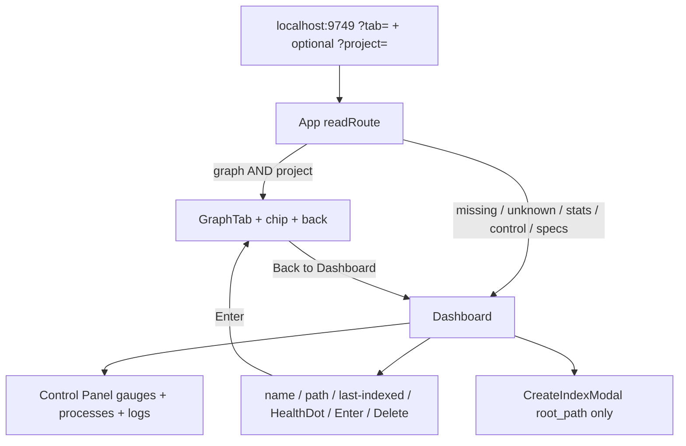

# spec-001 — Executive Dashboard
Reading time: 5-8 min
Last updated: 2026-08-29 — spec-001-w3q-executive-dashboard | Patterns: ✓

## Feature description

Account home used to be a lab console: four header tabs (Specs / Graph / Projects / Control), teal chrome, and a Projects page that dumped node and edge totals. The operator had to pick a tab and read graph cardinality just to see which folders were indexed.

Home is now one executive Dashboard. Opening localhost:9749 (no query) shows Indexed Projects and Control Panel on the same scroll. Each row is name, folder path, last-indexed time, a health dot, Enter, and Delete. Starting an index posts only the folder path; the name comes from that path in the daemon. The 3D graph is still one Enter away and still colorful.

Business result: judge index freshness and daemon health without counting nodes.

## Task timeline

All five tasks landed 2026-08-29. #1 / #2 / #3 were parallel; #4 needed those three; #5 needed #4.

| When | Task | What the operator can see |
|---|---|---|
| 2026-08-29 | #1 useProjects list-only | List identity comes from one `list_projects` call. No graph-size fetch to paint the list. |
| 2026-08-29 | #2 Chrome tokens + palette lock | Shell is dark gray. Graph nodes/edges keep the old hex. Health stays green / amber / red. |
| 2026-08-29 | #3 formatIndexedAt | Last-indexed ISO becomes a visible UTC locale string (English or Chinese UI). |
| 2026-08-29 | #4 Dashboard page | List + full Control on one page. Create-index has no Project ID field. Stats tab gone. |
| 2026-08-29 | #5 App routing + TabBar delete | Default URL is Dashboard. Old `?tab=stats` / `?tab=control` bookmarks alias home. Four-tab header gone. |

DEV Vitest: 16 files, 70 tests pass. Playwright not required at DEVELOPMENT.

## Architecture before / after

Before: default tab was Specs. Header jumped between Specs, Graph, Projects, Control. Projects (StatsTab) called schema per folder and showed Nodes/Edges cards plus label chips. Control was a sibling tab. Create-index could send a custom Project ID.

After: two-level shell only.

C daemon, SQLite files, and MCP tools are unchanged. Store key is still project name (path uniqueness is spec-003). Specs picker and ADR button stay on disk, unrouted.

## Decisions + ADRs

| Decision | Why it matters | ADR |
|---|---|---|
| Adopt starts at this Dashboard, not a stabilize-only spec | First executable work is epic-001 | SDD-ADR-001 |
| List then full Control, one ScrollArea | Side pane clips the 400px logs; empty/error must still show Control | SDD-ADR-002 |
| Last-indexed as UTC locale in `<time dateTime>` | Freshness is visible and CI-stable; no new backend field | SDD-ADR-003 |
| Delete TabBar.tsx | Account IA is home vs Graph, not four tabs. Workspace tabs are new code in spec-002 | SDD-ADR-004 |
| Grayscale chrome; lock Function `#06b6d4` and CALLS `#1DA27E` | Teal was both button accent and graph color. Galaxy must stay categorical | SDD-ADR-005 |
| `useProjects` is `list_projects` only | Home must not pay N schema RPCs | SDD-ADR-006 |
| POST `/api/index` is `{ root_path }` only | Custom Project ID created aliases | SDD-ADR-007 |
| `TabId` is `dashboard` \| `graph`; aliases in `readRoute` | Old bookmarks keep working; `?tab=specs` does not reopen Specs | SDD-ADR-008 |

Grill product ADRs behind this spec: dark grayscale theme, two-level shell, last-indexed visible, graph colors stay, no project-name override.

## How to use

1. Build/serve the UI as today (`scripts/build.sh --with-ui` or the usual graph-ui + daemon). Open http://localhost:9749
2. You should see Indexed Projects (or the empty CTA) and Control Panel. There is no Specs / Graph / Projects / Control tab strip.
3. New Index (page button) → browse a folder → Index This Folder. The request body is only the path. After accept, stay on Dashboard; a progress banner appears.
4. Each row: Enter opens the existing Graph (`?tab=graph&project=<name>`). The header chip × returns home without leaving `project=` in the URL.
5. Delete asks for confirm. Cancel leaves the row. Refresh reloads the list.
6. Control (CPU, RAM, processes, logs) stays on this page even with zero projects or a list error.
7. Bookmarks `?tab=stats` and `?tab=control` still open Dashboard. `?tab=graph&project=<name>` still opens Graph.

## Debugging guide

| If this fails | File:line | Cause | Fix |
|---|---|---|---|
| Home is Specs or a tab strip | `App.tsx:22-29`, `96-101` | `readRoute` defaulted to specs, or SpecBoard/TabBar remounted | Graph only when `tab=graph` and project is set. Header is brand only |
| `?tab=stats` is not Dashboard | `App.tsx:26-29`, `45-48` | Alias or first-load `replaceState` missing | `stats` / `control` / `specs` / unknown → `{ tab: "dashboard", project: null }` |
| `?tab=graph` with no project opens Graph | `App.tsx:26-27`, `64` | Project guard dropped | Empty project is Dashboard |
| Back leaves `?project=` on home | `App.tsx:32-36`, `87` | Back passed a name | `navigate("dashboard", null)` |
| List empty with a live daemon | `useProjects.ts:28-31` | RPC/HTTP fail or missing `projects` | Network: one `POST /rpc` `list_projects`. Missing array becomes `[]` |
| Spy / Network shows `get_graph_schema` on list paint | `useProjects.ts:28` | Hook or consumer named that tool | Schema is a future hook, not this path |
| List error, Control missing | `Dashboard.tsx:65-69`, `121-123` | Early return skipped Control | Error is inline; `ControlTab embedded` stays below |
| Empty CTA, no Control | `Dashboard.tsx:71-80`, `121-123` | Empty state replaced the page | CTA only; Control always below the border |
| Graph opens after index 202 | `Dashboard.tsx:125-128` / `CreateIndexModal.tsx:105-106` | `onCreated` called Enter | Only `setIndexing(true)` + `refresh()` |
| POST body has `project_name` | `CreateIndexModal.tsx:98-102` | Leftover Project ID state | `JSON.stringify({ root_path: path })` only |
| Index 400 closes the modal | `CreateIndexModal.tsx:103-108` | Success path ran on `!res.ok` | Throw `data.error`; modal stays. Live C may say `directory not found`; tests mock `not a directory` |
| Delete cancel still DELETEs | `Dashboard.tsx:29-30` | `confirm` not gated | Return before `fetch` when confirm is false |
| Last-indexed equals raw ISO | `formatIndexedAt.ts:27-29` | Invalid Date | Invalid input is supposed to show the raw string; check `indexed_at` from the list |
| Chrome looks teal again | `globals.css:18-30` | Primary/accent/ring restored to `#1DA27E` / `#1C8585` | Restore gray tokens; `chrome-tokens.test.ts` |
| Graph nodes went gray | `colors.ts:19-20` | `colorForLabel` read CSS vars | Function must stay `#06b6d4` |
| CALLS edges went gray | `EdgeLines.tsx:35`, `61-64` | Graph map "aligned" to chrome | CALLS `#1DA27E`; default `#1C8585` |
| Gauge lost red / amber | `ControlTab.tsx:14-17` | Always gray | `>80` red `#e05252`; `>50` amber `#eab308`; else `#a3a3a3` |
| ADR button on a row | `Dashboard.tsx:13-16` | `AdrButton` imported | Dashboard imports HealthDot + IndexProgress only |

Verify: `cd graph-ui && npm test` (70 tests). Targeted: `App.test.tsx`, `Dashboard.test.tsx`, `useProjects.test.ts`, `colors.test.ts`, `chrome-tokens.test.ts`, `formatIndexedAt.test.ts`.

## Pattern validation

Patterns: ✓ across the full feature.

Same list hook (Task #1), same chrome tokens (Task #2), same `formatIndexedAt` + `<time>` (Task #3), same Dashboard stack (Task #4), same `?tab=` + `?project=` shell (Task #5). MCP reads go through `callTool`; HTTP mutations stay on existing `/api/*`. Delete stays `window.confirm`. No second router. No second freshness field. No C change. No workspace tab strip. `ProjectCard` unused; `SpecBoardTab` unrouted; `AdrButton` extracted and not imported.

Leftover (not a second approach): `useProjects` fallback `"Failed to fetch projects"` and modal `"Failed"` are English literals; other chrome copy lives in `i18n.ts`. Reviews already accepted this. `i18n.tabs.*` catalog keys remain but are not rendered as header tabs.

Constitution I–IX: no gap that needs a new rule. Tasks did not solve the same problem two ways.

## Quick refs

- Spec: `.sdd-skill/specs/spec-001-w3q-executive-dashboard/spec.md`
- Plan: `.sdd-skill/specs/spec-001-w3q-executive-dashboard/plan.md`
- ADRs: `.sdd-skill/baseline/ARCHITECTURE_ADR.md` (SDD-ADR-001 … 008)
- Architecture: `human/ARCHITECTURE-VISUAL.mmd`
- Overview: `human/PROJECT-OVERVIEW.md`
- Debug: `human/QUICK-DEBUG.md`
- Task summaries: `human/task-summaries/task-1-useProjects-list-only.md` … `task-5-app-routing-tabbar.md`
- Constitution: `.sdd-skill/docs/constitution.md`
- Tests: `cd graph-ui && npm test`
