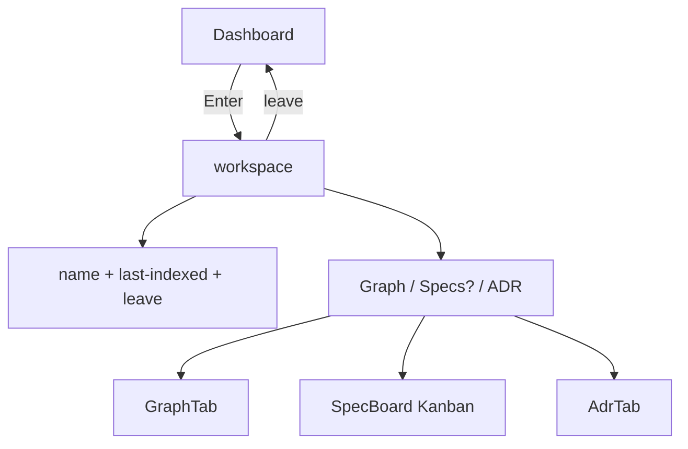

# spec-002 — Project Workspace
Reading time: 5-8 min
Last updated: 2026-08-29 — spec-002-p8w-project-workspace | Patterns: ✓

## Feature description

After spec-001, home is Dashboard. Enter still dropped the operator onto a bare Graph with a name chip. Specs had no route. ADR was a leftover modal.

A project now has an interior: header (name + last-indexed + leave) and a tab strip under the header. Default tab is Graph. Specs appears only when that repo has `.sdd-skill/`. ADR is always a full editor tab. Dashboard still has no ADR control.

## Task timeline

All five tasks landed 2026-08-29. #2 / #3 / #4 ran after #1; #5 composed them.

| When | Task | What the operator can see |
|---|---|---|
| 2026-08-29 | #1 TabId + readRoute | URL can name graph / specs / adr when a project is present |
| 2026-08-29 | #2 Workspace header | Same last-indexed clock as the Dashboard row; ghost names have no clock |
| 2026-08-29 | #3 Specs strip | Specs tab only after spec-board says sdd-skill is present |
| 2026-08-29 | #4 AdrTab | Full-page ADR editor; save errors keep the draft |
| 2026-08-29 | #5 App compose | Enter opens the workspace; leave returns home; unsaved ADR asks first |

DEV Vitest: 21 files, 106 tests. Playwright not required at DEVELOPMENT.

## Architecture before / after

Before: Dashboard vs Graph only. `?tab=specs` with a project still became Dashboard.

After: Dashboard is home. A project is a workspace with Graph / Specs? / ADR.

C daemon unchanged. `/api/spec-board` and `/api/adr` unchanged. Path 1:1 is spec-003. ADR parse-on-reindex is spec-004.

## Decisions + ADRs

| Decision | Why | ADR |
|---|---|---|
| One TabId union + WORKSPACE_TABS | Later tabs add an id; no plugin | SDD-ADR-009 |
| Specs omit until `sdd_skill_present === true` | No dead tab | SDD-ADR-010 |
| AdrTab pane; delete AdrButton | ADR is not a Dashboard modal | SDD-ADR-011 |
| Dirty leave uses `window.confirm` | Draft must not vanish silently | SDD-ADR-012 |
| Last-indexed from useProjects only | No second freshness field | SDD-ADR-013 |

## How to use

1. Open Dashboard. Enter a row.
2. Land on Graph. Tabs sit under the brand header.
3. Specs appears only if that project has sdd-skill. Otherwise Graph | ADR.
4. ADR tab edits the whole markdown blob. Save. Leave asks if the editor is dirty.
5. Old `?tab=stats` / `?tab=control` bookmarks still open Dashboard.

## Debugging

| Symptom | File | Fix |
|---|---|---|
| Specs in the brand header | `App.tsx` | Strip is a sibling under header |
| Specs URL without skill stays specs | `App.tsx` fallback | `fallbackSpecsToGraph` + replaceState |
| Dirty leave drops the draft | `requestNavigate` | Dismiss confirm stays on ADR |
| ADR popup on a Dashboard row | Dashboard imports | AdrButton is deleted |

## Constitution

No new constitution rules this spec (file still draft pending user review). IX.2 already named this workspace.

## Quick refs

- Spec: `.sdd-skill/specs/spec-002-p8w-project-workspace/spec.md`
- Tests: `cd graph-ui && npx vitest run`
