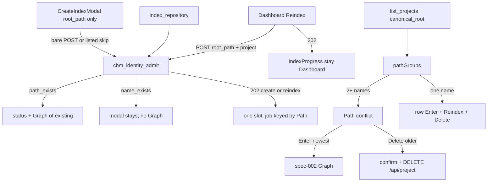

# spec-003 — Path–Project Identity
Reading time: 5-8 min
Last updated: 2026-08-29 — spec-003-h7q-path-project-identity | CONSTITUTION RECOMMENDATION (IV.1)

## Feature description

The store still names each index by project (one cache `.db` file per name). The folder path was stored but not unique, so the same repo could exist twice — a second “Index This Folder”, or an MCP `name` override, minted an alias.

That is blocked going forward. Creating an index for a folder that already has a project does not start a job. The operator lands on that project’s Graph with a status line that names it. Refreshing an existing row is a separate Dashboard Reindex (path + that name). Leftover aliases already on disk are not deleted silently: Dashboard shows a Path conflict, Enter opens the newest, and each older name deletes only after confirm.

Business result: one folder, one project from now on; leftover clones are visible and confirm-gated.

## Task timeline

All five tasks landed 2026-08-29. #2 and #3 ran after #1; #4 after #2+#3; #5 composed Reindex + remaining Gherkin.

| When | Task | What the operator / agent can see |
|---|---|---|
| 2026-08-29 | #1 Catalog + list fields | Each list row always has last-indexed time and a resolved folder (`canonical_root`). Display path is still the stored folder. |
| 2026-08-29 | #2 Admit create vs reindex | Bare create of an owned folder is 409 `path_exists`. Reindex is `{root_path, project}`. MCP cannot mint a second name for the same folder. |
| 2026-08-29 | #3 Conflict UI | Same-folder leftovers sit in one “Path conflict” block. Enter newest. Delete older is per name + confirm. |
| 2026-08-29 | #4 Create 409 redirect | “Index This Folder” on an owned path closes the modal and opens that Graph + notice. A name clash on a *different* folder stays in the modal. |
| 2026-08-29 | #5 Dashboard Reindex | Every row (including each conflict member) has Reindex. 202 stays on Dashboard with the progress banner. 500 stays with an error. No Reindex on the workspace header. |

DEV: C identity 18/18; httpd 69/69 + 1 skip; graph-ui targeted Vitest 57/57 (Task #5 files). Playwright not required at DEVELOPMENT. CERT later if required.

## Architecture before / after

Before: POST `/api/index` with only a folder could allocate a slot and write a second `.db` for the same path. MCP `name` could clone. Dashboard painted one card per name. Create modal was the only UI path to `/api/index`.

After: one admission helper for HTTP and MCP. Store files are still named by project. Uniqueness is checked at create/reindex, not as a SQLite UNIQUE (there is no global projects table).



Chrome stays grayscale. `colorForLabel("Function")` is still `#06b6d4`. Workspace tabs are unchanged except the create-redirect into Graph.

## Decisions + ADRs

| Decision | Why it matters | ADR |
|---|---|---|
| Admission scan, not UNIQUE SQL | Each project is its own `.db`; there is no central table to constrain | SDD-ADR-014 |
| Bare `{root_path}` = create; `{root_path, project}` = reindex | Same POST cannot be both 409 and 202; create modal stays path-only | SDD-ADR-015 |
| `project_name` on HTTP is a reindex alias | Leftover key must not mint a new name | SDD-ADR-015 |
| List always emits `indexed_at` + `canonical_root` | UI groups and picks newest without a JS realpath | SDD-ADR-016 |
| In-flight guard is canonical Path | Two derived names cannot index the same folder at once | SDD-ADR-017 |
| MCP no-name + two owners = `path_exists` | Ambiguous reindex; UI Reindex always sends `project` | SDD-ADR-018 |
| Newest = `indexed_at` string, tie = greater `name` | Same rule in C and `pathGroups` (`beta` > `alpha`) | US-001 / US-004 |
| Skip POST if the list already has that Path | Same redirect + notice; no IndexProgress | US-001 |
| `name_exists` is not a redirect | `/tmp/b/foo` must not open the Graph for `/tmp/a/foo` | US-006 |

Grill product ADRs behind this spec: path↔project 1:1, no project-name override, leftover clones visible (not silent-delete), last-indexed as newest signal.

## How to use

1. Build/serve as today (`scripts/build.sh --with-ui`). Open http://localhost:9749 (Dashboard).
2. New Index → pick a folder already indexed → Index This Folder. You should land on that project’s Graph. A status line names the existing project. No second progress job.
3. If the folder is new but the derived name already belongs to another folder, the modal stays open with the error. You are not sent into the other repo.
4. Two names for the same folder: Dashboard shows Path conflict (all names, all last-indexed times, the folder once). Enter opens the newest. Delete on an older name asks confirm; cancel leaves the conflict.
5. Reindex on a row (including a conflict member) refreshes that name only. Stay on Dashboard. The progress banner is the same as a new index. A server error stays on Dashboard with a red line; the row remains.
6. Workspace header has no Reindex. The create modal never sends `project` / `project_name`.
7. Agents: `index_repository` on an owned path with no `name` (or `name` = the owner) refreshes that project. A different `name` is an error containing `path_exists`. A new path with a taken name is `name_exists`.

## Debugging guide

| If this fails | File:line | Cause | Fix |
|---|---|---|---|
| Bare create 202 on an owned folder | `http_server.c:1232` | Admit skipped or wrong cache dir | Isolate `CBM_CACHE_DIR`; 409 before a slot |
| 409 JSON missing `code` | `http_server.c:1108` | Generic error path | `path_exists` or `name_exists` + `existing_project` |
| Trailing slash creates a clone | `identity_catalog.c:254` | Path not canonicalized | Same `canonical_root` as the owner |
| MCP no-name writes a derived name | `mcp.c:7906` | Worker args lacked bind `name` | Admit REINDEX copies the owner |
| Second create 202 while first runs | `http_server.c:1226` / `application.c:1616` | In-flight / daemon keyed by name only | Path key + PATH_CONFLICT |
| Two clones stay as solo cards | `pathGroups.ts:36-37` | Grouped on stored `root_path` | Use `canonical_root` when present |
| Enter opens the older clone | `pathGroups.ts:17-33` | Newest drifted from C | `indexed_at` then greater `name`; Enter uses `group.newest.name` |
| One click deletes two names | `Dashboard.tsx:168-175` | Bulk delete added | Per-name `DELETE /api/project?name=` |
| 409 `path_exists` starts IndexProgress | `CreateIndexModal.tsx:127-133` | 409 treated as 202 | `onPathExists` + close; never `onCreated` |
| Graph opens but no status notice | `App.tsx:55-62` | Route used `navigate` | `openExistingProject` sets notice then `setRoute` |
| 409 `name_exists` opens Graph | `CreateIndexModal.tsx:127` | Code treated as `path_exists` | Only `path_exists` redirects |
| Reindex opens Graph | `Dashboard.tsx:47-73` | Button called Enter | `reindexProject` only; URL stays `?tab=dashboard` |
| Reindex POST has `project_name` | `Dashboard.tsx:53` | Wrong JSON key | `{ root_path, project }` |
| 500 drops the row or navigates | `Dashboard.tsx:60-69` | `refresh` or `onSelectProject` on error | `reindexError` only; stay home |
| Reindex on workspace header | `WorkspaceHeader.tsx` | Control added to chrome | Header is leave + name + time only |
| Function nodes went gray | `colors.ts:19-20` | Palette edit | `colorForLabel("Function")` must stay `#06b6d4` |

Verify: `scripts/test.sh --suites identity` and `--suites httpd`. UI: `cd graph-ui && npx vitest run src/components/Dashboard.test.tsx src/App.test.tsx src/components/CreateIndexModal.test.tsx src/lib/pathGroups.test.ts src/lib/i18n.test.ts src/lib/colors.test.ts src/components/WorkspaceHeader.test.tsx`.

## Pattern validation

Implementation is uniform across #1–#5: one catalog scan, one `cbm_identity_admit` (HTTP + MCP), one newest rule (C `strcmp` and matching `pickNewest`), group key from server `canonical_root` (no JS realpath), create vs reindex distinguished by `project` on the existing POST `/api/index`, delete still `window.confirm` + `DELETE /api/project`, copy in `i18n.ts` en+zh, no new endpoint, no UNIQUE SQL, no workspace Reindex, graph hex locked.

Constitution I–III, V–IX: no second approach. There is no Section X in the draft file.

Constitution IV.1 is stale (it still says Path uniqueness is out of spec-001). That is a gap, not a code defect.

```
📜 CONSTITUTION RECOMMENDATION
Observed: IV.1 still says the store key is project name and Path uniqueness is out of spec-001. Tasks #1–#5 enforced Path 1:1 at admission (catalog scan + cbm_identity_admit). Store files stay name-keyed; there is no UNIQUE root_path. Create vs reindex is the same POST /api/index, distinguished by project.
Recommendation: Rewrite Section IV.1 — "Store key remains project name (.db filename). Path 1:1 is admission-only (cbm_identity_admit + catalog scan). Bare {root_path} is create (409 path_exists if owned). {root_path, project} that already owns that Path is reindex. MCP index_repository uses the same gate. Legacy same-Path clones are a Dashboard conflict (enter newest, confirm-delete older). Do not silent-delete aliases."
→ @planner evaluates, creates ADR if agreed
```

## Quick refs

- Spec: `.sdd-skill/specs/spec-003-h7q-path-project-identity/spec.md`
- Plan: `.sdd-skill/specs/spec-003-h7q-path-project-identity/plan.md`
- ADRs: `.sdd-skill/baseline/ARCHITECTURE_ADR.md` (SDD-ADR-014 … 018)
- Architecture: `human/ARCHITECTURE-VISUAL.mmd`
- Overview: `human/PROJECT-OVERVIEW.md`
- Debug: `human/QUICK-DEBUG.md`
- Task summaries: `human/task-summaries/task-1-identity-catalog-list-fields.md` … `task-5-dashboard-reindex.md`
- Constitution: `.sdd-skill/docs/constitution.md`
- Tests: `scripts/test.sh --suites identity` · `scripts/test.sh --suites httpd` · `cd graph-ui && npm test`
