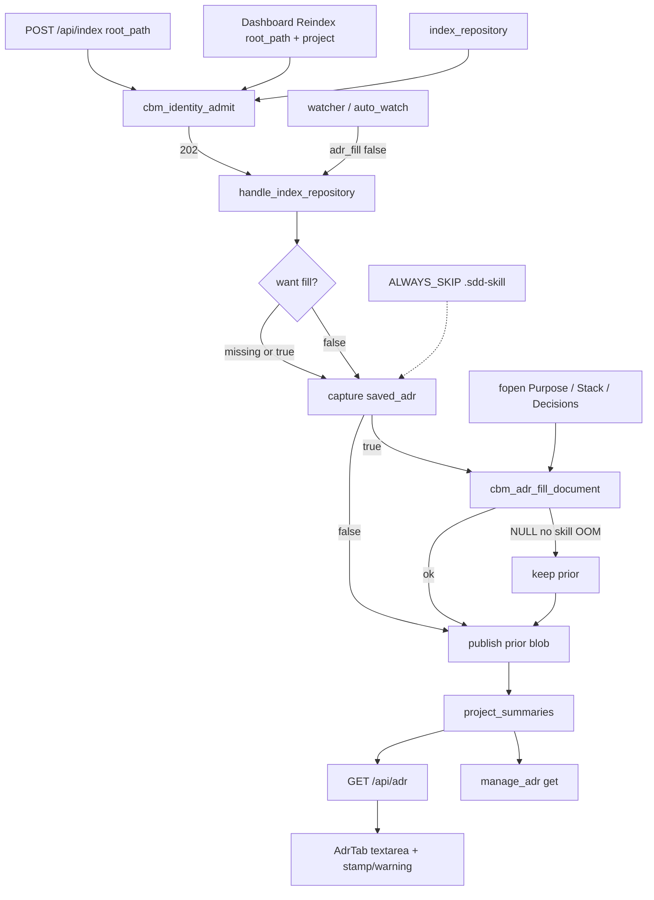

# spec-004 — ADR parse on reindex
Reading time: 5-8 min
Last updated: 2026-08-30 — spec-004-j8k-adr-parse-on-reindex | CONSTITUTION RECOMMENDATION (IX)

## Feature description

After spec-002, ADR is a workspace tab over one markdown blob. That blob was empty or hand-written. After spec-003, Reindex refreshes the same Path without minting a second store. The tab still did not know PURPOSE, STACK, or decisions from sdd-skill.

A user-triggered index now fills a generated region from three files in that project folder: `.sdd-skill/context_ai.md`, `.sdd-skill/baseline/TECH_STACK.md`, and `.sdd-skill/baseline/ARCHITECTURE_ADR.md`. Dashboard Reindex, first create-index, and MCP `index_repository` share that fill. There is no LLM and no write-back into the skill tree. DEV_LOG, constitution, specs, and other skill files are not copied. The three files are read from disk; they are not added as graph File nodes.

Hand-written notes live in a manual region below the generated block. Parse never rewrites that span. An old Phase-1 blob with no markers is treated as manual on the first fill; a generated block is prepended. Save is still the whole document. The next user-triggered index refreshes generated from disk and keeps the manual text from that save. Edits inside the generated region die on the next Reindex.

Projects without `.sdd-skill/` stay unmarked. Background watcher and incremental jobs do not fill even if the trio changes on disk. A missing or unreadable trio file omits only that extract; the index job still succeeds.

The ADR tab is still one textarea. When the blob has a generated region, chrome shows the same last-indexed clock as the Dashboard row and a warning that generated-region edits are replaced on the next user-triggered index. That clock is not written into the markdown.

Business result: an sdd-skill repo’s ADR tab matches PURPOSE / STACK / decisions after Reindex or `index_repository`, without deleting human notes and without auto-watch inventing an ADR.

## Task timeline

All four tasks landed 2026-08-30. #2 and #3 ran after #1; #4 ran in parallel after #1 (needs the marker string only).

| When | Task | What the operator / agent can see |
|---|---|---|
| 2026-08-30 | #1 Splice + extract helper | A C helper can rebuild the blob: generated from the trio, then manual from existing notes. Not wired to index yet. |
| 2026-08-30 | #2 Pipeline hook + skip | User Reindex / create / `index_repository` splice after ADR restore. Watcher jobs leave the blob alone. Skill folder is not graph source. |
| 2026-08-30 | #3 HTTP + MCP + watcher Gherkin | Live create/Reindex and `index_repository` leave the same blob GET `/api/adr` and `manage_adr` get already read. Save cap is 32768. |
| 2026-08-30 | #4 AdrTab stamp + warning | Open ADR with markers → last-indexed datetime + replace warning + one textarea. Unmarked blob omits both chrome pieces. |

DEV: C adr_fill helper + hook; httpd+mcp 274 passed (3 skipped); graph-ui 17 Vitest AdrTab+i18n+colors + App dirty-leave. Playwright not required at DEVELOPMENT. CERT later if required.

## Architecture before / after

Before: Reindex captured `saved_adr` and wrote it back as-is. GET `/api/adr` was a whole-document blob with no `CBM-GENERATED` markers (SDD-ADR-011). `.sdd-skill` was walkable because `.md` is a language. The ADR tab was a plain editor.

After: user-triggered persist captures, splices, then publishes one blob. Watcher jobs pass `adr_fill: false`. `.sdd-skill` is ALWAYS_SKIP; fill is fopen of three fixed relatives. Markers live in the markdown. Stamp is list `indexed_at`, not a line in the blob.



Chrome stays grayscale. `colorForLabel("Function")` is still `#06b6d4`. Admission, conflict UI, and workspace header Reindex rules from spec-003 are unchanged.

## Decisions + ADRs

| Decision | Why it matters | ADR |
|---|---|---|
| Capture-then-splice; intent flag, not incremental vs full | User Reindex can take the incremental persist path and must still fill; watcher uses the same persist and must not | SDD-ADR-019 |
| `cbm_pipeline_new` defaults false; handle true unless JSON `adr_fill: false` | Direct pipeline tests stay inert; HTTP/MCP share one worker; flag not on the MCP tool schema | SDD-ADR-019 |
| Four HTML comments, generated then manual | Parse (not POST) protects notes; one SQLite blob, no second table | SDD-ADR-020 |
| 1536 B/file after 64KiB read; POST `/api/adr` max 32768 | Real trio is ~22KiB; a byte-copy would 400 | SDD-ADR-020 |
| POST / `manage_adr` stay whole-document | Phase-1 clients and unmarked-save migrate on next parse; generated hand-edits die then | SDD-ADR-021 |
| Unreadable = regular file and open/read fails; English H1s | Missing vs chmod-0 / directory-at-path; blob headings stay architecture language | SDD-ADR-022 |
| `.sdd-skill` in ALWAYS_SKIP; fill is out-of-graph fopen | Trio is not graph source; indexer never writes cycle files | SDD-ADR-023 |
| Stamp from list `indexed_at` via `formatIndexedAt` | No second freshness field; same clock as header | SDD-ADR-016 |
| Dirty leave stays `window.confirm` | Do not change spec-002 confirm | SDD-ADR-012 |

Grill product ADRs behind this spec: parse on user-triggered index only (ADR-005), source trio (ADR-006), generated vs manual (ADR-007). SDD-ADR-011 “no CBM-GENERATED” is superseded only after a user-triggered index of a repo that has `.sdd-skill/`.

## How to use

1. Build/serve as today (`scripts/build.sh --with-ui`). Open http://localhost:9749 (Dashboard).
2. Index a folder that has `.sdd-skill/` and the trio, or Reindex an existing row for that Path. Stay on Dashboard until the job finishes.
3. Enter the project → ADR tab. You should see `# Purpose` / `# Stack` / `# Decisions` excerpts, last-indexed time, and a replace warning. The editor is still one box of the whole document.
4. Write durable notes in the manual region (between `CBM-MANUAL-START` and `CBM-MANUAL-END`). Do not treat generated text as notes — the next Reindex replaces that block from disk.
5. A folder with no `.sdd-skill/` keeps whatever ADR you already had. No markers are added.
6. Save still posts `{project, content}`. A 16KiB draft still saves. A raw body above 32768 is rejected. Leaving with unsaved text still asks confirm.
7. Agents: successful `index_repository` on the owned Path fills the same store. `manage_adr` get matches GET `/api/adr`. A later `manage_adr` update of the manual region survives the next user-triggered index; generated refreshes from the trio.

## Debugging guide

| If this fails | File:line | Cause | Fix |
|---|---|---|---|
| Reindex of a skill repo leaves ADR unmarked | `mcp.c:8189` | Pipeline left at `new()` default false | HTTP/MCP omit `adr_fill` or set true; hook after capture |
| Watcher / auto_watch writes `CBM-GENERATED` | `application.c:3399` | Watcher args omitted `adr_fill: false` | Encode false; gate is `mcp.c:1561-1563` |
| Unmarked `# Existing ADR` vanished | `adr_fill.c:175-179` | Body already had both MANUAL markers | Only the MANUAL span is kept (`:165-191`) |
| `SECRET-DEVLOG` in GET | `adr_fill.c:20-22` | Extra relative opened | Only the three trio paths |
| Trio files appear as File nodes | `discover.c:57` / `:351` | Dir not in ALWAYS_SKIP | `cbm_should_skip_dir(".sdd-skill")` |
| Unchanged-tree Reindex skips fill | `pipeline_incremental.c:2448` | Trio never dirties the manifest | `adr_fill_would_change` must force full |
| `# New notes` gone after next index | `adr_fill.c:189-191` | Write dropped the MANUAL span | Whole-doc update; splice keeps MANUAL |
| `PURPOSE-HAND-EDIT` survives Reindex | `test_httpd.c:3091` | Fill skipped or trio lacks canonical string | Next user index rewrites generated from disk |
| 16KiB Save is 400 `invalid body` | `http_server.c:918` | Cap still 16384 or stale binary | `body_len > CBM_SZ_32K` (32768) |
| Stamp missing with `CBM-GENERATED-START` | `AdrTab.tsx:113`, `:120` | `lastClean` empty or name not in list | Gate is last GET/save; mock `list_projects` with that name |
| Stamp on unmarked `# Existing ADR` | `AdrTab.tsx:113` | Gate used live `content` | `lastClean.includes("CBM-GENERATED-START")` |
| ISO written into the textarea / POST | `AdrTab.tsx:77-81` | Chrome copied into `content` | Stamp is chrome only |
| Function nodes went gray | `colors.ts:19-20` | Palette edit | `colorForLabel("Function")` must stay `#06b6d4` |

Verify: `scripts/test.sh --suites adr_fill,discover,httpd,mcp,daemon_application,incremental`. UI: `cd graph-ui && npx vitest run src/components/AdrTab.test.tsx src/lib/i18n.test.ts src/lib/colors.test.ts`.

## Pattern validation

Implementation is uniform across #1–#4: one helper (`cbm_adr_fill_document`), one persist hook after capture (full and incremental), one intent flag for HTTP/MCP/watcher, one store blob for GET `/api/adr` and `manage_adr`, stamp from existing `indexed_at` (no second field), copy in `i18n.ts` en+zh, no new endpoint, no LLM, no write-back to `.sdd-skill/`, graph hex locked.

Constitution I–III, V–VIII: no second approach. IV admission and `indexed_at` reuse held. There is no Section X in the draft file.

IX.2 names spec-004 but is silent on the in-document fence, the user-triggered-only gate, and “skill dir is not graph source.” Not a code defect.

```
📜 CONSTITUTION RECOMMENDATION
Observed: Tasks #1–#4 splice generated/manual HTML comments on user-triggered index only; watcher args stay false; `.sdd-skill` is ALWAYS_SKIP; trio reads are best-effort fopen and never write cycle files. IX.2 names spec-004 but does not lock that fence or gate. Plan already proposed a Phase 2 rule for close.
Recommendation: Add to Section IX at spec close — "Generated/manual HTML comments are the in-document fence; fill runs on user-triggered index only (POST /api/index create or Reindex, and index_repository); watcher / incremental does not fill; `.sdd-skill` is not graph source; skill-file reads are best-effort fopen and never write cycle files."
→ @planner evaluates, creates ADR if agreed
```

## Quick refs

- Spec: `.sdd-skill/specs/spec-004-j8k-adr-parse-on-reindex/spec.md`
- Plan: `.sdd-skill/specs/spec-004-j8k-adr-parse-on-reindex/plan.md`
- ADRs: `.sdd-skill/baseline/ARCHITECTURE_ADR.md` (SDD-ADR-019 … 023)
- Architecture: `human/ARCHITECTURE-VISUAL.mmd`
- Overview: `human/PROJECT-OVERVIEW.md`
- Debug: `human/QUICK-DEBUG.md`
- Task summaries: `human/task-summaries/task-1-splice-extract-helper.md` … `task-4-adrtab-generated-at-warning.md`
- Constitution: `.sdd-skill/docs/constitution.md`
- Tests: `scripts/test.sh --suites adr_fill,httpd,mcp` · `cd graph-ui && npx vitest run src/components/AdrTab.test.tsx src/lib/i18n.test.ts src/lib/colors.test.ts`
