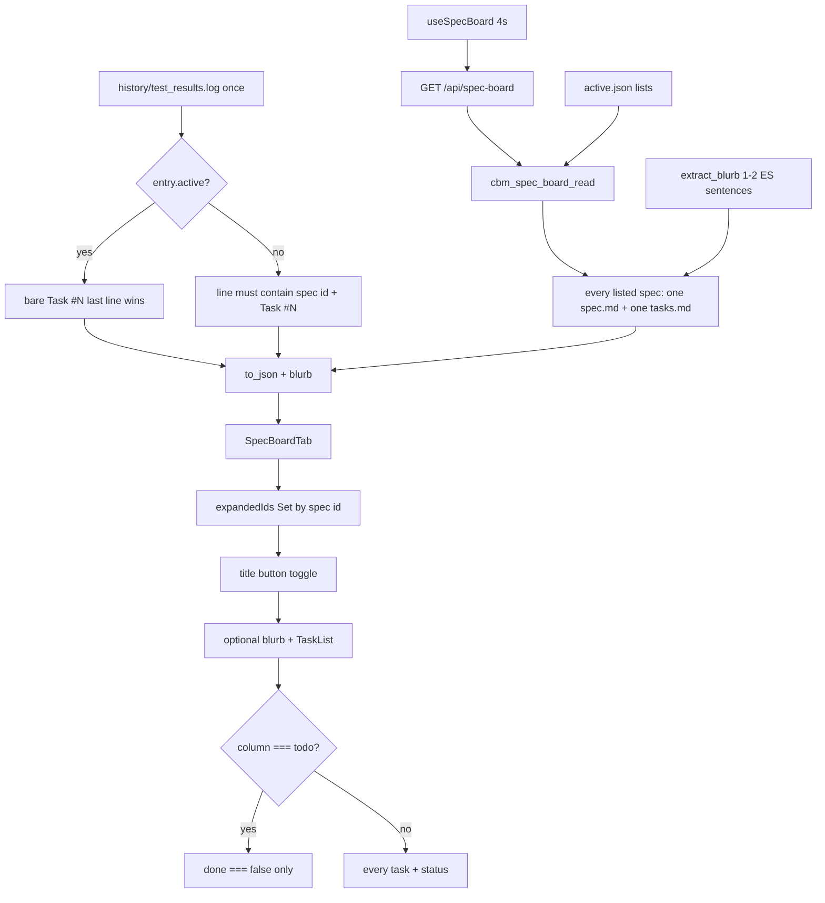

# spec-005 — Spec card expand
Reading time: 5-8 min
Last updated: 2026-08-30 — spec-005-v2m-spec-card-expand | CONSTITUTION RECOMMENDATION (IX.2)

## Feature description

After spec-002, the workspace Specs tab is a three-column Kanban. Only the active spec could open, and only when it had tasks. Todo and Done cards were dead: no title from spec.md, no objective, no task list. The board reader deep-parsed `active.json:active_spec` only.

Any listed card now expands in that same card. Click the title. The body starts with a 1–2 sentence objective from `## Executive Summary` when that text exists, then a task list that fits the column: Todo shows unfinished work only; In Progress and Done show every heading. Several cards can stay open. A later poll must not close what you opened. There is no Archive button and no extra page.

GET `/api/spec-board` is still the only board read. Each entry gains an additive `blurb`. Title, blurb, and tasks are filled for every listed spec when those files exist. Missing or unreadable files empty that one card. The rest of the board stays up. Nothing is written into `.sdd-skill/`.

Business result: the operator can open any Specs-tab card and see why the spec exists and which tasks it has, without an overlay and without a skill-file write. Archive and last-indexed timezone are later specs.

## Task timeline

All four tasks landed 2026-08-30. Critical path #1 → #2 → #3 → #4 (12h plan). #4 is tests on the #3 UI.

| When | Task | What the operator can see |
|---|---|---|
| 2026-08-30 | #1 Blurb extract helper + JSON | The poll JSON always has `"blurb"`. Live values stayed empty until #2 opened each spec.md. |
| 2026-08-30 | #2 Enrich all + dual done matcher | Every listed card can carry a title, objective, and tasks. Active done still trusts a bare Task #N line. Other cards only mark done when that spec’s id is on the same log line. |
| 2026-08-30 | #3 SpecCard expand + Set + filter | Click any title to grow that card. Todo hides finished tasks. Empty objective omits the blurb region. Poll keeps open cards. |
| 2026-08-30 | #4 Vitest Gherkin + no Archive | Tests lock multi-open, poll persist, In Progress first paint, and document-wide absence of Archive/Unarchive. Product expand did not change. |

DEV: C `spec_board` 18 passed (extract + full-read + degrade + dual matcher). graph-ui 16 Vitest (SpecBoardTab + `colorForLabel`). Playwright not required at DEVELOPMENT. CERT later if required. Live UI was not browser-clicked; proof is C + Vitest.

## Architecture before / after

Before: GET listed planned/draft/done ids. Only the active spec got a title, tasks, log flags, agent, and checklist. SpecCard expanded only when `active && task_count > 0`. A `useEffect` on `entry.active` could collapse on remount. No `blurb` field.

After: the same GET enriches every listed spec. `blurb` is additive (empty string when omitted). Expanded ids live in a Set on SpecBoardTab keyed by spec id. Active chrome (agent / N/M / checklist / blocked) stays outside the task list. Caps stay 64 specs / 48 tasks. Poll interval stays ~4s. Graph hex and last-indexed UTC stay untouched.



Chrome stays grayscale. `colorForLabel("Function")` is still `#06b6d4`. Dashboard, Graph, ADR tab, Path 1:1, and ADR parse-on-reindex are unchanged.

## Decisions + ADRs

| Decision | Why it matters | ADR |
|---|---|---|
| Same GET; additive `blurb`; enrich every listed spec | Todo/Done need title/objective/tasks without a second fetch | SDD-ADR-024 |
| 1–2 ES sentences; 512 B; third dropped then byte-truncate; KPI never used | Bounded field; leftover bytes cannot pull KPI or a third sentence | SDD-ADR-025 |
| Dual done matcher: active bare `Task #N`; non-active needs spec id | Shared log must not mark another spec’s task; active compact fixture stays valid | SDD-ADR-026 |
| `expandedIds` Set on SpecBoardTab; seed active; poll does not reset | Multi-open; 4s `setBoard` must not remount-collapse | SDD-ADR-027 |
| Naive fopen; one spec.md + one shared log; no cache | Same best-effort read as prior skill fopen; no mtime TTL this spec | SDD-ADR-028 |
| Title button only; `canExpand` always true | Overlay / accordion / zero-task lock rejected | grill ADR-002, ADR-008 |
| Empty Executive Summary omits the blurb region | Card still expands; no invented fallback | grill ADR-006 |
| Zero Archive / Unarchive chrome | Grill ADR-003 Archive-on-Done is epic-002 | US-005 |

`formatIndexedAt` UTC (SDD-ADR-003) and Graph hex (SDD-ADR-005) were not opened.

## How to use

1. Build/serve as today (`scripts/build.sh --with-ui`). Open http://localhost:9749 → Enter a project that has `.sdd-skill/` → Specs tab.
2. In Progress (the active spec) starts expanded on first paint. Click its title to collapse or expand again.
3. Click the title on a Todo or Done card. That same card grows. There is no modal, popover, or separate spec page.
4. When `spec.md` has a non-empty Executive Summary, the first one or two sentences appear above the task list. If that section is missing or blank, the blurb region is omitted and the card still opens.
5. Todo lists only unfinished tasks. In Progress and Done list every task (capped at 48). Zero pending or zero tasks shows “No tasks planned yet”.
6. Open a second card. The first stays open. A later ~4s poll must not collapse either.
7. There is no Archive or Unarchive control. Done cards stay in Done.
8. Active agent, N/M tasks, checklist percent, and blocked note stay on the card whether it is open or closed.

## Debugging guide

Full tables and file:line maps: `human/QUICK-DEBUG.md` (spec-005 Task #1–#4 sections at the top). Symptom → file → fix:

| If this fails | File:line | Cause | Fix |
|---|---|---|---|
| Opened Todo collapses on poll | `SpecBoardTab.tsx:220-231` | Seed/reset ran on new `board` identity | `seededRef` stays true. Only `project` change clears the Set |
| Todo shows `#1` when that task is done | `SpecBoardTab.tsx:63` | Filter skipped | `column === "todo" ? tasks.filter((t) => !t.done) : tasks` |
| Empty ES still paints a blurb region | `SpecBoardTab.tsx:107`, `:155-159` | Region rendered when `blurb` is `""` | `entry.blurb ?? ""` then omit `data-region=blurb` |
| Archive / Unarchive on the page | `SpecBoardTab.tsx:153-162` | Grill ADR-003 leaked onto Done | Expand body is optional blurb + TaskList only |
| KPI text in the card / GET blurb | `spec_board.c:331-334`, `:469-472` | Heading too loose or body not stopped at H2 | Exact `## Executive Summary`; stop at `\n## ` |
| Non-active marked done from a bare `Task #N` | `spec_board.c:556-568` | Active matcher used for all | Non-active needs `e->id` on the same line |
| Ghost spec fails the whole board | `spec_board.c:672-674` | Missing file treated as fatal | That entry `title`/`blurb` `""`; HTTP stays 200 |
| Function nodes went gray | `colors.ts:19-20` | Palette edit | `colorForLabel("Function")` must stay `#06b6d4` |

Verify C: `scripts/test.sh --suites spec_board`. UI: `cd graph-ui && npx vitest run src/components/SpecBoardTab.test.tsx src/lib/colors.test.ts`.

## Out of scope

- Archive / Unarchive, session show-archived toggle, confirm dialog — grill epic-002 (later spec)
- Last indexed in browser local TZ — grill epic-003 (later spec)
- Overlay, popover, accordion, or a separate spec page
- Writing, moving, or renaming `.sdd-skill/` files
- Raising 64/48 caps; a second spec-board HTTP route
- Recolor Graph 3D or change `formatIndexedAt` UTC

## Pattern validation

Implementation is uniform across #1–#4: one GET, additive `blurb`, one `spec.md` open (title + extract on the same buffer), one `tasks.md` per listed spec, one shared log, dual matcher in one apply helper, Set on SpecBoardTab, title button only, `noTasksYet` reused, no Archive, no second endpoint, no skill write, Graph hex locked.

Best-effort fopen matches prior specs: `cbm_fopen` rb via `read_whole_file`; missing/unreadable → omit that field; never write cycle files (same degrade as `read_spec_title` / spec-004 `adr_read_extract`). SDD-ADR-028 is naive fopen, not a new IO style. I.2 already covers the zero-write reader.

Constitution I–III, V–VIII: no second approach. IV.3 existing GET held. There is no Section X in the draft file.

IX.2 names spec-001..004 delivered but is silent on spec-005 card expand, enrich-all, dual matcher, and zero Archive this spec. Not a code defect.

```
📜 CONSTITUTION RECOMMENDATION
Observed: Tasks #1–#4 delivered in-place Specs-tab card expand, additive `blurb` on GET `/api/spec-board`, enrich title/tasks for every listed spec, dual done matcher (active bare Task #N / non-active id-qualified), Todo pending-only, and zero Archive. IX.2 lists spec-001..004 delivered but does not lock that Specs-tab contract. I.2 already covers the zero-write reader.
Recommendation: MODIFIED IX.2 at spec close — append "spec-005 delivered in-place Specs-tab card expand: additive blurb on GET /api/spec-board; enrich title/tasks for every listed spec; dual done matcher (active bare Task #N / non-active id-qualified); Todo pending-only; zero Archive this spec."
→ @planner evaluates, creates ADR if agreed
```

## Quick refs

- Spec: `.sdd-skill/specs/spec-005-v2m-spec-card-expand/spec.md`
- Plan: `.sdd-skill/specs/spec-005-v2m-spec-card-expand/plan.md`
- ADRs: `.sdd-skill/baseline/ARCHITECTURE_ADR.md` (SDD-ADR-024 … 028)
- Architecture: `human/ARCHITECTURE-VISUAL.mmd`
- Overview: `human/PROJECT-OVERVIEW.md`
- Debug: `human/QUICK-DEBUG.md`
- Task summaries: `human/task-summaries/task-1-blurb-extract-helper.md` … `task-4-vitest-gherkin-no-archive.md`
- Constitution: `.sdd-skill/docs/constitution.md`
- Tests: `scripts/test.sh --suites spec_board` · `cd graph-ui && npx vitest run src/components/SpecBoardTab.test.tsx src/lib/colors.test.ts`
