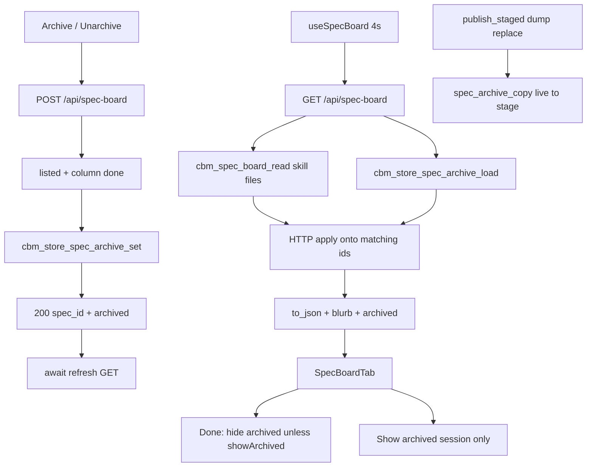

# spec-006 — Spec archive
Reading time: 5-8 min
Last updated: 2026-08-30 — spec-006-k3n-spec-archive CLOSED | IX.2 MODIFIED confirmed

## Feature description

After spec-005, any Specs-tab card expands in place. Closed work still piled up in Done. sdd-skill has no archived status. This feature must not write, move, or rename anything under `.sdd-skill/` or other skill trees.

A Done spec can now be archived into CBM-owned state. The card stays `column: "done"`. There is no fourth column. Archive is immediate — no confirm dialog. A fresh Specs visit hides archived cards. Show archived is for this visit only; remount or a project change starts hidden again. Unarchive from the same expand restores the card even if the toggle is off.

GET `/api/spec-board` is still the only board read. Each entry gains an additive `archived` boolean (false when no flag). POST on the same path is the mutate: `{project, spec_id, archived}`. The 200 body is that flag object, not the full board. After 200 the UI awaits one GET refresh so the 4s poll cannot bring a hidden card back.

Flags live in that project’s cache `.db` table `spec_archive`. A leftover flag for a spec the skill no longer lists does not invent a card. A leftover true flag on Todo or In Progress is visible in JSON but does not hide that card and does not show Archive or Unarchive. If that spec later returns to Done, the existing flag hides it again.

Business result: Done stops accumulating history the operator does not need every visit, without changing the skill cycle, `active.json`, spec.md Status, or `completed_specs`.

## Task timeline

All four tasks landed 2026-08-30. Critical path #1 → #2 → #3 → #4 (12h plan). #4 is tests on the #3 UI.

| When | Task | What the operator can see |
|---|---|---|
| 2026-08-30 | #1 Store spec_archive + set/load/copy | Nothing on the live board. The project `.db` can keep one yes/no flag per spec folder id. Unarchive keeps the row. |
| 2026-08-30 | #2 HTTP POST + GET merge + publish copy | GET lists archived Done as `column` done + `archived` true. POST archives or unarchives. Reindex dump no longer wipes those flags. Skill files are unchanged. |
| 2026-08-30 | #3 SpecBoardTab filter + Archive/Unarchive | Expand a Done card → Archive hides it. Show archived in the Done header reveals history for this visit. Unarchive restores it. |
| 2026-08-30 | #4 Vitest Gherkin mapping | Tests lock hide without confirm, show + unarchive, fresh hide, count, leftover Todo, empty Done + toggle, and poll-does-not-resurrect. Product UI did not change. |

DEV: C `store_spec_archive` 9 passed. `spec_board` + `httpd` 105 passed (1 skipped). graph-ui 156/156 (24 SpecBoardTab + 3 palette). Playwright not required at DEVELOPMENT. CERT later if required. Live UI was not browser-clicked; proof is C + Vitest.

## Architecture before / after

Before: GET listed planned/draft/done ids with spec-005 blurb and enrich-all. SpecCard expand had no Archive. There was no `archived` field and no POST on `/api/spec-board`. Full dump publish rebuilt the `.db` without extra tables.

After: the same GET merges store flags onto matching ids only. `spec_board.c` still only reads skill files and never sets `archived`. POST on the same path validates listed + Done, UPSERTs the flag, returns `{project, spec_id, archived}`. `showArchived` is session state on SpecBoardTab. After 200, `await refresh()` (same GET as the poll). `publish_staged` copies `spec_archive` live→stage after the ADR write. Caps stay 64 specs / 48 tasks. Poll interval stays ~4s. Graph hex and last-indexed UTC stay untouched.



Chrome stays grayscale. `colorForLabel("Function")` is still `#06b6d4`. Dashboard, Graph, ADR tab, Path 1:1, ADR parse-on-reindex, and spec-005 expand rules are unchanged.

## Decisions + ADRs

| Decision | Why it matters | ADR |
|---|---|---|
| New `spec_archive` table in the project `.db` | Flag survives restart; project key is the filename; not a skill sidecar | SDD-ADR-029 |
| UPSERT; unarchive writes 0; no DELETE | Orphan rows stay; GET does not invent a card | SDD-ADR-029, US-005 |
| POST stays `/api/spec-board`; merge in HTTP after read | Same family (IV.3); `spec_board.c` stays zero-write | SDD-ADR-030 |
| POST 200 is the flag object, not the board | UI must refetch GET anyway; do not couple POST to GET shape | SDD-ADR-031 |
| `await refresh()` after 200; Show archived is session-only | 4s poll cannot resurrect; remount starts hidden | SDD-ADR-032 |
| `publish_staged` copies flags live→stage | Full dump would drop the table and resurrect Done cards | SDD-ADR-033 |
| No confirm; no fourth column; HTTP-only | Archive is not delete (VI.3); recovery is Unarchive | grill ADR-001, ADR-007, ADR-009 |

`formatIndexedAt` UTC (SDD-ADR-003) and Graph hex (SDD-ADR-005) were not opened. No MCP archive tool.

## How to use

1. Build/serve as today (`scripts/build.sh --with-ui`). Open http://localhost:9749 → Enter a project that has `.sdd-skill/` → Specs tab.
2. Expand a Done card (click its title). Archive appears only when that card is not already archived. Todo and In Progress expands have neither Archive nor Unarchive.
3. Activate Archive. No dialog. The card leaves Done if Show archived is off. `active.json` and spec.md Status do not change.
4. The Done header has Show archived (`aria-pressed` false on first paint). Press it to see archived cards. Press again to hide them. Todo and In Progress headers do not have this control.
5. With Show archived on, expand an archived Done card → Unarchive. After success the card stays in Done and stays visible even if you turn the toggle off.
6. Leave Specs and come back, or switch `?project=`. Archived cards start hidden again. The toggle is not saved.
7. Done header count equals the cards you can see. If every Done spec is archived and the toggle is off, Done shows “No specs yet” and count 0; Show archived remains.
8. spec-005 expand still applies: blurb when present, Todo pending-only, several cards can stay open, a later poll does not collapse them.

## Debugging guide

Full tables and file:line maps: `human/QUICK-DEBUG.md` (spec-006 Task #1–#4 sections at the top). Symptom → file → fix:

| If this fails | File:line | Cause | Fix |
|---|---|---|---|
| Archived Done visible on first paint | `SpecBoardTab.tsx:323-328`, `:267` | Filter missed `archived === true` or toggle defaulted on | `isArchived` is `=== true`. `useState(false)` |
| Toggle still pressed after remount / project change | `SpecBoardTab.tsx:273-278` | State leaked or localStorage added | Reset with `expandedIds`. No persist |
| After Archive the card stays visible (hide on) | `SpecBoardTab.tsx:304-305` | `refresh` not awaited | `await refresh()` after `res.ok` |
| Poll resurrects a hidden archived card | `SpecBoardTab.tsx:323-328` | GET payload `archived: false` or toggle leaked true | Store truth on GET; toggle off |
| Archive / Unarchive on Todo / In Progress | `SpecBoardTab.tsx:115-116` | Column gate dropped | Names only on expanded Done |
| Archive opened confirm / dialog | `SpecBoardTab.tsx:296-308` | `window.confirm` or a modal leaked | No confirm. VI.3 does not apply |
| GET `archived` always false after set | `http_server.c:454-460`, `:498-499` | Query-open/load failed (degrades) | Apply after `cbm_spec_board_read` |
| GET invents an orphan card | `http_server.c:462-469` | Store rows appended to `specs` | Match `e->id` only |
| POST 200 is the full board | `http_server.c:642-643` | Returned `to_json` | Flag object only |
| 409 still persisted | `http_server.c:605-609` | `set` before done check | 409 before lock/`set` |
| Flags vanish after Reindex dump | `pipeline.c:1799-1808` | Copy skipped or fail ignored | After ADR write; copy fail fails publish |
| `active.json` changed on POST | skill tree | Skill write leaked | Reader + store only; snapshot in `test_httpd.c` |
| Function nodes went gray | `colors.ts:19-20` | Palette edit | `colorForLabel("Function")` must stay `#06b6d4` |

Verify C: `scripts/test.sh --suites store_spec_archive,spec_board,httpd`. UI: `cd graph-ui && npx vitest run src/components/SpecBoardTab.test.tsx src/lib/colors.test.ts`.

## Out of scope

- Last indexed in browser local TZ — grill epic-003 (later spec)
- Overlay, popover, accordion, or a separate spec page
- Fourth “Archived” column; confirm dialog; persisted show/hide
- Writing, moving, or renaming `.sdd-skill/` files; changing the sdd-skill agent cycle
- MCP archive tool; raising 64/48 caps; a sibling `/api/spec-archive`
- Recolor Graph 3D or change `formatIndexedAt` UTC
- Auto-clear of flags when a spec leaves `completed_specs` (keep row; ignore if unlisted)

## Pattern validation

Implementation is uniform across #1–#4:

- Store flag: `spec_archive` in the project `.db` via `init_schema` (same class as `project_summaries`). `sqlite_master` probe matches `cbm_store_adr_get`. UPSERT + `iso_now` matches `cbm_store_adr_store`. Not `store_meta`. Not a skill sidecar. Unarchive writes 0.
- HTTP merge: GET still reads skill files; HTTP applies matching ids only after `cbm_spec_board_read`. Orphans stay in the table and never become cards. Leftover true on todo/in_progress is JSON only.
- POST flag object: same `/api/spec-board` family (IV.3). Mutation lock matches `handle_adr_save`. 200 is `{project, spec_id, archived}`, not `to_json`. 409 does not call `set`.
- Session toggle: `showArchived` `useState(false)`, reset with `expandedIds` on project change. No localStorage. No CBM toggle field. Done header only.
- Await refresh: `useSpecBoard.refresh` is the same `fetchBoard` Promise. Archive/Unarchive `await refresh()` after 200 so the next 4s tick sees store truth.
- Zero skill writes: `spec_board.c` fopen read-only; POST writes SQLite only; `mcp.c` unchanged (no archive tool); `active.json` byte-identical around 200 and 409.

spec-005 expand Set / blurb / Todo pending-only / title button stay. Graph hex locked. I.2 already covers the zero-write reader. VI.3 does not apply (archive is not delete).

Constitution I–III, V–VIII: no second approach. IV.3 existing path held (POST added because GET-only cannot mutate). There is no Section X in the draft file.

Patterns: ✓

IX.2 still says “Archive is not part of spec-005” and does not lock the spec-006 contract. Not a code defect.

```
📜 CONSTITUTION RECOMMENDATION
Observed: Tasks #1–#4 delivered CBM-owned Specs-tab archive: spec_archive in the project .db; GET /api/spec-board merges archived after skill read; POST /api/spec-board {project, spec_id, archived} returns the flag object; Show archived is session-only; await GET refresh after 200; zero skill writes; no fourth column; no confirm; no MCP archive tool. IX.2 still says "Archive is not part of spec-005" and does not lock that contract. I.2 already covers the zero-write reader. VI.3 does not apply (archive is not delete).
Recommendation: MODIFIED IX.2 at spec close — keep the spec-005 expand sentence; replace "Archive is not part of spec-005" with "spec-006 delivered Specs-tab archive: spec_archive in the project .db; GET /api/spec-board merges archived after skill read; POST /api/spec-board {project, spec_id, archived} returns the flag object; Show archived is session-only; await GET refresh after 200; zero skill writes; no fourth column; no confirm; no MCP archive tool (SDD-ADR-029..033)."
→ @planner evaluates, creates ADR if agreed
```

## Quick refs

- Spec: `.sdd-skill/specs/spec-006-k3n-spec-archive/spec.md`
- Plan: `.sdd-skill/specs/spec-006-k3n-spec-archive/plan.md`
- ADRs: `.sdd-skill/baseline/ARCHITECTURE_ADR.md` (SDD-ADR-029 … 033)
- Architecture: `human/ARCHITECTURE-VISUAL.mmd`
- Overview: `human/PROJECT-OVERVIEW.md`
- Debug: `human/QUICK-DEBUG.md`
- Task summaries: `human/task-summaries/task-1-store-spec-archive.md` … `task-4-vitest-gherkin-archive.md`
- Constitution: `.sdd-skill/docs/constitution.md`
- Tests: `scripts/test.sh --suites store_spec_archive,spec_board,httpd` · `cd graph-ui && npx vitest run src/components/SpecBoardTab.test.tsx src/lib/colors.test.ts`
