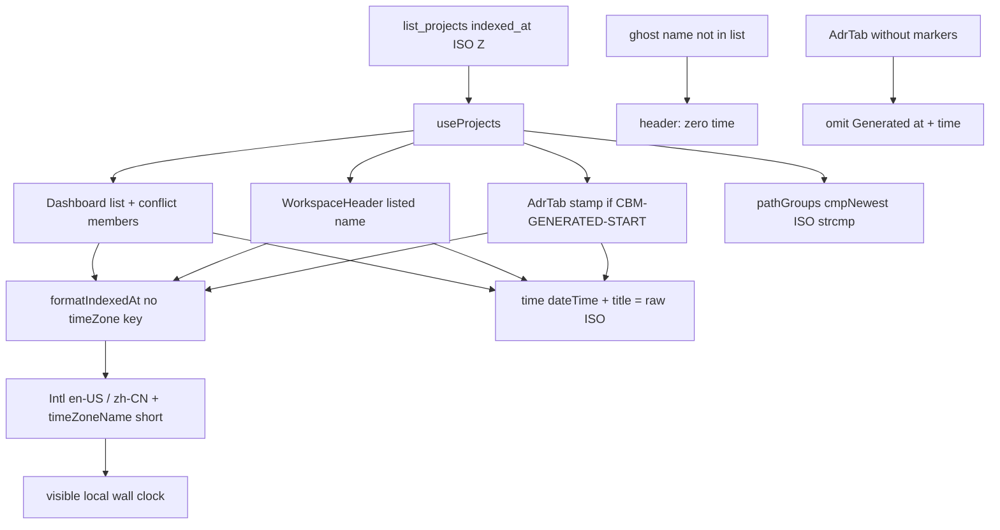

# spec-007 — Last indexed local
Reading time: 5-8 min
Last updated: 2026-08-30 — spec-007-n6p-last-indexed-local CLOSED | IX.2 MODIFIED confirmed

## Feature description

After spec-001, last-indexed text was a UTC locale string. The operator judged freshness against UTC, not the laptop clock. Hover and the hidden machine timestamp were already the raw ISO. Grill epic-003 reverses the display half only.

Last-indexed on Dashboard (list rows and Path-conflict members), the workspace header, and the AdrTab “Generated at” stamp now uses the browser’s runtime timezone. The shared helper still turns `list_projects.indexed_at` into a short English or Chinese string with a timezone abbreviation. It no longer pins `timeZone: "UTC"`. Hover and `<time dateTime>` stay the raw ISO. Conflict “newest” still compares ISO strings. Storage stays ISO Z. No second freshness field.

Business result: the operator reads index age against the same clock as the machine, and a short zone name keeps the stamp from looking like UTC.

## Task timeline

Both tasks landed 2026-08-30. Critical path #1 → #2 (3h plan). Surfaces already called the helper; #2 is tests on that clock.

| When | Task | What the operator can see |
|---|---|---|
| 2026-08-30 | #1 Drop UTC pin + helper oracles | Every screen that already calls `formatIndexedAt` shows the host wall clock plus a short zone name. Invalid or empty `indexed_at` still prints as-is. |
| 2026-08-30 | #2 Surface Gherkin local text + raw ISO | Dashboard, header, and AdrTab stamp prove: visible text = helper; hover/`dateTime` = raw ISO. Garbage `not-a-date` stays visible as that raw text. Ghost names and ADR without generated markers still omit `<time>`. |

DEV: Vitest — helper 4 passed (`formatIndexedAt.test.ts`); surface file run 38 passed (`Dashboard.test.tsx` + `WorkspaceHeader.test.tsx` + `AdrTab.test.tsx` + `colors.test.ts`; tester mapped 11 surface Gherkin). Full graph-ui 160 passed. No C/HTTP. Playwright not required at DEVELOPMENT. CERT later if required. Live UI was not browser-clicked; proof is Vitest.

## Architecture before / after

Before: `formatIndexedAt` used `UTC_PARTS` with `timeZone: "UTC"` (SDD-ADR-003). Visible hour was UTC. `dateTime` / `title` were already the raw `indexed_at` ISO. Dashboard, WorkspaceHeader, and AdrTab already called that one helper.

After: the same helper drops the `timeZone` key (`INDEXED_AT_PARTS`). Locale stays `en-US` / `zh-CN`. `timeZoneName: "short"` stays. Invalid Date still returns the raw string. The three surfaces were not rewritten. Newest is still ISO string compare in `pathGroups`. `list_projects` / `Project.indexed_at` stay daemon ISO Z. Graph hex, Specs expand/archive, Path 1:1, and ADR fill stay untouched.



Host UTC: helper text may match the old UTC-pinned string. `dateTime` is still the raw ISO. Tests compare to a same-process Intl oracle, not a hardcoded wall clock. No `TZ=` required in CI.

Chrome stays grayscale. `colorForLabel("Function")` is still `#06b6d4`. Specs expand/archive and ADR fill are unchanged.

## Decisions + ADRs

| Decision | Why it matters | ADR |
|---|---|---|
| One helper; drop `timeZone: "UTC"` only | Every surface already calls it; a second clock would drift | SDD-ADR-034 |
| Keep `timeZoneName: "short"` + `en-US` / `zh-CN` | Operator can see a zone abbreviation; lang is not a TZ pick | SDD-ADR-034 |
| `dateTime` + `title` + stored ISO stay raw | Instant is not a display-TZ label; hover may still end in Z | SDD-ADR-003 instant half + SDD-ADR-034 |
| Conflict newest still ISO string compare | Display TZ must not change grouping or Enter target | SDD-ADR-016 |
| Tests use Intl `localFmt` vs `utcFmt`; no `TZ=` | CI must not hardcode `"10:00 AM UTC"` or a local wall clock | SDD-ADR-034 |
| Host UTC allowed | Limit Case — pin-fail only when the two oracles differ | SDD-ADR-034 |
| No C/HTTP/MCP; no i18n “UTC” / “local” | Display only; existing “Last indexed” / “Generated at” stay | this spec + IV.3–IV.4 |
| Header still `useProjects` only | No `/api/index-status`; no second freshness field | SDD-ADR-013, IV.4 |

Grill ADR-005 reverses the SDD-ADR-003 display TZ. Instant contract stays.

## How to use

1. Build/serve as today (`scripts/build.sh --with-ui`). Open http://localhost:9749.
2. Dashboard rows show “Last indexed” in the browser timezone (short zone name, e.g. CST). Hover the time to see the raw ISO (often ending in Z).
3. Enter a project. The workspace header uses the same clock. A URL name that is not on the list still shows the name and omits the time.
4. Open ADR after a user-triggered index of an sdd-skill repo. “Generated at” matches last-indexed timezone. The textarea does not contain the ISO stamp.
5. Chinese UI (`zh`) uses `zh-CN` digits for the same instant. Timezone is not selected by language.
6. If the browser host is UTC, the visible string may look like the old UTC pin. `dateTime` is still the stored ISO.
7. A corrupt `indexed_at` such as `not-a-date` stays visible as that raw text on Dashboard, header, and AdrTab-with-markers.

## Debugging guide

Full tables: `human/QUICK-DEBUG.md` (spec-007 Task #1–#2 at the top). Symptom → file → fix:

| If this fails | File:line | Cause | Fix |
|---|---|---|---|
| Visible text still UTC while the laptop is not | `formatIndexedAt.ts:16-23`, `:30` | `timeZone` leaked into `INDEXED_AT_PARTS` | Options must omit `timeZone`. Test `:23-35` fails the pin only when `localFmt !== utcFmt` |
| Valid ISO paints as the raw ISO string | `formatIndexedAt.ts:26-29` | `Date` parse NaN, or parts dropped | Valid ISO must hit `:30`. Invalid/empty is supposed to return raw |
| List/header/stamp text !== `formatIndexedAt` | Dashboard `:248-249` / `:154-155`; header `:31-32`; AdrTab `:123-124` | Surface bypassed the helper | Children must be `formatIndexedAt(indexed_at, lang)` |
| `dateTime` / `title` show formatted local text | same `<time>` attrs | Helper output written into attributes | Instant stays raw `indexed_at` |
| `not-a-date` invented a clock | helper `:27-28` + three surfaces | Formatter ran on Invalid Date | Text and `dateTime` must be `not-a-date` |
| Ghost header shows a `time` | `WorkspaceHeader.tsx:21,28` | Wrong-name match or index-status | `projects.find` by exact `name` |
| AdrTab without markers shows “Generated at” | `AdrTab.tsx:113,120` | Gate used live `content` | `hasGenerated && listed` |
| ISO / formatted clock in the ADR textarea | `AdrTab.tsx:77-81,144` | Chrome copied into `content` | POST equals GET blob |
| Conflict Enter opens the older alias | `pathGroups.ts:17-26` | Display TZ leaked into newest | ISO string then name |
| Host-UTC `dateTime` drifted off the ISO | Dashboard `:248` | Attribute used helper output | `dateTime` stays raw even when `localFmt === utcFmt` |
| Function hex drifted | `colors.ts` | Palette edit | `colorForLabel("Function")` must stay `#06b6d4` |

Verify: `cd graph-ui && npx vitest run src/lib/formatIndexedAt.test.ts` (4) and `npx vitest run src/components/Dashboard.test.tsx src/components/WorkspaceHeader.test.tsx src/components/AdrTab.test.tsx src/lib/colors.test.ts` (38).

## Out of scope

- Changing stored `indexed_at`, `list_projects`, or a daemon display TZ
- Recolor Graph 3D; Specs expand / archive; Path 1:1; ADR fill / watcher
- New HTTP/MCP endpoints or a second freshness field
- Persisted timezone preference or a timezone picker
- Relative “5 minutes ago”; i18n that says “UTC” or “local”
- Playwright / live browser click at DEVELOPMENT

## Pattern validation

Implementation is uniform across #1–#2:

- One helper: `formatIndexedAt` is the only clock. `UTC_PARTS` renamed to `INDEXED_AT_PARTS`. No second formatter. Dashboard `:155` / `:249`, WorkspaceHeader `:32`, AdrTab `:124` still call it.
- Same Intl parts: year/month/day/hour/minute + `timeZoneName: "short"`; locale `en-US` / `zh-CN`. Only the `timeZone` key dropped.
- Instant vs display: visible text = helper; `dateTime` + `title` = raw `indexed_at` (IV.4, SDD-ADR-003 instant half).
- Newest: `cmpNewest` still ISO string then name. `pathGroups.ts` not opened.
- Invalid: NaN / empty returns the raw string on helper and all three surfaces. No invented clock.
- Tests: same-process Intl oracles; surface text compared to `formatIndexedAt`; no hardcoded wall clock; no required `TZ=`.
- Zero C/HTTP/MCP/i18n. Graph hex locked in the suite run. Vitest + fetch-mock, no live daemon (V.1, V.4).

Constitution I–III, V–VIII: no second approach. IV.3–IV.4 held (existing `indexed_at`; no new field). There is no Section X in the draft file.

Patterns: ✓

IX.2 lists spec-001..006 delivered and is silent on display TZ. SDD-ADR-034 is the new rule (visible text = runtime-local Intl; `dateTime`/`title` raw ISO; store stays ISO Z). Not a code defect.

```
📜 CONSTITUTION RECOMMENDATION
Observed: Tasks #1–#2 delivered last-indexed display TZ: formatIndexedAt uses runtime-local Intl (no timeZone pin); time dateTime/title stay raw ISO; store indexed_at stays ISO Z; one helper; newest still ISO strcmp; zero C/HTTP. IX.2 lists spec-001..006 delivered and does not lock that display-TZ contract. IV.4 already says display existing indexed_at and do not invent a second freshness field — it is silent on timezone.
Recommendation: MODIFIED IX.2 at spec close — append "spec-007 delivered last-indexed display TZ: formatIndexedAt uses runtime-local Intl (no timeZone pin); time dateTime/title stay raw ISO; store indexed_at stays ISO Z; one helper; no C/HTTP (SDD-ADR-034)."
→ @planner evaluates, creates ADR if agreed
```

## Quick refs

- Spec: `.sdd-skill/specs/spec-007-n6p-last-indexed-local/spec.md`
- Plan: `.sdd-skill/specs/spec-007-n6p-last-indexed-local/plan.md`
- ADRs: `.sdd-skill/baseline/ARCHITECTURE_ADR.md` (SDD-ADR-034; SDD-ADR-003 instant half; SDD-ADR-016)
- Architecture: `human/ARCHITECTURE-VISUAL.mmd`
- Overview: `human/PROJECT-OVERVIEW.md`
- Debug: `human/QUICK-DEBUG.md`
- Task summaries: `human/task-summaries/task-1-drop-utc-pin-formatindexedat.md`, `task-2-surface-gherkin-local-indexed.md`
- Constitution: `.sdd-skill/docs/constitution.md`
- Tests: `cd graph-ui && npx vitest run src/lib/formatIndexedAt.test.ts` · `npx vitest run src/components/Dashboard.test.tsx src/components/WorkspaceHeader.test.tsx src/components/AdrTab.test.tsx src/lib/colors.test.ts`
