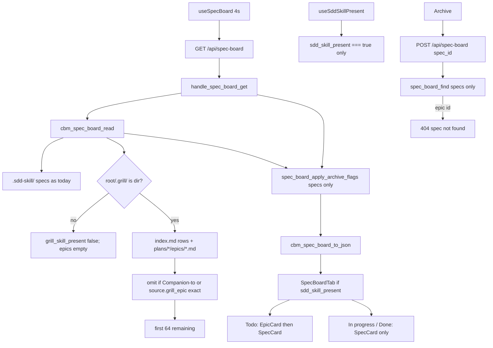

# spec-008 — Grill epic Todo
Reading time: 5-8 min
Last updated: 2026-08-30 — spec-008-g8r-grill-epic-todo CLOSED | IX.2 MODIFIED confirmed

## Feature description

After spec-002, Specs is a three-column Kanban of sdd-skill specs. grill-skill writes plans and epics under `.grill/` that later become those specs. The board never read `.grill/`, so the operator on Specs could not see that funnel in Todo.

Todo now mixes unconverted grill epics with planned/draft specs on the same GET `/api/spec-board`. Each epic card shows a letter E, title, one-line summary, and owning plan. Converted epics disappear when a listed spec.md `Companion to:` path or `active.json.source.grill_epic` equals that epic file path. CBM does not write, move, or rename `.grill/` or `.sdd-skill/` to hide a card. In progress and Done stay specs-only. The Specs tab still requires `.sdd-skill/` (grill-only tab is the next spec).

Business result: an operator already on Specs sees the grill backlog in Todo without a second board, a drag action, or a skill-file write.

## Task timeline

All four tasks landed 2026-08-30. Critical path #1 → #2 → #3 → #4 (11h plan). #4 is tests on the #3 UI.

| When | Task | What the operator can see |
|---|---|---|
| 2026-08-30 | #1 spec_board grill read + additive JSON | Nothing on the live tab yet. The poll JSON can include `grill_skill_present` and an `epics` list (empty when `.grill/` is missing). Converted paths are already omitted. |
| 2026-08-30 | #2 HTTP GET additive + POST epic-id 404 | Same GET returns those keys. Archive POST with an epic path is 404 `spec not found` and writes nothing. Skill files stay byte-identical. |
| 2026-08-30 | #3 SpecBoardTab EpicCard + Todo order | Todo paints E cards first, then planned/draft specs. Clicking an epic does nothing. Spec expand/archive unchanged. Specs still hidden without sdd. |
| 2026-08-30 | #4 Vitest Gherkin mapping | Tests lock two-plan order, 64-cap no Has more, Done/In progress isolation, and grill-true + sdd-false still hides Specs. Product paint did not change. |

DEV: C `spec_board` 35 passed. `spec_board` + `httpd` 124 passed (1 skipped). graph-ui 170/170 (34 SpecBoardTab + 3 palette). Playwright not required at DEVELOPMENT. CERT later if required. Live UI was not browser-clicked; proof is C + Vitest. A pre-spec-008 binary on :9749 will not paint epics until `scripts/build.sh --with-ui`.

## Architecture before / after

Before: GET listed planned/draft/in_progress/done specs with spec-005 blurb/enrich-all and spec-006 `archived` merge. Todo was specs only. `spec_board.c` opened `.sdd-skill/` only. POST `/api/spec-board` found `specs[]` only.

After: the same GET also walks `.grill/` inside `cbm_spec_board_read`. Additive `grill_skill_present` + sibling `epics[]` (cap 64, independent of specs 64). HTTP still merges archive onto `specs[]` only and never fopen `.grill/`. Todo concatenates EpicCard then SpecCard. EpicCard is display-only. `kind` is only on epics. Specs tab omit-until `sdd_skill_present === true`. Caps stay 64 specs / 64 epics / 48 tasks. Poll stays ~4s. Graph hex and last-indexed TZ stay locked.



Chrome stays grayscale except letter E (`--color-epic-mark #7d8ec9`). `colorForLabel("Function")` is still `#06b6d4`. Dashboard, Graph, ADR tab, Path 1:1, ADR fill, spec-005 expand, spec-006 archive, and spec-007 `formatIndexedAt` are unchanged.

## Decisions + ADRs

| Decision | Why it matters | ADR |
|---|---|---|
| Same GET; additive `grill_skill_present` + separate `epics[]`; `kind` only on epics | No second poll; spec slots and SpecCard/archive stay spec-only | SDD-ADR-035 |
| Grill walk in `spec_board.c`; HTTP stays archive merge | Skill-tree fopen stays with sdd reads; HTTP already owns SQLite merge | SDD-ADR-036 |
| JSON `summary` + `plan_title`; conversion exact path; index.md then slug-asc | Do not reuse spec `blurb`; no fuzzy kebab hide; catalog order is closed | SDD-ADR-037 |
| Letter E uses `--color-epic-mark #7d8ec9` | One discreet chrome hue; not health red/amber/green; not GraphTab hex | SDD-ADR-038 |
| Tab still omit-until sdd; emit `grill_skill_present` anyway | Grill-only Specs is epic-002 / a later spec | grill ADR-001 |
| POST epic id → existing 404 `spec not found` | No new error string; `spec_board_find` never walks `epics[]` | SDD-ADR-035 |
| Own epic cap 64; no `has_more`; no `.gamedev/` read | Spec Todo must not compete; gamedev is a later plan | grill ADR-006, ADR-007 |

Graph hex (SDD-ADR-005) and last-indexed TZ (SDD-ADR-034) were not opened. No MCP board tool.

## How to use

1. Build/serve as today (`scripts/build.sh --with-ui`). Open http://localhost:9749 → Enter a project that has `.sdd-skill/` → Specs tab. Grill alone does not show the tab.
2. Todo lists unconverted grill epics first (letter E, title, summary, plan, file path), then planned/draft specs. In progress and Done stay spec cards.
3. An epic leaves Todo when some listed spec.md has `Companion to: .grill/plans/…/epic-NNN-….md` (trailing notes after `.md` are ignored), or when `active.json` `source.grill_epic` equals that path. The epic file on disk does not change. The matching spec still appears in its own column.
4. Clicking an epic card does not expand tasks, does not show Archive/Unarchive, and does not POST. Spec cards still expand in place and still Archive from expanded Done.
5. Missing `.grill/` → GET still 200, `grill_skill_present` false, `epics: []`, specs as today.
6. More than 64 unconverted epics: extras are omitted with no “Has more” control. Spec cap 64 is unchanged.
7. A similarly named spec without Companion-to / `source.grill_epic` sits beside its epic. Conversion is exact path, not kebab/name.
8. Closed-plan leftover epics stay in Todo until converted. Pending and detailed epics both list.

## Debugging guide

Full tables and file:line maps: `human/QUICK-DEBUG.md` (spec-008 Task #1–#4 sections at the top). Symptom → file → fix:

| If this fails | File:line | Cause | Fix |
|---|---|---|---|
| `.grill/` on disk but flag false / empty epics | `spec_board.c:1087-1093`, `:1170-1173` | Not a directory, converted, or name not `epic-NNN-*.md` | `cbm_is_dir`. Walk after present. Tests `:1328` / `:946` |
| Converted epic still in Todo JSON | `spec_board.c:738-756`, `:322-344` | Companion-to token missed | First `.grill/plans/`…`.md` on `Companion to:`. Tests `:1016` / `:1092` |
| 65th epic in JSON / spec cap shrunk | `spec_board.c:967-968`, `:1067-1068` | Shared pool or `has_more` key | Own cap 64; specs stay 64. Test `:1277` |
| GET/POST changed `index.md` / epic.md / `active.json` | `spec_board.c:36-37`; `http_server.c` no fopen | Write mode or HTTP opened skill trees | fopen `"rb"` only. Tests `test_spec_board.c:1386` / `test_httpd.c:3825` |
| POST epic id 200 / wrote a flag | `http_server.c:531-543`, `:626-630` | `spec_board_find` walked `epics[]` | Loop `spec_count` only. `{"error":"spec not found"}`. Test `:3745` |
| Grill `fopen` in `http_server.c` | `http_server.c:487-518` | Sibling reader leaked into HTTP | Parse stays in `cbm_spec_board_read`. SDD-ADR-036 |
| Letter E is gray / the word Epic / a pill | `globals.css:28`; `SpecBoardTab.tsx:104` | Token missing or badge leaked | `--color-epic-mark: #7d8ec9`. Literal `"E"`. Tests `:819-823` |
| Epic follows the spec in Todo | `SpecBoardTab.tsx:267-278` | Specs mapped first | `todoEpics.map` then `entries.map`. Test `:828` |
| Click epic expands / Archive / POST | `SpecBoardTab.tsx:100-111` | EpicCard reused SpecCard | Display-only `<div>`; `persistArchive` SpecCard only. Test `:837` |
| grill true + sdd false paints Todo | `SpecBoardTab.tsx:344-346` | Host gated on grill | Still `!board.sdd_skill_present`. Test `:389`. Strip: `useSddSkillPresent.ts:16` |
| Function nodes went periwinkle | `colors.ts:19-20` | Graph map imported the chrome var | `colorForLabel("Function")` must stay `#06b6d4`. Test `:963` |
| Live :9749 has no epic cards | daemon binary | Pre-spec-008 embed | Rebuild `--with-ui`. GET must include `epics` |

Verify C: `scripts/test.sh --suites spec_board,httpd`. UI: `cd graph-ui && npx vitest run src/components/SpecBoardTab.test.tsx src/lib/colors.test.ts`.

## Out of scope

- Specs tab visible when `.grill/` exists and `.sdd-skill/` does not — grill epic-002
- Drag, button, or CBM write that creates a spec or deletes/moves an epic
- Fuzzy name/kebab match or a CBM-owned epic↔spec table
- Reading `.gamedev/`, painting or hiding via gamedev
- “Has more” chrome; renaming the tab away from “Specs”
- Changing spec-005 expand, spec-006 archive, or spec-007 `formatIndexedAt`
- Recolor Graph 3D

## Pattern validation

Implementation is uniform across #1–#4 vs constitution + spec-005/006 GET family:

- Same GET `/api/spec-board` (IV.3). Additive keys only. No `/api/grill-board`. No MCP board tool. Poll stays `useSpecBoard` 4000 ms.
- Grill walk in `spec_board.c` / `cbm_spec_board_read`. HTTP is still read → archive merge on `specs[]` → `to_json` (SDD-ADR-030 family). No grill fopen/opendir in `http_server.c`.
- Separate `epics[]` (own cap 64). Spec objects have no `"kind"`. Array membership is the discriminator. POST `spec_board_find` stays `specs[]` only.
- Conversion is read-side `strcmp` on Companion-to first `.grill/plans/`…`.md` or `source.grill_epic`. No CBM epic↔spec table. Companion-to token is never fopen’d.
- Omit-until sdd: `useSddSkillPresent` still `sdd_skill_present === true` only. `grill_skill_present` is emitted and does not show the tab.
- Letter E is chrome token `--color-epic-mark #7d8ec9`, not health, not `colorForLabel` / EdgeLines hex (III + SDD-ADR-005). No new CSS file.
- Zero skill writes: fopen `"rb"` only; GET and epic-id POST leave `index.md` / epic.md / `active.json` byte-identical (I.2).
- spec-005 expand Set / blurb / Todo pending-only stay on SpecCard. spec-006 Archive/Unarchive stay spec-only. spec-007 `formatIndexedAt` untouched.

Constitution I–III, V–VIII: no second approach. IV.3 existing path held. There is no Section X in the draft file.

Patterns: ✓

IX.2 lists spec-001..007 delivered (expand, archive, display TZ) and is silent on grill Mixed Todo / additive `epics[]` / E token. Not a code defect.

```
📜 CONSTITUTION RECOMMENDATION
Observed: Tasks #1–#4 delivered Specs-tab Mixed Todo grill epics: GET /api/spec-board additive grill_skill_present + separate epics[] (cap 64); kind only on epics; grill walk in spec_board.c (HTTP no grill fopen); conversion exact Companion-to / source.grill_epic; letter E --color-epic-mark #7d8ec9; EpicCard display-only; Todo epics-then-specs; tab still omit-until sdd; zero skill writes. IX.2 lists spec-001..007 delivered and does not lock that Mixed Todo contract. I.2 already covers the zero-write reader. III already grayscale-except-health and is silent on the one E chrome token.
Recommendation: MODIFIED IX.2 at spec close — append "spec-008 delivered Specs-tab Mixed Todo grill epics: GET /api/spec-board additive grill_skill_present + separate epics[] (cap 64); kind only on epics; grill walk in spec_board.c (HTTP no grill fopen); conversion exact Companion-to / source.grill_epic; letter E --color-epic-mark #7d8ec9; EpicCard display-only; Todo epics-then-specs; tab still omit-until sdd; zero skill writes (SDD-ADR-035..038)."
→ @planner evaluates, creates ADR if agreed
```

## Quick refs

- Spec: `.sdd-skill/specs/spec-008-g8r-grill-epic-todo/spec.md`
- Plan: `.sdd-skill/specs/spec-008-g8r-grill-epic-todo/plan.md`
- ADRs: `.sdd-skill/baseline/ARCHITECTURE_ADR.md` (SDD-ADR-035 … 038)
- Architecture: `human/ARCHITECTURE-VISUAL.mmd`
- Overview: `human/PROJECT-OVERVIEW.md`
- Debug: `human/QUICK-DEBUG.md`
- Task summaries: `human/task-summaries/task-1-spec-board-grill-read.md`, `task-2-http-get-additive-post-epic-404.md`, `task-3-epiccard-todo-order.md`, `task-4-vitest-gherkin-grill-epic.md`
- Constitution: `.sdd-skill/docs/constitution.md`
- Tests: `scripts/test.sh --suites spec_board,httpd` · `cd graph-ui && npx vitest run src/components/SpecBoardTab.test.tsx src/lib/colors.test.ts`
