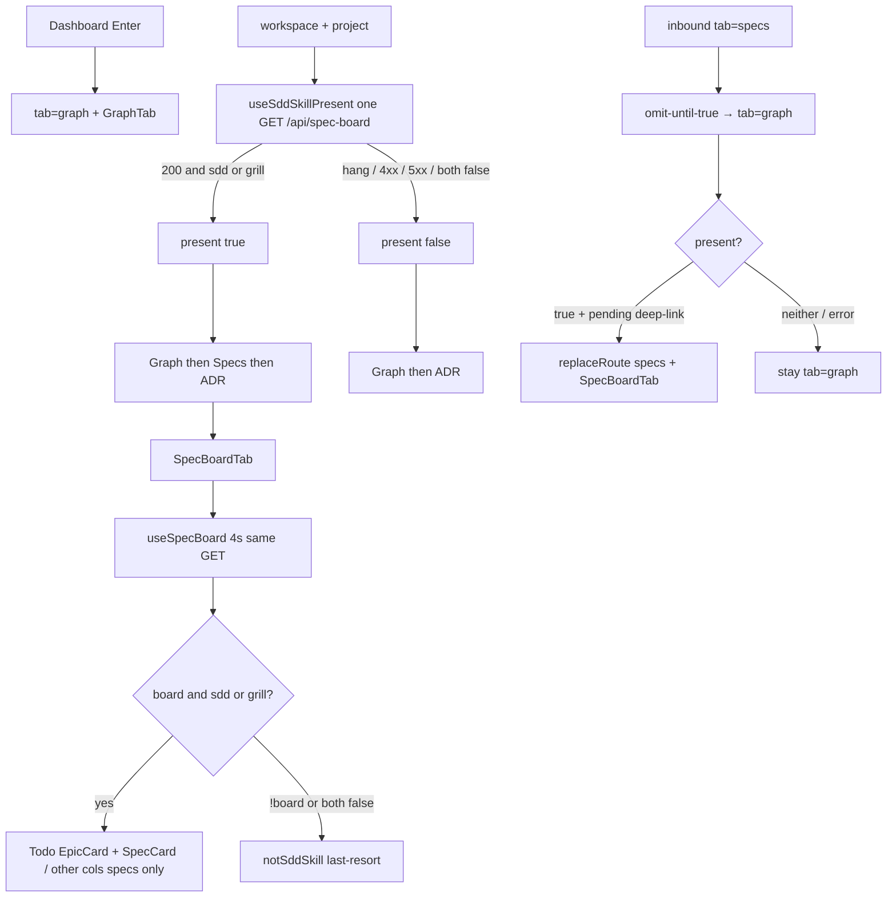

# spec-009 — Specs tab grill presence
Reading time: 5-8 min
Last updated: 2026-08-30 — spec-009-t4x-specs-tab-grill-presence CLOSED

## Feature description

spec-008 already walks `.grill/` on GET `/api/spec-board` and returns `grill_skill_present` plus Mixed Todo `epics[]` even when the repo has no `.sdd-skill/`. The workspace strip still treated Specs as sdd-only: the tab stayed hidden, `?tab=specs` bounced to Graph, and opening the pane showed “This project doesn't use sdd-skill — nothing to show here”. A grill-only operator could not reach the Kanban that already listed their epics.

Specs now appears when that same one-shot GET is HTTP 200 and the project has sdd-skill or grill-skill. The tab name is still Specs. Order when shown stays Graph, then Specs, then ADR. Enter from Dashboard still opens Graph. A bookmark `?tab=specs&project=…` on a grill-only project stays on Specs instead of rewriting to Graph.

On that grill-only pane the three-column Kanban is the board. Unconverted epics paint in Todo (letter E, title, summary, plan — same spec-008 cards). In progress and Done stay specs-only; with no specs they show the existing “No specs yet” copy. The “doesn't use sdd-skill” message is only a last-resort if both flags are false after load. An empty `.grill/` still shows the tab; all three columns say “No specs yet”.

A path with neither skill, or only a future `.gamedev/` tree, still omits Specs. Loading, 404, 500, or a network failure still omit the tab — it is not disabled and there is no strip hint. There is no second HTTP path, no MCP presence tool, and GET still does not write `.grill/` or `.sdd-skill/`.

Business result: an operator whose repo has only grill-skill can open Mixed Todo without adopting sdd-skill first.

## Task timeline

All three tasks landed 2026-08-30. Critical path #1 then #2 and #3 (6h sequential; 4h if #2/#3 parallel after #1).

| When | Task | What the operator can see |
|---|---|---|
| 2026-08-30 | #1 Presence predicate sdd OR grill | Nothing new on the live strip yet if App mocks were still sdd-only. The one-shot hook now treats GET 200 + grill as present, same as sdd. Hang / 404 / 500 still hide Specs. |
| 2026-08-30 | #2 SpecBoardTab host Kanban on grill-only | Grill-only paints Todo / In progress / Done. An inbox epic shows E + title in Todo; spec columns stay “No specs yet”. Empty epics still Kanban, not the sdd-empty pane. |
| 2026-08-30 | #3 App strip, deep-link, Enter, omit | Grill-only shows Specs in the strip. `?tab=specs` stays. Enter still opens Graph with Specs available. Neither-skill and gamedev-only omit; GET 500 still omits. |

DEV: hook 10/10. SpecBoardTab 36/36. App 30/30. Full graph-ui 182 passed (23 files). Coverage reporter absent (~88% claimed on touched files). Playwright not required at DEVELOPMENT. C/HTTP/MCP not edited this spec; GET zero-write and no `gamedev_skill_present` stay spec-008 C owners. Live UI was not browser-clicked; proof is Vitest. A pre-this-spec UI embed still hides Specs on grill-only until `scripts/build.sh --with-ui`.

## Architecture before / after

Before: `useSddSkillPresent.bodyHasSkill` was `sdd_skill_present === true` only. `fallbackSpecsToGraph` rewrote `tab=specs` to Graph whenever `present` was false (including while loading). SpecBoardTab replaced the Kanban with `notSddSkill` whenever sdd was false, even if grill was true. GET already emitted both flags and `epics[]` (spec-008).

After: the same hook, same GET, same `present` boolean. Predicate is HTTP 200 AND (`sdd === true` OR `grill === true`). Missing grill is false. App still drives `showSpecs={present}`. Omit-until-true still rewrites while loading; inbound `tab=specs` is restored when present becomes true. Host paints Kanban on the same OR. `notSddSkill` stays last-resort for `!board` after load or both flags false. Enter stays Graph. No C change.



Chrome, Mixed Todo card rules, expand, archive, `formatIndexedAt`, Graph hex, Path 1:1, and ADR fill are unchanged.

## Decisions + ADRs

| Decision | Why it matters | ADR |
|---|---|---|
| Keep `useSddSkillPresent`; change `bodyHasSkill` only | No rename churn; SDD-ADR-010 identity stays; Gherkin never names the hook | SDD-ADR-039 |
| Host Kanban on sdd OR grill; keep `notSddSkill` last-resort | Grill-only must paint; a later both-false poll / direct mount must not show empty columns under a still-visible tab | SDD-ADR-040 |
| graph-ui only; same GET; no second poll | Flags already on spec-008 200; constitution IV.3 | SDD-ADR-041 |
| Restore inbound `tab=specs` after present | Omit-while-loading would leave a grill-only bookmark on Graph | US-003; SDD-ADR-010 kernel stays |
| Enter stays Graph; tab label stays Specs | Default workspace tab and i18n key are not this spec | IX.3; `tabs.specs` |
| gamedev-only = both flags false; do not emit `gamedev_skill_present` | Dead tab must not appear; do not read `.gamedev/` | grill ADR-006 |
| spec-008 “Specs still requires sdd” tests inverted | Old Then must not stay green | plan Testing Strategy |

SDD-ADR-010 superseded in part (predicate only). One-shot GET, omit-while-loading, no `/api/skill-presence`, no 4s strip poll stay.

## How to use

1. Build/serve as today (`scripts/build.sh --with-ui`). Open http://localhost:9749.
2. Enter a project that has `.grill/` and no `.sdd-skill/`. You land on Graph. The strip shows Graph, Specs, ADR. Open Specs for Mixed Todo (epics in Todo; spec columns empty if there are no specs).
3. A project with `.sdd-skill/` still shows Specs (grill optional). sdd + grill is the same tab.
4. Share or bookmark `?tab=specs&project=<name>` on a grill-only project: the URL stays `tab=specs` and the Kanban is the pane.
5. A project with neither skill, or only `.gamedev/`, has no Specs tab. `?tab=specs` rewrites to Graph.
6. Enter never opens Specs by default. Loading or a failed GET hides the tab until a later 200 with a true flag (the strip is one-shot per workspace project; the pane still polls every 4s).
7. Epic cards, conversion, archive, and expand work as in spec-008 / spec-005 / spec-006. This spec does not write skill trees.

## Debugging guide

Full tables: `human/QUICK-DEBUG.md` (spec-009 Task #1–#3 at the top). Symptom → file → fix:

| If this fails | File:line | Cause | Fix |
|---|---|---|---|
| Grill-only omits Specs | `useSddSkillPresent.ts:17` / `App.test.tsx:93-99` | Hook still sdd-only, or mock `"true"`/`"false"` without grill | `bodyHasSkill` OR grill. Mock `{ sdd: false, grill: true }`. Tests hook `:41`, App `:592` |
| `?tab=specs` becomes `tab=graph` on grill-only 200 | `App.tsx:74-86` | Restore skipped | Capture inbound specs `:29`; restore when `present`. Test `:613` |
| neither-skill keeps `tab=specs` | `App.tsx:83-85` / `route.ts:38-40` | Fallback not applied | Both flags false → omit. Tests `:282` / `:636` |
| Enter opens Specs | `App.tsx:151` | Default tab changed | `navigate("graph", p)`. Test `:659` |
| Grill-only shows “doesn't use sdd-skill” | `SpecBoardTab.tsx:345` | Host still `!sdd` | OR `grill_skill_present === true`. Test `:372` |
| Empty grill-only shows notSddSkill | `SpecBoardTab.tsx:345` | Empty lists treated as absent | Kanban + three `noSpecs`. Test `:404` |
| Both-false / `!board` paints Todo | `SpecBoardTab.tsx:345` | Last-resort dropped | `!(sdd \|\| grill)` → `notSddSkill`. Tests `:443` / `:427` |
| First load shows notSddSkill | `SpecBoardTab.tsx:340-342` | Loading branch lost | `loading && !board` → `t.common.loading`. Test `:338` |
| Specs shows when neither / `"true"` / `1` | `useSddSkillPresent.ts:17` | Non-boolean truthy | Strict `=== true`. Tests `:86` / `:101` / `:114` |
| 404 / 500 / hang shows Specs | hook `:30, :36-38, :43` | `present` defaulted true | `setPresent(false)` until 200 + OR. Tests `:129` / `:140` / `:152` |
| Interval or `/api/skill-presence` | hook `:23-50` | Second poll or URL | One fetch; no `setInterval(4000)`. Test `:167` |
| gamedev-only shows Specs | `App.test.tsx:646-650` | Extra flag or grill true | Both false; no `gamedev_skill_present` key. Do not add C |
| GET 500 still shows Specs | `App.tsx:126` | `present` true on error | Keep omit. Test `:391` |
| C/HTTP/MCP edited | — | Presence leaked to daemon | SDD-ADR-041. Zero-write owner is spec-008 C |
| Live :9749 still sdd-only strip | daemon / embed | Pre-spec-009 UI | Rebuild `--with-ui` |

Verify UI: `cd graph-ui && npx vitest run src/hooks/useSddSkillPresent.test.ts src/components/SpecBoardTab.test.tsx src/App.test.tsx`. C unchanged: `scripts/test.sh --suites spec_board,httpd` only if you suspect a missing `grill_skill_present` on an existing 200.

## Out of scope

- Changing Mixed Todo card rules, conversion, order, or epic cap (spec-008)
- Drag, button, or CBM write that creates a spec or deletes/moves an epic
- Reading `.gamedev/`, painting or hiding via gamedev
- Renaming the tab away from Specs
- Changing default Enter tab away from Graph
- New HTTP path or MCP presence tool
- Changing spec-005 expand, spec-006 archive, spec-007 `formatIndexedAt`

## Pattern validation

Implementation is uniform across #1–#3 vs constitution + spec-002/008 presence family:

- Same GET `/api/spec-board` (IV.3). No `/api/skill-presence` for the strip. No MCP tool. Strip stays one-shot; `useSpecBoard` 4000 ms stays pane refresh only (VIII).
- Same hook export `useSddSkillPresent` and boolean `present` (SDD-ADR-010 identity; SDD-ADR-039 predicate only). Host gate uses the same strict `=== true` OR (SDD-ADR-040). App still passes `present` into `showSpecs` and `fallbackSpecsToGraph` (signature unchanged).
- Restore of inbound `tab=specs` is the omit-until-true complement, not a second presence source.
- Enter stays Graph (IX.3). Tab label `tabs.specs`. WorkspaceTabStrip product unchanged (`showSpecs` only).
- graph-ui only (SDD-ADR-041). C GET shape, zero skill writes, and no `gamedev_skill_present` stay spec-008. I.2 held.
- EpicCard / expand Set / archive / `formatIndexedAt` / `colors.ts` untouched (IX.2 delivered contracts).
- Last-resort keeps existing `notSddSkill` copy — no second empty-state string (II.3).
- English Then text (II.3). Breadcrumbs on touched files (VII.2).

Constitution I–III, V–VIII: no second approach. There is no Section X in the draft file.

Patterns: ✓

IX.2 still ends with spec-008 “tab still omit-until sdd”. This spec superseded that strip/host rule (grill-only shows Specs + Kanban). Not a code defect — constitution text is stale until close.

```
📜 CONSTITUTION RECOMMENDATION
Observed: Tasks #1–#3 delivered Specs-tab presence as sdd OR grill on the same one-shot GET /api/spec-board. Hook export stays useSddSkillPresent; host Kanban uses the same OR; notSddSkill is last-resort when !board or both flags false; omit-until-true + restore inbound tab=specs; Enter stays Graph; gamedev-only does not show Specs; graph-ui only; zero skill writes; no second poll. IX.2 still says spec-008 "tab still omit-until sdd", which this spec superseded.
Recommendation: MODIFIED IX.2 at spec close — append "spec-009 delivered Specs-tab presence sdd OR grill: useSddSkillPresent bodyHasSkill is 200 AND (sdd_skill_present === true OR grill_skill_present === true); SpecBoardTab host Kanban on the same OR with notSddSkill last-resort when !board or both false; omit-until-true + restore inbound tab=specs; Enter stays Graph; tab label Specs; gamedev-only does not show Specs; graph-ui only; zero skill writes; no second poll or /api/skill-presence (SDD-ADR-039..041). spec-008 'tab still omit-until sdd' is superseded."
→ @planner evaluates, creates ADR if agreed
```

## Quick refs

- Spec: `.sdd-skill/specs/spec-009-t4x-specs-tab-grill-presence/spec.md`
- Plan: `.sdd-skill/specs/spec-009-t4x-specs-tab-grill-presence/plan.md`
- ADRs: `.sdd-skill/baseline/ARCHITECTURE_ADR.md` (SDD-ADR-039 … 041; SDD-ADR-010 superseded in part)
- Architecture: `human/ARCHITECTURE-VISUAL.mmd`
- Overview: `human/PROJECT-OVERVIEW.md`
- Debug: `human/QUICK-DEBUG.md`
- Task summaries: `human/task-summaries/task-1-presence-predicate-sdd-or-grill.md`, `task-2-specboardtab-host-kanban-grill-only.md`, `task-3-app-strip-deep-link-enter.md`
- Constitution: `.sdd-skill/docs/constitution.md`
- Tests: `cd graph-ui && npx vitest run src/hooks/useSddSkillPresent.test.ts src/components/SpecBoardTab.test.tsx src/App.test.tsx`
