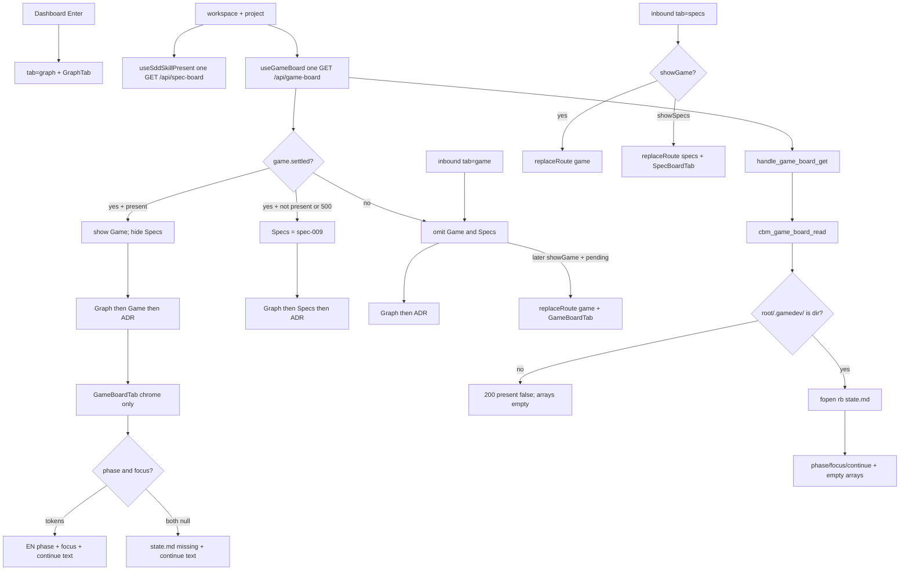

# spec-010 — Game tab silent win
Reading time: 5-8 min
Last updated: 2026-08-31 — spec-010-c4h-game-tab-silent-win closeprep

## Feature description

The workspace already had Graph, Specs (sdd or grill), and ADR. gamedev-skill is a different cycle. A folder with `.gamedev/` must get its own Game tab and must not show Specs, even when `.sdd-skill/` or `.grill/` sit on the same root. That is silent win: one path, one lifecycle chrome. Other paths stay sdd+grill as in spec-009.

Game presence comes from one shot of GET `/api/game-board?project=`. Specs stays on GET `/api/spec-board`. The UI never calls `/api/skill-presence`. While game-board is still loading, both Game and Specs stay off so Specs cannot flash. After a 200 with `gamedev_skill_present === true`, the strip is Graph, then Game, then ADR. After a 200 with present false, or after a 500, Specs follows spec-009.

The Game pane is a map, not a launcher. When `state.md` parses you see the English phase label, the focus line, and the exact text `/gamedev-skill continue` (copy it into the IDE). There is no button that starts the skill, no command catalog, no gate-review hint. An empty `.gamedev/` still shows the tab; chrome says "state.md missing" plus the same continue string. Column arrays exist on the JSON and stay empty — no cards this spec.

Enter from Dashboard still opens Graph. A leftover `?tab=specs` on a gamedev path becomes `tab=game`, not Graph. CBM only reads `.gamedev/` (`fopen` rb). It does not write skill trees or launch the skill.

Business result: an operator on a `.gamedev/` project (for example bevy-tetris) sees Game-not-Specs and how to resume the skill, without CBM writing `.gamedev/` or starting it.

## Task timeline

All five tasks landed 2026-08-31. Critical path #1 → #2 → #3 → #4 → #5 (13.5h plan). #5 is leftover Vitest on the #4 product.

| When | Task | What the operator can see |
|---|---|---|
| 2026-08-31 | #1 C/HTTP GET `/api/game-board` | Nothing on the strip yet. A known project answers the new URL: present + phase/focus/continue when `.gamedev/` is a directory; 200 present false when it is not. Four column arrays are always `[]`. Specs JSON still has no `gamedev_skill_present`. GET leaves skill trees byte-identical. |
| 2026-08-31 | #2 TabId, route kernels, strip, i18n | Address bar accepts `?tab=game`. Strip can show Graph then Game then ADR when `showGame` is true. Leftover `tab=specs` + gamedev is meant to become Game. App did not pass the flag yet. |
| 2026-08-31 | #3 GameBoardTab chrome | A dedicated pane can show "Production" + focus + `/gamedev-skill continue`, or "state.md missing" + continue. Continue is selectable text, not a button. App did not mount the pane yet. |
| 2026-08-31 | #4 App silent-win, dual fetch, deep-links | Dual one-shot. Game shown, Specs hidden. In-flight omits both. 500 does not hide Specs. `?tab=game` restores after the wait. Leftover `?tab=specs` on gamedev becomes Game. Enter still opens Graph. |
| 2026-08-31 | #5 Remaining Vitest Gherkin | Empty-dir still shows Game + missing-state chrome. App fetch never hits `/api/skill-presence`. No columns, cards, launcher, or gate-review. Product paint did not change. |

DEV: graph-ui Vitest 211 passed (25 files). C `game_board` + `httpd` 103 passed, 1 skipped (Task #1). Coverage reporter absent (~88% claimed on touched files). Playwright not run (optional at DEVELOPMENT). Live UI was not browser-clicked; proof is Vitest + C. A pre-this-spec UI embed has no Game tab until `scripts/build.sh --with-ui`.

## Architecture before / after

Before: closed set was graph / specs / adr. Specs present was spec-board 200 AND (sdd OR grill). `.gamedev/` was invisible on HTTP except the unused `/api/skill-presence` helper. `fallbackSpecsToGraph` sent leftover `tab=specs` to Graph. App passed `showSpecs={present}` only.

After: GET `/api/game-board` is a sibling path (new `game_board.c`, heap `cbm_game_board_t`, fopen rb `state.md`). Dual one-shot: `useGameBoard` + unchanged `useSddSkillPresent`. `showGame = settled && present`. `showSpecs = settled && !showGame && specsPresent`. Dedicated `GameBoardTab` (not `SpecBoardTab`). `resolveWorkspaceTab` applies specs-on-gamedev → game, then `fallbackGameToGraph`, then `fallbackSpecsToGraph`. Enter stays Graph. spec-board stays gamedev-free.



Chrome grayscale, Mixed Todo, expand, archive, `formatIndexedAt`, Graph hex, Path 1:1, and ADR fill are unchanged on non-gamedev paths.

## Decisions + ADRs

| Decision | Why it matters | ADR |
|---|---|---|
| New `GameBoardTab`, not `SpecBoardTab` | Silent win must not paint Specs Kanban (Todo / EpicCard / Archive) | SDD-ADR-042 |
| Keep `fallbackSpecsToGraph`; add `fallbackGameToGraph` + `resolveWorkspaceTab` | Leftover `tab=specs` + gamedev → game, not Graph. Do not fold the two fallbacks | SDD-ADR-043 |
| Dual one-shot; `useSddSkillPresent` unchanged | Game presence is GET `/api/game-board` only. Do not teach the Specs hook a second URL | SDD-ADR-043 |
| Parse compact `phase=` / `focus=`; tolerate `active_phase` / `director_focus` | Skill 1.7.0+ and bevy-tetris are compact; `/gamedev-skill update` does not migrate leftovers | SDD-ADR-044 |
| Dedicated heap `cbm_game_board_t` + new GET | spec-board stays gamedev-free (IV.3). Epic 002 fills the same struct and URL | SDD-ADR-045 |
| Continue is selectable text, not a button | Map, not launcher. No spawn, no catalog, no gate-review | SDD-ADR-042; grill ADR-009 |
| Enter stays Graph; in-flight omits both; 500 does not hide Specs | Default tab and anti-flash. A failed Game GET must not steal Specs | US-001; US-002; IX.3 |
| fopen `"rb"` only; no POST; no MCP tool | Zero skill writes. CBM is not the writer | I.2; US-006 |

## How to use

1. Build/serve with `scripts/build.sh --with-ui`. Open http://localhost:9749. A pre-spec-010 embed has no Game tab.
2. Enter a project. You land on Graph. That does not change.
3. If the project root has `.gamedev/` as a directory, the strip is Graph, Game, ADR. Open Game for phase, focus, and `/gamedev-skill continue`. Copy the continue text into the IDE. There is no launch button.
4. If that same root also has `.sdd-skill/` and/or `.grill/`, Specs is hidden. No conflict banner. No hybrid chrome.
5. If `.gamedev/` is empty or `state.md` is missing, Game still shows. Chrome says "state.md missing" plus the continue string. No phase label.
6. A leftover bookmark `?tab=specs&project=<name>` on a gamedev path becomes `tab=game`. Share `?tab=game&project=<name>` when present; without gamedev it falls back to Graph.
7. sdd-only and grill-only paths without `.gamedev/` still show Specs and never show Game. Neither-skill still omits both extra tabs.
8. This spec does not write `.gamedev/`, paint columns or cards, or start the skill. Epic 002 will fill the same GET arrays.

## Debugging guide

Symptom → file → fix. Task-level tables also live in `human/QUICK-DEBUG.md` and the five task summaries.

| If this fails | File:line | Cause | Fix |
|---|---|---|---|
| `.gamedev/` path has no Game tab | `App.tsx:35`; `useGameBoard.ts:69-80` | Hook not 200 + `gamedev_skill_present === true`, or `showGame` ignored settle | Presence is GET `/api/game-board` only. `present` is not "has state.md". Tests `App.test.tsx:749`, `:938` |
| Specs flashes while Game is loading | `App.tsx:35-36`; `useGameBoard.ts:63-65` | `showSpecs` used raw `specsPresent` before `game.settled` | Both flags require `gameSettled`. Hang never sets `settled` true. Test `:876-891` |
| Specs still visible when Game is shown | `App.tsx:36`, `:151-152` | Silent-win AND NOT dropped | `showSpecs = settled && !showGame && specsPresent`. Strip Game-wins if both true (`WorkspaceTabStrip.tsx:37-41`) |
| game-board 500 hides Specs | `useGameBoard.ts:71-75`; `App.tsx:36` | Non-200 left `settled` false, or Specs required Game 200 | 4xx/5xx/throw → settled true, present false. Specs = spec-009. Test `:894-902` |
| `?tab=specs` + gamedev stays Specs or goes Graph | `route.ts:59`; `App.tsx:94-99` | Silent-win step skipped, or pending specs restored Specs | `tab === "specs" && gamePresent` → `"game"`. Test `:786-800` |
| Inbound `tab=game` stays Graph after present true | `App.tsx:38`, `:86-92` | `pendingGameDeepLink` not set, or restore skipped | Capture inbound game before omit-until-true. Test `:855-873` |
| Enter opens Game | `App.tsx:179` | Default tab changed | `navigate("graph", p)`. Game tab still in strip. Test `:833-842` |
| Continue is a button / click starts the skill | `GameBoardTab.tsx:39-41` | Continue wrapped in `<button>` | `<p className="... select-text">`. Test `GameBoardTab.test.tsx:78` |
| Production missing on `phase: "02-production"` | `GameBoardTab.tsx:16-19`; `i18n.ts:121` | Token not mapped or EN key drifted | `phaseLabel` → `t.gameBoard.phaseProduction`. Test `:73` |
| Empty dir omits Game or shows "Production" | `App.test.tsx:51-61`; `game_board.c:189` | Present required `state.md`, or fixture filled phase | Dir only. `emptyGameBoard(true)` keeps phase/focus null. Tests App `:938-953`; C `:106` |
| GET spec-board has `gamedev_skill_present` | `spec_board.c` to_json | Extra key leaked | Helper is not called from read/to_json. Test `test_httpd.c:3936` |
| `/api/skill-presence` in App fetch | `useGameBoard.ts:69`; `App.test.tsx:228` | Unused GET called | Presence is `/api/game-board` only. afterEach `:652` / `:741`; dedicated `:957` |
| Skill-tree bytes changed after GET | `game_board.c:195-201` | Write mode or mkdir leaked | `fopen` `"rb"` only. Tests `test_game_board.c:270` / `test_httpd.c:3999` |
| Live :9749 has no Game tab | daemon / embed | Pre-spec-010 UI | Rebuild `--with-ui` |

Verify UI: `cd graph-ui && npx vitest run` (211). Verify C: `scripts/test.sh --suites game_board,httpd` (103 passed, 1 skipped).

## Out of scope

- Artifact cards, four visible columns, Inbox grill, conversion map (epic 002)
- Expand, archive, blocked-by strip, Track A Inputs (epic 003)
- ADR fill from the gamedev trio (epic 004)
- Two tabs Specs + Game on the same path
- Conflict banner if `.gamedev/` and `.sdd-skill/` coexist
- Writing `.gamedev/` or invoking gamedev-skill from CBM
- Using GET `/api/skill-presence` in graph-ui
- Emitting `gamedev_skill_present` on GET `/api/spec-board`
- Changing Enter default away from Graph
- POST `/api/game-board` / MCP game-board tool

## Pattern validation

Implementation is uniform across #1–#5 vs constitution + spec-002/009 presence family:

- Dual one-shot: `useGameBoard` GET `/api/game-board` + `useSddSkillPresent` GET `/api/spec-board`. Never `/api/skill-presence`. No 4s game-board interval. `useSpecBoard` 4000 ms stays Specs pane only (VIII).
- Presence AND NOT is App-only (`showSpecs = settled && !showGame && specsPresent`). `useSddSkillPresent` export and spec-009 predicate unchanged (SDD-ADR-039 identity).
- Dedicated `GameBoardTab`, not `SpecBoardTab` reuse (SDD-ADR-042). Props, not a second pane fetch.
- `fallbackSpecsToGraph(tab, present): TabId` signature kept. Sibling `fallbackGameToGraph` + `resolveWorkspaceTab` not collapsed (SDD-ADR-043).
- fopen `"rb"` only. Dir check reuses `cbm_spec_board_gamedev_skill_present` (no second `.gamedev` stat). New GET required by IV.3 + gamedev-free lock (SDD-ADR-045). Same 400/404 strings and heap calloc as spec-board.
- Compact `phase=` / `focus=` first; aliases for leftovers (SDD-ADR-044). English labels live in i18n, not C (II.3).
- Enter stays Graph (IX.3). Continue is text, not a launcher (grill ADR-009). Arrays `[]` unread in JSX.
- Zero skill writes (I.2). No POST. No MCP tool. `mockAppFetch` default game-board 200 present false so spec-009 tests stay.
- English Then text (II.3). Breadcrumbs on touched files (VII.2). Graph Function hue still `#06b6d4` (III.2).

Constitution I–III, V–VIII: no second approach. There is no Section X in the draft file.

Patterns: ✓

IX.2 still ends with spec-009 “gamedev-only does not show Specs” and does not mention the Game tab, silent win, or GET `/api/game-board`. That sentence is now incomplete: gamedev + sdd/grill used to show Specs; Game now wins. Not a code defect — constitution text is stale until close.

```
📜 CONSTITUTION RECOMMENDATION
Observed: Tasks #1–#5 delivered Game-tab silent win. Presence is one-shot GET /api/game-board (not /api/skill-presence, not a spec-board field). showGame = settled AND gamedev_skill_present === true. When Game is shown, Specs is omitted even if sdd or grill exist. In-flight omits Game and Specs. game-board 500 omits Game and does not hide Specs. Dedicated GameBoardTab chrome (phase/focus/continue as copy text, not SpecBoardTab, not a launcher). resolveWorkspaceTab leftover tab=specs + gamedev → game. Enter stays Graph. fopen rb only. Dedicated cbm_game_board_t + empty column arrays. spec-board stays gamedev-free. Dual one-shot; kernels not collapsed. IX.2 still says spec-009 "gamedev-only does not show Specs" and does not mention Game / silent win / GET /api/game-board — that text is now incomplete (gamedev + sdd/grill still showed Specs; now Game wins).
Recommendation: MODIFIED IX.2 at spec close — append "spec-010 delivered Game tab silent win: presence is one-shot GET /api/game-board (not /api/skill-presence, not a spec-board field); showGame = game-board settled AND gamedev_skill_present === true; when Game is shown Specs is omitted even if sdd or grill; in-flight omits Game and Specs; game-board 500 omits Game and does not hide Specs; dedicated GameBoardTab chrome (phase/focus/continue as copy text, not SpecBoardTab, not a launcher); resolveWorkspaceTab leftover tab=specs + gamedev → game; inbound tab=game restore after omit-until-true; Enter stays Graph; fopen rb .gamedev/state.md only; dedicated cbm_game_board_t + empty column arrays; spec-board stays gamedev-free; zero skill writes; no POST/MCP; dual one-shot; kernels not collapsed (SDD-ADR-042..045). spec-009 'gamedev-only does not show Specs' remains true for spec-board flags but is incomplete — Game wins when .gamedev/ is a directory."
→ @planner evaluates, creates ADR if agreed
```

## Quick refs

- Spec: `.sdd-skill/specs/spec-010-c4h-game-tab-silent-win/spec.md`
- Plan: `.sdd-skill/specs/spec-010-c4h-game-tab-silent-win/plan.md`
- ADRs: `.sdd-skill/baseline/ARCHITECTURE_ADR.md` (SDD-ADR-042 … 045)
- Architecture: `human/ARCHITECTURE-VISUAL.mmd`
- Overview: `human/PROJECT-OVERVIEW.md`
- Debug: `human/QUICK-DEBUG.md`
- Task summaries: `human/task-summaries/task-1-http-get-game-board.md`, `task-2-tabid-route-kernels-strip.md`, `task-3-gameboardtab-chrome.md`, `task-4-app-silent-win-dual-fetch.md`, `task-5-remaining-vitest-gherkin.md`
- Constitution: `.sdd-skill/docs/constitution.md` (IX.2 append is @planner at close — not edited here)
- Tests: `cd graph-ui && npx vitest run` (211). C: `scripts/test.sh --suites game_board,httpd`
