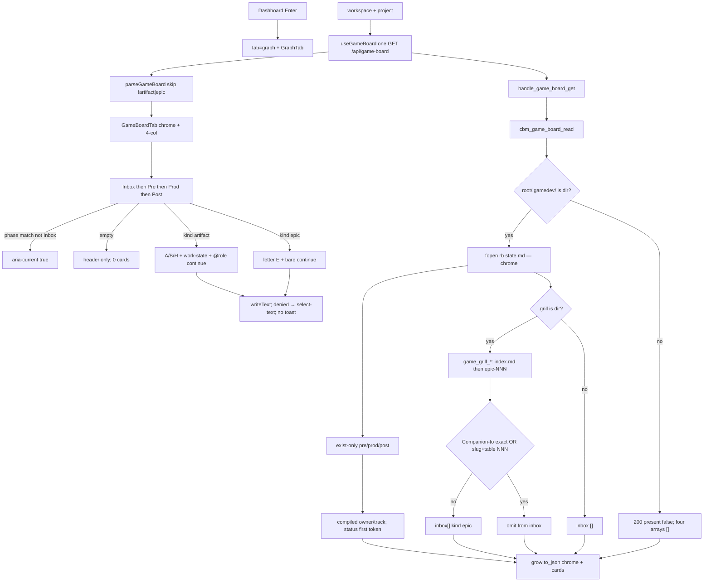

# spec-011 — Game phase board
Reading time: 5-8 min
Last updated: 2026-08-31 — spec-011-q5n-game-phase-board closed

## Feature description

spec-010 put Game in the strip and painted chrome (phase, focus, `/gamedev-skill continue`). The four JSON arrays stayed empty. An operator on a live `.gamedev/` tree still could not see phases, tracks, parallel work, or leftover grill.

This spec fills those arrays and paints the board. Cards are files and folders that already exist under `.gamedev/` — no placeholders for missing names. Pre-production and post-production are the known docs if present. Production is SYS-* / LVL-* / art / animation / audio / ui directories plus `playtest-log.md` if present. Each artifact card shows track A/B/H, work-state (Pending / In progress / Done / Blocked), owner, and a copyable `/gamedev-skill continue @role`. Many cards in one phase may be In progress at once.

If the same root also has `.grill/`, leftover epics land in Game Inbox (letter E, title, summary, plan). Converted means a Game artifact `Companion to:` path equals that epic id, or the plan slug is a token in roadmap.md and/or game_context.md and roadmap.md has a table cell `NNN` or `epic-NNN`. Closed plans stay. A kebab folder name or `active.json` does not hide an epic. Missing both links → the epic sits beside the SYS/doc card.

Same GET `/api/game-board`. Same 400/404. Same silent win. Chrome continue stays selectable text. Card continue is a button that copies (no toast). No expand, archive, drag, mark-done, POST, or skill write.

Business result: an operator on bevy-tetris (or any `.gamedev/` tree) sees the cycle map — current phase highlighted, parallel work, who to continue as, and leftover grill — without CBM writing `.gamedev/` or starting the skill.

## Task timeline

All five tasks landed 2026-08-31. Critical path #1 → #2 → #3 → #4 → #5 (16h plan). #3 could start after #1 in parallel with #2.

| When | Task | What the operator can see |
|---|---|---|
| 2026-08-31 | #1 C artifact walk + widen card JSON | Nothing new on the pane. Same GET now emits exist-only pre/prod/post cards (owner/track from a compiled table; `ready` → In progress). Inbox still `[]`. Missing names are not cards. Cap 64 after sort; no `has_more`. |
| 2026-08-31 | #2 C Inbox + conversion + HTTP bytes | Same GET fills Inbox with unconverted grill epics (index.md then epic-NNN). Companion-to exact or slug+table NNN omits. GET leaves skill trees byte-identical. Pane still chrome-only. |
| 2026-08-31 | #3 GameBoardTab columns + cards + i18n | Four headers always: Inbox, Pre-production, Production, Post-production & Launch. Empty = header only. Current phase gets `aria-current`. Artifact A/B/H + English work-state. Inbox letter E. Card continue still text. |
| 2026-08-31 | #4 Clipboard, no-drag, typed parse | Artifact button copies `@role`. Inbox button copies `/gamedev-skill continue`. Denied clipboard selects the button text. No toast, expand, Archive, or drag. Junk `kind` objects do not paint. |
| 2026-08-31 | #5 Remaining Vitest Gherkin | 01/03 highlight, Done/Blocked, sit-beside, no dim, chrome stays `<p>`. App fetch never hits `/api/skill-presence`. Silent win / Enter Graph stay on a filled board. Product paint did not change. |

DEV: graph-ui Vitest 238 passed. C `game_board` + `httpd` 125 passed, 1 skipped (Task #2). Coverage reporter absent (~88% claimed on touched files). Playwright not run (optional at DEVELOPMENT). Live UI was not browser-clicked; proof is Vitest + C. A pre-this-spec UI embed still has Game chrome only until `scripts/build.sh --with-ui`.

## Architecture before / after

Before: GET `/api/game-board` returned presence + chrome + four empty arrays. GameBoardTab painted chrome only. spec-010 tests locked "no columns/cards". Grill leftovers were invisible on Game (Specs Mixed Todo still used a different omit: Companion-to / `source.grill_epic`).

After: same GET, same heap board, same one-shot hook. `cbm_game_board_card_t` is widened. `cbm_game_board_read` walks exist-only phase artifacts, then `game_grill_*` Inbox (copy of spec-008 catalog order, Game-local conversion). `to_json` grows a buffer. GameBoardTab keeps chrome and paints a 4-col grid. Card continue is a button; chrome continue stays a `<p>`. spec_board.c / MCP / POST stay untouched.



Silent win, Enter→Graph, Mixed Todo, expand, archive, `formatIndexedAt`, Graph hex, Path 1:1, and ADR fill are unchanged.

## Decisions + ADRs

| Decision | Why it matters | ADR |
|---|---|---|
| New `game_grill_*` walk in `game_board.c`; do not extract spec_board | spec_board helpers are bound to `active.json` / spec Companion-to. Sharing JSON would couple two GET families | SDD-ADR-046 |
| Convert = Companion-to exact OR (slug token + roadmap table NNN) | Heading prose or kebab name must not empty Inbox. Both sides required independently | SDD-ADR-047 |
| Cap 64/column; scratch 256 then sort; grow `to_json` | 8192 hardcoded `[]` would 500 on a real board. Cap after sort keeps SYS-001 | SDD-ADR-048 |
| Owner/track from compiled table; do not fopen `agents.md` | Skill agents.md is not a closed Path→owner schema | SDD-ADR-049 |
| Keep `useGameBoard` one-shot | Heavier walk than chrome. A 4s poll could re-settle presence | SDD-ADR-050 |
| Card `writeText`; select-text fallback; no toast. Chrome stays `<p>` | Map, not launcher. Denied clipboard still copyable | SDD-ADR-051 |
| Exist-only cards; empty column = header only; Inbox never `aria-current` | Placeholders fail the missing-name Then. Spine stays readable | US-001; US-002 |
| fopen `"rb"` only; no POST; no MCP tool | Zero skill writes. CBM is not the writer | I.2; US-006 |

## How to use

1. Build/serve with `scripts/build.sh --with-ui`. Open http://localhost:9749. A pre-spec-011 embed has Game chrome only (empty columns).
2. Enter a `.gamedev/` project. You still land on Graph. Open Game.
3. Four columns are always there. The column that matches `state.md` phase is current. Empty phases show the header and nothing else.
4. Artifact cards: filename or folder name, track A/B/H, work-state, `@role`. Click the continue line to copy `/gamedev-skill continue @role` into the clipboard. Paste it in the IDE.
5. Inbox cards (if leftover grill exists): letter E, title, summary, plan. Continue copies `/gamedev-skill continue` with no `@role`.
6. If clipboard is denied, the continue text is selected — Cmd+C. There is no "Copied" toast and no launch button.
7. Clicking the card body does not expand or Archive. Cards cannot be dragged to another phase.
8. Silent win is unchanged: Game shown ⇒ Specs hidden. Enter still opens Graph. Leftover `?tab=specs` on a gamedev path still becomes `tab=game`.
9. This spec does not write `.gamedev/`, `.grill/`, or `.sdd-skill/`. Expand, archive, and ADR fill from the gamedev trio are later epics.

## Debugging guide

Symptom → file → fix. Task-level tables also live in `human/QUICK-DEBUG.md` and the five task summaries.

| If this fails | File:line | Cause | Fix |
|---|---|---|---|
| Only chrome; four headers missing | `GameBoardTab.tsx:181-188` | Grid dropped or `max-w-2xl` hid columns | Always map `COLUMN_KEYS`. Tests `GameBoardTab.test.tsx:213-237` |
| Production missing `aria-current` when phase is `02-production` | `GameBoardTab.tsx:34-39`, `:138` | Inbox leaked into the map | Inbox always false. `01`→Pre, `02`→Prod, `03`→Post. Tests `:232-235`, `:642-657` |
| Inbox has `aria-current` / phase null still highlights | `GameBoardTab.tsx:35` | Null/Inbox gate dropped | Inbox never; `phase === null` → none. Tests `:233`, `:374-393` |
| Empty column hidden, dimmed, or "no artifacts in this phase" | `GameBoardTab.tsx:138`, `:181-188` | Placeholder copy or `opacity`/`hidden` | Header + 0 articles. Test `:356-372`, `:687-706` |
| Missing `narrative-bible.md` still a card | `game_board.c:411` | Placeholder emit | Exist-only `game_is_regular_file`. Test `test_game_board.c:398` |
| gdd owner follows `agents.md` | `game_board.c:51-63` | Project agents.md parsed | Compiled table. Test `:365-378` |
| `status: ready` stays Pending | `game_board.c:306` | Token map missed `ready` | `ready` → `in_progress`. Test `:495` |
| 65th SYS kept or JSON has `has_more` | `game_board.c:393`, `:599` | Cap before sort, or extra key | Scratch 256, sort, copy 64. Test `:525` |
| Inbox empty but leftover grill exists | `game_board.c:1171`, `:1271` | `.grill` missing, or conversion matched | Dir required. Omit only Companion-to exact or slug+NNN. Tests `:882` / `:714` |
| Companion-to exact still in Inbox | `game_board.c` Companion scan | Token parse skipped | First `.grill/plans/`…`.md` on `Companion to:`; never fopen the token. Tests `:757` / `test_httpd.c:4070` |
| kebab SYS name hid the epic | `game_board.c` omit | Fuzzy name match | No kebab. Test `:956` |
| plan-folder cite without NNN hid Inbox | `game_board.c` slug+cell | Slug-only treated as convert | Both required. Test `:931` |
| Artifact click does not copy `@role` | `GameBoardTab.tsx:73-86`, `:57-63` | Chrome `<p>` used as the control | Card button name is the continue string. Test `:459-485` |
| Clipboard denied shows a toast | `GameBoardTab.tsx:64-70` | Success/fail painted `role="status"` | Catch → `selectNodeContents` only. Test `:521-549` |
| Chrome continue became a button | `GameBoardTab.tsx:177-179` | Pane `<p>` replaced | Chrome stays text. Card button is Task #4. Test `:741-765` |
| Card activate shows Archive / drop moves a card | `GameBoardTab.tsx:92`, `:107` | SpecBoardTab / `draggable` leaked | No expand. `draggable={false}`. Tests `:583-610`, `:612-640` |
| Junk objects paint (kind `spec`) | `useGameBoard.ts:36`, `:50` | Cast-through parse | Skip unless `artifact`\|`epic`. Tests `useGameBoard.test.ts:132-182` |
| `/api/skill-presence` in App fetch | `useGameBoard.ts:104` | Unused GET called | Presence is `/api/game-board` only. Tests `App.test.tsx:1046-1078`, `:1145-1164` |
| Game Inbox shows a spec-board epic | `App.tsx` `showGame` | Inbox read `epics[]` | Game pane uses game-board `inbox` only. Test `App.test.tsx:1115-1143` |
| GET 200 changed skill trees | `game_board.c` fopen | Write mode or mkdir | `"rb"` only. Tests `test_game_board.c:1008` / `test_httpd.c:4108` |
| Live :9749 still chrome-only | daemon / embed | Pre-spec-011 UI | Rebuild `--with-ui` |

Verify UI: `cd graph-ui && npx vitest run` (238). Verify C: `scripts/test.sh --suites game_board,httpd` (125 passed, 1 skipped).

## Out of scope

- Expand, archive, blocked-by strip, Track A Inputs (epic 003)
- ADR fill from the gamedev trio (epic 004)
- Overlay of state.md agent lines vs header
- Writing `.gamedev/` or invoking gamedev-skill from CBM
- Drag / mark-done / launcher / toast
- POST `/api/game-board` / MCP game-board tool / GET `/api/skill-presence` from graph-ui
- Emitting `gamedev_skill_present` on spec-board
- Changing silent win, Enter→Graph, or Specs on non-gamedev paths
- Cards for state.md, roadmap.md, game_context.md, docs, baseline, history, prompts, backlog, assets_registry
- Parsing project `docs/agents.md`

## Pattern validation

Implementation is uniform across #1–#5 vs constitution + spec-008/010 families:

- Same GET `/api/game-board`. Same 400/404 strings. Same heap calloc. No POST. No MCP tool. spec-board stays gamedev-free (IV.3, SDD-ADR-045).
- fopen `"rb"` only. Dir check still reuses `cbm_spec_board_gamedev_skill_present`. Zero skill writes (I.2).
- Inbox catalog copied as `game_grill_*`; `grill_epic_converted` / `active.json` not called. No shared `to_json` (SDD-ADR-046).
- Dedicated `GameBoardTab`, not `SpecBoardTab`. No `EpicCard` import. Letter E reuses `--color-epic-mark` (SDD-ADR-038, SDD-ADR-042).
- `useGameBoard` still one-shot. Never `/api/skill-presence`. `useSpecBoard` 4000 ms stays Specs-only (SDD-ADR-050).
- Chrome continue stays `<p select-text>`. Card continue is the new button (SDD-ADR-051). No toast either path.
- English Then text (II.3). Breadcrumbs on touched files (VII.2). Graph Function hue still `#06b6d4` (III.2).
- Enter stays Graph (IX.3). Silent win / leftover `tab=specs`→game not weakened.

Constitution I–III, V–VIII: no second approach. There is no Section X in the draft file.

Patterns: ✓

IX.2 still ends with spec-010 “dedicated GameBoardTab chrome” and “empty column arrays”. That sentence is now incomplete: GET fills exist-only cards and Inbox; the pane paints four columns. Not a code defect — constitution text is stale until close.

```
📜 CONSTITUTION RECOMMENDATION
Observed: Tasks #1–#5 delivered Game phase board on the spec-010 GET. Arrays are no longer always empty: exist-only artifact cards plus unconverted grill Inbox (omit Companion-to exact OR slug token + roadmap table NNN). Four always-visible columns; empty = header only; no expand/archive/drag. IX.2 still says spec-010 "dedicated GameBoardTab chrome" + "empty column arrays" and does not mention filled cards or Inbox conversion — that text is now incomplete.
Recommendation: MODIFIED IX.2 at spec close — append "spec-011 delivered Game phase board: GET /api/game-board fills exist-only artifact cards in preproduction/production/postproduction plus unconverted grill Inbox (omit Companion-to exact OR slug token + roadmap table NNN); four always-visible columns; empty = header only; aria-current on matching phase only; Inbox letter E; artifact track A/B/H + work-state; card continue copies via writeText (select-text fallback, no toast); chrome continue stays text; zero skill writes; no expand/archive/drag/POST/MCP; same GET; spec-board stays gamedev-free; useGameBoard one-shot; game_grill_* local walk not spec_board extract (SDD-ADR-046..051). spec-010 'empty column arrays' / chrome-only Game pane is superseded for paint — chrome stays, arrays fill."
→ @planner evaluates, creates ADR if agreed
```

## Quick refs

- Spec: `.sdd-skill/specs/spec-011-q5n-game-phase-board/spec.md`
- Plan: `.sdd-skill/specs/spec-011-q5n-game-phase-board/plan.md`
- ADRs: `.sdd-skill/baseline/ARCHITECTURE_ADR.md` (SDD-ADR-046 … 051)
- Architecture: `human/ARCHITECTURE-VISUAL.mmd`
- Overview: `human/PROJECT-OVERVIEW.md`
- Debug: `human/QUICK-DEBUG.md`
- Task summaries: `human/task-summaries/task-1-c-artifact-walk-widen-card-json.md`, `task-2-c-inbox-walk-conversion-http-bytes.md`, `task-3-gameboardtab-columns-cards-i18n.md`, `task-4-clipboard-no-drag-typed-card-parse.md`, `task-5-remaining-vitest-gherkin-game-phase.md`
- Constitution: `.sdd-skill/docs/constitution.md` (IX.2 append is @planner at close — not edited here)
- Tests: `cd graph-ui && npx vitest run` (238). C: `scripts/test.sh --suites game_board,httpd`
