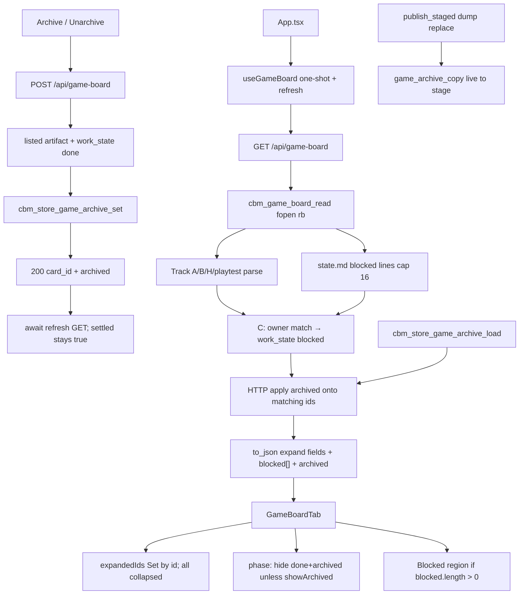

# spec-012 — Game expand, archive, and deps
Reading time: 5-8 min
Last updated: 2026-08-31 — spec-012-m2k-game-expand-archive-deps closeprep

## Feature description

spec-011 painted four Game columns with exist-only artifact cards and leftover grill Inbox. Cards were still dead: no expand, no archive, no live blocked-by. spec-011 Gherkin forbade POST `/api/game-board` and expand. This spec supersedes those two locks only. Drag stays forbidden.

On Game, the card title is a button. Click it and that same card grows in place. Track A shows a short What-it-does blurb, every checkbox task (`#N name`, or “No tasks planned yet”), and Inputs only when the GET sent some. Track B / level / playtest show header `last_decision` / `open` / `recent`. Inbox still shows summary and plan on the card; expand adds nothing and never Archive.

A done artifact can be archived into CBM-owned state. The card leaves its phase column on a fresh visit. Show archived sits in the pane chrome (not Inbox, not a fifth column) and reveals those cards for this visit only. Unarchive restores the card even if the toggle is off. There is no confirm dialog. Inbox is never filtered.

A Blocked strip lists live `state.md` blocked lines above the four columns. Artifact cards whose owner matches a strip row get JSON `work_state` `"blocked"` in C before JSON, so Archive POST 409s the same way GET looks. Inbox is never overlaid. This is not a roadmap graph.

Same GET `/api/game-board`. POST on that path is archive-only (flag object, not the board). Zero skill-file writes. Silent win, four columns, conversion, clipboard, Enter→Graph, and no drag stay.

Business result: an operator inspects one artifact without leaving the board, hides finished work, and sees who is blocked — without a second interaction pattern or a write into `.gamedev/`.

## Task timeline

All five tasks landed 2026-08-31. Critical path #2 → #3 → #4 → #5 (16h plan). #1 ran in parallel with #2.

| When | Task | What the operator can see |
|---|---|---|
| 2026-08-31 | #1 Store `game_archive` + set/load/copy | Nothing on the pane. The project `.db` can keep one yes/no flag per Game card id (path). Unarchive keeps the row. |
| 2026-08-31 | #2 C expand parse + blocked overlay + JSON | Nothing new on the pane. Same GET now emits expand fields + `blocked[]`. Matching artifact cards are `work_state` blocked. Inbox expand fields stay empty. `archived` is still false until HTTP merge. |
| 2026-08-31 | #3 HTTP POST + GET merge + publish copy | GET stamps `archived` onto matching ids. POST archives or unarchives a done artifact. Reindex dump no longer wipes those flags. Skill files stay byte-identical. Pane still has no Archive button. |
| 2026-08-31 | #4 GameBoardTab expand + blocked strip + i18n | Title button expands in place. Track A/B/Inbox/H bodies. Blocked region above columns when GET `blocked[]` is non-empty. Overlay prefix stays on the collapsed card. No POST yet. |
| 2026-08-31 | #5 Archive UI + refresh + remaining Vitest | Archive hides a done artifact. Show archived is session-only chrome. Unarchive restores while hide is on. Refresh never flips the Game tab off. Silent win / Enter Graph stay. |

DEV: graph-ui Vitest 260 passed (25 files). C `store_game_archive` 10; `game_board` 38; `httpd` 108 passed, 1 skipped. Coverage reporter absent (~88% claimed on touched files). Playwright not run (optional at DEVELOPMENT). Live UI was not browser-clicked; proof is Vitest + C. A pre-this-spec UI embed still has spec-011 dead cards until `scripts/build.sh --with-ui`.

## Architecture before / after

Before: GET `/api/game-board` returned presence + chrome + exist-only cards + Inbox. GameBoardTab painted four columns. Title was a `<p>`. No expand fields, no `blocked[]`, no `archived`, no POST. spec-011 tests locked “no expand / no Archive / no POST”.

After: same GET, same heap board, same one-shot hook plus `refresh()`. `cbm_game_board_read` parses expand bodies and overlays blocked in C. HTTP merges `game_archive` onto matching ids. POST on the same path returns a flag object. `publish_staged` copies `game_archive` live→stage next to `spec_archive`. GameBoardTab title is a button; Show archived is pane chrome; Archive/Unarchive POST then await refresh. spec_board.c / MCP / drag stay untouched.



Silent win, Enter→Graph, Mixed Todo, Specs expand/archive, `formatIndexedAt`, Graph hex, Path 1:1, and ADR fill are unchanged. Drag stays off.

## Decisions + ADRs

| Decision | Why it matters | ADR |
|---|---|---|
| New `game_archive` table; `card_id` PK 256; CAP 512 | Game ids are paths. Mixing into `spec_archive` would collide and let spec-board POST mutate Game | SDD-ADR-052 |
| POST on `/api/game-board`; merge in HTTP after read; 200 flag object; publish copy | Same family (IV.3). Skill reader stays SQLite-free. Dump replace would drop the table | SDD-ADR-053 |
| Keep one-shot; `refresh()` after POST; never unset settled/present | A 4s poll would redo the expand walk. Unsetting settled unmounts Game (silent win) | SDD-ADR-054 |
| Blocked overlay in C before JSON; strip = `blocked` lines only | POST 409 must match GET `work_state` `"blocked"`. No roadmap graph | SDD-ADR-055 |
| game_board-local `## What it does` extract | spec-005 extract is locked to Executive Summary | SDD-ADR-056 |
| Reuse specBoard Archive / Unarchive / Show archived / No tasks planned yet; add inputs + blockedStrip | EN already matches Gherkin | SDD-ADR-057 |
| Title button; Set by id; all start collapsed; multi-open | Same gesture as Specs. Game has no auto-expand | US-001; spec-005 |
| Archive only expanded done; no confirm; no fourth column; Inbox never | Same session rule as spec-006. Game has phase columns, not a Done column | spec-006; US-003/004 |
| fopen `"rb"` only; no MCP; spec-board POST stays specs-only | Zero skill writes. Game `card_id` on spec-board is 404 spec not found | I.2; US-006 |

## How to use

1. Build/serve with `scripts/build.sh --with-ui`. Open http://localhost:9749. A pre-spec-012 embed has spec-011 dead cards (no expand, no Archive, no strip).
2. Enter a `.gamedev/` project. You still land on Graph. Open Game.
3. Four columns stay. Click a card title to expand that card. Several cards may stay open. Continue still copies and does not collapse the card. Card body click does not expand.
4. Track A: blurb + `#N name` for every task (or “No tasks planned yet”) + Inputs when present. Track B: last decision and open. Inbox: summary and plan only — no Archive.
5. Expand a done artifact → Archive. No dialog. The card leaves the column if Show archived is off. `.gamedev/` does not change.
6. Show archived is in the pane chrome (`aria-pressed` false on first paint). Press it to see archived done cards. Leave Game or switch `?project=` and the toggle starts hidden again.
7. With Show archived on, expand an archived done card → Unarchive. After success the card stays visible even if you turn the toggle off.
8. If `state.md` has `slug:blocked:"task":"blocked-by"` lines, a Blocked region appears above the columns. Matching owner cards show Blocked + the reason, collapsed or expanded. Clicking a strip row does nothing.
9. Silent win is unchanged: Game shown ⇒ Specs hidden. Enter still opens Graph. Cards still cannot be dragged. This spec does not write `.gamedev/`, `.grill/`, or `.sdd-skill/`.

## Debugging guide

Symptom → file → fix. Task-level tables also live in `human/QUICK-DEBUG.md` and the five task summaries.

| If this fails | File:line | Cause | Fix |
|---|---|---|---|
| Title click does not expand (title still `<p>`) | `GameBoardTab.tsx:158-176` | TitleControl dropped | `<button aria-expanded>`. Test `GameBoardTab.test.tsx:822` |
| Body click expands / POSTs | `GameBoardTab.tsx:234`, `:272` | Toggle on `<article>` | Only title button. Test `:608-638` |
| Continue toggles expand | `GameBoardTab.tsx:90-93` | `stopPropagation` dropped | Nested continue button. Test `:1002-1044` |
| Inputs heading on Track B | `GameBoardTab.tsx:115-155` | Track A body used for B | Inputs only when `track === "A"`. Test `:836-865` |
| Blurb is header `open` though What-it-does exists | `game_board.c:419`, `:983` | Extract empty or heading missed | Local H2; What-it-does wins. Test `test_game_board.c` What-it-does |
| Strip missing though GET has blocked rows | `GameBoardTab.tsx:291-300` | Region mounted only with a heading | `rows.length === 0` → omit. Test `:869` / `:1047` |
| Overlay text only when expanded | `GameBoardTab.tsx:100-112` | Prefix inside expand body | `BlockedByLine` always. Test `:914-917` |
| Archive a blocked card succeeds | `http_server.c:760-765`; `game_board.c:1030` | Overlay UI-only | C overlay before JSON; POST 409. Test `test_httpd.c` overlay 409 |
| Archived done visible on first paint | `GameBoardTab.tsx:60-62`, `:375` | Filter missed `done`, or toggle defaulted on | `visiblePhaseCards`. `useState(false)`. Test `:1272` |
| Game tab vanishes after Archive | `useGameBoard.ts:160-176` | `refresh` unset `settled`/`present` | Refresh must not unset. Tests `useGameBoard.test.ts:270` / `:309` |
| Archive opened a confirm | `GameBoardTab.tsx:393-406` | `window.confirm` leaked | No confirm. Test `:1233` |
| After POST 200 the card comes back (hide on) | `GameBoardTab.tsx:401-402` | `refresh` not awaited | `if (!res.ok) return; await refresh()`. Test `:1233` |
| Inbox archived epic disappeared | `GameBoardTab.tsx:441` | Inbox ran through phase filter | `board.inbox` unfiltered. Test `:1419` |
| POST went to spec-board / Game id archived a spec | `GameBoardTab.tsx:396-399`; `http_server.c` spec-board POST | Copied `spec_id` persist | `{project, card_id, archived}` on `/api/game-board`. spec-board Game id → 404 spec not found |
| GET invents a card from an orphan flag | `http_server.c:531-546` | Append on unmatched id | Matching ids only. Test `test_httpd.c` orphan |
| Flags gone after Reindex | `pipeline.c:1808` | Copy skipped on dump replace | `game_archive_copy` live→stage with spec_archive |
| `/api/skill-presence` / Enter opens Game | `App.tsx` silent-win | Presence or Enter weakened | Presence is GET game-board; Enter Graph. Tests `App.test.tsx:1164` / `:1185` |
| Card drop moves a phase | `GameBoardTab.tsx:234`, `:272` | `draggable` leaked | `draggable={false}`. spec-011 tests stay |
| Function hex drifted | `colors.ts` | Do not edit | `colorForLabel("Function") === "#06b6d4"`. Test `:1512` |

Verify UI: `cd graph-ui && npx vitest run` (260). Verify C: `scripts/test.sh --suites store_game_archive,game_board,httpd`.

## Out of scope

- ADR fill from the gamedev trio (epic 004)
- Writing `.gamedev/` or invoking gamedev-skill from CBM
- Drag / mark-done / launcher / toast
- Roadmap.md graph, agents.md Needs as edges, click-strip scroll/highlight
- Reusing `spec_archive` or POST `/api/spec-board` for Game ids
- MCP game-board / archive tool / GET `/api/skill-presence` from graph-ui
- Changing silent win, Enter→Graph, conversion, four-column layout, or Specs on non-gamedev paths
- Persisted show-archived preference, confirm dialog, fourth “Archived” column
- Dumping full GDD/spec/review into expand

## Pattern validation

Implementation is uniform across #1–#5 vs constitution IX (no Section X) and prior specs:

- Archive is the spec-006 pattern on a sibling table: dedicated `game_archive`, HTTP merge after read, POST flag object, session Show archived, no confirm, no fourth column, publish copy. Not `spec_archive`. spec-board POST a Game id stays 404 spec not found (IV.3, SDD-ADR-052/053).
- Expand is the spec-005 gesture: title `<button aria-expanded>`, Set keyed by GET id, multi-open, continue `stopPropagation`. Game starts all collapsed (spec-required; no Specs auto-expand). Track A lists every task, not Todo pending-only — that is US-002, not a second approach.
- Silent win spec-010: `refresh()` is the same GET and never unsets `settled`/`present` (SDD-ADR-054). No `/api/skill-presence`. Enter stays Graph. Leftover `tab=specs`→game stays.
- spec-011 board stays: same GET 400/404, four columns, conversion, clipboard writeText + select-text no toast, chrome continue `<p>`, `draggable={false}`. Expand+archive+POST supersede those locks only. Drag does not.
- fopen `"rb"` only. Zero skill writes (I.2). spec_board.c / mcp.c untouched. Local H2 extract + local `game_grill_*` (SDD-ADR-046, SDD-ADR-056) — do not share JSON with spec_board.
- i18n reuses specBoard archive / noTasksYet; adds inputs + blockedStrip (II.3, SDD-ADR-057). Graph Function hue still `#06b6d4` (III.2). Breadcrumbs on touched files (VII.2).

Constitution I–III, V–VIII: no second approach. Show archived lives in Game pane chrome (not a Done header) because Game has phase columns — spec-required, same session rule.

Patterns: ✓

IX.2 still ends with spec-011 “no expand/archive/drag/POST/MCP”. That sentence is now incomplete: expand, archive, and POST landed; drag stays forbidden. Not a code defect — constitution text is stale until close.

```
📜 CONSTITUTION RECOMMENDATION
Observed: Tasks #1–#5 delivered Game expand, archive, and deps on the spec-011 GET. Cards expand in place; done artifacts archive into game_archive via POST /api/game-board; GET merges archived; blocked strip + C overlay. IX.2 still says spec-011 "no expand/archive/drag/POST/MCP" — that text is now incomplete. spec-012 superseded expand+archive+POST only. Drag stays forbidden.
Recommendation: MODIFIED IX.2 at spec close — append "spec-012 delivered Game expand, archive, and deps: GET /api/game-board additive card expand fields + top-level blocked[]; title button in-place expand (Set by id, all collapsed, multi-open); Track A blurb+tasks+Inputs / Track B header / Inbox summary only; C overlay blocked from state.md blocked lines cap 16; dedicated game_archive table (not spec_archive); POST /api/game-board flag object; GET merge matching ids; publish_staged copy; Show archived session-only pane chrome; Archive/Unarchive expanded done only; refresh() same GET never unset settled/present; zero skill writes; no drag/MCP/skill-presence; spec-board stays gamedev-free and specs-only POST (SDD-ADR-052..057). spec-011 'no expand/archive/drag/POST' is superseded for expand+archive+POST — drag stays forbidden."
→ @planner evaluates, creates ADR if agreed
```

## Quick refs

- Spec: `.sdd-skill/specs/spec-012-m2k-game-expand-archive-deps/spec.md`
- Plan: `.sdd-skill/specs/spec-012-m2k-game-expand-archive-deps/plan.md`
- ADRs: `.sdd-skill/baseline/ARCHITECTURE_ADR.md` (SDD-ADR-052 … 057)
- Architecture: `human/ARCHITECTURE-VISUAL.mmd`
- Overview: `human/PROJECT-OVERVIEW.md`
- Debug: `human/QUICK-DEBUG.md`
- Task summaries: `human/task-summaries/task-1-store-game-archive.md`, `task-2-c-expand-parse-blocked-overlay.md`, `task-3-http-post-get-merge-publish-copy.md`, `task-4-gameboardtab-expand-blocked-strip-i18n.md`, `task-5-archive-ui-refresh-remaining-vitest.md`
- Constitution: `.sdd-skill/docs/constitution.md` (IX.2 append is @planner at close — not edited here)
- Tests: `cd graph-ui && npx vitest run` (260). C: `scripts/test.sh --suites store_game_archive,game_board,httpd`
