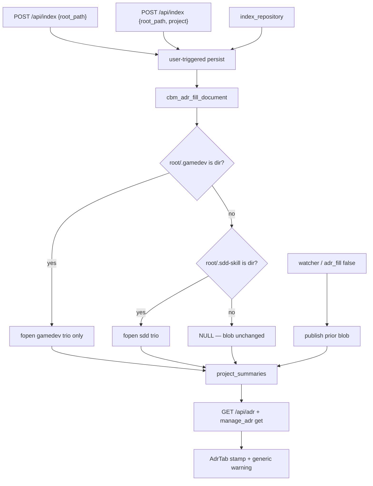

# spec-013 — ADR fill from gamedev trio
Reading time: 5-8 min
Last updated: 2026-08-31 — spec-013-r9w-adr-fill-gamedev-trio closeprep

## Feature description

spec-004 fills the ADR generated region from three sdd-skill files on a user-triggered index. spec-010 already hides Specs when a folder has `.gamedev/`, but ADR still described leftover MVP1 sdd files.

This spec changes trio selection only. If `.gamedev/` is a directory, Purpose/Stack/Decisions come from `.gamedev/game_context.md`, `.gamedev/baseline/TECH_STACK.md`, and `.gamedev/baseline/ARCHITECTURE_ADR.md`. Leftover sdd unique strings stay out. Missing or unreadable gamedev files omit that heading; they do not fall back to sdd. If there is no `.gamedev/` directory, the old sdd trio still fills. If neither folder exists as a directory, the stored ADR is left alone.

Markers, the manual region, watcher skip (`adr_fill: false`), extract window, and the ADR tab stamp + replace warning stay spec-004. No new endpoint. The tab does not say “from gamedev-skill”.

Business result: Reindex or `index_repository` on a Game path (for example bevy MVP2) makes ADR match the live Game cycle, not an archived sdd tree, without an LLM and without writing skill files.

## Task timeline

All three tasks landed 2026-08-31. Critical path #1 → #2 (7h plan). #3 ran after #1 (1h, compact).

| When | Task | What the operator can see |
|---|---|---|
| 2026-08-31 | #1 XOR trio in `cbm_adr_fill_document` | Nothing on the pane. The helper picks gamedev or sdd by directory. Empty `.gamedev/` still writes markers. A file named `.gamedev` is not present. |
| 2026-08-31 | #2 HTTP + MCP + watcher Gherkin | Dashboard create/Reindex and `index_repository` fill GET `/api/adr` from the gamedev trio. Watcher-style `adr_fill: false` leaves the blob unmarked. Manual notes survive. |
| 2026-08-31 | #3 AdrTab no cycle stamp | Isolated ADR tab still shows last-indexed clock + generic replace warning + one textarea. The page must not contain `gamedev-skill`. |

DEV: `scripts/test.sh --suites adr_fill` 21 passed; `--suites httpd,mcp` exit 0 (httpd 117 / 1 skipped; mcp 201 / 2 skipped). graph-ui `npx vitest run` AdrTab + colors + i18n → 18 passed (3 files). Coverage reporter absent (~88% claimed on touched C fill). Playwright not run (optional at DEVELOPMENT). A pre-this-spec binary still fills sdd-only until rebuild.

## Architecture before / after

Before: `cbm_adr_fill_document` gated on `.sdd-skill/` as a directory and always opened the sdd trio. Pipeline hook, `adr_fill` flag, ALWAYS_SKIP `.sdd-skill`, GET/POST `/api/adr`, and AdrTab chrome were already spec-004.

After: same hook and flag. The helper XOR-selects. `.gamedev` is not added to ALWAYS_SKIP (fill is out-of-graph fopen). AdrTab copy unchanged.



## Decisions + ADRs

| Decision | Why it matters | ADR |
|---|---|---|
| XOR inside the existing helper; hook/flag unchanged | Same persist path. Trio choice is not a new job | SDD-ADR-058 |
| Local `cbm_is_dir`; no `spec_board.h` | Same meaning as Game presence; adr must not import UI | SDD-ADR-059 |
| NULL only when neither directory exists | Empty `.gamedev/` still marks. File-at-path `.gamedev` is not present | SDD-ADR-060 |
| Do not ALWAYS_SKIP `.gamedev` | Adding it would drop GDD/state.md from already-indexed Game graphs | SDD-ADR-061 |
| Unreadable HTTP = directory-at-path | chmod 0 would fail semantic_manifest because `.gamedev` is graph source | SDD-ADR-022, SDD-ADR-061 |
| AdrTab chrome stays generic | No “from gamedev-skill” / “from sdd-skill” stamp | US-006 |

## How to use

1. Rebuild with `scripts/build.sh --with-ui`. A pre-this-spec daemon still fills leftover sdd on a Game path.
2. Open a project whose root has `.gamedev/` as a directory. Reindex from the Dashboard, or run `index_repository` for that Path.
3. Open ADR. Purpose/Stack/Decisions should match `game_context.md` / gamedev `TECH_STACK.md` / `ARCHITECTURE_ADR.md`. Leftover `.sdd-skill/` unique strings must be absent. Hand notes in the manual region stay.
4. If only some gamedev trio files exist, those headings appear; missing/unreadable files omit their H1. The index job still succeeds.
5. Remove `.gamedev/` and Reindex: sdd fills again if `.sdd-skill/` is still a directory. Remove both: the last blob stays (no new markers on an unmarked leftover).
6. Watcher / incremental does not fill. The ADR tab still shows last-indexed + the same replace warning. It does not mention gamedev-skill.

## Debugging guide

| If this fails | File:line | Cause | Fix |
|---|---|---|---|
| Leftover `PURPOSE-SDD-*` after Reindex on a dual-tree | `adr_fill.c:72-76` | Select mixed relatives | Gamedev relatives only. Test `adr_fill_gamedev_dual_tree_xor` / `ui_index_reindex_fills_gamedev_omits_leftover_sdd` |
| NULL on an empty `.gamedev/` directory | `adr_fill.c:72-76, 274-276` | Empty dir treated as missing | `cbm_is_dir`; present always splices |
| File named `.gamedev` skipped sdd fill | `adr_fill.c:72, 78-82` | File-at-path counted present | `cbm_is_dir` only |
| Unreadable Purpose copied / job failed | `test_httpd.c:3661` | chmod 0 hashed by discover | Directory-at-path at `game_context.md` |
| `adr_fill: false` wrote gamedev markers | `test_mcp.c:6599` | Gate ignored bool false | Blob stays `# Before watch` |
| `# New notes` gone after next index | `test_mcp.c:6529` | MANUAL span dropped | Whole-doc update; splice keeps MANUAL |
| `gamedev-skill` on the ADR tab | `AdrTab.test.tsx:206-207` | Cycle stamp added | Keep generic `adr.replaceWarning` |

Verify C: `scripts/test.sh --suites adr_fill,httpd,mcp`. Verify UI: `cd graph-ui && npx vitest run src/components/AdrTab.test.tsx`.

## Out of scope

- Adding `.gamedev` to ALWAYS_SKIP
- New HTTP/MCP endpoints or GET `/api/game-board` on the fill path
- Writing `.gamedev/`, `.sdd-skill/`, or `.grill/`
- Copying GDD, DEV_LOG, playtest-log, or other non-trio files
- Changing AdrTab warning copy or adding a cycle stamp
- Raising extract cap or POST `/api/adr` 32768

## Pattern validation

Patterns: ✓. Same persist as spec-004: user-triggered only, four HTML comments, bounded extract, local `cbm_is_dir`, no spec_board include, `adr_fill: false` for watcher, GET `/api/adr` and `manage_adr` get share one blob. Relatives passed into `adr_build_generated` so XOR cannot mix paths. AdrTab test-only. Graph Function hue still `#06b6d4`.

IX.5 still names the sdd trio as the only fill source. That sentence is incomplete once XOR lands. Not a code defect — constitution text is stale until close.

```
📜 CONSTITUTION RECOMMENDATION
Observed: Tasks #1–#3 XOR-select the gamedev trio when `.gamedev/` is a directory (no merge, no sdd fallback). IX.5 still says fill reads the sdd-skill trio. IX.2 does not name spec-013.
Recommendation: At spec close, MODIFY IX.5 — when `.gamedev/` is a directory, fill opens the gamedev trio only; else sdd trio if `.sdd-skill/` is a directory. `.gamedev` is not graph-skip this spec. APPEND IX.2 — spec-013 delivered gamedev XOR fill (SDD-ADR-058..061).
→ @planner evaluates, creates ADR if agreed
```

## Quick refs

- Spec: `.sdd-skill/specs/spec-013-r9w-adr-fill-gamedev-trio/spec.md`
- Plan: `.sdd-skill/specs/spec-013-r9w-adr-fill-gamedev-trio/plan.md`
- ADRs: `.sdd-skill/baseline/ARCHITECTURE_ADR.md` (SDD-ADR-058 … 061)
- Architecture: `human/ARCHITECTURE-VISUAL.mmd`
- Overview: `human/PROJECT-OVERVIEW.md`
- Debug: `human/QUICK-DEBUG.md`
- Task summaries: `human/task-summaries/task-1-xor-trio-select-gamedev-relatives.md`, `task-2-http-mcp-watcher-gherkin-gamedev.md`, `task-3-adrtab-no-cycle-stamp.md`
- Constitution: `.sdd-skill/docs/constitution.md` (IX.5 / IX.2 are @planner at close — not edited here)
- Tests: `scripts/test.sh --suites adr_fill,httpd,mcp`; `cd graph-ui && npx vitest run src/components/AdrTab.test.tsx src/lib/colors.test.ts src/lib/i18n.test.ts`
