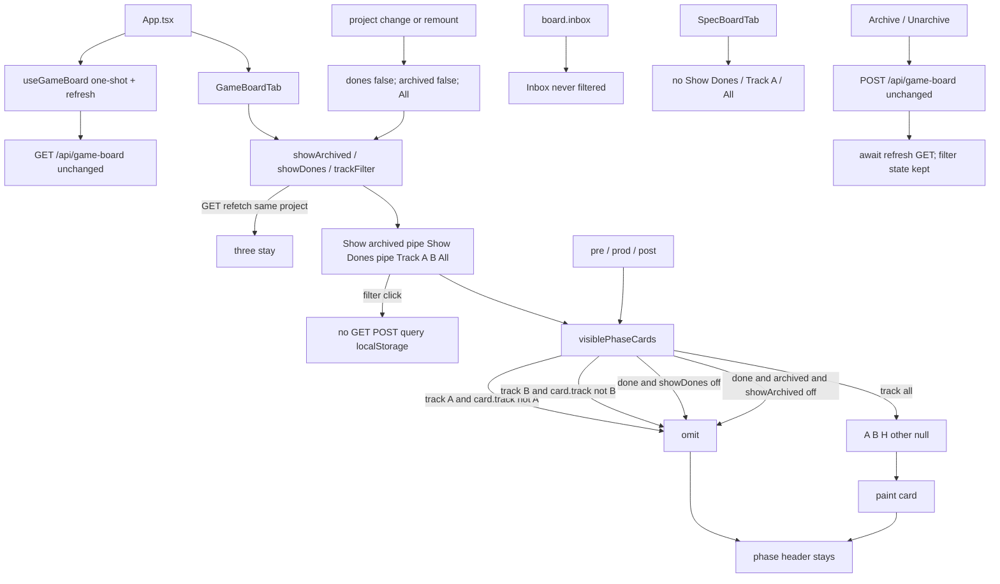

# spec-014 — Game visibility filters
Reading time: 5-8 min
Last updated: 2026-09-01 — spec-014-x7m-filters closeprep

## Feature description

spec-012 shipped Game expand, CBM archive, and a session Show archived toggle. A live board still painted every unarchived done artifact next to pending work. Track A, B, and H sat in the same columns with no way to isolate one track. Show archived alone also revealed archived finished work.

This spec adds two client-side visibility controls in Game pane chrome, next to Show archived, with a pipe separator: Show Dones (off by default) and Track A / B / All (All by default; All includes A, B, and H). Filters apply to phase columns only. Inbox cards stay visible. An archived done card appears only when Show Dones and Show archived are both on (AND).

Specs does not copy Show Dones or Track. Graph and ADR do not gain them. There is no new HTTP path, query param, POST field, localStorage key, or skill-file write. Remount or a project change starts Show Dones off, Show archived off, All on. A GET refetch after Archive keeps the three controls.

Business result: an operator scans active work without scrolling past Done, and can isolate Track A or B, without a persisted preference or a write into `.gamedev/`.

## Task timeline

Both tasks landed 2026-09-01. Critical path #1 → #2 (5.5h plan). No parallel branch.

| When | Task | What the operator can see |
|---|---|---|
| 2026-09-01 | #1 i18n + chrome cluster + predicate + invert first-paint | First Game visit hides done artifacts. Chrome row: Show archived \| Show Dones \| Track A / Track B / All. All five are buttons. First paint: Show Dones off, Show archived off, All on. Remount / project change starts those three at the defaults. Inbox is not filtered. |
| 2026-09-01 | #2 Track / AND leftover + Specs lock + no-persist | Track A shows only A; Track B only B; All brings back A, B, H, and anything else. Archived done needs both toggles. Specs still has Show archived only. Filter click does not fetch or POST. Nothing is written to the URL or localStorage. |

DEV: graph-ui Vitest 276 passed (25 files). Task #1 5/5 Gherkin; Task #2 10/10. Coverage reporter absent. Playwright not run (optional at DEVELOPMENT). No C this spec. A pre-this-spec UI embed still paints every unarchived done until `scripts/build.sh --with-ui`.

## Architecture before / after

Before: `visiblePhaseCards` hid a phase card only when `work_state==="done" && archived && !showArchived`. Unarchived dones always painted. Chrome was one Show archived button. No track filter. GET/POST `/api/game-board` and Archive eligibility stayed spec-012.

After: same GET/POST, same one-shot hook, same Archive POST. GameBoardTab holds `showArchived`, `showDones` (default false), and `trackFilter` (`"A"` \| `"B"` \| `"all"`, default `"all"`). Phase columns call `visiblePhaseCards(cards, showArchived, showDones, track)`. Inbox still uses `board.inbox`. Specs Show archived stays on the Done column only.



Silent win, four columns, expand, clipboard, no drag, Enter→Graph, Mixed Todo, Specs expand/archive, ADR XOR fill, Graph hex, and Path 1:1 stay.

## Decisions + ADRs

| Decision | Why it matters | ADR |
|---|---|---|
| React state on GameBoardTab; no GET query / localStorage / URL | Same lifetime as Show archived. All Thens are paint/aria. C/HTTP would invent params the spec forbids | SDD-ADR-062 |
| Hide `work_state==="done"` unless Show Dones; archived done also needs Show archived | spec-012 Show archived alone leaked finished archived work. Leftover archived pending still shows with Show Dones off | SDD-ADR-063 |
| Five `aria-pressed` buttons; Track exclusive in onClick; two `aria-hidden` `\|` spans | Gherkin finds names + `aria-pressed`. A radiogroup would fail those Thens | SDD-ADR-064 |
| Keep `t.specBoard.showArchived`; add `gameBoard.showDones` / `trackA` / `trackB` / `trackAll` | SDD-ADR-057 already owns Show archived copy. Specs must not grow Game keys | SDD-ADR-064 |
| Reset the three controls in the existing `lastProjectRef` block | Same remount / `?project=` rule as expand + Show archived. GET refetch must not reset | SDD-ADR-062; spec-012 SDD-ADR-054 |
| Inbox never calls `visiblePhaseCards` | Leftover funnel must not disappear | US-004 |
| Specs lock is a test, not a SpecBoardTab.tsx edit | Game chrome must not leak. Show archived stays on Done only | US-001 / US-003 |

## How to use

Operator: Game tab filters.

1. Rebuild with `scripts/build.sh --with-ui`. A pre-this-spec embed still paints every unarchived done.
2. Open a project whose root has `.gamedev/` as a directory. Enter still opens Graph. Switch to Game.
3. First paint: done artifacts are hidden. Show Dones is off. Show archived is off. All is on. Inbox leftover grill cards stay visible.
4. Press Show Dones to see unarchived finished artifacts (still subject to Track).
5. Press Track A to keep only Track A phase cards. Track B keeps only B. All restores A, B, H, and any other/null track, then Show Dones / Show archived still apply. H has no own button.
6. An archived done card appears only when Show Dones and Show archived are both on. Either toggle alone hides it.
7. Archive / Unarchive stay spec-012: expand a done artifact, then Archive. After Archive with Show archived off, that card is gone even if Show Dones is on. After Unarchive, the unarchived done stays only while Show Dones is on.
8. Leave Game and come back, or switch `?project=`: the three controls reset. A GET refetch after Archive does not reset them.
9. Specs still has Show archived on the Done column only. It does not gain Show Dones, Track A, or All.

## Debugging guide

| If this fails | File:line | Cause | Fix |
|---|---|---|---|
| Done artifacts paint on first Game visit | `GameBoardTab.tsx:394`, `:65-79` | `showDones` defaulted true, or predicate still spec-012 | `useState(false)`. Drop done when `!showDones`. Test `:1601` |
| Track A still shows B or H | `GameBoardTab.tsx:72`, `:466-467` | Filter not exclusive or All left on | `setTrackFilter("A")`. Drop `card.track !== "A"`. Test `:1773` |
| Track B hides H and All does not restore it | `GameBoardTab.tsx:73`, `:474-486` | All treated as A/B only | `track === "all"` keeps H / other / null. Test `:1874` |
| Track A + Show Dones paints a Track B done | `GameBoardTab.tsx:72-75` | Track applied after keep-done | Track first, then dones. Test `:2019` |
| Show archived alone reveals an archived done | `GameBoardTab.tsx:74-76` | AND missed or spec-012 leftover | Drop done+archived when `!showArchived`. Tests `:1992` / invert `:1339` |
| Show Dones alone reveals an archived done | `GameBoardTab.tsx:74-76` | AND missed | Drop done+archived when `!showArchived`. Test `:1746` |
| Both toggles on still hide the archived done | `GameBoardTab.tsx:74-78` | Extra drop | Keep when `showDones && showArchived`. Test `:1815` |
| After Unarchive the card vanishes with Show archived off | `GameBoardTab.tsx:74-76`; test `:1383` | Flag still true or Show Dones off | POST `archived: false` then refresh. Stays while Show Dones on |
| Remount / project change keeps Show Dones or Track | `GameBoardTab.tsx:398-403` | State leaked or localStorage | Reset three + expand in `lastProjectRef`. Tests `:1715` / `:1901` |
| GET refetch resets the three controls | `GameBoardTab.tsx:398-403` | New `board` treated as remount | Reset only when `project` changes. Test `:1901` |
| Filter click sends GET/POST or `?track=` | `GameBoardTab.tsx:445-487`; test `:2045` | onClick fetched or wrote URL | Chrome only `setState`. No `track` / `show_dones` / `show_archived` |
| `localStorage` has `showDones` or `gameTrack` | test `:2045` | Pref written | React state only. SDD-ADR-062 |
| Specs paints Show Dones / Track A / All | `SpecBoardTab.tsx:245-256`; test `:1019` | Game chrome copied | Show archived on Done only. Do not add Game keys |
| Inbox gone under Track / Show Dones | `GameBoardTab.tsx:498-499` | Inbox ran through `visiblePhaseCards` | `board.inbox`. Test `:1843` |
| All-done phase lost the header / shows "No specs yet" | `GameBoardTab.tsx:352-378` | Empty-state copy leaked | Header + empty list. Show Dones stays in chrome. Test `:1931` |
| Show Dones EN / Track labels drifted | `i18n.ts:130-133`, `:252-255` | Copy edited or `gameBoard.showArchived` added | EN "Show Dones" / "Track A" / "Track B" / "All". Test `i18n.test.ts:111-122` |
| `\|` joins an accessible name | `GameBoardTab.tsx:454`, `:463` | Separator is not `aria-hidden` | Two `<span aria-hidden="true">\|</span>` |

Verify UI: `cd graph-ui && npx vitest run` (276 passed, 25 files). No C suite this spec.

## Out of scope

- Specs tab filters (Done column, grill epics)
- A dedicated Track H control
- Persisted preference (localStorage, CBM, URL)
- New HTTP path, GET query params, or POST fields
- Writing `.gamedev/`, `.sdd-skill/`, or `.grill/`
- Changing Archive / Unarchive / expand / blocked strip / silent win / four columns / conversion / clipboard / no drag
- MCP game-board or filter tool

## Pattern validation

Patterns: ✓. Same problem as Show archived session chrome: `useState` defaults, reset with `expandedIds` on remount / `?project=`, GET refetch does not reset, no localStorage. Same `text-[10px]` pressed/unpressed tokens. Same `aria-pressed` buttons (Track exclusive in onClick, not a radiogroup). Inbox never filtered (spec-012 leftover; Specs never filters Todo). Prefer existing GET/POST (IV.3). Specs lock is a test, not a second hide path. Helper stays in GameBoardTab.tsx. Vitest + fetch mock (V.1/V.4). No C (V.3). Graph Function hue still `#06b6d4`.

IX.2 still describes spec-012 hide done+archived unless Show archived alone. That sentence is incomplete once first-paint hide, AND, Track A/B/All, client-only state, and Specs lock land. Not a code defect — constitution text is stale until close.

```
📜 CONSTITUTION RECOMMENDATION
Observed: Tasks #1–#2 hide work_state done unless Show Dones; archived done needs Show Dones AND Show archived; Track A/B/All exclusive (All includes A, B, H, other, null); Inbox never filtered; React state only (remount / ?project= reset; GET refetch keeps); Specs does not copy Show Dones / Track A / All. IX.2 still says spec-012 Show archived session-only and hide done+archived unless Show archived.
Recommendation: At spec close, MODIFY IX.2 — append spec-014 delivered Game visibility filters: Show Dones default hide done phase cards; Track A/B/All exclusive (All includes H); archived done iff both toggles; Inbox never filtered; client React state only; Specs lock (SDD-ADR-062..064). spec-012 Show archived session chrome stays; Show archived alone no longer reveals archived done.
→ @planner evaluates, creates ADR if agreed
```

## Quick refs

- Spec: `.sdd-skill/specs/spec-014-x7m-filters/spec.md`
- Plan: `.sdd-skill/specs/spec-014-x7m-filters/plan.md`
- Tasks: `.sdd-skill/specs/spec-014-x7m-filters/tasks.md`
- ADRs: `.sdd-skill/baseline/ARCHITECTURE_ADR.md` (SDD-ADR-062 … 064)
- Architecture: `human/ARCHITECTURE-VISUAL.mmd`
- Overview: `human/PROJECT-OVERVIEW.md`
- Debug: `human/QUICK-DEBUG.md`
- Task summaries: `human/task-summaries/task-1-i18n-chrome-predicate-invert.md`, `task-2-track-and-leftover-specs-lock.md`
- Constitution: `.sdd-skill/docs/constitution.md` (IX.2 is @planner at close — not edited here)
- Tests: `cd graph-ui && npx vitest run`
