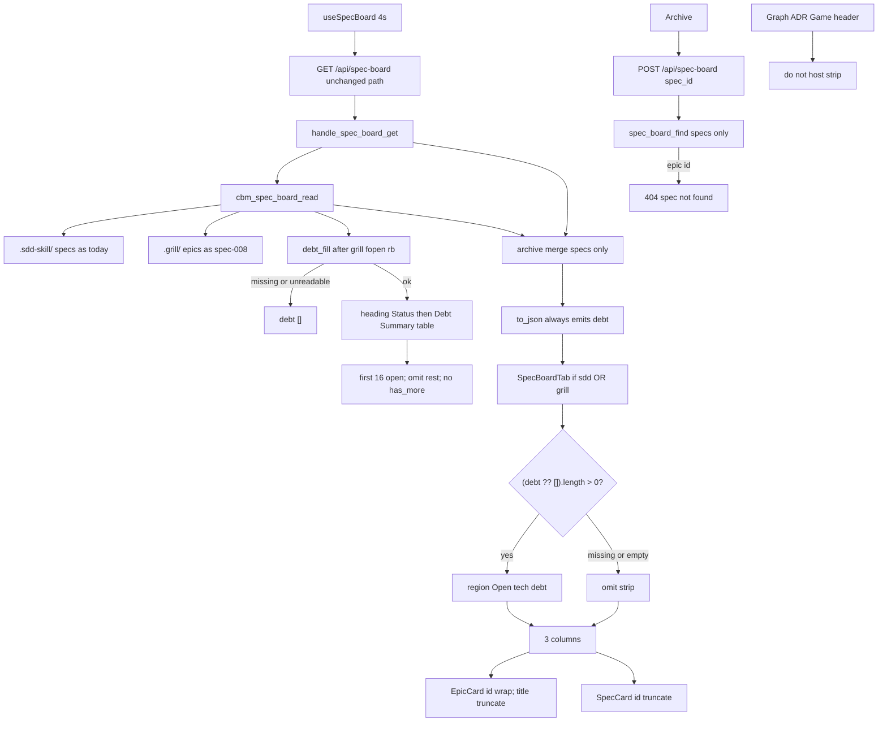

# spec-015 — Specs debt and path
Reading time: 5-8 min
Last updated: 2026-09-02 — spec-015-s5k-specs-debt-and-path closeprep

## Feature description

Specs already hosts the Kanban and Mixed Todo (spec-008/009). The operator could not see leftover SDD debt without opening `.sdd-skill/baseline/TECH_DEBT.md`, and Todo epic cards truncated the grill path so two epics in the same plan looked alike.

This spec adds an additive `debt` array on the same GET `/api/spec-board` (open TD-NNN only: Status is not the exact word `resolved`) and paints those rows in a Specs-only chrome strip above the three columns. Todo epic cards keep the short name as title (truncate stays) and wrap the full `id` path. Conversion (Companion-to / `active.json.source.grill_epic`) does not change. CBM does not write `.sdd-skill/`, `.grill/`, or `.gamedev/`.

Game Inbox hide via `.gamedev/epics_registry.md` and Game debt chrome / `.gamedev/backlog.md` are the next grill epics. They did not ship here.

Business result: an operator already on Specs sees open debt and which grill epic is which without leaving the tab, opening the debt file, or opening Game.

## Task timeline

All four tasks landed 2026-09-02. Critical path #1 → #2 → #3 → #4 (11h plan). No parallel branch.

| When | Task | What the operator can see |
|---|---|---|
| 2026-09-02 | #1 C parse + additive JSON | Nothing new on the live tab. The same GET reader now fills `debt[{id,title}]` from TECH_DEBT.md (cap 16, heading Status wins, empty when missing/unreadable/all-resolved). Companion-to omit still holds. |
| 2026-09-02 | #2 HTTP leftover | Same URL returns that key. Archive POST with an epic path is still 404 `spec not found` and writes nothing. Skill files stay byte-identical. HTTP does not open TECH_DEBT.md itself. Strip still absent. |
| 2026-09-02 | #3 strip + wrap | Specs paints a region named Open tech debt above the three columns when `debt` is non-empty. Todo epic id wraps the full grill path; spec id still truncates. Graph / ADR / Game / header do not host the strip. |
| 2026-09-02 | #4 leftover Vitest | Tests lock header/Graph/ADR/Game omit, dead row (no POST/clipboard/expand), no Has more, grill-only Specs still shown with strip omitted. Product Game and header files were not edited. |

DEV: C `spec_board` 46 passed. `httpd` 119 passed (1 skipped). graph-ui Vitest 290 passed. Coverage reporter absent. Playwright not run (optional at DEVELOPMENT). Live UI was not browser-clicked; proof is C + Vitest. A pre-this-spec UI embed has no strip and still truncates epic ids until `scripts/build.sh --with-ui`. This-repo live TECH_DEBT.md is all resolved → GET emits `debt: []`; strip omitted until a new TD is opened.

## Architecture before / after

Before: GET `/api/spec-board` listed sdd specs and unconverted grill epics. HTTP merged archive onto `specs[]` only. POST looked up `specs[]` only. Specs painted three columns. EpicCard id used CSS `truncate`. TECH_DEBT.md was invisible on the board. Game GET and GameBoardTab were unchanged.

After: same GET, same 4s poll, same POST. `cbm_spec_board_read` fopen `"rb"` of `{root}/.sdd-skill/baseline/TECH_DEBT.md` after grill fill. `to_json` always emits `"debt":[{id,title}]` (empty array when omit). Never `has_more`. HTTP still does not fopen TECH_DEBT.md. SpecBoardTab paints `DebtStrip` (`role="region"` + aria-label, no required heading) when `(board.debt ?? []).length > 0`. EpicCard id: `whitespace-normal break-all`. Title truncate stays. Spec / Artifact / Inbox ids stay truncated.



Silent win, Game filters, four columns, Mixed Todo conversion, Specs expand/archive, ADR XOR fill, Graph hex, and Path 1:1 stay.

## Decisions + ADRs

| Decision | Why it matters | ADR |
|---|---|---|
| Same GET; always-emit `debt[{id,title}]`; cap 16; no `has_more` | No second poll. Gherkin `debt is []` is a present empty array. Overflow must not steal spec/epic slots | SDD-ADR-065 |
| Parse in `spec_board.c`; HTTP stays merge | Skill IO stays with spec.md / grill fopen `"rb"`. HTTP already owns SQLite archive merge | SDD-ADR-066 |
| Heading `Status:` (line-start or pipe cell) wins; `## Debt Summary` table is fallback | Stale table cannot hide an open heading or invent one | SDD-ADR-066 |
| Open iff `strcmp` ≠ `"resolved"`; unknown/typo = open | Only the exact token closes an item | SDD-ADR-066 |
| Specs-only strip; `role="region"` + aria-label; no required `<h2>`; dead `<p>` rows | WorkspaceHeader would leak onto Graph/ADR. Clickable rows would invite POST/clipboard/expand. Same a11y as Game blockedStrip | SDD-ADR-067 |
| EpicCard id `break-all`; title truncate stays; Spec/Artifact/Inbox ids locked | Paths have no spaces; wrapping every card id is out of this spec | SDD-ADR-068 |
| Do not read `epics_registry.md` or `backlog.md`; do not edit GameBoardTab | Those are grill epic-002 / epic-003 | US-005 |

## How to use

Operator: Specs tab debt strip and epic path.

1. Rebuild with `scripts/build.sh --with-ui`. A pre-this-spec embed has no strip and still truncates epic ids.
2. Open a project whose root has `.sdd-skill/` or `.grill/` and does not show Game. Enter still opens Graph. Switch to Specs.
3. If GET `debt` has rows, a region named Open tech debt sits above Todo / In progress / Done. Each row is `TD-NNN` then the heading title. Rows are text: click does not archive, copy, or expand.
4. If the file is missing, unreadable, or every item is `resolved`, the region is gone. This repo’s TECH_DEBT.md is all resolved today — omit is the live default until a new TD is opened. Grill-only with no TECH_DEBT.md still shows Specs; strip omitted.
5. Todo epic cards: short name may still truncate; the full `.grill/plans/<slug>/epics/epic-NNN-<name>.md` path wraps under it.
6. Converted epics stay omitted (Companion-to exact path or `source.grill_epic`). Spec expand, archive, Show archived, and Game filters stay as before.
7. Graph, ADR, Game, and the workspace header never show Open tech debt.

## Debugging guide

| If this fails | File:line | Cause | Fix |
|---|---|---|---|
| Open heading present but `debt` is `[]` | `spec_board.c:1493-1507`, `:1471-1476` | fopen failed, or Status token is exact `resolved` | `debt_fill` joins TECH_DEBT.md `"rb"`. Heading `Status:` is line-start or a pipe cell. Test `test_spec_board.c:1532` |
| Table says resolved so an identified heading disappeared | `spec_board.c:1162-1180` | Table used before heading | First heading `Status:` wins. Test `:1622` |
| Typo `resolvd` omitted | `spec_board.c:1477` | Case-fold or prefix match | `strcmp` to exact `"resolved"` only. Test `:1677` |
| 17th open id in JSON / `has_more` key | `spec_board.c:1477`, `:1699-1710` | Shared cap or overflow field | Stop at cap 16. Never emit `has_more`. Tests `:1696` / `test_httpd.c:4579` |
| GET 200 missing `debt` | `http_server.c:508-511` | Wrapper skipped `to_json` | Same dispatch: read → merge → `to_json`. Test `test_httpd.c:4541` |
| HTTP opened TECH_DEBT.md | `http_server.c` (no match) | Skill IO leaked into GET | Fill stays in `cbm_spec_board_read`. Test `:4468` |
| POST epic id is 200 | `http_server.c:815-826`, `:910-914` | `spec_board_find` walked `epics[]` | Loop `spec_count` only. `{"error":"spec not found"}`. Test `:4388` |
| Strip missing though `debt` has TD-005 | `SpecBoardTab.tsx:217`, `:374` | Length gate inverted | `DebtStrip rows={board.debt ?? []}`. Test `:1052` |
| Empty / missing `debt` still shows the region | `SpecBoardTab.tsx:217`, `:374` | Region mounted on `[]` | `rows.length === 0` → null. Tests `:1078` / `:1089` |
| Epic id still ellipsis / class `truncate` | `SpecBoardTab.tsx:109` | Id line still `truncate` | `whitespace-normal break-all`. Test `:1100` |
| Spec card id wraps | `SpecBoardTab.tsx:151` | SpecCard id lost `truncate` | Keep `truncate`. Test `:1122` |
| Header / Graph / ADR / Game show Open tech debt | `SpecBoardTab.tsx:374` only | Strip leaked | Do not edit WorkspaceHeader / GameBoardTab. Tests `WorkspaceHeader.test.tsx:128`, `App.test.tsx:1232`, `GameBoardTab.test.tsx:2076` |
| Debt click POSTs / copies / expands | `SpecBoardTab.tsx:220-223` | Row became a control | Dead `<p>`. Test `:1224` |
| Grill-only hides Specs or shows notSddSkill | `SpecBoardTab.tsx:360` | Host OR dropped | sdd false + grill true still Kanban. Tests `:1166` / `App.test.tsx:1264` |
| Converted epic back in Todo | `spec_board.c:738-756` | Matcher rewritten | Do not touch `grill_epic_converted`. Test `:1041` |
| Function hex drifted | `colors.test.ts:27` | Chrome token leaked into Graph | `colorForLabel("Function") === "#06b6d4"` |

Verify: `scripts/test.sh --suites spec_board` (46); `scripts/test.sh --suites httpd` (119); `cd graph-ui && npx vitest run` (290).

## Out of scope

- Game Inbox hide via `.gamedev/epics_registry.md` (grill epic-002)
- Game debt chrome / `.gamedev/backlog.md` `debt:*` (grill epic-003)
- New Kanban column, debt cards in Todo, kind E for debt, expand/archive on debt
- Changing Companion-to / `active.json` conversion
- Writing `.grill/`, `.sdd-skill/`, or `.gamedev/`
- has_more chrome, severity/category/status/color on rows
- Clipboard copy of TD-NNN
- New HTTP path or MCP debt tool
- Changing spec-005 expand, spec-006 archive, spec-007 formatIndexedAt, spec-014 Game filters
- Reading `.gamedev/` from spec_board.c

## Pattern validation

Patterns: ✓. Same GET family as spec-006/008: `cbm_spec_board_read` → archive merge on `specs[]` only → `cbm_spec_board_to_json`; POST `spec_board_find` on `specs[]`; epic id stays 404 `spec not found`. fopen `"rb"` + `read_whole_file` in spec_board.c after grill (not in HTTP) — same class as spec.md / grill. Additive always-emit JSON (blurb / `epics[]` / `debt[]`); never `has_more`. Strip copies spec-012 blockedStrip a11y (`role="region"` + aria-label; omit when length 0). Leftover Thens live in tests (spec-008 #4 / spec-014 #2); GameBoardTab.tsx / WorkspaceHeader.tsx not patched. Conversion matcher untouched. Prefer existing HTTP (IV.3). Zero skill writes (I.2). Chrome grayscale; Graph Function hue `#06b6d4`. Vitest + fetch mock (V.1/V.4). C tests for parse/HTTP (V.3). Constitution has I–IX only (no Section X).

IX.2 still ends at spec-014 Game filters and Specs lock. It does not mention Specs debt chrome or epic path wrap. Not a code defect — constitution text is stale until close.

```
📜 CONSTITUTION RECOMMENDATION
Observed: Tasks #1–#4 add additive always-emit debt[{id,title}] on GET /api/spec-board (cap 16, no has_more); parse in spec_board.c fopen rb after grill (heading Status wins; table fallback; HTTP merge stays specs-only); Specs-only Open tech debt region (blockedStrip a11y; dead text; omit when []/missing); EpicCard id wrap break-all (title truncate stays; Spec/Artifact/Inbox ids locked). IX.2 still ends at spec-014 Game filters — no debt strip or epic path wrap.
Recommendation: At spec close, MODIFY IX.2 — append spec-015 delivered Specs debt chrome + epic path wrap: GET /api/spec-board additive debt[{id,title}] cap 16 no has_more; TECH_DEBT.md fopen rb in spec_board.c (heading Status wins); Specs-only strip above 3-col; EpicCard id wraps; zero skill writes; Game/registry/backlog.md not this spec (SDD-ADR-065..068).
→ @planner evaluates, creates ADR if agreed
```

## Quick refs

- Spec: `.sdd-skill/specs/spec-015-s5k-specs-debt-and-path/spec.md`
- Plan: `.sdd-skill/specs/spec-015-s5k-specs-debt-and-path/plan.md`
- Tasks: `.sdd-skill/specs/spec-015-s5k-specs-debt-and-path/tasks.md`
- ADRs: `.sdd-skill/baseline/ARCHITECTURE_ADR.md` (SDD-ADR-065 … 068)
- Architecture: `human/ARCHITECTURE-VISUAL.mmd`
- Overview: `human/PROJECT-OVERVIEW.md`
- Debug: `human/QUICK-DEBUG.md`
- Task summaries: `human/task-summaries/task-1-spec-board-debt-parse.md`, `task-2-http-get-additive-post-epic-404.md`, `task-3-specboardtab-strip-epiccard-wrap.md`, `task-4-leftover-vitest-locks.md`
- Constitution: `.sdd-skill/docs/constitution.md` (IX.2 is @planner at close — not edited here)
- Tests: `scripts/test.sh --suites spec_board`; `scripts/test.sh --suites httpd`; `cd graph-ui && npx vitest run`
