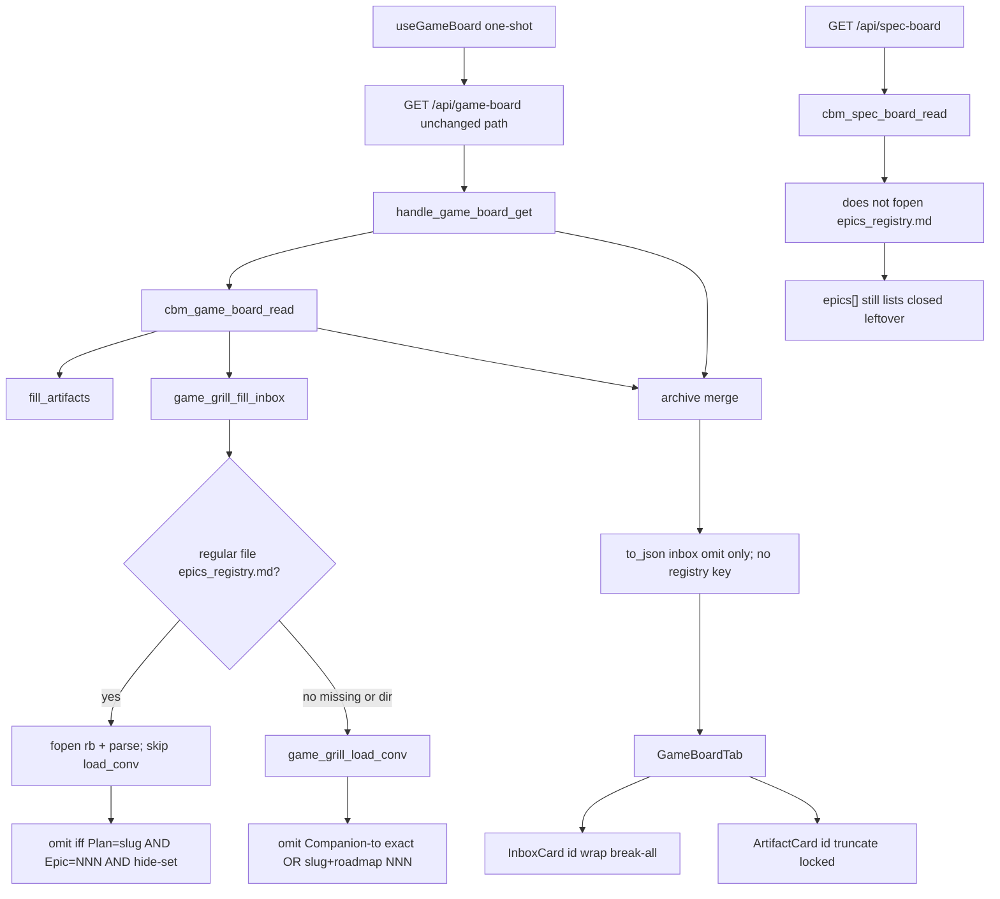

# spec-016 — Game Inbox registry
Reading time: 5-8 min
Last updated: 2026-09-02 — spec-016-d9v-game-inbox-registry closeprep

## Feature description

Game Inbox already listed leftover grill epics (spec-011). Hide was Companion-to exact path or roadmap slug+NNN. Operators who adopted gamedev Epic Tracking still saw leftovers `@director` had already marked `in_progress`, `closed`, or `parked`, and InboxCard truncated the grill path so two leftovers in the same plan looked alike.

This spec changes only the Inbox hide predicate and the Inbox id chrome. If `{project}/.gamedev/epics_registry.md` exists as a regular file (even empty, header-only, unreadable, or zero parsed rows), hide is solely Plan cell = grill plan slug AND Epic cell = filename NNN with Status in {`in_progress`, `closed`, `parked`}. Companion-to and roadmap must not also hide. If the file is absent or is a directory, spec-011 hide stays. Hide is server-side omit from `inbox[]` on the same GET `/api/game-board`. Inbox cards keep the short `name` as title (truncate stays) and wrap the full `id` path. Artifact id truncate stays. Specs conversion does not read the registry. CBM never creates the file and never writes `.gamedev/`, `.sdd-skill/`, or `.grill/`.

Game debt chrome / `.gamedev/backlog.md` is the next grill epic. It did not ship here.

Business result: on a gamedev path that has a registry, Inbox means “faltan” against the skill’s own tracking file; older games without the file keep the prior funnel; leftover paths stay readable.

## Task timeline

All three tasks landed 2026-09-02. Critical path #1 → #2 (8h plan). #3 ran after #1 (UI mocks already-filtered `inbox`).

| When | Task | What the operator can see |
|---|---|---|
| 2026-09-02 | #1 C parse + hide | Nothing new on the live tab until rebuild. `game_grill_fill_inbox` now gates hide on a regular file at `.gamedev/epics_registry.md`. Present → skip Companion-to/roadmap load; omit Plan+NNN hide-set only. Absent/dir → spec-011 hide. Walk and cap 64 stay. JSON shape unchanged (omit from `inbox[]`). |
| 2026-09-02 | #2 HTTP leftover | Same URL. HTTP does not open the registry. Unknown project still 404. GET does not create the file. Skill trees stay byte-identical. Specs Todo still lists a leftover the Game registry marks `closed`. |
| 2026-09-02 | #3 Inbox wrap | Inbox id wraps the full `.grill/plans/<slug>/epics/epic-NNN-<name>.md` path; title may still truncate. Artifact id still truncates. Empty Inbox = column header only. Show Dones off still shows a leftover Inbox card. |

DEV: C `game_board` 56 passed. `httpd` 122 passed (1 skipped). graph-ui Vitest 294 passed (25 files). Coverage reporter absent. Playwright not run (optional at DEVELOPMENT). Live UI was not browser-clicked; proof is C + Vitest. A pre-this-spec UI embed still truncates Inbox ids and still hides via Companion-to/roadmap only until `scripts/build.sh --with-ui`.

## Architecture before / after

Before: GET `/api/game-board` filled exist-only phase cards plus leftover grill Inbox. Hide was always Companion-to exact OR slug token + roadmap table NNN. HTTP merged `game_archive` then `to_json`. InboxCard id used CSS `truncate`. Specs GET did not (and still does not) open the registry. CBM never created `epics_registry.md`.

After: same GET, same one-shot, same POST, same JSON keys. `game_grill_fill_inbox` stats `{root}/.gamedev/epics_registry.md`. Regular file present → fopen `"rb"`, parse last-wins Plan+NNN, skip `game_grill_load_conv`, omit iff hide-set. Missing or directory → existing `game_grill_epic_converted`. HTTP still does not fopen the registry. InboxCard id: `whitespace-normal break-all`. ArtifactCard id keeps `truncate`. spec_board.c untouched.



Silent win, four columns, expand, archive, Blocked strip, Show Dones, Track filters, Enter→Graph, Specs debt strip, EpicCard wrap, and Path 1:1 stay.

## Decisions + ADRs

| Decision | Why it matters | ADR |
|---|---|---|
| Present = regular file; sole hide when present; skip `load_conv`; absent/dir keeps spec-011 | Mixing both predicates would hide an unlisted leftover. A directory at that name must not turn prior hide off | SDD-ADR-069 |
| Hide = omit from `inbox[]`; no new JSON key; same GET | Old UIs keep working. No sibling route. HTTP does not fopen the registry | SDD-ADR-069 |
| Parse in `game_board.c`; last-wins Plan+NNN; integer NNN (`001`/`1`/`epic-001`); exact slug; `native` skip | Path leftover in Plan must not hide. Fuzzy match would hide the wrong card. HTTP must not grow a registry reader | SDD-ADR-070 |
| Hide-set exact `in_progress`/`closed`/`parked`; Epic 0 / evergreen never hide | `not_started`, typo, unknown stay visible | SDD-ADR-070 |
| Unreadable regular file = present, 0 rows | fopen-success-as-present would treat unreadable as absent and re-apply Companion-to | SDD-ADR-069 |
| InboxCard id `break-all`; title truncate + letter E stay; Artifact/Spec/header ids locked | Paths have no spaces. SDD-ADR-068 Inbox truncate lock is lifted here only | SDD-ADR-071 |
| Specs does not read the registry | Conversion on Specs stays Companion-to / `source.grill_epic`. Closed leftover still in Todo | grill ADR-005; US-006 |

## How to use

Operator: Game Inbox leftovers and path.

1. Rebuild with `scripts/build.sh --with-ui`. A pre-this-spec embed still truncates Inbox ids and still hides via Companion-to/roadmap only.
2. Open a project whose root has `.gamedev/`. Enter still opens Graph. Switch to Game.
3. If `{root}/.gamedev/epics_registry.md` is a regular file, Inbox omits a leftover only when a table row has Plan = that epic’s plan folder name, Epic = the same NNN as `epic-NNN-*.md`, and Status is `in_progress`, `closed`, or `parked`. Companion-to and roadmap do not also hide — even if the file is empty or has no matching row.
4. If that path is missing or is a directory, hide is unchanged from spec-011: omit iff Companion-to exact path OR (slug token in roadmap.md|game_context.md AND roadmap table cell NNN / epic-NNN).
5. Inbox cards: short name may still truncate; the full `.grill/plans/<slug>/epics/epic-NNN-<name>.md` path wraps under it. Phase artifact ids still truncate.
6. Empty Inbox after hide: column header only. No “all tracked”. Show Dones and Track never hide Inbox.
7. Specs Todo does not read the registry. A leftover marked `closed` there still appears in Todo unless Companion-to / `source.grill_epic` converts it.
8. CBM never creates `epics_registry.md`. GET/POST leave skill trees byte-identical.

## Debugging guide

| If this fails | File:line | Cause | Fix |
|---|---|---|---|
| Leftover still hidden though registry exists and has no matching row | `game_board.c:1948-1961`, `:1888-1893` | `load_conv` still ran, or present check used `is_dir` | Present = regular file only (`:685-687`). When present, do not call `load_conv`. Test `test_game_board.c:1635` |
| Header-only registry still hides via roadmap | `game_board.c:1950-1955` | Empty file treated as absent | Empty regular file is present, 0 rows. Test `:1653` |
| `in_progress` card still in inbox | `game_board.c:1465-1469`, `:1857-1863` | Status cell not cells[5] or n < 6 | GFM dummy is cells[0]. Test `:1547` |
| `not_started` omitted | `game_board.c:1467-1469` | Hide-set too wide | Only `in_progress`/`closed`/`parked`. Test `:1590` |
| Later `not_started` still omitted after earlier `closed` | `game_board.c:1470-1472` | First row kept | Last Plan+NNN overwrites hide. Tests `:1676` / `:1695` |
| `1` or `epic-001` does not hide NNN 1 | `game_board.c:1391-1417` | Prefix case-fold or leftover suffix | Optional exact `epic-` then all digits. Tests `:1715` / `:1731` |
| Plan `.grill/plans/inbox-plan` hid the leftover | `game_board.c:1465-1466`, `:1857-1859` | Basename match | Exact slug `strcmp`. Test `:1747` |
| Plan `native` hid a grill card | `game_board.c:1466` | native stored as a slug | Skip that row. Test `:1833` |
| Epic 0 / evergreen hid epic-001 | `game_board.c:1467` | NNN 0 stored as hide | `nnn != 0` required. Test `:1799` |
| Typo `closd` omitted the card | `game_board.c:1467-1469` | Prefix / case-fold | Exact tokens only. Test `:1816` |
| Unreadable oversize file hid via Companion-to | `game_board.c:1950-1955`, `:100` | Treated as absent | Regular file + `read_whole_file` NULL → 0 rows, still present. Test `:1850` |
| `n/a` Epic hid epic-001 | `game_board.c:1465` | Unparseable row stored | Skip; keep well-formed parked. Test `:1890` |
| File absent no longer hides Companion-to | `game_board.c:1892-1893` | Absent branch skipped | Keep `game_grill_epic_converted`. Test `:814` |
| File absent no longer hides roadmap slug+NNN | `game_board.c:1849-1854` | Roadmap matcher rewritten | Unchanged. Test `:858` |
| GET 200 still lists a hide-set leftover | `http_server.c:614-615` | fill_inbox not reached | Hide is Task #1. HTTP only calls read. Test `test_httpd.c:5007` |
| `has_more` / `"registry"` / `epics_registry` in body | `game_board.c` to_json | New key leaked | Never emit. Test `test_httpd.c:5055-5056` |
| GET created `epics_registry.md` | `http_server.c` / `game_board.c` | Write leaked | fopen `"rb"` only. Test `test_httpd.c:5084` |
| GET changed registry / state / index / active.json | `http_server.c:614` | Skill write | Bytes lock. Test `:5007` |
| Specs Todo omitted a closed leftover | `spec_board.c` | spec_board opened the registry | Do not edit spec_board. Test `test_httpd.c:5150` |
| Inbox id still ellipsis / class `truncate` | `GameBoardTab.tsx:301` | Id `<p>` still has `truncate` | `whitespace-normal break-all`. Test `GameBoardTab.test.tsx:2076` |
| Artifact id wraps | `GameBoardTab.tsx:259` | ArtifactCard id lost `truncate` | Keep `truncate`. Test `:2131` |
| Empty Inbox shows “all tracked” / “no artifacts in this phase” | `GameBoardTab.tsx` Inbox column | Placeholder copy leaked | Header only; 0 cards. Test `:2109` |
| Show Dones off hides a leftover Inbox card | `GameBoardTab.tsx` `visiblePhaseCards` | Inbox entered the phase filter | Inbox never filtered. Test `:2155` |

Verify: `scripts/test.sh --suites game_board` (56); `scripts/test.sh --suites httpd` (122); `cd graph-ui && npx vitest run` (294).

## Out of scope

- Game debt chrome / `.gamedev/backlog.md` `debt:*` (grill epic-003)
- Reading `epics_registry.md` from spec_board / Specs Todo
- Changing Companion-to / `active.json` conversion on Specs
- Writing `.grill/`, `.sdd-skill/`, or `.gamedev/` (including creating the registry)
- New Inbox column, debt cards, or “all tracked” copy
- Fuzzy Plan/Epic match, kebab, or path basename
- New HTTP path or MCP registry tool
- Changing spec-012 expand/archive, spec-014 filters, spec-015 Specs debt strip
- Cards for backlog.md / assets_registry.md / roadmap / game_context / state.md

## Pattern validation

Patterns: ✓. Same `cbm_fopen` `"rb"` + `read_whole_file` as spec-011 inbox / spec-015 debt. Same server-side omit from an existing GET array (not a new key or route, IV.3). Present reuses `game_is_regular_file`. Parse stays in `game_board.c` (do not import spec_board). Unreadable regular file is 0 rows, same degrade as oversize TECH_DEBT.md. Own cap 256 unique Plan+NNN next to inbox cap 64; last-wins overwrite does not consume a new slot. Conversion matcher kept for the absent branch only. HTTP leftover locks match spec-015 Task #2 (skill IO stays in the board reader). InboxCard wrap copies spec-015 EpicCard Tailwind (`whitespace-normal break-all`, no new CSS file, II.2). Hide stays C-owned; UI Gherkin mocks already-filtered `inbox`. Empty column = header only (spec-011). Inbox unfiltered (spec-014). Zero skill writes (I.2). Never create the file. Vitest + fetch mock (V.1/V.4). C tests for parse/HTTP (V.3). Constitution has I–IX only (no Section X).

IX.2 ends at spec-015 debt/wrap. It does not mention Game registry hide or InboxCard wrap. Not a code defect — constitution text is stale until close.

```
📜 CONSTITUTION RECOMMENDATION
Observed: Tasks #1–#3 add Game Inbox registry hide + InboxCard wrap: regular file {root}/.gamedev/epics_registry.md is sole hide (skip Companion-to/roadmap when present); absent/dir keeps spec-011; parse in game_board.c last-wins NNN exact slug hide-set in_progress/closed/parked; same GET omit from inbox[]; HTTP no registry fopen; InboxCard id wrap break-all; Artifact truncate locked; Specs does not read the registry; zero skill writes; never create the file. IX.2 still ends at spec-015 Specs debt/wrap — no Game registry hide or Inbox wrap.
Recommendation: At spec close, MODIFY IX.2 — append spec-016 delivered Game Inbox registry hide + InboxCard wrap: regular file {root}/.gamedev/epics_registry.md is sole hide (skip Companion-to/roadmap when present); absent/dir keeps spec-011; parse in game_board.c last-wins NNN exact slug hide-set in_progress/closed/parked; same GET omit from inbox[]; HTTP no registry fopen; InboxCard id wrap break-all; Artifact truncate locked; Specs does not read the registry; zero skill writes; never create the file (SDD-ADR-069..071).
→ @planner evaluates, creates ADR if agreed
```

## Quick refs

- Spec: `.sdd-skill/specs/spec-016-d9v-game-inbox-registry/spec.md`
- Plan: `.sdd-skill/specs/spec-016-d9v-game-inbox-registry/plan.md`
- Tasks: `.sdd-skill/specs/spec-016-d9v-game-inbox-registry/tasks.md`
- ADRs: `.sdd-skill/baseline/ARCHITECTURE_ADR.md` (SDD-ADR-069 … 071)
- Architecture: `human/ARCHITECTURE-VISUAL.mmd`
- Overview: `human/PROJECT-OVERVIEW.md`
- Debug: `human/QUICK-DEBUG.md`
- Task summaries: `human/task-summaries/task-1-game-board-registry-parse-hide.md`, `task-2-http-get-leftover-locks.md`, `task-3-inboxcard-wrap-leftover-vitest.md`
- Constitution: `.sdd-skill/docs/constitution.md` (IX.2 is @planner at close — not edited here)
- Tests: `scripts/test.sh --suites game_board`; `scripts/test.sh --suites httpd`; `cd graph-ui && npx vitest run`
