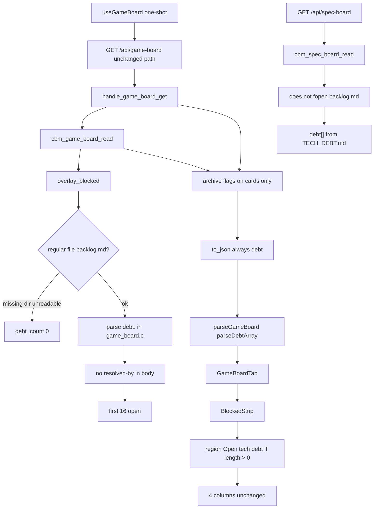

# spec-017 — Game debt chrome
Reading time: 5-8 min
Last updated: 2026-09-03 — spec-017-b4w-game-debt-chrome closed

## Feature description

Game already mapped phase artifacts, Inbox hide, and a Blocked strip. Open gamedev debt lived only in `.gamedev/backlog.md` as `debt:<tag>` comments, lists, or headings. Mixing those into Inbox would collide with grill cards and registry hide. Specs already shows TECH_DEBT.md in its own strip; Game must not reuse that parser.

This spec adds always-present `debt: [{id, title}]` on the same GET `/api/game-board` (open `debt:*` only, cap 16) and paints those rows in a Game-only chrome strip after Blocked, before the four columns. Closed means the entry body contains `resolved-by`. CBM never writes or creates `backlog.md`. Inbox hide and Specs debt stay locked.

Business result: an operator already on Game sees leftover backlog debt the same way Specs shows open TD-NNN, without a fifth column or Inbox cards.

## Task timeline

All three tasks landed 2026-09-03. Critical path #1 → #2 (9h plan). #3 ran after #1 (UI mocks JSON; live GET also needed parse).

| When | Task | What the operator can see |
|---|---|---|
| 2026-09-03 | #1 C parse + JSON | Nothing new on a pre-rebuild tab. `cbm_game_board_read` fopens `{root}/.gamedev/backlog.md` `"rb"` after overlay. Open `debt:<tag>` fills `debt[]`. `to_json` always emits the key. |
| 2026-09-03 | #2 HTTP leftover | Same URL. HTTP does not open `backlog.md`. GET/POST leave skill files byte-identical. Absent GET does not create the file. POST of a debt id stays 404. Specs GET still uses TECH_DEBT.md. |
| 2026-09-03 | #3 Game strip | Region "Open tech debt" after Blocked, before the four columns. Dead wrapping rows. Graph / ADR / header omit Game tags. Show Dones does not hide the strip. |

DEV: C `game_board` 74 passed. `httpd` 131 passed (1 skipped). graph-ui Vitest 302 passed (25 files). Coverage reporter absent. Playwright not run (optional at DEVELOPMENT). Live UI was not browser-clicked; proof is C + Vitest. A pre-this-spec UI embed still omits Game debt until `scripts/build.sh --with-ui`. This repo has no `.gamedev/`; omit is the live default until a gamedev path is opened.

## Architecture before / after

Before: GET `/api/game-board` filled chrome, exist-only artifacts, Inbox hide, expand fields, blocked overlay, then archive merge on cards. No `debt` key. GameBoardTab painted Blocked then four columns. Specs GET still read TECH_DEBT.md only.

After: same GET, same one-shot, same POST. After overlay, `game_debt_fill` stats `{root}/.gamedev/backlog.md`. Regular file + readable → parse open `debt:*` (cap 16). Missing / directory / unreadable → `debt: []`. HTTP still does not fopen the file. `parseGameBoard` keeps `debt` so live GET rows reach the tab. GameBoardTab inserts `DebtStrip` between Blocked and the grid. spec_board.c still does not fopen `backlog.md`.



Silent win, four columns, expand, archive, Blocked, Show Dones, Track, Inbox registry hide, Inbox wrap, Specs debt strip, EpicCard wrap, and Path 1:1 stay.

## Decisions + ADRs

| Decision | Why it matters | ADR |
|---|---|---|
| Same GET; always-emit `debt[{id,title}]`; cap 16; no `has_more` | Old UIs ignore the key. Empty array is unambiguous. Overflow omit | SDD-ADR-072 |
| Parse in `game_board.c`; do not call spec-board helper; HTTP/spec_board do not fopen backlog.md | Two file formats. Specs stays TECH_DEBT.md. Skill IO stays in the Game reader | SDD-ADR-073 |
| Game-only strip after BlockedStrip; reuse `specBoard.openTechDebt`; dead wrap rows | Header would leak onto Graph/ADR. A new i18n key can drift. Filters must not apply | SDD-ADR-074 |
| `parseGameBoard` keeps `debt` | Strict constructor would drop live GET rows. Specs casts; Game already parses | constitution I.1 vs tasks.md lock |

## How to use

Operator: Game leftover debt.

1. Rebuild with `scripts/build.sh --with-ui`. A pre-this-spec embed still omits the Game strip.
2. Open a project whose root has `.gamedev/`. Enter still opens Graph. Switch to Game.
3. If `{root}/.gamedev/backlog.md` has an open `debt:<tag>` (comment, list, or `##` heading) and the entry body has no `resolved-by`, that row appears after Blocked and before Inbox / Pre-production / Production / Post-production. Title is the text after the tag, cut at ` — ` or ` -- `.
4. If the file is missing, a directory, unreadable, or every `debt:*` is closed, the region is absent. Game still shows when `.gamedev/` is present.
5. Rows are dead text. They do not archive, copy, or expand. Show Dones / Track / Show archived do not hide them.
6. Specs Open tech debt still comes from TECH_DEBT.md only. Graph, ADR, and the workspace header never show Game `debt:` tags.
7. CBM never creates `backlog.md`. GET/POST leave skill trees byte-identical. A debt id is not an archive target.

## Debugging guide

| If this fails | File:line | Cause | Fix |
|---|---|---|---|
| Open comment stays `debt: []` | `game_board.c` 2253, 2034 | Path not regular / tag charset | `debt:` + `[A-Za-z0-9][A-Za-z0-9_-]*`. Test `game_board_debt_open_comment` |
| Title keeps director / M1 | `game_board.c` title helper | Cut not applied | Cut at ` — ` or ` -- ` after strip `-->` |
| Following-line `resolved-by` still listed | `game_board.c` 2198 | Blank line ended body | Body continues to next start / `##` / EOF |
| `design` / `tech` rows appear | `game_board.c` 2043 | Prefix not required | Token must be `debt:` |
| 17th open listed / `has_more` | `game_board.c` 2238, 2542 | Cap or overflow key | Cap 16; never `has_more` |
| GET created `backlog.md` | `http_server.c` | HTTP wrote | Do not fopen. Test `test_httpd.c:5854` |
| Specs debt has `debt:gate-*` | `spec_board.c` | Opened backlog.md | TECH_DEBT.md only. Test `:5723` |
| POST debt id is 200 | `http_server.c` find | Debt taught as card | Card arrays only. Test `:5920` |
| Live GET debt but no region | `useGameBoard.ts` 121, 160 | Constructor dropped `debt` | `parseDebtArray`. Test `useGameBoard.test.ts:249` |
| Strip above Blocked / inside header | `GameBoardTab.tsx` 503-505 | Sibling order | After Blocked, before grid. Test `GameBoardTab.test.tsx:2177` |
| Title ellipsis | `GameBoardTab.tsx` 338 | `truncate` leaked | `whitespace-normal break-words`. Test `:2210` |
| Graph shows Open tech debt | `App.test.tsx` leftover | GameBoardTab stayed mounted | Unmount on tab change |

Verify: `scripts/test.sh --suites game_board` (74); `scripts/test.sh --suites httpd` (131); `cd graph-ui && npx vitest run` (302).

## Out of scope

- Changing Inbox hide (registry or Companion-to/roadmap)
- Specs TECH_DEBT.md parse or Specs strip placement
- New Kanban column, debt cards in Inbox, expand/archive on debt
- Writing `.grill/`, `.sdd-skill/`, or `.gamedev/` (including creating backlog.md)
- has_more chrome, owner/target/severity/color
- Clipboard copy of the debt tag
- New HTTP path or MCP debt tool
- Sharing `cbm_spec_board_parse_tech_debt` with backlog.md
- Changing spec-012 expand/archive, spec-014 filters, spec-016 registry hide
- Lines tagged only `design` or `tech`

## Pattern validation

Patterns: ✓. Same `cbm_fopen` `"rb"` + `read_whole_file` as spec-015 debt / spec-016 registry. Same always-emit additive array on an existing GET (IV.3). Own cap 16 next to blocked 16. Parse stays in `game_board.c` (do not import spec_board). HTTP leftover locks match spec-015/#016 Task #2. Strip copies Specs DebtStrip JSX (region + dead `<p>` + `break-words`, no new CSS, II.2). Filters do not apply (spec-014 Inbox lock analog). Zero skill writes (I.2). Never create the file. Vitest + fetch mock (V.1/V.4). C tests for parse/HTTP (V.3). Constitution has I–IX only (no Section X).

Deviation (not a defect): tasks.md said do not edit `useGameBoard`. Live GET requires `parseDebtArray` because `parseGameBoard` is a strict constructor. Flagged in Task #3 Pattern Notes. @review approved.

IX.2 append confirmed at close (SDD-ADR-072..074).

```
CONSTITUTION RECOMMENDATION
Observed: Tasks #1–#3 add Game backlog.md debt chrome: same GET always-emit debt[{id,title}] cap 16; parse in game_board.c (no spec_board helper); HTTP/spec_board do not fopen backlog.md; Game-only strip after BlockedStrip; reuse specBoard.openTechDebt; dead wrap rows; parseGameBoard keeps debt; zero skill writes; never create the file. IX.2 still ends at spec-016 Inbox registry/wrap.
Recommendation: At spec close, MODIFY IX.2 — append spec-017 delivered Game debt chrome: GET /api/game-board always-emit additive debt[{id,title}] cap 16 (open debt:* only; closed iff resolved-by in entry body; missing/unreadable/dir → []); parse in game_board.c fopen rb backlog.md after overlay (HTTP no backlog fopen; do not call cbm_spec_board_parse_tech_debt); Game-only strip after BlockedStrip, dead text, omit when []; reuse specBoard.openTechDebt; parseGameBoard keeps debt; Specs GET stays TECH_DEBT.md; zero skill writes; never create backlog.md (SDD-ADR-072..074).
→ @planner evaluates, creates ADR if agreed
```

## Quick refs

- Spec: `.sdd-skill/specs/spec-017-b4w-game-debt-chrome/spec.md`
- Plan: `.sdd-skill/specs/spec-017-b4w-game-debt-chrome/plan.md`
- Tasks: `.sdd-skill/specs/spec-017-b4w-game-debt-chrome/tasks.md`
- ADRs: `.sdd-skill/baseline/ARCHITECTURE_ADR.md` (SDD-ADR-072 … 074)
- Architecture: `human/ARCHITECTURE-VISUAL.mmd`
- Overview: `human/PROJECT-OVERVIEW.md`
- Debug: `human/QUICK-DEBUG.md`
- Task summaries: `human/task-summaries/task-1-game-board-debt-parse.md`, `task-2-http-get-additive-post-leftover.md`, `task-3-gameboardtab-strip-leftover-vitest.md`
- Constitution: `.sdd-skill/docs/constitution.md` (IX.2 spec-017 append confirmed)
- Tests: `scripts/test.sh --suites game_board`; `scripts/test.sh --suites httpd`; `cd graph-ui && npx vitest run`
