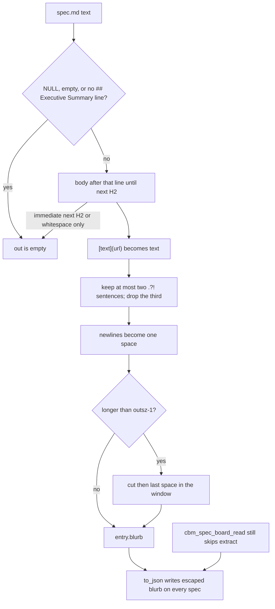

# Task #1 — Blurb extract helper + JSON
Reading time: 2-3 min
Last updated: 2026-08-30 — spec-005-v2m-spec-card-expand | Patterns: ✓

## What changed (plain language)

Each spec-board card can now carry a short objective string: the first one or two sentences of the spec’s Executive Summary. KPI text, the title line, and invented fallback copy are never used.

This task only added the parser and the JSON field. Opening every spec file and filling live cards is Task #2. Until then, GET `/api/spec-board` still emits `"blurb":""` on listed specs.

## Files modified

| File | What it does | Lines ± |
|---|---|---|
| `src/ui/spec_board.h` | `blurb[512]`, public `cbm_spec_board_extract_blurb` | +19 / −7 |
| `src/ui/spec_board.c` | ES parse + `to_json` emits escaped `"blurb"` | +191 / −5 |
| `tests/test_spec_board.c` | Unit Then clauses (no HTTP, no full-tree enrich) | +159 / −2 |

`handle_spec_board` already calls read + to_json. Not edited.

## Key decisions

| Decision | Why | ADR |
|---|---|---|
| Same GET; additive `"blurb"` on every spec | No second expand endpoint | SDD-ADR-024 |
| Extract is public and string-in (no fopen) | C tests cover US-002 without a fixture tree; missing file is Task #2 | SDD-ADR-025 |
| Source is `## Executive Summary` until next H2 | KPI / H1 / `###` never become the blurb | SDD-ADR-025 |
| Two sentences then 512-byte walkback | Third sentence is dropped first so leftover bytes cannot pull it or KPI | SDD-ADR-025 |
| Links → link text before sentence cuts | A `.` in a URL must not end a sentence | SDD-ADR-025 |
| `cbm_spec_board_read` does not call extract yet | DoD: do not loop all specs | Task #2 / SDD-ADR-028 |

## How extract and JSON emit work

Live GET already includes the key because `to_json` always writes it. Values stay empty until Task #2 opens each `spec.md` once and calls this helper.

## Debugging

| If this fails | File:line | Cause | Fix |
|---|---|---|---|
| KPI text appears in blurb | `spec_board.c:314-333`, `:464` | Heading match too loose, or body not stopped at H2 | Line must be `## Executive Summary` then space or EOL (`:323-327`). Body ends at `\n## ` (`:464`) |
| Empty Executive Summary still has text | `spec_board.c:461-463`, `:478-481` | Next H2 sat on the following line, or body was only whitespace | Immediate `## ` after the heading returns "". Trim empty → "" |
| H1 or `### Executive Summary` used as source | `spec_board.c:323-327` | `#` / `###` accepted as H2 | `# Executive Summary` and `###` fail the exact heading + isspace test |
| URL or a third sentence in blurb | `spec_board.c:336-371`, `:375-389` | Sentence cut ran before link strip, or third kept | `strip_md_links` then `cut_after_two_sentences` (`:474-475`) |
| Third sentence reappears after the 512 cap | `spec_board.c:426-440` | Truncate used leftover third-sentence bytes | Third is dropped first (`:475`); `copy_blurb_truncated` only sees the two-sentence string |
| Mid-word cut at 512 | `spec_board.c:432-438` | Walkback skipped | After the hard cut, last space in the window becomes NUL |
| NULL / empty md leaves leftover bytes | `spec_board.c:446-448` | `out` not cleared | `out[0] = 0` before any parse |
| JSON missing `"blurb"` | `spec_board.c:715-718` | Format string dropped the key | Every spec emits `"blurb":"..."`; unread extract is `""` |
| Quotes unescaped in JSON | `spec_board.c:706-709` | Raw blurb passed to `APP` | `esc_blurb[1024]` via `cbm_json_escape` |
| Live GET has a real blurb from this helper | `spec_board.c:618-641` | Expected Task #2 enrich | `read` still calls `read_spec_title` only; `blurb` stays zeroed |
| Alloc fail leaves stale output | `spec_board.c:470-473` | `malloc` for the stripped body failed | Return with `out` already `""` |

## Project fit

- Before: GET `/api/spec-board` listed planned/draft/done ids, but only the active spec got a title and tasks. No `blurb` key.
- After this task: the field exists and is escaped. The helper is tested. Listed specs still serialize `"blurb":""` because read does not extract yet.
- Next: Task #2 opens each listed `spec.md` once (title + blurb from the same buffer), fills `tasks.md`, and applies the dual done matcher. Task #3 is the expand UI.

## Pattern Notes

Patterns: ✓. Same best-effort degrade as `read_spec_title` (`:288-305`) and `adr_read_extract`: missing/empty/unreadable → omit, never write `.sdd-skill/`. Extract is string-in so C tests skip fopen (Task #2 owns the one `spec.md` open). `cbm_` prefix, heap board unchanged, caps 64/48 untouched. Breadcrumbs on `spec_board.h`, `spec_board.c`, `test_spec_board.c`.

IX.5 already locks reader-only skill files (best-effort fopen, never write cycle files). No new constitution gap this task.

## Quick refs

- Spec US-002: `.sdd-skill/specs/spec-005-v2m-spec-card-expand/spec.md`
- Plan extract steps + JSON: `.sdd-skill/specs/spec-005-v2m-spec-card-expand/plan.md`
- ADR: SDD-ADR-024 (same GET + additive blurb), SDD-ADR-025 (1–2 ES sentences, 512 B)
- Tests: `scripts/test.sh --suites spec_board` (12 passed)
- Constitution: I.2 (no cycle writes), II.1 (`cbm_` C11), V.3 (C tests), VII.2 (breadcrumbs), IX.5 (reader-only skill files)
