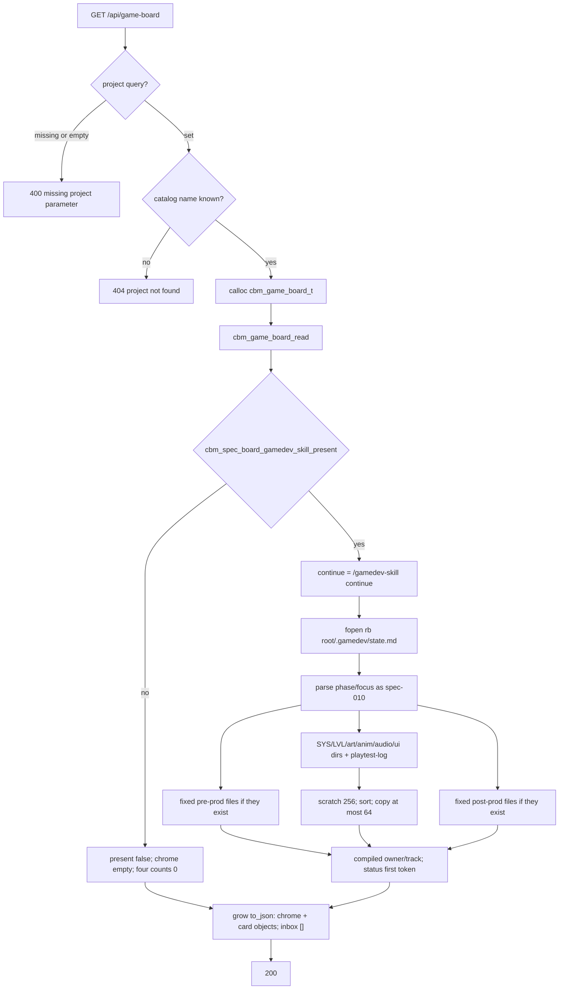

# Task #1 — C artifact walk + widen card JSON
Reading time: 2-3 min
Last updated: 2026-08-31 — spec-011-q5n-game-phase-board | Patterns: ✓

## What changed (plain language)

GET `/api/game-board` still uses the spec-010 path, 400/404 strings, and chrome keys (`phase`, `focus`, `continue`). When `.gamedev/` is a directory, the three phase arrays are no longer always empty: C walks files and folders that already exist, maps header `status:` to work-state (including `ready` → `in_progress`), and stamps owner/track from a compiled table — never from `docs/agents.md`. Inbox stays `[]` this task. Missing names do not get placeholder cards. Overflow after sort is dropped; there is no `has_more`. Specs board JSON is still gamedev-free.

This task is C and HTTP Gherkin only. Game columns, Inbox grill, clipboard, and Vitest paint are later tasks.

## Files modified

| File | What it does | Lines ± |
|---|---|---|
| `src/ui/game_board.h` | Widen `cbm_game_board_card_t`; `CBM_GAME_BOARD_LIST_MAX` 256; cap 64 unchanged | 56 (was 47; +9) |
| `src/ui/game_board.c` | Exist-only pre/prod/post walk; compiled owner/track; grow `to_json`; inbox count 0 | 805 (was 244; +561) |
| `tests/test_game_board.c` | 18 parse / walk / cap / bytes Thens; `/tmp` fixtures; agents.md ignored | 708 (was 311; +397) |
| `tests/test_httpd.c` | Breadcrumb to this spec; keep 400/404/present-false/spec-board/empty-dir/bytes | game-board block `:3880` (no new HTTP tests) |

`http_server.c` handler, `spec_board.c`, `mcp.c`, and `Makefile.cbm` were not edited this task.

## Key decisions

| Decision | Why | ADR |
|---|---|---|
| Same GET `/api/game-board`; same 400/404; no POST; no MCP | IV.3 — fill arrays on the existing path | US-005; spec-010 Task #1 |
| Widen card on the existing heap board; grow `to_json` locally | 8192 hardcoded `[]` would 500 on a real board | SDD-ADR-048 |
| Production scratch 256, sort, then copy ≤64; no `has_more` | Cap after sort so SYS-001 is kept, SYS-065 dropped | SDD-ADR-048 |
| Owner/track from compiled table only; do not fopen `agents.md` | Skill agents.md is not a closed Path→owner schema | SDD-ADR-049 |
| Exist-only walk; missing sibling is not a card | Placeholders fail the narrative-bible Then | US-002 |
| `status:` first token; `ready` → `in_progress` | bevy qa-lead uses `ready` | US-002 |
| present false → return after `memset`; do not walk phases | Empty arrays + no extra IO | US-005 |
| Inbox stays count 0 | Grill catalog + conversion is Task #2 (SDD-ADR-046/047) | Task #1 DoD |
| spec-board still has no `gamedev_skill_present` | Gamedev-free lock from spec-010 | SDD-ADR-045 |
| fopen `"rb"` only | Zero skill writes | I.2; US-006 |

SDD-ADR-050 (one-shot hook) and SDD-ADR-051 (clipboard) are later UI tasks. Not used in C this turn.

## How GET read → artifact walk → JSON works

HTTP still never `fopen`s `.gamedev/`. Walk lives in `game_board.c`. Dispatch is GET only (`http_server.c:2295-2298`). Inbox walk is not this task.

## Debugging

| If this fails | File:line | Cause | Fix |
|---|---|---|---|
| GET without `project` is not 400 | `http_server.c:533-536` | Handler edited or string drifted | `{"error":"missing project parameter"}`. Test `test_httpd.c:4003` |
| Unknown name is not 404 | `http_server.c:540-542` | Resolve skipped or string drifted | `{"error":"project not found"}`. Test `:3982` |
| `.gamedev/` missing but phase arrays fill | `game_board.c:638-640` | Walk ran when present false | `memset` then helper false → return. Test `test_game_board.c:632` / `test_httpd.c:3936` |
| gdd owner is `@analyst` because `agents.md` exists | `game_board.c:50-63`, `:254-264` | Project agents.md parsed | Compiled table only. Test `:365-378` (`@game-designer` / track `B`) |
| Missing `narrative-bible.md` still has a card | `game_board.c:410-412` | Placeholder emit | Exist-only `game_is_regular_file`. Test `:398` |
| Loose `systems/*.md` is a Production card | `game_board.c:499-505` | File treated as SYS dir | Immediate child **directories** with `SYS-` only. Test `:421` |
| SYS dir without `spec.md` omitted | `game_board.c:361-367`, `:607-611` | Required header file | Missing header → card still emitted; `work_state` `pending`. Test `:421` |
| `status: ready` stays `pending` | `game_board.c:304-307` | Token map missed `ready` | `ready` → `in_progress`. Test `:495` |
| Two `in_progress` SYS cards collapse to one | `game_board.c:598-612` | Unique-per-phase assumed | Many cards per column. Test `:456` |
| 65th SYS kept or JSON has `has_more` | `game_board.c:391-396`, `:594-612` | Cap before sort, or extra key | Sort scratch then copy 64. No `has_more`. Test `:525` |
| Inbox has epics this task | `game_board.c:633`, `:650` | Grill walk leaked into #1 | `memset` + no grill fill. Test `:595` / empty-dir `:107` |
| JSON has `column` or `has_more` | `game_board.c:708-729` | Extra keys in emit | Card keys only. Tests `:389-390` |
| spec-board has `gamedev_skill_present` | `spec_board.c:1215` | Extra key in `to_json` | Helper `:1096` unused by read/to_json. Test `test_httpd.c:3975` |
| GET 200 changed `state.md` or created `.sdd-skill/` / `.grill/` | `game_board.c:89` | Write mode or mkdir | `cbm_fopen` `"rb"` only. Tests `test_game_board.c:658` / `test_httpd.c:4024` |
| GET 500 `board serialization failed` on a full board | `game_board.c:653-681`, `:743-804` | Grow skipped; 8192 snprintf returned | Local grow buffer. Handler `:552-556` unchanged |
| MCP `game-board` tool / POST `/api/game-board` | `http_server.c:2295-2298` | New tool or POST branch | GET-only. `mcp.c` not edited |

## Project fit

- Before: spec-010 GET returns presence + chrome + four empty arrays. Game tab paints chrome only. Inbox and phase cards are not in JSON.
- After this task: same GET fills `preproduction` / `production` / `postproduction` from existing artifacts. `inbox` is still `[]`. Chrome, 400/404, and spec-board stay as spec-010. UI still does not paint columns.
- Next: Task #2 C Inbox + conversion + HTTP bytes. Task #3 GameBoardTab four columns. Task #4 clipboard / no-drag. Task #5 remaining Vitest.

## Pattern Notes

Patterns: ✓. Same GET, same 400/404 strings, same heap `calloc` as `handle_game_board_get` (`:531-560`). fopen `"rb"` + `read_whole_file` matches spec-010 / spec-008 zero-write. Dir check still reuses `cbm_spec_board_gamedev_skill_present`. Local grow `to_json` (same class as spec-board, not shared — SDD-ADR-046/048). No archive merge. No MCP tool. No POST. `spec_board.c` / `mcp.c` / `Makefile.cbm` untouched. Empty `.gamedev/` dir still emits `[]`. English phase labels stay out of C.

Constitution has I–IX only (no Section X). IX.2 still describes spec-010 empty column arrays. The filled-array sentence waits for spec close (plan note for @planner). No constitution gap this task.

Breadcrumbs on `game_board.h`, `game_board.c`, `test_game_board.c`, and `test_httpd.c` game-board block (`:3880-3885`). `http_server.c` handler (`:522-530`) still carries spec-010 breadcrumbs — that file was not this task.

## Quick refs

- Spec US-002 / US-005 (artifact half): `.sdd-skill/specs/spec-011-q5n-game-phase-board/spec.md`
- Plan artifact walk + heap: `.sdd-skill/specs/spec-011-q5n-game-phase-board/plan.md`
- ADR: SDD-ADR-048 (cap 64 / widen / grow); SDD-ADR-049 (compiled owner/track)
- Tests: `scripts/test.sh --suites game_board,httpd` (18 game_board + 95 httpd, 1 skipped)
- Constitution: I.2 (no cycle writes), II.1 (`cbm_` C11), IV.3 (same GET), V.3 (C tests), VI.2 (loopback unchanged), VII.2 (breadcrumbs), IX.2 (spec-010 chrome / gamedev-free lock)
