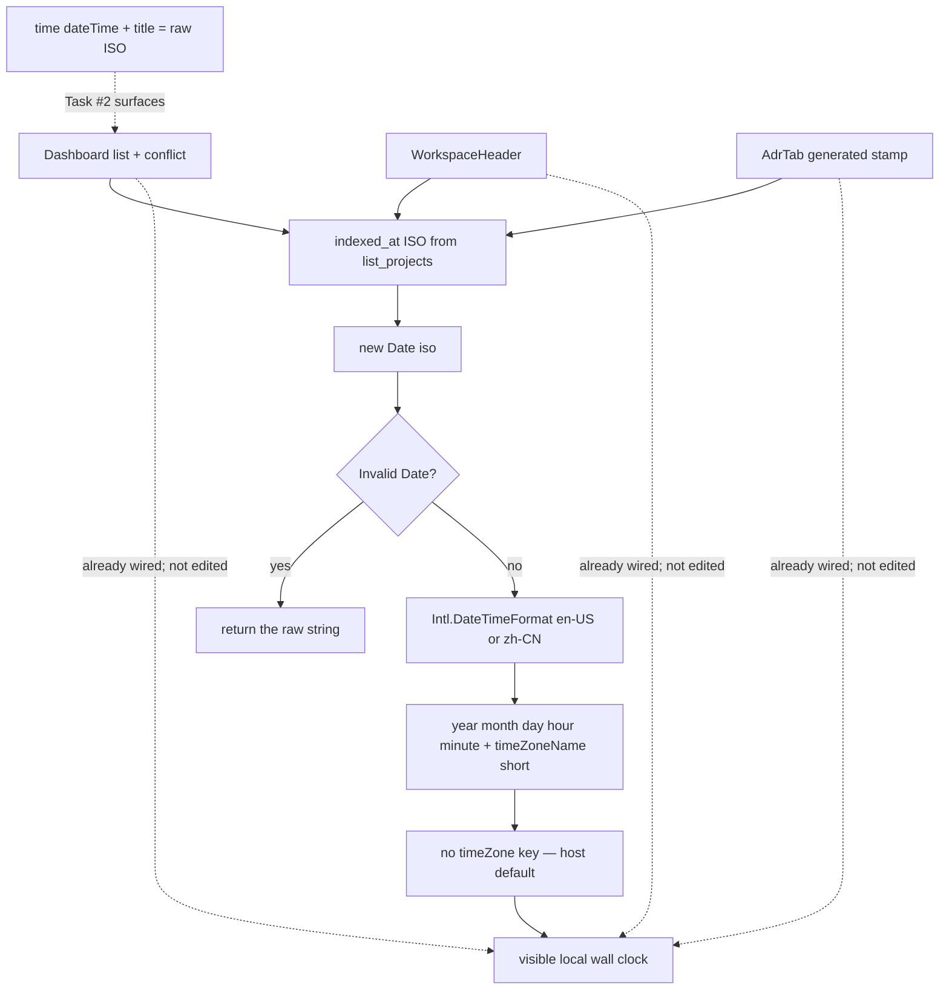

# Task #1 — Drop UTC pin in formatIndexedAt + helper oracles
Reading time: 2-3 min
Last updated: 2026-08-30 — spec-007-n6p-last-indexed-local | Patterns: ✓

## What changed (plain language)

Last-indexed text now follows the laptop clock. The shared helper still turns the stored ISO instant into a short locale string (English or Chinese, with a timezone abbreviation), but it no longer forces UTC. Hover and the hidden machine timestamp stay the raw ISO — that part is Task #2 on the screens.

This task only changed the helper and its tests. Dashboard rows, the workspace header, and the ADR generated stamp already call this function. They were not edited here.

## Files modified

| File | What it does | Lines ± |
|---|---|---|
| `graph-ui/src/lib/formatIndexedAt.ts` | `INDEXED_AT_PARTS` has no `timeZone` key; invalid still returns raw | +8 / −9 |
| `graph-ui/src/lib/formatIndexedAt.test.ts` | Same-process Intl `localFmt` vs `utcFmt` oracles | +39 / −11 |

Dashboard, WorkspaceHeader, AdrTab, C, HTTP, and i18n were not edited.

## Key decisions

| Decision | Why | ADR |
|---|---|---|
| One helper; drop `timeZone: "UTC"` only | Every surface already calls it; a second clock would drift | SDD-ADR-034 |
| Keep `timeZoneName: "short"` + `en-US` / `zh-CN` | Operator can see a zone abbreviation; lang is not a TZ pick | SDD-ADR-034 |
| Invalid / empty still returns the raw string | Corrupt list rows stay visible; no invented clock | US-001 / US-006 |
| Tests compare to Intl oracles, not a hardcoded wall clock | CI must not require `TZ=` or a pinned `"10:00 AM UTC"` string | SDD-ADR-034 |
| Host UTC: `localFmt === utcFmt` is allowed | Limit Case; pin-fail only when the two oracles differ | SDD-ADR-034 |
| `dateTime` / `title` / newest stay raw ISO | Instant contract of SDD-ADR-003 / SDD-ADR-016 unchanged | SDD-ADR-034 (display half only) |

## How the helper formats now

`localFmt` is Intl with the same parts and no `timeZone`. `utcFmt` adds `timeZone: "UTC"`. When those strings differ, the helper must match `localFmt` and must not match `utcFmt`. When the host is UTC they may be identical — that is still a pass.

## Debugging

| If this fails | File:line | Cause | Fix |
|---|---|---|---|
| Visible text equals the raw ISO on a valid instant | `formatIndexedAt.ts:26-29` | `Date` parse treated as NaN, or `INDEXED_AT_PARTS` dropped | Valid ISO must reach `:30`. Invalid/empty is supposed to return raw (`:28`). Tests `:44-47` |
| Visible text still matches `utcFmt` while host is not UTC | `formatIndexedAt.ts:16-23`, `:30` | `timeZone: "UTC"` (or any IANA zone) leaked into `INDEXED_AT_PARTS` | Options must omit `timeZone`. Test `:23-35` fails the pin only when `localFmt !== utcFmt` |
| en result !== `localFmt` | `formatIndexedAt.ts:11-14`, `:30` | Locale or parts drifted from the oracle | `en` → `en-US`, same year/month/day/hour/minute + `timeZoneName: "short"`. Test `:29-31` |
| zh result !== zh-CN local Intl | `formatIndexedAt.ts:13`, `:30` | Wrong locale or a `timeZone` key | `zh` → `zh-CN` with the same parts, no zone pin. Test `:37-42` |
| Host-UTC test fails | `formatIndexedAt.test.ts:49-60` | Required the pin-diff Then on a UTC host | When `localFmt === utcFmt`, assert the shared string. Do not require `process.env.TZ` |
| Test hardcodes `"Aug 29, 2026, 10:00 AM UTC"` | `formatIndexedAt.test.ts:13-20` | Oracle replaced by a wall-clock literal | Rebuild `localFmt` / `utcFmt` in-process from `PARTS` |
| `dateTime` / `title` show a formatted local string | Dashboard / header / AdrTab `<time>` | Surface wrote helper output into attributes | Instant stays raw `indexed_at`. Task #2 owns those asserts |
| Newest conflict pick changed | `pathGroups.ts` | Display TZ leaked into strcmp | Newest is still ISO string compare. Do not open that file for this spec |
| Stamp / row still looks UTC on a non-UTC laptop | `formatIndexedAt.ts:16-23` | Binary or helper still on SDD-ADR-003 pin | Confirm `INDEXED_AT_PARTS` has no `timeZone`. Rebuild graph-ui |

## Project fit

- Before: spec-001 pinned the helper to UTC (`UTC_PARTS` + `timeZone: "UTC"`). Operators judged freshness against UTC. QUICK-DEBUG told humans to force that pin.
- After this task: one helper, runtime timezone, short zone name kept. Invalid input still prints as-is. Surfaces already call it; their `<time dateTime>` / `title` contract is Task #2.
- Next: Task #2 tightens Dashboard, WorkspaceHeader, and AdrTab tests: visible text equals `formatIndexedAt`, attributes stay raw ISO, invalid ISO stays raw, ghost / no-marker omit `<time>`.

## Pattern Notes

Patterns: ✓. Same helper, same Intl parts, only the `timeZone` key dropped. `UTC_PARTS` renamed to `INDEXED_AT_PARTS` so the constant does not lie. No second formatter. No C/HTTP/MCP/i18n. Surfaces left wired (Dashboard `:155` / `:249`, WorkspaceHeader `:32`, AdrTab `:124`). Breadcrumbs on both edited files (SDD-ADR-034). Constitution has I–IX only (no Section X). IV.4 still: display existing `indexed_at`, do not invent a second freshness field. IX is silent on display TZ — a sentence can wait for spec close; not a defect this task.

## Quick refs

- Spec US-001 / US-006 helper: `.sdd-skill/specs/spec-007-n6p-last-indexed-local/spec.md`
- Plan helper + oracle shape: `.sdd-skill/specs/spec-007-n6p-last-indexed-local/plan.md`
- ADR: SDD-ADR-034 (display TZ); SDD-ADR-003 instant half + SDD-ADR-016 stay
- Tests: `cd graph-ui && npx vitest run src/lib/formatIndexedAt.test.ts` (4 passed)
- Constitution: II.3 (no new i18n), IV.4 (existing `indexed_at`), V.1–V.2 (Vitest + Gherkin map), VII.2 (breadcrumbs)
