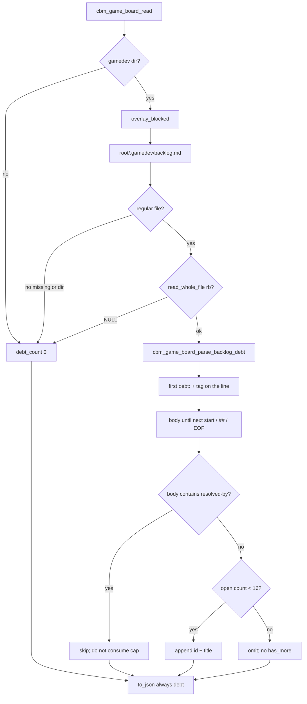

# Task #1 — game_board debt parse + additive JSON
Reading time: 2-3 min
Last updated: 2026-09-03 — spec-017-b4w-game-debt-chrome | Patterns: ✓

## What changed (plain language)

Game already maps artifacts, Inbox hide, and Blocked. Open leftover work in `.gamedev/backlog.md` (`debt:gate-*`, `debt:adopt-gap-*`, `debt:<slug>`) was invisible unless someone opened the file. This task reads that file on the same GET `/api/game-board` and always emits `debt: [{id, title}]` — only entries whose body does not contain `resolved-by`, first 16 in file order. Missing, unreadable, or a directory at that path yields `[]`. CBM never creates `backlog.md` and never writes skill trees.

This task is C only. HTTP leftover locks and the Game strip are later tasks.

## Files modified

| File | What it does | Lines |
|---|---|---|
| `src/ui/game_board.h` | `CBM_GAME_BOARD_MAX_DEBT` 16; `debt_t` id/title; `board.debt`; parse prototype | 115 |
| `src/ui/game_board.c` | `game_debt_fill` after overlay; parse `debt:` tags; `to_json` always emits `debt[]` | 2551 |
| `tests/test_game_board.c` | Comment/list/heading/resolved-by/cap/skip/missing/oversize/dir/bytes/non-card | 2446 |

HTTP, graph-ui, spec_board, MCP, and `Makefile.cbm` were not edited.

## Key decisions

| Decision | Why | ADR |
|---|---|---|
| Always emit `"debt":[]` | Gherkin `debt is []` is a present empty array; matches Specs | SDD-ADR-072 |
| Cap 16 independent of cards/blocked/Specs | Filling debt must not steal other slots | SDD-ADR-072 |
| Parse in `game_board.c`; do not call `cbm_spec_board_parse_tech_debt` | TECH_DEBT.md helper is heading Status; backlog is `debt:` lines | SDD-ADR-073 |
| Tag `[A-Za-z0-9][A-Za-z0-9_-]*`; no `.` | First `debt:` + tag on the line; `id` is the full token | SDD-ADR-073 |
| Body until next start / ATX `##` / EOF; blank lines continue | gamedev appends `resolved-by` on a later line | SDD-ADR-073 |
| Closed iff body contains `resolved-by` | Same-line or later; `Resolved-by` / `resolved_by` stay open | SDD-ADR-073 |
| Title: trim, strip `]`, strip `-->`, cut at ` — ` or ` -- ` | Owner/target after the cut are omitted | SDD-ADR-073 |
| Duplicate id: first start wins (even if closed) | Later same-id does not consume a cap slot | SDD-ADR-073 |
| Unreadable = regular file + `read_whole_file` NULL (oversize > 1 MiB) | Directory-at-path is not a regular file → `[]` | SDD-ADR-073 |

## How Game debt is filled

Live GET already includes `debt` because fill runs inside `cbm_game_board_read` before `to_json`. HTTP still does not fopen `backlog.md` (Task #2 lock). The Game strip is Task #3.

## Debugging

| If this fails | File:line | Cause | Fix |
|---|---|---|---|
| Open comment stays `debt: []` | `game_board.c:2034-2058`, `:2253-2268` | Tag charset / path not regular / fopen failed | First `debt:` + `[A-Za-z0-9][A-Za-z0-9_-]*`. Test `test_game_board.c` `game_board_debt_open_comment` |
| Title still has director / M1 / `-->` | `game_board.c` `game_debt_title_from_after` | Cut order wrong | Trim → strip `]` → strip `-->` → cut ` — ` or ` -- `. Test open-comment title `missing GDD lock` |
| List `- debt:save-slot` missing | `game_board.c:2034` | Only headings scanned | Any line. Test `game_board_debt_list_item_open` |
| Following-line `resolved-by` still listed | `game_board.c:2198-2214` | Blank line ended the body | Body continues. Tests following-line + blank-line |
| Same-line `resolved-by` still listed | `game_board.c` mem_contains on start line | Only later lines scanned | Whole body including start line |
| `design` / `tech` rows appear | `game_board.c:2043` | Prefix not required | Token is `debt:` only. Test design/tech omit |
| `## debt:adopt-gap-audio` missing | `game_board.c:2063` | Heading treated as ender of itself | Start line is not an ender for its own body. Test heading |
| Bare `debt:` became an entry | `game_board.c:2048` | Empty tag accepted | Need a tag first char. Test bare-colon |
| 17th open listed / `has_more` | `game_board.c:2238`, `:2542` | Cap or overflow field | Stop at 16; never emit `has_more`. Test `game_board_debt_17th_open_omitted_no_has_more` |
| Second same-id overwrote the first | `game_board.c:2232` | Last-wins leaked from registry | First start wins. Later skipped |
| `backlog.md` is an Inbox/phase card | `game_board.c:1266` | Added to `fill_artifacts` | Keep non-card. Test `game_board_debt_backlog_is_not_a_card` |
| Registry leftover reappeared | `game_board.c` fill_inbox | Hide order changed | `debt_fill` after overlay only. Test inbox hide + debt |
| Missing file created `backlog.md` | `game_board.c:2253` | Write leaked | fopen rb via `read_whole_file` only. Test missing + leftover bytes |
| Oversize file parsed as open debt | `game_board.c:100`, `:2263` | Size > 1 MiB still read | `read_whole_file` NULL → count 0. Test oversize |
| Directory at `backlog.md` parsed | `game_board.c:685`, `:2260` | Treated as regular file | Not regular → 0. Test directory-at-path |
| Specs `debt[]` changed | `spec_board.c` | Called TECH_DEBT helper | Do not call `cbm_spec_board_parse_tech_debt` |

## Project fit

- Before: GET `/api/game-board` had blocked + four columns. Operators had to open `backlog.md` to see leftover `debt:*`.
- After this task: the same GET always has `debt[{id,title}]`. Empty when the file is missing, unreadable, a directory, or every entry is closed. Inbox hide and Specs TECH_DEBT.md parse are untouched.
- Next: Task #2 HTTP GET/POST leftover (no backlog fopen in HTTP; bytes identical). Task #3 GameBoardTab strip after BlockedStrip.

## Pattern Notes

Patterns: ✓. Same `cbm_fopen` `"rb"` + `read_whole_file` + `game_is_regular_file` as registry (spec-016) and Specs debt (spec-015). Same always-emit empty array (SDD-ADR-065 / 072). Own cap 16 next to blocked 16 / spec-board 16. Parse stays in `game_board.c` (do not import spec_board debt types). Unreadable regular file is 0 rows. Did not emit `has_more`, owner, target, or severity. Did not put `backlog.md` on a card array. Did not touch HTTP, spec_board, graph-ui, or Makefile.cbm. Breadcrumbs on `game_board.h`, `game_board.c`, `test_game_board.c`.

Constitution has I–IX only (no Section X). IX.2 does not mention Game backlog debt yet — true; this is spec-017 reader only. Same-GET additive is locked by SDD-ADR-072. No constitution gap this task (IX sentence waits for spec close).

## Quick refs

- Spec US-001 / US-002 / US-003 / US-004 (reader): `.sdd-skill/specs/spec-017-b4w-game-debt-chrome/spec.md`
- Plan parse + JSON: `.sdd-skill/specs/spec-017-b4w-game-debt-chrome/plan.md`
- ADR: SDD-ADR-072 (always-emit cap 16); SDD-ADR-073 (local parse, no spec_board helper)
- Tests: `make -f Makefile.cbm test-focused TEST_SUITES=game_board` (74 passed)
- Constitution: I.2 (no cycle writes), II.1 (`cbm_` C11), IV.3 (existing GET), V.3 (C tests), VI (fixed join path), VII.2 (breadcrumbs), IX.2 (spec-016 hide + spec-015 Specs debt locked)
