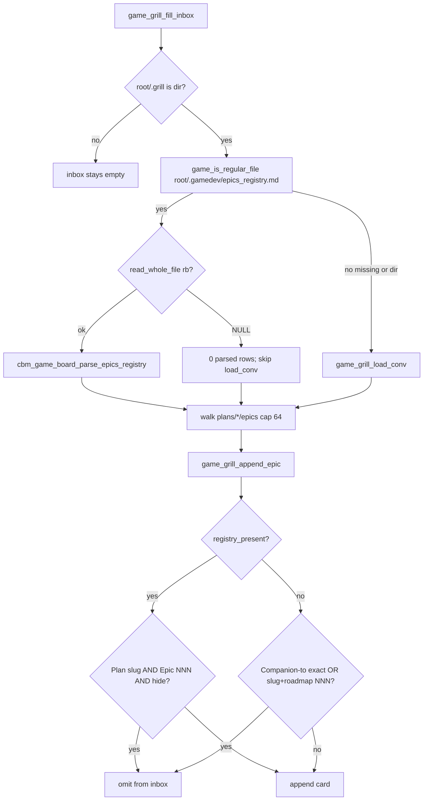

# Task #1 — game_board registry parse + hide predicate
Reading time: 2-3 min
Last updated: 2026-09-02 — spec-016-d9v-game-inbox-registry | Patterns: ✓

## What changed (plain language)

Game Inbox still lists leftover grill epics on the same GET. When `{project}/.gamedev/epics_registry.md` exists as a regular file, hide comes only from that table: Plan cell equals the grill plan folder name and Epic cell is the same number as `epic-NNN-*.md`, and Status is `in_progress`, `closed`, or `parked`. Companion-to and roadmap must not also hide, even if the registry is empty, header-only, or unreadable. When the file is missing or is a directory, the older Companion-to / roadmap hide stays. CBM never creates the registry file and never writes skill trees.

This task is C only. HTTP leftover locks and Inbox path wrap are later tasks.

## Files modified

| File | What it does | Lines |
|---|---|---|
| `src/ui/game_board.h` | `CBM_GAME_BOARD_MAX_REGISTRY` 256; `registry_row_t` slug/nnn/hide; parse prototype | 104 |
| `src/ui/game_board.c` | Regular-file present check; skip `load_conv` when present; parse + registry hide; absent = spec-011 | 2276 |
| `tests/test_game_board.c` | Buffer parse + present/absent/last-wins/NNN/slug/unreadable/malformed/bytes; keep-green cap 64 | 1968 |

HTTP, graph-ui, spec_board, MCP, and `Makefile.cbm` were not edited.

## Key decisions

| Decision | Why | ADR |
|---|---|---|
| Present = `game_is_regular_file` only; directory = absent | A dir at that name must not turn prior hide off | SDD-ADR-069 |
| Present → skip `game_grill_load_conv`; hide via registry only | Companion-to/roadmap must not leak when the file exists | SDD-ADR-069 |
| Absent → existing `game_grill_epic_converted` | Older games without the file keep spec-011 | SDD-ADR-069 |
| GFM cells[1]=Epic, [2]=Plan, [5]=Status; n < 6 skip | Leading-pipe dummy is cells[0]; Origin unused but must exist so Status stays at 5 | SDD-ADR-070 |
| Last Plan+NNN row wins; cap 256 unique pairs | Later Status is the live one; extra unique rows omitted | SDD-ADR-070 |
| Epic: trim, optional `epic-`, then all digits → int; `native` skip | `001` / `1` / `epic-001` hide the same leftover; path leftovers do not match | SDD-ADR-070 |
| Hide-set exact `in_progress`/`closed`/`parked`; Epic 0 never hide | `not_started`, typo, evergreen stay visible | SDD-ADR-070 |
| Unreadable regular file = present, 0 rows | Oversize > 1 MiB is present; GET-equivalent read stays 200 | SDD-ADR-069 |

## How Inbox hide chooses a source

Live GET already omits hidden ids because hide happens inside `cbm_game_board_read` before `to_json`. HTTP still does not fopen the registry (Task #2 lock). InboxCard wrap is Task #3.

## Debugging

| If this fails | File:line | Cause | Fix |
|---|---|---|---|
| Leftover still hidden though registry exists and has no matching row | `game_board.c:1948-1961`, `:1888-1893` | `load_conv` still ran, or present check used `is_dir` | Present = regular file only (`:685-687`). When present, do not call `load_conv`. Test `test_game_board.c:1635` |
| Header-only registry still hides via roadmap | `game_board.c:1950-1955` | Empty file treated as absent | Empty regular file is present, 0 rows. Test `:1653` |
| `in_progress` card still in inbox | `game_board.c:1465-1469`, `:1857-1863` | Status cell not cells[5] or n < 6 | GFM dummy is cells[0]. Test `:1547` |
| `not_started` omitted | `game_board.c:1467-1469` | Hide-set too wide | Only `in_progress`/`closed`/`parked`. Test `:1590` |
| Later `not_started` still omitted after earlier `closed` | `game_board.c:1470-1472` | First row kept | Last Plan+NNN overwrites hide. Tests `:1676` / `:1695` |
| `1` or `epic-001` does not hide NNN 1 | `game_board.c:1391-1417` | Prefix case-fold or leftover suffix accepted/rejected wrong | Optional exact `epic-` then all digits. Tests `:1715` / `:1731` |
| Plan `.grill/plans/inbox-plan` hid the leftover | `game_board.c:1465-1466`, `:1857-1859` | Basename match | Exact slug `strcmp`. Test `:1747` |
| Plan `native` hid a grill card | `game_board.c:1466` | native stored as a slug | Skip that row. Test `:1833` |
| Epic 0 / evergreen hid epic-001 | `game_board.c:1467` | NNN 0 stored as hide | `nnn != 0` required for hide. Test `:1799` |
| Typo `closd` omitted the card | `game_board.c:1467-1469` | Prefix / case-fold | Exact tokens only. Test `:1816` |
| Unreadable oversize file hid via Companion-to | `game_board.c:1950-1955`, `:100` | Treated as absent | Regular file + `read_whole_file` NULL → 0 rows, still present. Test `:1850` |
| `n/a` Epic hid epic-001 | `game_board.c:1465` | Unparseable row stored | Skip; keep well-formed parked. Test `:1890` |
| Registry / epic.md bytes changed | `game_board.c` fopen `"rb"` | Write mode leaked | Read-only. Test `:1547` (`:1578-1579`) |
| 65th leftover listed / `has_more` when file absent | `game_board.c:1878-1879` | Cap or overflow field | Cap 64; no `has_more`. Test `:1765` |
| File absent no longer hides Companion-to | `game_board.c:1892-1893` | Absent branch skipped | Keep `game_grill_epic_converted`. Test `:814` |
| File absent no longer hides roadmap slug+NNN | `game_board.c:1849-1854` | Roadmap matcher rewritten | Unchanged. Test `:858` |

## Project fit

- Before: Inbox hid a grill epic when a Game artifact had an exact Companion-to path or when roadmap slug+NNN matched. Games with `epics_registry.md` still showed leftovers `@director` already marked in_progress / closed / parked.
- After this task: if the registry is a regular file, it is the only hide source. If it is missing or a directory, spec-011 hide stays. Walk and cap 64 stay. JSON shape unchanged (omit from `inbox[]`).
- Next: Task #2 HTTP GET leftover locks (same GET; no registry fopen in HTTP; spec-board must not read the registry). Task #3 InboxCard wrap.

## Pattern Notes

Patterns: ✓. Same `cbm_fopen` `"rb"` + `read_whole_file` as spec-011 inbox / spec-015 debt. Same server-side omit from an existing GET array (not a new key or route, IV.3). Present uses existing `game_is_regular_file`. Parse stays in `game_board.c` (do not import spec_board). Unreadable regular file is 0 rows, same degrade as oversize TECH_DEBT.md. Own cap 256 unique Plan+NNN next to inbox cap 64; last-wins overwrite does not consume a new slot. Conversion matcher kept for the absent branch only. Did not emit `has_more` or a registry JSON key. Did not touch HTTP, spec_board, graph-ui, or Makefile.cbm. Breadcrumbs on `game_board.h`, `game_board.c`, `test_game_board.c`.

Constitution has I–IX only (no Section X). IX.2 does not mention Game registry hide yet — true; this is spec-016 reader only. Same-GET omit is locked by SDD-ADR-069. No constitution gap this task (IX sentence waits for spec close).

## Quick refs

- Spec US-001 / US-002 / US-003 / US-004 / US-005 (walk/cap): `.sdd-skill/specs/spec-016-d9v-game-inbox-registry/spec.md`
- Plan parse + hide: `.sdd-skill/specs/spec-016-d9v-game-inbox-registry/plan.md`
- ADR: SDD-ADR-069 (registry sole hide when regular file present); SDD-ADR-070 (last-wins, integer NNN, exact slug)
- Tests: `make -f Makefile.cbm test-focused TEST_SUITES=game_board` (56 passed)
- Constitution: I.2 (no cycle writes), II.1 (`cbm_` C11), IV.3 (existing GET), V.3 (C tests), VI (fixed join path), VII.2 (breadcrumbs), IX.2 (spec-011 walk/cap + omit pattern)
