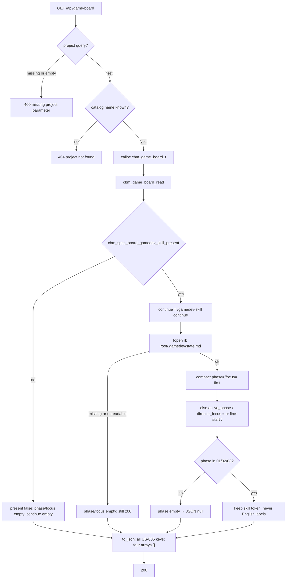

# Task #1 — C/HTTP GET /api/game-board contract
Reading time: 2-3 min
Last updated: 2026-08-31 — spec-010-c4h-game-tab-silent-win | Patterns: ✓

## What changed (plain language)

A known project now has a second read-only board URL: GET `/api/game-board?project=`. If the folder has a `.gamedev/` directory, the body says present and (when `state.md` parses) returns the skill phase token, the focus line, and `/gamedev-skill continue`. If that directory is missing, the same URL is still 200 with present false and an empty continue string. Four column arrays are always there and always empty. Specs board JSON is unchanged — it still has no `gamedev_skill_present` field.

This task is C and HTTP only. There is no Game tab, no POST, and no MCP tool yet. Tasks #2–#5 own the strip, chrome, and silent-win UI.

## Files modified

| File | What it does | Lines ± |
|---|---|---|
| `src/ui/game_board.h` | `cbm_game_board_t` + `CBM_GAME_BOARD_MAX_CARDS` 64; read / to_json | NEW 47 |
| `src/ui/game_board.c` | dir reuse; fopen `"rb"` `state.md`; compact then aliases; empty arrays | NEW 244 |
| `tests/test_game_board.c` | 9 parse / present / bytes / null-phase Thens; `/tmp` fixtures | NEW 311 |
| `Makefile.cbm` | `UI_SRCS` += `game_board.c`; `TEST_UI_SRCS` += `test_game_board.c` | this task +2 (`game_board` lines). vs HEAD +14/−5 (prior specs also uncommitted) |
| `src/ui/http_server.c` | `handle_game_board_get` + GET-only dispatch; same 400/404 strings; heap calloc | this task +~45 (include `:21`, handler `:531-560`, dispatch `:2295-2298`). vs HEAD +367/−14 |
| `tests/test_httpd.c` | 5 HTTP Gherkin: 200 empty arrays, spec-board no gamedev key, 404, 400, bytes | this task +~160 (`:3880-4034` + `RUN_TEST` `:4157-4161`). vs HEAD +1861/−5 |

Those three edited files vs HEAD are +2242/−24 together (includes earlier uncommitted specs). `spec_board.c` read/to_json and `mcp.c` were not part of this task.

## Key decisions

| Decision | Why | ADR |
|---|---|---|
| New GET `/api/game-board`, not a key on spec-board | spec-board gamedev-free lock; IV.3 allows a new path when the current contract cannot meet the spec | SDD-ADR-045; constitution IV.3 |
| Dedicated heap `cbm_game_board_t` with empty column slots | Epic 002 fills the same struct and URL; a thin sprintf builder would be ripped | SDD-ADR-045 |
| Reuse `cbm_spec_board_gamedev_skill_present` | One dir rule (`root/.gamedev` is a directory). Do not invent a second stat | SDD-ADR-045 |
| Parse compact `phase=` / `focus=` first; tolerate `active_phase` / `director_focus` (`=` or line-start `:`) | Skill 1.7.0+ and bevy-tetris are compact; pre-1.7.0 leftovers are not migrated by `/gamedev-skill update` | SDD-ADR-044 |
| Unknown phase token → JSON `null`, not 500 | Chrome degrades; GET must still be 200 | SDD-ADR-044 |
| present false → `continue` `""`; present true → `/gamedev-skill continue` even if `state.md` is missing | Continue is a display string, not a launcher | US-005; SDD-ADR-044 |
| No POST, no MCP tool, fopen `"rb"` only | Zero skill writes; CBM is not the writer | I.2; US-006 |

## How GET /api/game-board read → parse → JSON works

HTTP never `fopen`s `.gamedev/`. Parse lives in `game_board.c`. Dispatch is GET only (`http_server.c:2295-2298`). Other methods on this path fall through (no 405, no POST handler).

## Debugging

| If this fails | File:line | Cause | Fix |
|---|---|---|---|
| GET without `project` is not 400 | `http_server.c:533-536` | Different string or 200 empty board | `{"error":"missing project parameter"}` — same as spec-board `:492`. Test `test_httpd.c:3978` |
| Unknown name is not 404 | `http_server.c:540-542` | Resolve skipped or string drifted | `{"error":"project not found"}` — same as spec-board `:498`. Test `:3957` |
| `.gamedev/` missing but `continue` is set | `game_board.c:189-191` | Return after present skipped | `memset` then helper false → return. JSON `"continue":""` `:236-238`. Test `test_game_board.c:76` |
| Empty `.gamedev/` is present false | `game_board.c:189`; `spec_board.c:1096-1102` | Helper required `state.md` | Dir only (`cbm_is_dir`). Continue still set. Test `test_game_board.c:106` |
| `phase=99-unknown` is 500 or a string | `game_board.c:25-28`, `:172-174`, `:220-223` | Token check skipped or treated fatal | Clear phase → JSON `null`. Focus still kept. Test `:228` |
| Compact lost to `active_phase` / `director_focus` | `game_board.c:154-166` | Alias ran first or compact ignored | Compact wins when both exist. Tests `:170` / `:190` / `:208` |
| English `"Production"` in JSON | `game_board.c:235-238` | Label mapped in C | Token only. Labels are later UI. Test `:137` (`:163`) |
| GET spec-board has `gamedev_skill_present` | `spec_board.c:1215` | Extra key in `to_json` | Helper `:1096` is not called from read/to_json. Test `test_httpd.c:3936` |
| `state.md` / missing `.sdd-skill/` / `.grill/` bytes changed | `game_board.c:32`, `:195-201` | Write mode or mkdir leaked | `cbm_fopen` `"rb"` only. Handler `:550-558` does not write. Tests `test_game_board.c:270` / `test_httpd.c:3999` |
| Column arrays omitted or non-empty | `game_board.c:235-238` | Keys dropped or counts filled | Always `[]`. Cap 64 unused this spec. Tests `test_game_board.c:66-73` / `test_httpd.c:3910` |
| GET 500 `out of memory` / `board serialization failed` | `http_server.c:545-556` | calloc or `to_json` NULL | Same class as spec-board `:503-515`. Heap only, never stack |
| MCP `game-board` tool / POST `/api/game-board` | `http_server.c:2295-2298` | New tool or POST branch | GET-only match. `mcp.c` has no game-board symbol |

## Project fit

- Before: workspace strip is Graph / Specs? / ADR. Specs present is spec-board 200 AND (sdd OR grill). `.gamedev/` is invisible on HTTP except the unused `/api/skill-presence` helper. graph-ui does not call that URL.
- After this task: GET `/api/game-board` returns presence + chrome + empty arrays. spec-board stays gamedev-free. Skill trees are byte-identical after 200. No Game tab yet.
- Next: Task #2 TabId / route kernels / strip / i18n. Task #3 GameBoardTab chrome. Task #4 App silent-win + dual fetch + deep-links. Task #5 remaining Vitest Gherkin.

## Pattern Notes

Patterns: ✓. Same 400/404 strings and heap `calloc` as `handle_spec_board_get` (`:488-518`). Same 500 class (`out of memory` / `board serialization failed`). fopen `"rb"` + `read_whole_file` matches spec-005/008 zero-write. Dir check reuses `cbm_spec_board_gamedev_skill_present` (no second `.gamedev` stat). New path is required by IV.3 + the gamedev-free lock (SDD-ADR-045) — not a second way to solve spec-board. No archive merge (game-board has no store flags). No MCP tool. No POST. Arrays always `[]`. English phase labels stay out of C.

Constitution has I–IX only (no Section X). IX.2 still describes spec-009 Specs = sdd OR grill. The AND NOT gamedev sentence waits for spec close (plan note for @planner). No constitution gap this task.

Breadcrumbs on `game_board.h`, `game_board.c`, `test_game_board.c`, `http_server.c` handler (`:522-530`), and `test_httpd.c` game-board block (`:3880-3885`). `Makefile.cbm` has no `@sdd-*` header (build file; this-task edit is two source list lines). File-top `http_server.c` comment is still generic `/api/...` — handler block is the breadcrumb.

## Quick refs

- Spec US-005 / US-006 (C/HTTP): `.sdd-skill/specs/spec-010-c4h-game-tab-silent-win/spec.md`
- Plan API + parse + heap: `.sdd-skill/specs/spec-010-c4h-game-tab-silent-win/plan.md`
- ADR: SDD-ADR-044 (compact keys + aliases); SDD-ADR-045 (dedicated struct + new GET)
- Tests: `make -f Makefile.cbm test-focused TEST_SUITES="game_board httpd"` (103 passed, 1 skipped)
- Constitution: I.2 (no cycle writes), II.1 (`cbm_` C11), IV.3 (new path required), V.3 (C tests), VI.2 (loopback unchanged), VII.2 (breadcrumbs), IX.3 (Enter Graph is later UI)
