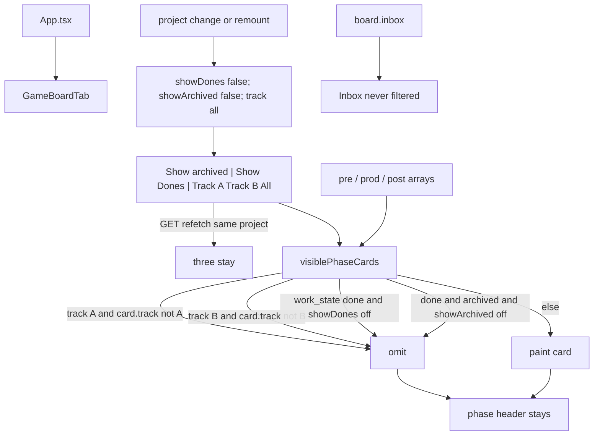

# Task #1 — i18n, chrome cluster, predicate, invert first-paint dones
Reading time: 2-3 min
Last updated: 2026-09-01 — spec-014-x7m-filters | Path=full | Patterns: ✓

## What changed (plain language)

On Game, finished artifacts no longer sit next to active work on first visit. Show Dones lives in the same chrome row as Show archived, with a pipe between them. A Track A / Track B / All group sits after a second pipe. All five controls are buttons. First paint: Show Dones off, Show archived off, All on.

Phase columns hide every `done` card until Show Dones is pressed. An archived done card still needs both toggles (AND). Inbox is not filtered. Switching project or remounting starts those three controls at the defaults again. There is no remembered preference and no new HTTP.

## Files modified

`SpecBoardTab.tsx` / `useGameBoard.ts` / `App.tsx` / `types.ts` / C were not this task. Track A/B AND leftover Gherkin and the Specs lock stay Task #2.

| File | What it does | Lines ± |
|---|---|---|
| `graph-ui/src/lib/i18n.ts` | `gameBoard.showDones` / `trackA` / `trackB` / `trackAll` en+zh; keep `specBoard.showArchived` | 330. en `:130-133`; zh `:252-255`; no `gameBoard.showArchived` |
| `graph-ui/src/lib/i18n.test.ts` | Lock English names + zh + showArchived stays on specBoard | 125. Locks `:111-122` |
| `graph-ui/src/components/GameBoardTab.tsx` | Chrome cluster; `visiblePhaseCards`; reset `showDones` + `trackFilter` with Show archived | 515 (was 455). Predicate `:65-79`; state `:393-404`; chrome `:445-488`; Inbox `:498-499` |
| `graph-ui/src/components/GameBoardTab.test.tsx` | First-paint / Show Dones Gherkin + invert spec-012 unarchived-done first paint | 1699 (was 1515). Invert labels `:772`; Archive `:1235`; first paint `:1524`; reveal `:1582`; leftover pending `:1614`; remount `:1638`; Show Dones alone `:1669` |

## Key decisions

| Decision | Why | ADR |
|---|---|---|
| React state on GameBoardTab; no GET query / localStorage / URL | Same lifetime as Show archived; all Thens are paint/aria | SDD-ADR-062 |
| Hide `work_state==="done"` unless Show Dones; archived done also needs Show archived | spec-012 Show archived alone leaked finished archived work | SDD-ADR-063 |
| Five `aria-pressed` buttons; Track exclusive in onClick; two `aria-hidden` `\|` spans | Gherkin finds names + `aria-pressed`; radiogroup would fail | SDD-ADR-064 |
| Keep `t.specBoard.showArchived`; do not add `gameBoard.showArchived` | SDD-ADR-057 already owns that copy | SDD-ADR-064 |
| Reset `showDones` + `trackFilter` in the existing `lastProjectRef` block | Same remount / `?project=` rule as expand + Show archived | SDD-ADR-062; spec-012 SDD-ADR-054 |
| Invert first-paint tests that expected an unarchived done card | Suite would go red when the predicate landed | tasks.md Task #1; SDD-ADR-063 |
| Same `text-[10px]` pressed/unpressed tokens via `chromeFilterClass` | Same chrome as Show archived; no new CSS | II.2, III.1 |

## How chrome and visiblePhaseCards run

Empty filtered phase = header only. Show Dones stays in pane chrome. Inbox never calls `visiblePhaseCards`.

## Debugging

| If this fails | File:line | Cause | Fix |
|---|---|---|---|
| Done artifacts paint on first Game visit | `GameBoardTab.tsx:394`, `:65-79` | `showDones` defaulted true, or predicate still spec-012 | `useState(false)`. Drop done when `!showDones`. Test `:1524` |
| SYS-003-done missing after invert | `GameBoardTab.test.tsx:772`, `:798` | Test still asserts Done on first paint | Click Show Dones before `SYS-003-done` |
| Archive test finds no card to expand | `GameBoardTab.test.tsx:1235`, `:1255` | Unarchived done is hidden on first paint | Press Show Dones, then expand + Archive |
| Archived done leaks with Show Dones only | `GameBoardTab.tsx:74-76` | AND missed | Drop done+archived when `!showArchived`. Test `:1669` |
| Archived done leaks with Show archived only | `GameBoardTab.tsx:74-75`; test `:1275` | Show archived treated as enough | Show Dones must also be pressed. Task #2 owns the named Error Gherkin |
| All not pressed / Track A+B both pressed | `GameBoardTab.tsx:395`, `:464-487` | Radiogroup or toggle instead of exclusive set | `trackFilter` default `"all"`; onClick sets `"A"` / `"B"` / `"all"`. Test `:1524` |
| Remount / project change keeps Show Dones or Track A | `GameBoardTab.tsx:398-403` | New state leaked or localStorage added | Reset in `lastProjectRef` with expand + Show archived. Test `:1638` / `:1486` |
| GET refetch resets the three controls | `GameBoardTab.tsx:398-403` | New `board` treated as remount | Reset only when `project` changes. Test `:1486` |
| Inbox card disappeared under Show Dones / Track | `GameBoardTab.tsx:498-499` | Inbox passed through `visiblePhaseCards` | Inbox uses `board.inbox`. Test `:1578` |
| Show Dones / Track sit in Inbox or a fifth column | `GameBoardTab.tsx:445-488` | Controls mounted inside `PhaseColumn` | Chrome row `self-start` under phase/focus/continue. Test `:1576-1579` |
| Show Dones EN / Track labels drifted | `i18n.ts:130-133`, `:252-255` | Copy edited or `gameBoard.showArchived` added | EN "Show Dones" / "Track A" / "Track B" / "All". Test `i18n.test.ts:111-122` |
| `\|` joins an accessible name | `GameBoardTab.tsx:454`, `:463` | Separator is not `aria-hidden` | Two `\|`. Test `:1576` |

## Project fit

- Before: spec-012 Show archived hid only archived dones. Unarchived dones painted. One chrome button. No track filter.
- After this task: first paint hides dones; chrome cluster + predicate + remount reset land. Track click behavior and leftover AND Gherkin named in Task #2 still pending.
- Next: @review then @tester. Task #2 remains. Trigger A (NOT closeprep).

## Pattern Notes

Patterns: ✓.

- Session Show Dones / Track / Show archived like Specs (`SpecBoardTab.tsx:292`, `:298-303`) and spec-012 Game chrome: `useState` defaults, reset with `expandedIds` on `?project=` / remount, no localStorage. GET refetch does not reset.
- Chrome tokens `text-[10px]` + `text-foreground/35` / `/70` (`chromeFilterClass`). Same as Specs Show archived (`SpecBoardTab.tsx:248-251`). No new CSS (II.2, III.1).
- `aria-pressed` buttons, not radiogroup (VII.1; SDD-ADR-064). Exclusive Track is onClick, not a second control role.
- i18n in `graph-ui/src/lib/i18n.ts` en+zh (II.3). Reuse `specBoard.showArchived` (SDD-ADR-057). New keys only for Show Dones + Track.
- Inbox never filtered (spec-012 leftover; Specs never filters Todo). Helper stays in GameBoardTab.tsx (no new module).
- Prefer existing GET/POST (IV.3). No query params. Vitest + fetch mock (V.1/V.4). Breadcrumbs on the four edited files (VII.2).

Constitution has I–IX only (no Section X). IX.2 still describes spec-012 hide done+archived unless Show archived — true until close appends this spec. Not a gap this task.

## Quick refs

- Spec US-001 / US-003 (chrome + default All) / US-004 (reset half): `.sdd-skill/specs/spec-014-x7m-filters/spec.md`
- Plan predicate + chrome: same folder `plan.md`
- ADR: SDD-ADR-062 (client filter only); SDD-ADR-063 (AND hide); SDD-ADR-064 (aria-pressed trio + i18n split)
- Tests: `cd graph-ui && npx vitest run` → 265 passed
- Constitution: II.2–3, III.1–2, IV.3, V.1/V.4, VII.1–2, IX.2 (Show archived session; first-paint hide supersedes at close)
