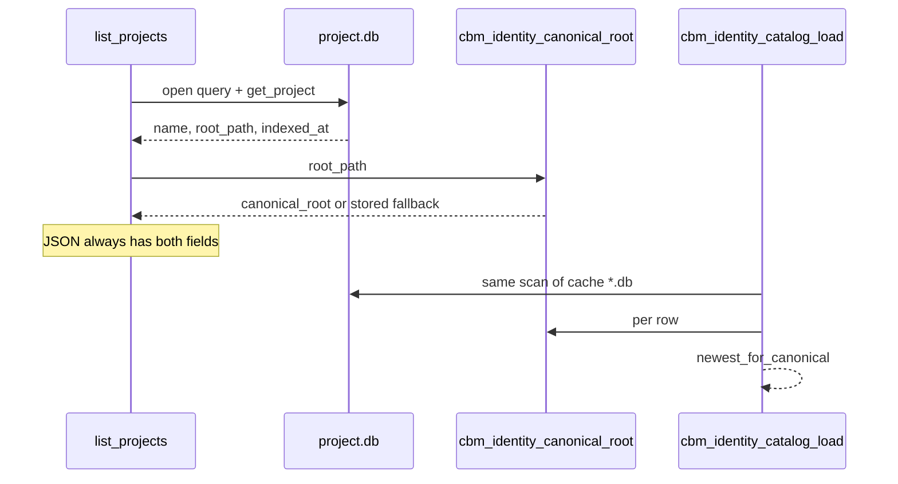

# Task #1 — Identity catalog + list_projects fields
Reading time: 2-3 min
Last updated: 2026-08-29 — spec-003-h7q-path-project-identity | Patterns: ✓

## What changed (plain language)

Each indexed folder lives in its own cache database file, named after the project. There is still no single table that says “this folder path may appear only once.” This task builds a shared catalog: open those files, read name / folder / last-indexed time, and compute a canonical folder path (resolved shortcuts and trailing slashes).

The project list API now always includes last-indexed time and that canonical path, even on the lean metadata-only call. The UI type accepts `canonical_root`. Create-vs-reindex blocking is Task #2 — not here.

## Files modified

| File | What it does | Lines ± |
|---|---|---|
| `src/foundation/identity.h` | Catalog entry + newest / canonical helpers | +43 |
| `src/foundation/identity.c` | `cbm_canonical_path` or stored fallback; strcmp newest/tie | +66 |
| `src/store/identity_catalog.c` | Scan cache `*.db`; skip ghosts / `_` / `::missed` | +151 |
| `src/mcp/mcp.c` | `list_projects` emits `indexed_at` + `canonical_root` always | +12 |
| `tests/test_identity.c` | Newest, tie, slash, symlink, missing path, list JSON | +251 |
| `graph-ui/src/lib/types.ts` | `Project.canonical_root?: string` | +3 |
| `Makefile.cbm` / `tests/test_main.c` | Wire identity sources + suite | +6 |

## Key decisions

| Decision | Why | ADR |
|---|---|---|
| No UNIQUE on `root_path` | Each project is its own `.db` | SDD-ADR-014 |
| Catalog scan, not a new table | Same discovery as `list_projects` | SDD-ADR-016 |
| Store I/O in `identity_catalog.c` | Foundation-only link must not pull SQLite | layering |
| Display `root_path` unchanged | UI shows what was stored; group key is `canonical_root` | SDD-ADR-016 |
| Newest = strcmp time, then name | ISO-8601 strings sort; tie → `beta` > `alpha` | spec US-001 |

## How list + catalog relate

## Debugging

| If this fails | File:line | Cause | Fix |
|---|---|---|---|
| Two clones have different `canonical_root` | `identity.c:20` | Path missing on disk; each stored string kept | Create the folder or accept fallback until Task #3 groups on whatever the server sent |
| Newest is the older name | `identity.c:36` | Times equal; greater `name` wins | Check `indexed_at` strings; tie is `strcmp(name)` |
| Catalog empty but `.db` exists | `identity_catalog.c:73` | Filename `_*.db`, unreadable, or no primary `projects` row | Internal name with `::` is shadow-only; need one primary name |
| List JSON missing `indexed_at` | `mcp.c:2545` | Old daemon binary | Rebuild; fields are not `metadata_only`-gated |
| UI `root_path` lost the trailing slash | `mcp.c:2541` | Display path rewritten | Must stay stored value; only `canonical_root` is resolved |
| `make test-foundation` misses catalog | `identity_catalog.c` | Catalog links store | Use `scripts/test.sh --suites identity` |

## Project fit

- Before: `list_projects` had `root_path` but not a guaranteed `indexed_at` / `canonical_root` on every row. Newest and Dashboard conflict grouping could not be honest.
- After: C helpers + list fields exist. HTTP 409 and Reindex are not implemented.
- Next: Task #2 admit create vs reindex (HTTP + MCP + in-flight jobs). Task #3 Dashboard groups can start after #1 (parallel with #2).

## Quick refs

- Spec US-001 / US-004: `.sdd-skill/specs/spec-003-h7q-path-project-identity/spec.md`
- Plan: `.sdd-skill/specs/spec-003-h7q-path-project-identity/plan.md`
- ADR: SDD-ADR-014, SDD-ADR-016
- Tests: `scripts/test.sh --suites identity`
- Constitution: II.1 (`cbm_` C11), IV.4 (`indexed_at` already the freshness field), VII.2 breadcrumbs. IV.1 still says Path uniqueness is out of spec-001 (draft; update at spec close).
