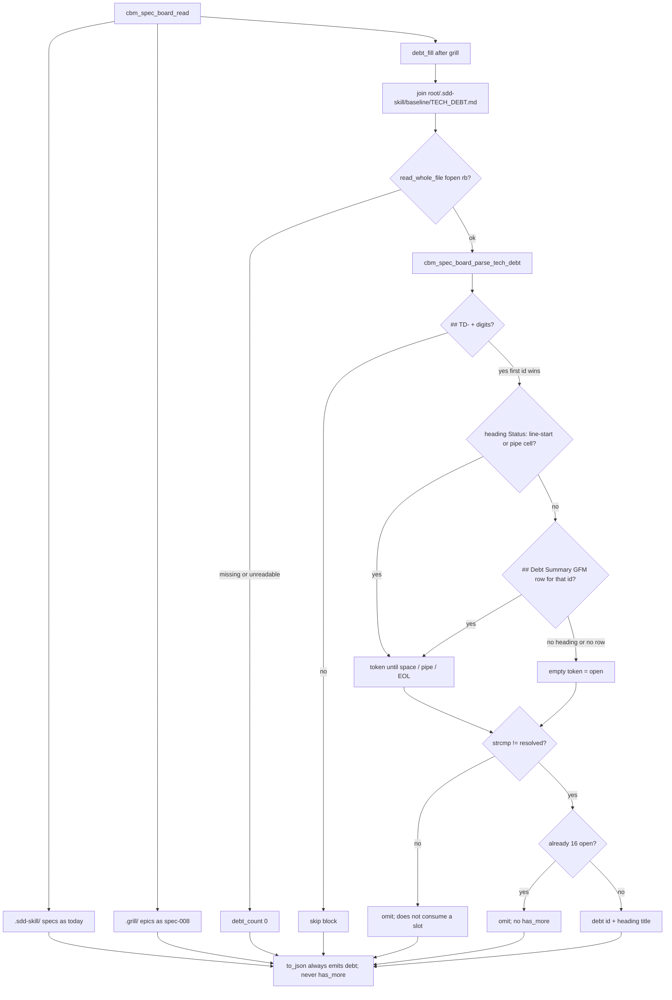

# Task #1 — spec_board debt parse + additive JSON
Reading time: 2-3 min
Last updated: 2026-09-02 — spec-015-s5k-specs-debt-and-path | Patterns: ✓

## What changed (plain language)

The Specs board reader now also opens `{project}/.sdd-skill/baseline/TECH_DEBT.md` on the same GET. Open items (`Status` is not the exact word `resolved`) land in a `debt` list of id + title only, up to 16, in file order. Missing, unreadable, or all-resolved files still return an empty `debt` array. Nothing is written into `.sdd-skill/`, `.grill/`, or `.gamedev/`. Companion-to conversion is unchanged.

This task only filled the C reader and JSON. HTTP still does not open TECH_DEBT.md itself. The Specs chrome strip is a later task. Until then, the live tab still paints specs and epics only.

## Files modified

| File | What it does | Lines ± |
|---|---|---|
| `src/ui/spec_board.h` | `CBM_SPEC_BOARD_MAX_DEBT` 16; `debt_t` id/title; `debt[]`; parse prototype | +~25 |
| `src/ui/spec_board.c` | `parse_tech_debt` + `debt_fill` after grill; `to_json` always emits `debt` | +~460 |
| `tests/test_spec_board.c` | 11 debt Then + helpers; existing `to_json` accepts additive `debt` | +~400 |

HTTP, graph-ui, MCP, store, and `Makefile.cbm` were not edited.

## Key decisions

| Decision | Why | ADR |
|---|---|---|
| Same GET; always-emit `"debt":[{id,title}]`; cap 16; no `has_more` | No second poll; Gherkin `debt is []` is a present empty array | SDD-ADR-065 |
| Parse inside `cbm_spec_board_read`; HTTP does not fopen TECH_DEBT.md | HTTP already owns SQLite archive merge; skill IO stays in spec_board | SDD-ADR-066 |
| Heading `Status:` (line-start or pipe cell) wins; `## Debt Summary` table is fallback | Stale table cannot hide an open heading or invent one | SDD-ADR-066 |
| Title = trimmed remainder after `## TD-NNN:` | Gherkin title is the heading line, not a `Title:` field or table cell | SDD-ADR-066 |
| Open iff `strcmp` ≠ `"resolved"`; unknown/typo/empty/missing-both → open | Only the exact token closes an item | SDD-ADR-066; grill ADR-002 |
| Own cap 16 after omit; resolved does not consume a slot | Overflow must not steal spec/epic slots or grow chrome without bound | SDD-ADR-065; US-006 |
| fopen `"rb"` only; skip heading without `TD-`+digits | Zero-write; GET-equivalent read still succeeds | constitution I.2; SDD-ADR-066 |

## How debt parse and JSON emit work

Live GET already serializes `debt` because `to_json` always writes the key. Archive merge (Task #2) still applies only to `specs[]`. HTTP still does not fopen TECH_DEBT.md.

## Debugging

| If this fails | File:line | Cause | Fix |
|---|---|---|---|
| Open heading present but `debt` is `[]` | `spec_board.c:1493-1507`, `:1471-1476` | fopen failed, or Status token is exact `resolved` | `debt_fill` joins `TECH_DEBT.md` then `read_whole_file` `"rb"` (`:36-37`). Heading `Status:` is line-start or a `\|` cell (`:1113-1159`). Test `test_spec_board.c:1532` |
| Table says resolved so an identified heading disappeared | `spec_board.c:1162-1180`, `:1471` | Table used before heading | First heading `Status:` wins. Pipe line `ID: … \| Status: identified` counts. Test `:1622` |
| Heading has no Status and table `in_progress` is omitted | `spec_board.c:1471-1475`, `:1353-1413` | `## Debt Summary` not found or header cells not `ID` + `Status` | Table is fallback only when heading has no token. Test `:1649` |
| Typo `resolvd` omitted | `spec_board.c:1477` | Case-fold or prefix match leaked | `strcmp` to exact `"resolved"` only. Test `:1677` |
| 17th open id in JSON / `has_more` key | `spec_board.c:1477`, `:1699-1710` | Shared cap or overflow field | Stop at `CBM_SPEC_BOARD_MAX_DEBT` 16. Resolved does not consume a slot. Never emit `has_more`. Test `:1696` |
| `## leftover with no id` became a row | `spec_board.c:1183-1231` | Any `## ` accepted | Id is `## ` + `TD-` + digits. Skip the block; keep well-formed TD-005. Test `:1756` |
| Title is `Title:` field or table cell | `spec_board.c:1217-1230` | Wrong title source | Remainder after `## TD-NNN:` on that line. Test `:1532` (`Title: wrong title from field`) |
| Missing / dir-at-path file 500 or leftover rows | `spec_board.c:1502-1504`, `:46-48` | Unreadable treated as fatal or as text | NULL `read_whole_file` → count 0. Oversize > 4 MiB also NULL. Tests `:1598` / `:1731` |
| `TECH_DEBT.md` / `active.json` / epic.md bytes changed | `spec_board.c:36-37` | Write mode leaked | `cbm_fopen` `"rb"` only. Test `:1793` |
| Converted epic back in `epics[]` | `spec_board.c:738-756`, `:322-344` | Matcher rewritten while adding debt | Do not touch `grill_epic_converted`. Test `:1041` |
| `has_more` / `severity` / `category` / `status` on JSON | `spec_board.c:1699-1708` | Extra keys in emit | Objects are `{id,title}` only. Test `:1557-1561` |
| Mid-sentence `Status:` in Description closed the item | `spec_board.c:1118`, `:1149` | Substring match | Only trimmed line-start or a pipe cell that starts with `Status:` |
| HTTP opened TECH_DEBT.md | `http_server.c` (no match) | Skill IO leaked into GET | Fill stays in `cbm_spec_board_read`. Task #2 must not fopen |

## Project fit

- Before: GET `/api/spec-board` listed sdd specs and unconverted grill epics. TECH_DEBT.md was invisible on the board.
- After this task: the reader fills additive `debt` (cap 16, heading Status wins, zero-write). HTTP still serializes whatever read returns; the UI does not paint the chrome strip yet.
- Next: Task #2 GET additive + POST leftover locks (C HTTP; still no TECH_DEBT fopen in HTTP). Task #3 is SpecBoardTab strip + EpicCard wrap. Task #4 maps remaining Vitest Gherkin.

## Pattern Notes

Patterns: ✓. Same `cbm_fopen` `"rb"` + `read_whole_file` as spec-005 spec.md / spec-008 grill. Same additive JSON on the existing GET (SDD-ADR-024/035/065), not a sibling route (IV.3). Debt IO stays in `spec_board.c` so HTTP remains read → archive merge on `specs[]` → `to_json` (SDD-ADR-030/036/066). Unreadable TECH_DEBT.md is count 0, same dir-at-path degrade as unreadable epic. Own cap 16 next to spec/epic/task caps; resolved does not steal a slot. Conversion matcher, Companion-to, and `source.grill_epic` untouched. Did not emit `has_more` or `gamedev_skill_present`. Did not read `.gamedev/` from read/to_json. Did not touch HTTP, graph-ui, or Makefile.cbm. Breadcrumbs on `spec_board.h`, `spec_board.c`, `test_spec_board.c`.

Constitution has I–IX only (no Section X). IX.2 does not mention Specs debt chrome yet — true; this is spec-015 reader only. Same-GET additive is locked by SDD-ADR-065. No constitution gap this task (IX debt sentence waits for spec close).

## Quick refs

- Spec US-001 / US-002 / US-003 / US-006 (reader): `.sdd-skill/specs/spec-015-s5k-specs-debt-and-path/spec.md`
- Plan parse + JSON: `.sdd-skill/specs/spec-015-s5k-specs-debt-and-path/plan.md`
- ADR: SDD-ADR-065 (same GET + always-emit `debt[{id,title}]` + cap 16); SDD-ADR-066 (parse in `spec_board.c`; heading Status wins)
- Tests: `scripts/test.sh --suites spec_board` (46 passed)
- Constitution: I.2 (no cycle writes), II.1 (`cbm_` C11), IV.3 (existing GET), V.3 (C tests), VI (fixed join path), VII.2 (breadcrumbs), IX.2 (spec-008 same-GET reader pattern)
