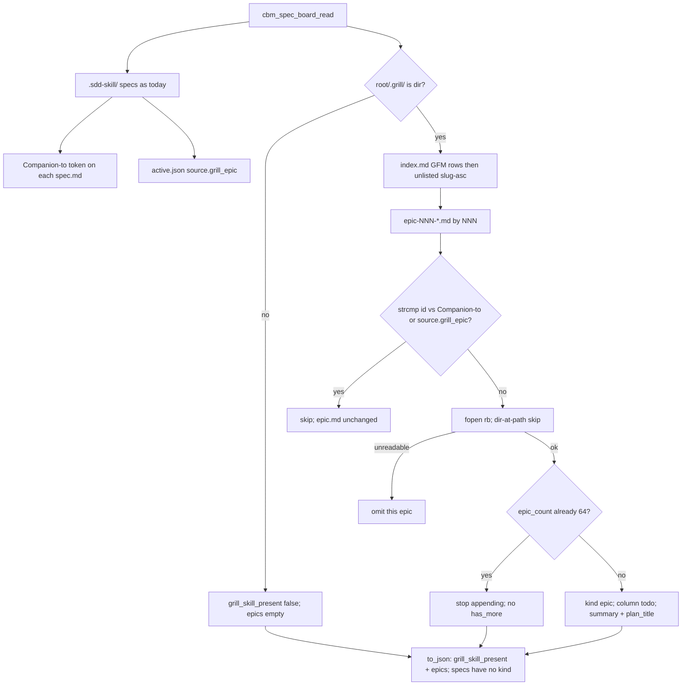

# Task #1 — spec_board grill read + additive JSON
Reading time: 2-3 min
Last updated: 2026-08-30 — spec-008-g8r-grill-epic-todo | Patterns: ✓

## What changed (plain language)

The Specs board reader now also walks `.grill/` on the same GET. When that folder exists, the JSON gains `grill_skill_present: true` and an `epics` list of unconverted grill cards (title, one-line summary, plan name, always Todo). An epic drops off that list when a listed spec.md says `Companion to:` that file path, or when `active.json` `source.grill_epic` equals that path. Nothing is written into `.grill/` or `.sdd-skill/`.

This task only filled the C reader and JSON. HTTP merge, POST, and the Specs UI are later tasks. Until then, the live tab still paints specs only.

## Files modified

| File | What it does | Lines ± |
|---|---|---|
| `src/ui/spec_board.h` | `CBM_SPEC_BOARD_MAX_EPICS` 64; epic type; `grill_skill_present`; `companion_grill` (not JSON) | +~30 |
| `src/ui/spec_board.c` | `.grill/` walk; conversion `strcmp`; additive `to_json` | +~490 |
| `tests/test_spec_board.c` | 15 grill Then + helpers; existing `to_json` accepts additive keys | +~620 |

HTTP, graph-ui, MCP, store, and `Makefile.cbm` were not edited.

## Key decisions

| Decision | Why | ADR |
|---|---|---|
| Same GET; additive `grill_skill_present` + sibling `epics[]`; `kind` only on epics | No second poll; spec cards stay expand/archive-only | SDD-ADR-035 |
| Parse `.grill/` inside `cbm_spec_board_read` | HTTP already owns SQLite archive merge; conversion needs listed spec.md + `active.json` | SDD-ADR-036 |
| JSON `summary` + `plan_title`; not spec `blurb` | Epic.md `summary:` is one line; `blurb` is Executive Summary extract | SDD-ADR-037 |
| Conversion = exact `strcmp` of epic `id` | Fuzzy kebab would hide a similarly named spec’s neighbor | SDD-ADR-037; grill ADR-002 |
| index.md table rows, then unlisted slug-asc; within plan, epic-NNN numeric | Catalog order is the skill contract; missing index still lists dirs | SDD-ADR-037 |
| Own cap 64 after omit; no `has_more` | Large grill trees must not steal spec slots | SDD-ADR-035; US-005 |
| fopen `"rb"` only; Companion-to token never fopen’d | Zero-write; no path traversal from a markdown line | constitution I.2; SDD-ADR-036 |

## How grill read and JSON emit work

Live GET already serializes the two additive keys because `to_json` always writes them. Archive merge (Task #2) still applies only to `specs[]`.

## Debugging

| If this fails | File:line | Cause | Fix |
|---|---|---|---|
| `.grill/` exists but `grill_skill_present` is false | `spec_board.c:1087-1093`, `:1170-1171` | Path not a directory (file-at-path or missing) | `cbm_is_dir(root/.grill)`. Test `test_spec_board.c:1328` |
| Flag true but `epics` empty with files on disk | `spec_board.c:1172-1173`, `:1012-1073` | Walk skipped, all converted, or names not `epic-NNN-*.md` | `grill_fill_epics` only if present. Filename parse `:712-735`. Test `:946` |
| Converted epic still in JSON | `spec_board.c:738-756`, `:322-344` | Token not extracted or `strcmp` missed | First `.grill/plans/`…`.md` on a `Companion to:` line (`:334-344`). Test `:1016` / trailing notes `:1092` |
| `source.grill_epic` omit missed | `spec_board.c:275-283`, `:744-745` | `source` object not read | yyjson `source.grill_epic` string. Test `:1062` |
| Done spec still leaves the epic in Todo JSON | `spec_board.c:750-754` | Match skipped non-todo specs | Any listed spec’s `companion_grill`. Test `:1123` |
| Similarly named spec hid the epic | `spec_board.c:738-756` | Fuzzy match leaked | Exact `strcmp` on full relative id. Missing Companion-to keeps both. Test `:1246` |
| 65th epic in JSON / spec slots dropped | `spec_board.c:967-968`, `:1026-1028`, `:1067-1068` | Shared cap or has-more field | Stop at `CBM_SPEC_BOARD_MAX_EPICS` 64. Specs stay 64. No `has_more`. Test `:1277` |
| Unreadable epic 500 / board abort | `spec_board.c:978-984` | Dir-at-path treated as fatal | `cbm_is_dir` then `read_whole_file` NULL → skip. Test `:1360` |
| `index.md` / epic.md / `active.json` bytes changed | `spec_board.c:36-37` | Write mode leaked | `cbm_fopen` `"rb"` only. Test `:1386` |
| No `.sdd-skill/` → no epics | `spec_board.c:1170-1173` | Grill gated on sdd | Fill is independent of sdd. Test `:1438` |
| Plan order wrong (disk name, not catalog) | `spec_board.c:873-955`, `:1063-1064` | GFM rows skipped or NNN sort dropped | Table data rows then unlisted slug-asc; NNN numeric. Tests `:1156` / `:1459` |
| JSON has `"kind"` on a spec / `companion_grill` leaked | `spec_board.c:1228-1234`, `:1247-1260` | Spec format grew kind, or scratch serialized | Specs: no `kind`. Epics: `"kind":"epic"`. Test `:946` (`:997`) |
| `gamedev_skill_present` on this JSON | `spec_board.c:1096-1102`, `:1215` | Presence helper called from read/to_json | Helper stays for `/api/skill-presence` only. Test `:197` |
| Dirent `../` opened under root | `spec_board.c:678-691` | Name join unsanitized | Reject `/`, `\`, `..`. Companion-to is never fopen’d (`:323`) |

## Project fit

- Before: GET `/api/spec-board` listed sdd specs (expand + archive flags). `.grill/` was invisible on the board.
- After this task: the reader fills additive epics (cap 64, conversion omit, zero-write). HTTP still serializes whatever read returns; the UI does not paint EpicCards yet.
- Next: Task #2 GET additive + POST epic-id 404 (C HTTP). Task #3 is EpicCard + Todo epics-then-specs. Task #4 maps remaining Vitest Gherkin.

## Pattern Notes

Patterns: ✓. Same `cbm_fopen` `"rb"` + `read_whole_file` as spec-005 spec.md / spec-006 zero-write board. Same additive JSON on the existing GET (SDD-ADR-024/035), not a sibling route (IV.3). Grill IO stays in `spec_board.c` so HTTP remains read → archive merge on `specs[]` → `to_json` (SDD-ADR-030/036). Unreadable epic is skip-one, same dir-at-path degrade as unreadable spec.md. Own cap 64 next to spec/task caps; `kv_extract_colon_line` reused for `name:` / `summary:` / plan `title:`. `companion_grill` and `source.grill_epic` are conversion scratch, not JSON. Did not emit `has_more` or `gamedev_skill_present`. Did not read `.gamedev/` from read/to_json. Did not touch HTTP, graph-ui, or Makefile.cbm. Breadcrumbs on `spec_board.h`, `spec_board.c`, `test_spec_board.c`.

Constitution has I–IX only (no Section X). IX.2 does not mention grill yet — true; this is spec-008 reader only. Same-GET additive is locked by SDD-ADR-035. No constitution gap this task (IX grill sentence waits for spec close).

## Quick refs

- Spec US-001 / US-002 / US-004 / US-005 / US-006 (reader): `.sdd-skill/specs/spec-008-g8r-grill-epic-todo/spec.md`
- Plan grill walk + JSON: `.sdd-skill/specs/spec-008-g8r-grill-epic-todo/plan.md`
- ADR: SDD-ADR-035 (same GET + separate `epics[]`); SDD-ADR-036 (walk in `spec_board.c`); SDD-ADR-037 (`summary` / `plan_title` / exact match / index.md order)
- Tests: `scripts/test.sh --suites spec_board` (35 passed)
- Constitution: I.2 (no cycle writes), II.1 (`cbm_` C11), IV.3 (existing GET), V.3 (C tests), VI.3 (path join sanitized), VII.2 (breadcrumbs), IX.5 (reader-only skill files)
