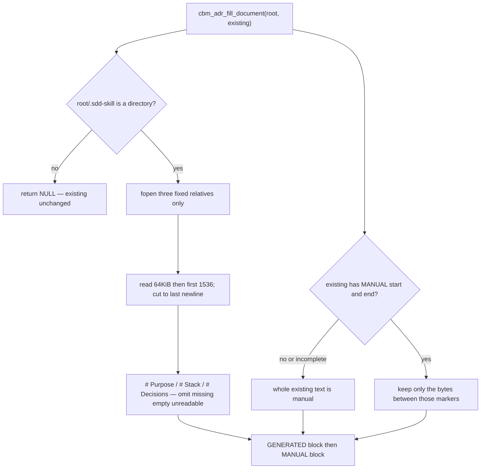

# Task #1 — Splice + bounded extract helper
Reading time: 2-3 min
Last updated: 2026-08-30 — spec-004-j8k-adr-parse-on-reindex | Patterns: ✓

## What changed (plain language)

The ADR tab still stores one markdown blob. This task adds a C helper that, given a project folder, can rebuild that blob: a generated block taken from three sdd-skill files, then a manual block that keeps whatever a human already wrote.

This task only added the helper. Task #2 now calls it after ADR capture on user-triggered persist. Watcher jobs still do not fill.

## Files modified

| File | What it does | Lines ± |
|---|---|---|
| `src/adr/adr_fill.h` | Marker macros + `cbm_adr_fill_document` | +32 (new) |
| `src/adr/adr_fill.c` | Trio extract + marker splice; no store / HTTP | +247 (new) |
| `tests/test_adr_fill.c` | Nine unit Then clauses (no full index job) | +343 (new) |
| `Makefile.cbm` | `ADR_SRCS` + `TEST_ADR_SRCS` | +11 / −4 |
| `tests/test_main.c` | Register `suite_adr_fill` | +4 |

## Key decisions

| Decision | Why | ADR |
|---|---|---|
| Module in `src/adr/`, `cbm_adr_` prefix | Pipeline must not grow a UI/store dependency | plan Directory Structure |
| Local `adr_skill_present` (`cbm_is_dir`) | Same check as Specs, but do not call `spec_board.c` | SDD-ADR-023 |
| Four HTML comments, generated then manual | Parse (not POST) protects notes | SDD-ADR-020, SDD-ADR-021 |
| Unmarked body → entire text is manual | Phase-1 blobs must not become generated | US-002 |
| No `.sdd-skill/` dir → return NULL | Caller leaves existing text unchanged | US-003 |
| 64KiB read, first 1536, cut to last newline | Real trio is ~22KiB; do not byte-copy | SDD-ADR-020 |
| Unreadable = regular file and open/read fails | Missing vs chmod-0 / directory-at-path | SDD-ADR-022 |
| English H1s `# Purpose` `# Stack` `# Decisions` | Role titles, not basenames; omit H1 if that file is empty or unreadable | SDD-ADR-022 |
| Not hooked to pipeline in this task | Intent flag landed in Task #2 | SDD-ADR-019 |

## How the helper splices



The three relatives are `.sdd-skill/context_ai.md`, `.sdd-skill/baseline/TECH_STACK.md`, `.sdd-skill/baseline/ARCHITECTURE_ADR.md`. DEV_LOG, TECH_DEBT, constitution, human/, specs/, and history/ are never opened.

## Debugging

| If this fails | File:line | Cause | Fix |
|---|---|---|---|
| Helper returns NULL but `.sdd-skill/` exists | `adr_fill.c:241-242` | `adr_skill_present` is false | `cbm_is_dir` on `root/.sdd-skill` (`:50-53`); empty `root_path` fails `adr_join` (`:40-44`) |
| Unmarked notes vanished | `adr_fill.c:175-179` | Body already had both MANUAL markers | Only the span between MANUAL start/end is kept (`:165-191`) |
| A `# Purpose` / `# Stack` / `# Decisions` H1 is missing | `adr_fill.c:66-71` | Path is not a regular file, `fopen`/`fread` failed, or file is empty | `adr_read_extract` returns NULL; `adr_append_section` omits that H1 (`:125-127`) |
| `SECRET-DEVLOG` appears in the blob | `adr_fill.c:20-22` | An extra relative was opened | Only the three `CBM_ADR_REL_*` paths; never DEV_LOG |
| Markers appear on a repo with no skill dir | `adr_fill.c:241-242` | Skill check skipped | Must return NULL; do not invent comments |
| Generated block is after manual | `adr_fill.c:215-231` | Splice order flipped | START + generated + END, then MANUAL start/end |
| Skill dir exists, trio missing, no markers | `adr_fill.c:244-246` | Early return on empty extract | Skill present always splices; generated inner may be whitespace |
| Text after byte 1536 still in generated | `adr_fill.c:91-98` | Cap not applied | First 1536; if truncated, walk back to the last newline |
| Unreadable ARCHITECTURE_ADR still copied | `adr_fill.c:66-71` | Directory-at-path treated as a file | Not regular, or `fopen` fail → omit `# Decisions` |
| Fill returns NULL with a real skill dir and trio | `adr_fill.c:211-212` | `malloc` in `adr_splice` failed | NULL is OOM; caller must keep prior `existing` |

## Project fit

- Before: GET `/api/adr` is a whole-document blob (spec-002). Reindex restores `saved_adr` as-is. No `CBM-GENERATED` markers (SDD-ADR-011 still true until a user-triggered index of a skill repo).
- After this task: `cbm_adr_fill_document` exists and is tested. Pipeline hook is Task #2 (now landed).
- Next after Task #2: Task #3 HTTP/MCP/watcher Gherkin. Task #4 AdrTab stamp can run in parallel.

## Pattern Notes

Patterns: ✓. Same class as Specs: best-effort fopen, omit a missing or unreadable file, presence is `cbm_is_dir` on `.sdd-skill`. Isolated C helper first, hook later — same shape as spec-003 `cbm_identity_*`. `cbm_` prefix, no store/HTTP in the helper, no write-back to skill files (I.2). Local presence check is intentional so `src/adr/` does not include `spec_board.c`.

Constitution has I–IX only (no Section X). IX.2 already names spec-004 but does not lock the marker fence, the user-triggered-only gate, or “skill dir is not graph source.” Not a code defect this task.

```
📜 CONSTITUTION RECOMMENDATION
Observed: Fill helper and spec_board both read `.sdd-skill/` best-effort and never write cycle files. IX.2 names spec-004 but is silent on the in-document fence and the fill gate. No Section X exists.
Recommendation: Add to Section IX at spec close — "Generated/manual HTML comments are the in-document fence; fill runs on user-triggered index only; `.sdd-skill` is not graph source; skill-file reads are best-effort fopen and never write cycle files."
→ @planner evaluates, creates ADR if agreed
```

## Quick refs

- Spec US-001 / US-002 / US-004: `.sdd-skill/specs/spec-004-j8k-adr-parse-on-reindex/spec.md`
- Plan: `.sdd-skill/specs/spec-004-j8k-adr-parse-on-reindex/plan.md`
- ADR: SDD-ADR-019 (hook is Task #2), SDD-ADR-020 (extract + markers), SDD-ADR-021 (whole-doc writes), SDD-ADR-022 (unreadable + H1s), SDD-ADR-023 (skip dir is Task #2)
- Tests: `scripts/test.sh --suites adr_fill` (9 passed)
- Constitution: I.2 (no write to cycle files), II.1 (`cbm_` C11), V.3 (C tests), VII.2 (breadcrumbs), IX.2 (spec-004 is ADR parse)
