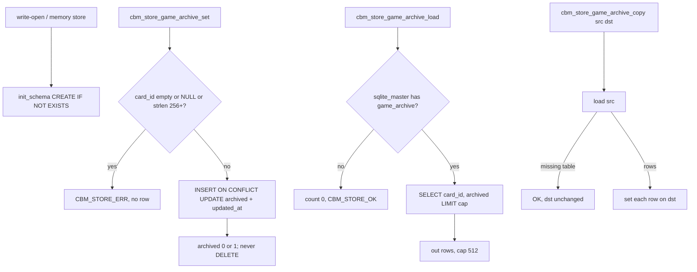

# Task #1 — Store game_archive table + set/load/copy
Reading time: 2-3 min
Last updated: 2026-08-31 — spec-012-m2k-game-expand-archive-deps | Patterns: ✓

## What changed (plain language)

Game archive is a CBM flag, not a write into `.gamedev/`. This task adds a small table inside that project’s cache database: one row per Game card id (the root-relative path), archived yes or no, plus a timestamp. Unarchive keeps the row and writes “no.” A leftover id with no matching card still stays in the table.

This task only added the store APIs. GET merge, POST, publish copy, and the Game UI are later tasks. Until then, the live board does not read or write these flags.

## Files modified

| File | What it does | Lines ± |
|---|---|---|
| `src/store/store.h` | Row type, cap 512, `set` / `load` / `copy` | +17 |
| `src/store/store.c` | `init_schema` DDL + probe + set/load/copy | +~160 |
| `tests/test_store_game_archive.c` | Ten memory-store Then clauses | +251 (new) |
| `Makefile.cbm` | `TEST_STORE_SRCS` += this suite | +1 (this task) |
| `tests/test_main.c` | Register `suite_store_game_archive` | +2 (this task) |

HTTP, pipeline, `game_board.c`, graph-ui, `spec_archive` APIs, and `sqlite_writer.c` were not edited for this task.

## Key decisions

| Decision | Why | ADR |
|---|---|---|
| New `game_archive` in the project `.db` | Flag must survive restart; not `spec_archive` | SDD-ADR-052 |
| PK is `card_id` (path, 255 bytes) | Match `cbm_game_board_card_t.id`, not spec folder ids | SDD-ADR-052 |
| Cap 512 | Board max 256 plus leftover orphans | plan |
| UPSERT; unarchive writes 0; no DELETE | Orphan-keep: leftover ids stay until HTTP ignores them | SDD-ADR-052, US-003 |
| `sqlite_master` probe on load | Query-open skips `init_schema`; missing table is empty, not ERR | same as spec_archive |
| Store does not include `game_board.h` | Merge onto cards is HTTP (Task #3) | SDD-ADR-053 |
| Table not added to writer dump DDL | Full dump rebuilds without this table; copy is Task #3 | SDD-ADR-053 |

## How set, load, and copy work

`updated_at` uses the existing `iso_now` helper. Project name is not a column — it is which `.db` file you opened.

## Debugging

| If this fails | File:line | Cause | Fix |
|---|---|---|---|
| Write-open `.db` has no `game_archive` | `store.c:334-343` | DDL dropped from `init_schema` | `CREATE TABLE IF NOT EXISTS game_archive` with PK `card_id` + CHECK (0,1) + `updated_at` |
| Query-open load 500 on a pre-table `.db` | `store.c:8331-8349`, `:8408-8414` | SELECT ran without a probe | `game_archive_table_probe` `SQLITE_DONE` → load returns OK, `*count = 0` |
| Empty or NULL `card_id` still inserts | `store.c:8361-8364` | Guard skipped | Both `""` and NULL → `CBM_STORE_ERR`. Test `:82-90` |
| `card_id` of 256 bytes stored | `store.c:8365-8368` | Length check skipped | `strlen >= 256` → ERR; 255 OK. Test `:93-113` |
| Unarchive deleted the row | `store.c:8369`, `:8372-8375` | `DELETE` on 0 | `flag = archived ? 1 : 0` then UPSERT. Test `:115-134` |
| Repeat archive created a second row | `store.c:8372-8375` | INSERT without `ON CONFLICT` | PK UPSERT. Test `:136-155` |
| Orphan id vanished on load | `store.c:8419-8448` | Load filtered by a board list | Store has no board. Test `:157-175` keeps a missing-doc path |
| Copy failed when src table missing | `store.c:8408-8414`, `:8461-8464` | Missing src treated as ERR | Probe NOT_FOUND → load OK count 0 → copy no-op. Test `:219-237` |
| Copy dropped dest rows already present | `store.c:8465-8469` | Copy cleared dst first | Copy only `set`s src rows. Missing-src test leaves dst `gdd.md` |
| Flags mixed into `spec_archive` | `store.h:806-815` | Same table reused | New APIs only. Writer DDL unchanged |
| Store opened `game_board.h` | `store.h` / `store.c` | Layering leak | No include. HTTP merge is Task #3 |

## Project fit

- Before: Game cards stay on the board forever. There is no CBM row for “this artifact is archived.” spec-011 paint stays; expand/archive chrome is still absent.
- After this task: the table and three APIs exist and are tested in a memory store. GET `/api/game-board` and the Game pane still know nothing about flags.
- Next: Task #2 C expand parse + blocked overlay (parallel). Task #3 GET-merge + POST + `publish_staged` copy. Task #4–#5 are expand UI and archive chrome.

## Pattern Notes

Patterns: ✓. Sibling of spec-006 `spec_archive`: same `init_schema` `CREATE TABLE IF NOT EXISTS`, same `sqlite_master` probe, same UPSERT + `iso_now`, same missing-table → OK count 0, same no-DELETE unarchive. Cap 512 and `card_id[256]` are the Game-sized difference, not a second pattern. `cbm_` prefix, explicit NULL/empty errors, `cbm_store_open_memory` tests. Did not reuse `spec_archive` / `store_meta` / `project_summaries`. Did not add the table to writer dump DDL. Did not include `game_board.h`. Breadcrumbs on `store.h`, `store.c`, `test_store_game_archive.c`.

Constitution I–IX. IX.2 still says spec-011 forbade Game archive/POST — true until this spec’s later tasks land HTTP/UI. Persist-in-project-db is locked by SDD-ADR-052. No constitution gap this task (IX Game-archive sentence waits for spec close).

## Quick refs

- Spec US-003: `.sdd-skill/specs/spec-012-m2k-game-expand-archive-deps/spec.md`
- Plan schema + store APIs: `.sdd-skill/specs/spec-012-m2k-game-expand-archive-deps/plan.md`
- ADR: SDD-ADR-052 (table in project `.db`); SDD-ADR-053 copy/HTTP is Task #3
- Tests: `scripts/test.sh --suites store_game_archive` (10 passed); `store_spec_archive` still green (9)
- Constitution: I.2 (no cycle writes), II.1 (`cbm_` C11), IV.1 (store key = project name / `.db` file), V.3 (C tests), VII.2 (breadcrumbs), IX.2 (Game archive not in spec-011)
