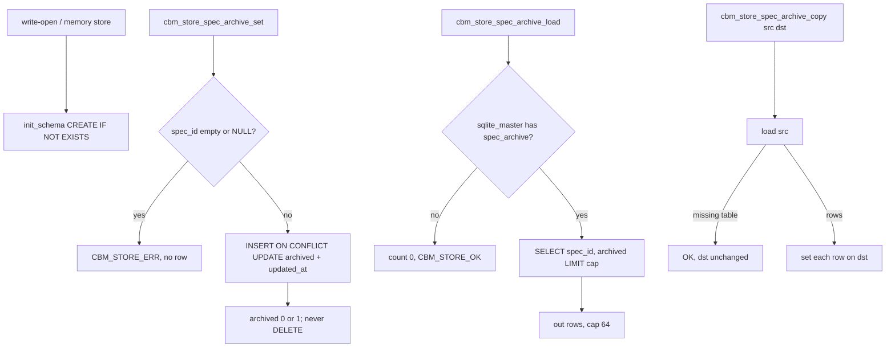

# Task #1 — Store spec_archive table + set/load/copy
Reading time: 2-3 min
Last updated: 2026-08-30 — spec-006-k3n-spec-archive | Patterns: ✓

## What changed (plain language)

Archive is a CBM flag, not a skill-file write. This task adds a small table inside that project’s cache database: one row per spec folder id, archived yes or no, plus a timestamp. Unarchive keeps the row and writes “no.” A leftover id with no matching card still stays in the table.

This task only added the store APIs. GET merge, POST, and the Specs UI are later tasks. Until then, the live board does not read or write these flags.

## Files modified

| File | What it does | Lines ± |
|---|---|---|
| `src/store/store.h` | Row type, cap 64, `set` / `load` / `copy` | +18 |
| `src/store/store.c` | `init_schema` DDL + probe + set/load/copy | +159 |
| `tests/test_store_spec_archive.c` | Nine memory-store Then clauses | +218 (new) |
| `Makefile.cbm` | `TEST_STORE_SRCS` += this suite | +1 (this task) |
| `tests/test_main.c` | Register `suite_store_spec_archive` | +2 (this task) |

HTTP, pipeline, `spec_board.c`, graph-ui, and `sqlite_writer.c` were not edited.

## Key decisions

| Decision | Why | ADR |
|---|---|---|
| New `spec_archive` in the project `.db` | Flag must survive restart; project key is the filename | SDD-ADR-029 |
| Do not reuse `store_meta` or `project_summaries` | Those own db_uid / mutation_gen and the ADR blob | SDD-ADR-029 |
| UPSERT; unarchive writes 0; no DELETE | Orphan-keep: leftover ids stay until a later board ignores them | SDD-ADR-029, US-005 |
| `sqlite_master` probe on load | Query-open skips `init_schema`; missing table is empty, not ERR | SDD-ADR-029 (same idea as `cbm_store_adr_get`) |
| Cap 64 | Board max; copy uses the same constant | plan / `CBM_SPEC_BOARD_MAX_SPECS` |
| Store does not include `spec_board.h` | Merge onto cards is HTTP (Task #2) | SDD-ADR-030 |
| Table not added to writer dump DDL | Full dump rebuilds without this table; copy is Task #2 / SDD-ADR-033 | SDD-ADR-033 |

## How set, load, and copy work

`updated_at` uses the existing `iso_now` helper. Project name is not a column — it is which `.db` file you opened.

## Debugging

| If this fails | File:line | Cause | Fix |
|---|---|---|---|
| Write-open `.db` has no `spec_archive` | `store.c:325-333` | DDL dropped from `init_schema` | `CREATE TABLE IF NOT EXISTS spec_archive` with PK + CHECK (0,1) + `updated_at` |
| Query-open GET / load 500 on a pre-table `.db` | `store.c:8171-8189`, `:8248-8251` | SELECT ran without a probe | `spec_archive_table_probe` `SQLITE_DONE` → load returns OK, `*count = 0` |
| Empty or NULL `spec_id` still inserts | `store.c:8201-8204` | Guard skipped | Both `""` and NULL → `CBM_STORE_ERR`. Test `:81-89` |
| Unarchive deleted the row | `store.c:8209`, `:8212-8215` | `DELETE` on 0 | `flag = archived ? 1 : 0` then UPSERT. Test `:92-108` |
| Repeat archive created a second row | `store.c:8212-8215` | INSERT without `ON CONFLICT` | PK UPSERT. Test `:111-127` |
| Orphan id vanished on load | `store.c:8259-8288` | Load filtered by a board list | Store has no board. Test `:130-145` keeps `spec-099-zzz-gone` |
| Copy failed when src table missing | `store.c:8248-8251`, `:8301-8304` | Missing src treated as ERR | Probe NOT_FOUND → load OK count 0 → copy no-op. Test `:187-205` |
| Copy dropped dest rows already present | `store.c:8305-8309` | Copy cleared dst first | Copy only `set`s src rows. Missing-src test leaves dst `spec-017-hhh-visible` |
| `spec_id` longer than 191 bytes stored | `store.c:8205-8208` | Length check skipped | `strlen >= 192` → ERR |
| Flags mixed into ADR or `store_meta` | `store.h:790-797` | Wrong table reused | New APIs only. `sqlite_writer.c` has no `spec_archive` |
| Store opened `spec_board.h` | `store.h` / `store.c` | Layering leak | No include. HTTP merge is Task #2 |

## Project fit

- Before: Done cards pile up. There is no CBM row for “this spec is archived.” spec-005 expand stays; Archive chrome is still absent.
- After this task: the table and three APIs exist and are tested in a memory store. The board JSON and UI still know nothing about flags.
- Next: Task #2 GET-merge + POST + `publish_staged` copy. Task #3 is the Specs hide/show chrome. Task #4 maps remaining Vitest Gherkin.

## Pattern Notes

Patterns: ✓. Same `init_schema` `CREATE TABLE IF NOT EXISTS` as `project_summaries` / `index_coverage_meta`. Same `sqlite_master` probe as `cbm_store_adr_get` (`store.c:8011-8028`); load maps missing-table to OK count 0 (list), not `NOT_FOUND` (single get) — that is the plan’s caller contract. UPSERT + `iso_now` matches `cbm_store_adr_store`. `cbm_` prefix, explicit NULL/empty errors, cap 64, `cbm_store_open_memory` tests. Did not reuse `store_meta` / `project_summaries`. Did not add the table to writer dump DDL. Did not include `spec_board.h`. Breadcrumbs on `store.h`, `store.c`, `test_store_spec_archive.c`.

Constitution has I–IX only (no Section X). IX.2 still says Archive is not part of spec-005 — true; this is spec-006 store only. Persist-in-project-db is locked by SDD-ADR-029. No constitution gap this task (IX archive sentence waits for spec close).

## Quick refs

- Spec US-005: `.sdd-skill/specs/spec-006-k3n-spec-archive/spec.md`
- Plan schema + store APIs: `.sdd-skill/specs/spec-006-k3n-spec-archive/plan.md`
- ADR: SDD-ADR-029 (table in project `.db`); SDD-ADR-033 copy hook is Task #2
- Tests: `scripts/test.sh --suites store_spec_archive` (9 passed)
- Constitution: I.2 (no cycle writes), II.1 (`cbm_` C11), IV.1 (store key = project name / `.db` file), V.3 (C tests), VII.2 (breadcrumbs), IX.2 (Archive not in spec-005)
