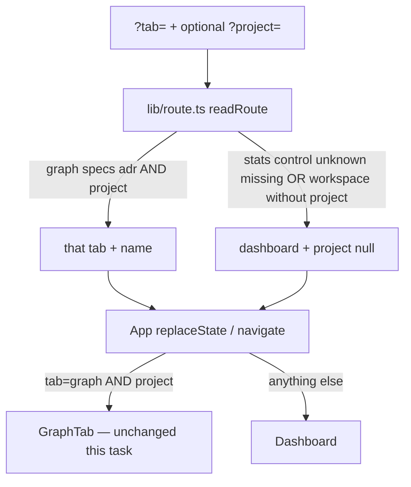

# Task #1 — TabId + readRoute + routeUrl
Reading time: 2-3 min
Last updated: 2026-08-29 — spec-002-p8w-project-workspace | Patterns: ✓

## What changed (plain language)

The address bar can now name three project interiors: Graph, Specs, and ADR. Those names only stick when a project is also in the URL. Without a project, or with old bookmarks like stats/control, you still land on Dashboard.

The parse lives in one file so later workspace chrome cannot invent a second set of rules. The Graph pane and tab strip are not built yet — this task only decides what the URL means.

## Files modified

| File | What it does | Lines ± |
|---|---|---|
| `graph-ui/src/lib/types.ts` | `TabId` + `WORKSPACE_TABS` + `isWorkspaceTab` | +9 / −1 |
| `graph-ui/src/lib/route.ts` | `readRoute` / `routeUrl` / `RouteState` | +34 (new) |
| `graph-ui/src/lib/route.test.ts` | Workspace + project kept; aliases and missing project → Dashboard | +58 (new) |
| `graph-ui/src/App.tsx` | Imports `route.ts`; no local parse | +4 / −24 |

## Key decisions

| Decision | Why | ADR |
|---|---|---|
| One `TabId` union, not two types | One `navigate(tab, project)` path | SDD-ADR-009 |
| `WORKSPACE_TABS` is the extension point | Later tabs add an id here; no plugin | SDD-ADR-009 / plan D1 |
| Workspace tab without project → Dashboard | Spec-001 aliases stay; `?tab=adr` alone is home | US-006 / Gherkin error |
| Specs-without-skill fallback not here | Needs presence fetch (Task #3) | plan D3 |

## How the URL is read

Before: only `graph` + project was a second level. After: `specs` and `adr` with a project are also valid tab ids. Next: header last-indexed (#2), Specs strip (#3), AdrTab (#4), then App compose (#5).

## Debugging

| If this fails | File:line | Cause | Fix |
|---|---|---|---|
| `?tab=specs&project=alpha` reads as Dashboard | `route.ts:23-24` | `WORKSPACE_TABS` missing `specs` or parse still inlined in App | `isWorkspaceTab` + non-empty project; App must import `readRoute` |
| `?tab=adr` without project stays `tab=adr` | `route.ts:23-26` | Empty-project guard dropped | Return `{ tab: "dashboard", project: null }` |
| `?tab=stats` keeps `project=` | `route.ts:26` | Alias branch returned the query project | Dashboard always clears project |
| App still has a local `readRoute` | `App.tsx:11` | Duplicate parse | Import from `./lib/route` only |
| Specs pane appears this task | `App.tsx:72-77` | Workspace chrome built early | Main is still GraphTab or Dashboard only |

## Project fit

- Before: spec-001 two-level shell — Dashboard vs Graph. `?tab=specs` always became Dashboard.
- After: the URL can say specs/adr when a project is present. The UI does not host those panes yet.
- Next: @review then @tester for this slice. Tasks #2 #3 #4 can start after PASS.

## Pattern Notes

Patterns: ✓. Same `?tab=` + `?project=` (constitution IX). Same `replaceState` / `pushState` / `popstate`. Same Dashboard + GraphTab paint. No second router. No C change. No workspace tab strip.

## Quick refs

- Spec US-002 / US-006: `.sdd-skill/specs/spec-002-p8w-project-workspace/spec.md`
- Plan D1: `.sdd-skill/specs/spec-002-p8w-project-workspace/plan.md`
- ADR: `.sdd-skill/baseline/ARCHITECTURE_ADR.md` — SDD-ADR-009
- Tests: `graph-ui/src/lib/route.test.ts` — `cd graph-ui && npx vitest run src/lib/route.test.ts src/App.test.tsx`
