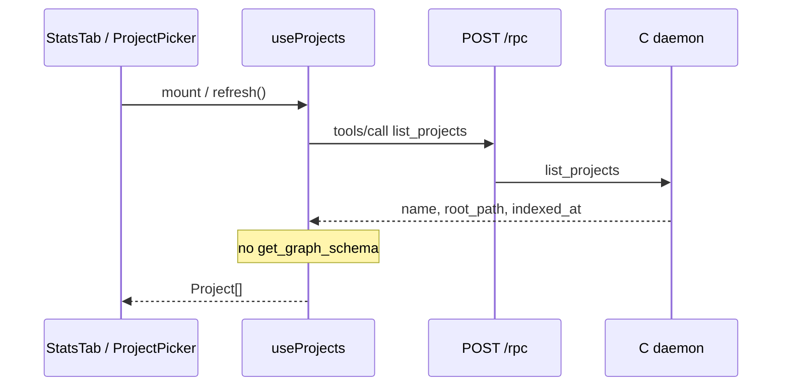

# Task #1 — useProjects list-only (TD-001)
Reading time: 2-3 min
Last updated: 2026-08-29 — spec-001-w3q-executive-dashboard | Patterns: ✓

## What changed (plain language)

The project list used to ask the daemon twice: once for the list of indexed folders, then once per folder for graph size (nodes, edges, labels). The home screen no longer needs those sizes, so that second round trip is gone.

The list still shows each project's name, folder path, and last-indexed timestamp from the single list call. If something later needs graph schema, that will be a new hook — not this one.

## Files modified

| File | What it does | Lines ± |
|---|---|---|
| `graph-ui/src/hooks/useProjects.ts` | Fetches the project list; returns `{ projects, loading, error, refresh }` | +12 / −26 |
| `graph-ui/src/hooks/useProjects.test.ts` | Proves `indexed_at` comes from the list call and the schema tool is never named | +113 / −0 |
| `graph-ui/src/components/SpecBoardTab.tsx` | Specs picker shows name + path only (still unrouted as home) | +8 / −1 |
| `graph-ui/src/components/StatsTab.tsx` | Reads `p.name` / `p.root_path` on `Project[]`; schema chips removed | +18 / −36 |

`ProjectCard.tsx` is unused and was left unwired on purpose.

## Key decisions

| Decision | Why | ADR |
|---|---|---|
| `useProjects` calls `list_projects` only | Home must paint without graph cardinality; extra RPCs were wasted (TD-001) | SDD-ADR-006 |
| Return `Project[]`, not a wrapper with `schema: null` | A null placeholder invites a later fetch and fails the Gherkin spy | SDD-ADR-006 / plan D5 |
| Specs picker maps name + path | SpecBoard must keep working if mounted; it must not depend on schema | US-002, plan D5 |
| Display existing `indexed_at` | Do not invent a second freshness field | constitution IV.4 |

## How the list fetch works now

Before: `list_projects` then N × `get_graph_schema`. After: one list call. Health dots still use `GET /api/project-health` per row — that is not schema.

## Debugging

| If this fails | File:line | Cause | Fix |
|---|---|---|---|
| List stays empty with a live daemon | `useProjects.ts:28-31` | `/rpc` HTTP error, JSON-RPC error, or `result.projects` missing | Confirm daemon on 9749; watch Network for `POST /rpc` `list_projects`; missing `projects` becomes `[]` at line 29 |
| Visible error banner, empty list | `useProjects.ts:30-31` | `callTool` threw (non-OK HTTP or `json.error`) | Message is `e.message` or `"Failed to fetch projects"`; Control still mounts (Task #4 will keep it on Dashboard) |
| Test spy sees `get_graph_schema` | `useProjects.test.ts:83` | Hook or a consumer called `callTool("get_graph_schema")` | Search `callTool(` / `get_graph_schema` under `graph-ui/src`; schema belongs in a new hook, not here |
| Specs picker empty but DBs exist | `SpecBoardTab.tsx:24-32` | `useProjects` still loading or errored | Check hook `error`/`loading`; picker does not read schema |
| Row missing name or path | `StatsTab.tsx:566-567` | Leftover `p.project` / nested `ProjectInfo` | Use `p.name` and `p.root_path` on `Project` |
| Nodes/Edges cards still on Projects tab | `StatsTab.tsx:512-529` | Task #1 zeros aggregates; Task #4 deletes StatsTab | Expected until Dashboard ships |

## Project fit

- Before: Projects tab (StatsTab) and Specs picker both waited on per-project schema. Home looked like a lab console of node/edge dumps.
- After: List identity comes from `list_projects` only. Schema chips are gone. StatsTab still shows 0/0 Nodes/Edges cards until Task #4 replaces it with Dashboard.
- Next: Task #2 grayscale chrome + palette lock; Task #3 `formatIndexedAt`; then Task #4 Dashboard rows (name, path, visible last-indexed, HealthDot, Enter, Delete).

## Quick refs

- Spec US-002: `.sdd-skill/specs/spec-001-w3q-executive-dashboard/spec.md`
- Plan D5 / API: `.sdd-skill/specs/spec-001-w3q-executive-dashboard/plan.md`
- ADR: `.sdd-skill/baseline/ARCHITECTURE_ADR.md` — SDD-ADR-006
- Tests: `graph-ui/src/hooks/useProjects.test.ts` — `cd graph-ui && npx vitest run src/hooks/useProjects.test.ts`
- Constitution: VIII.1 (no schema on Dashboard list), IV.4 (`indexed_at`), VII.2 (breadcrumbs)
