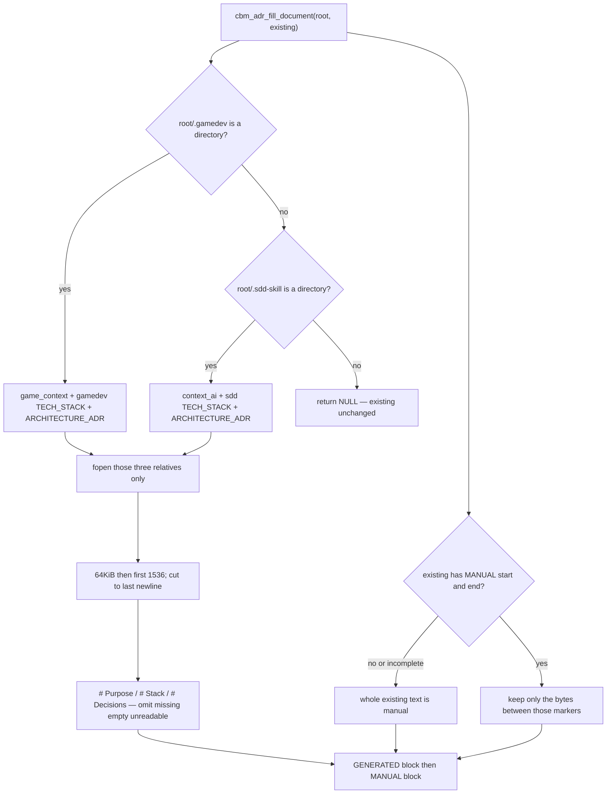

# Task #1 — XOR trio select + gamedev relatives
Reading time: 2-3 min
Last updated: 2026-08-31 — spec-013-r9w-adr-fill-gamedev-trio | Patterns: ✓

## What changed (plain language)

User-triggered ADR fill still rebuilds one markdown blob: a generated block, then a manual block that keeps human notes. The helper now picks which three skill files to read.

If the project folder has a `.gamedev/` directory, Purpose/Stack/Decisions come from the game cycle files only. Leftover sdd-skill text is ignored. If there is no `.gamedev/` directory, the old sdd-skill files are used. If neither folder exists as a directory, the helper does nothing and the stored ADR stays as-is.

This task is the C helper and its unit tests only. HTTP, MCP, watcher, and the ADR tab are later tasks. They already call the same helper, so the next user Reindex on a Game path will pick the new trio without a new endpoint.

## Files modified

| File | What it does | Lines ± |
|---|---|---|
| `src/adr/adr_fill.h` | NULL = neither skill dir; gamedev dir uses gamedev trio only | 35 (was 32) |
| `src/adr/adr_fill.c` | `adr_select_trio` + relatives into `adr_build_generated`; local `cbm_is_dir` | 280 (was 247) |
| `tests/test_adr_fill.c` | `af_write_gamedev_trio` + 7 XOR Thens; 21 suite cases | 630 (was 446) |

Pipeline, discover, HTTP, MCP, graph-ui, and constitution.md were not edited.

## Key decisions

| Decision | Why | ADR |
|---|---|---|
| XOR inside the existing helper; hook/flag unchanged | Same persist path; trio choice is not a new job | SDD-ADR-058 |
| Local `cbm_is_dir` on `.gamedev` / `.sdd-skill` | Same meaning as Game presence; do not include `spec_board.h` | SDD-ADR-059 |
| NULL only when neither directory exists | Empty `.gamedev/` still writes markers with no extracts | SDD-ADR-060 |
| File-at-path `.gamedev` is not present | Regular file must not skip leftover sdd fill | SDD-ADR-060 |
| Relatives passed into `adr_build_generated` | Selected trio cannot fopen the other cycle's paths | SDD-ADR-058 |
| Do not add `.gamedev` to ALWAYS_SKIP | Fill is out-of-graph fopen; skip would drop GDD from the graph | SDD-ADR-061 |
| Extract window, H1s, splice, markers stay spec-004 | XOR is select, not a new parse | SDD-ADR-020 |

## How trio select works



Gamedev relatives are `.gamedev/game_context.md`, `.gamedev/baseline/TECH_STACK.md`, `.gamedev/baseline/ARCHITECTURE_ADR.md`. GDD, DEV_LOG, playtest-log, constitution, human/, and other non-trio files are never opened. Missing or unreadable gamedev files do not open the matching sdd file.

## Debugging

| If this fails | File:line | Cause | Fix |
|---|---|---|---|
| Leftover `PURPOSE-SDD-*` in generated on a dual-tree | `adr_fill.c:72-76` | Select mixed relatives or still opened sdd paths | `adr_select_trio` sets only `CBM_ADR_GAME_REL_*`; `adr_build_generated` joins those three (`:170-194`) |
| NULL on an empty `.gamedev/` directory | `adr_fill.c:72-76, 274-276` | Empty dir treated as missing | `adr_dir_present` is `cbm_is_dir` (`:57-64`); skill dir present always splices (`:277-279`) |
| File named `.gamedev` skipped sdd fill | `adr_fill.c:72, 78-82` | File-at-path counted present | `cbm_is_dir` only; then sdd if `.sdd-skill/` is a dir |
| Neither dir but markers appeared | `adr_fill.c:274-276` | Select returned true | Must return NULL; do not invent comments |
| Missing gamedev file filled from sdd | `adr_fill.c:170-194` | Fallback join on sdd relatives | One selected trio; omit that H1 (`adr_append_section` `:156-157`) |
| Unreadable `game_context.md` still copied | `adr_fill.c:97-102` | Directory-at-path treated as a file | Not regular or `fopen` fail → omit `# Purpose` |
| `# Purpose` from GDD / DEV_LOG | `adr_fill.c:24-26` | Extra relative opened | Only the three `CBM_ADR_GAME_REL_*` (or sdd trio when gamedev dir is absent) |
| Text past 1536 still in generated | `adr_fill.c:122-129` | Cap not applied | Same spec-004 window; gamedev test `adr_fill_gamedev_extract_cap_drops_tail` |
| Unmarked notes vanished | `adr_fill.c:207-211` | Body already had both MANUAL markers | Only the span between MANUAL start/end is kept (`:197-223`) |
| Fill NULL with a real skill dir and trio | `adr_fill.c:242-244` | `malloc` in `adr_splice` failed | NULL is OOM or neither dir; caller keeps prior `existing` |

## Project fit

- Before: fill always opened the sdd-skill trio when `.sdd-skill/` was a directory. A Game path with leftover MVP1 files still described sdd in ADR.
- After this task: the helper XOR-selects. Unit tests prove dual-tree, empty dir, file-at-path, unreadable, extract cap, and sdd regression. Pipeline hook is unchanged.
- Next: Task #2 HTTP/MCP/watcher Gherkin on a gamedev tree. Task #3 AdrTab chrome (no cycle stamp) can run in parallel.

## Pattern Notes

Patterns: ✓. Same class as spec-004: best-effort fopen, omit missing/empty/unreadable, presence is `cbm_is_dir`, local check so `src/adr/` does not include `spec_board.h`. Relatives are constants under `root_path`. No write-back to `.gamedev/`, `.sdd-skill/`, or `.grill/` (I.2). Extract/splice/markers reused. `.gamedev` not added to ALWAYS_SKIP (graph coverage unchanged).

Constitution IX.5 still names the sdd trio as the only fill source. Not a code defect this task — planned for @planner at spec close.

```
📜 CONSTITUTION RECOMMENDATION
Observed: IX.5 says fill reads the sdd-skill trio. Task #1 XOR-selects gamedev trio when `.gamedev/` is a directory (no merge, no sdd fallback).
Recommendation: At spec close, MODIFY IX.5 — when `.gamedev/` is a directory, fill opens the gamedev trio only; else sdd trio if `.sdd-skill/` is a directory. `.gamedev` is not graph-skip this spec. APPEND IX.2 — spec-013 delivered gamedev XOR fill (SDD-ADR-058..061).
→ @planner evaluates, creates ADR if agreed
```

## Quick refs

- Spec US-001 / US-002 / US-004 / US-005: `.sdd-skill/specs/spec-013-r9w-adr-fill-gamedev-trio/spec.md`
- Plan: `.sdd-skill/specs/spec-013-r9w-adr-fill-gamedev-trio/plan.md`
- ADR: SDD-ADR-058 (XOR), SDD-ADR-059 (local is-dir), SDD-ADR-060 (NULL = neither dir), SDD-ADR-061 (no ALWAYS_SKIP)
- Tests: `scripts/test.sh --suites adr_fill` (21 passed)
- Constitution: I.2 (no write to cycle files), II.1 (`cbm_` C11), V.3 (C tests), VII.2 (breadcrumbs), IX.5 (user-triggered fill; sdd wording still incomplete)
