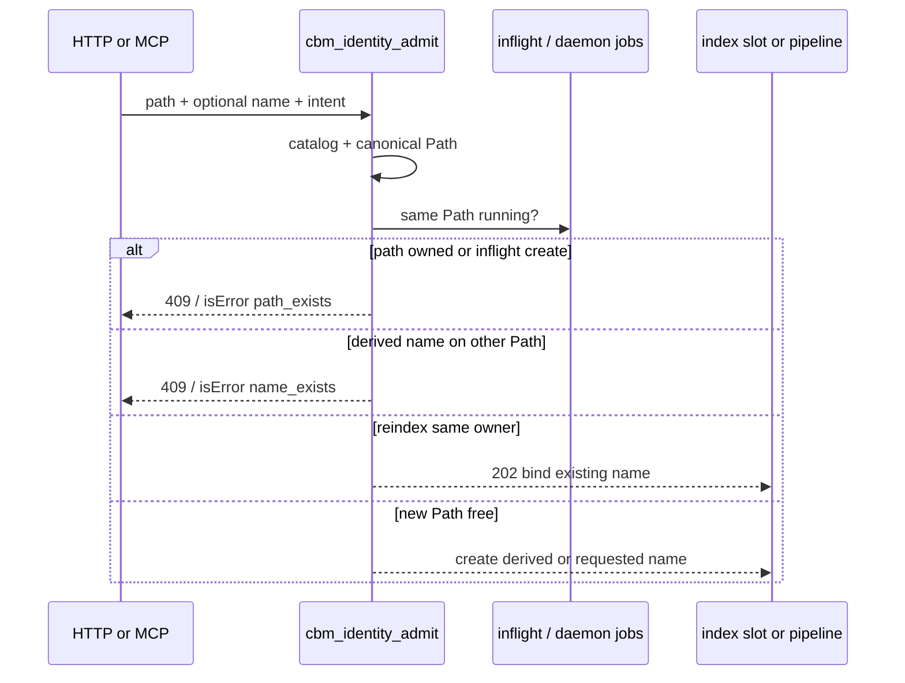

# Task #2 — Admit create vs reindex (HTTP + MCP + jobs)
Reading time: 2-3 min
Last updated: 2026-08-29 — spec-003-h7q-path-project-identity | Patterns: ✓

## What changed (plain language)

Creating an index for a folder that already has a project is no longer a silent second name. A bare HTTP create is refused with 409 and the newest existing name. Reindex is explicit: send that name as `project` (or the old `project_name` alias). MCP without a name reindexes the single owner; two owners or a clone name are errors.

In-flight work is keyed by the resolved folder, not only the project name. A second create of the same folder while a job is running is 409, not a second slot.

## Files modified

| File | What it does | Lines ± |
|---|---|---|
| `src/store/identity_catalog.c` | `cbm_identity_admit` CREATE / REINDEX / MCP | ~+140 |
| `src/foundation/identity.h` | Admit intents, verdicts, inflight | ~+40 |
| `src/ui/http_server.c` | Admit before slot; 409 JSON; reindex subscribe | +95 / −13 |
| `src/mcp/mcp.c` | Admit before executor; inject bind `name` | +54 |
| `src/daemon/application.c` | Same Path + other name → PATH_CONFLICT | +36 |
| `tests/test_identity.c` | Admit + MCP Then clauses | +~250 |
| `tests/test_httpd.c` | HTTP 409/202 Gherkin | +325 |

No Dashboard / create-modal UI in this task.

## Key decisions

| Decision | Why | ADR |
|---|---|---|
| One `cbm_identity_admit` for HTTP + MCP | Same Path 1:1 rule; workspace-boundary style | SDD-ADR-014 |
| HTTP `project` / `project_name` never create | Alias used to spawn a new name | SDD-ADR-015 |
| Slot after admit | 409 must not start IndexProgress | spec US-001 |
| MCP no-name + 1 owner = reindex that name | Agents omit `name`; must not clone | plan MCP rules |
| Daemon path key + PATH_CONFLICT | Watcher/MCP jobs must not alias a running Path | SDD-ADR-014 |

## How create vs reindex is decided

## Debugging

| If this fails | File:line | Cause | Fix |
|---|---|---|---|
| Bare POST 202 on an owned Path | `http_server.c:1232` | Admit not reached or cache dir wrong | Isolate `CBM_CACHE_DIR`; confirm catalog sees the `.db` |
| 409 body missing `code` | `http_server.c:1108` | Old reply path | Must be `path_exists` or `name_exists` plus `existing_project` |
| Trailing slash creates a clone | `identity_catalog.c:254` | Request not canonicalized | `cbm_identity_canonical_root` before owner count |
| MCP reindex writes a derived name | `mcp.c:7906` | Worker args lacked `name` | Admit sets bind; `index_args_with_repo_path` copies it |
| MCP success asserted as error | `test_identity.c` `id_mcp_is_error` | `"isError":false` always present | Check `:true`, not the key |
| Second create 202 while first runs | `http_server.c:1226` | In-flight list empty | Status must be running (1) before the second POST |
| Daemon starts two names on one Path | `application.c:1616` | Path lookup skipped | PATH_CONFLICT when `project_key` differs |

## Project fit

- Before: catalog + list fields existed; HTTP still allocated a slot and could create a second name for the same folder.
- After: create is gated; reindex is named; MCP matches the plan; UI redirect / Reindex are not built.
- Next: Task #3 Dashboard conflict group (Enter newest, delete older). Task #4 create-modal 409. Task #5 Reindex button.

## Quick refs

- Spec US-001 / US-002 / US-003 / US-006: `.sdd-skill/specs/spec-003-h7q-path-project-identity/spec.md`
- Plan: `.sdd-skill/specs/spec-003-h7q-path-project-identity/plan.md`
- ADR: SDD-ADR-014, SDD-ADR-015
- Tests: `scripts/test.sh --suites identity` (18); `scripts/test.sh --suites httpd` (69 + 1 skip)
- Constitution: II.1 C11 `cbm_`; II JSON errors; V C tests for daemon/HTTP; VII breadcrumbs. IV.1 still talks about spec-001 (draft gap for close).
