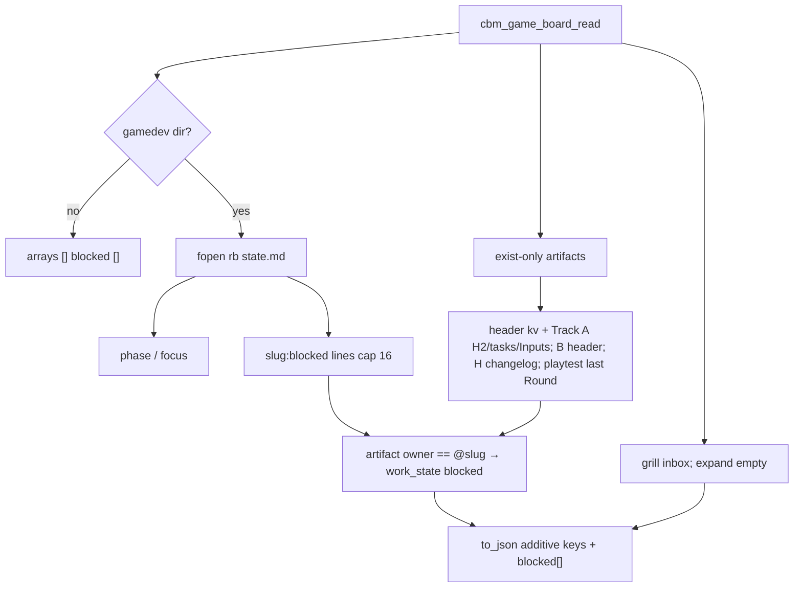

# Task #2 — C expand parse + blocked overlay + JSON
Reading time: 2-3 min
Last updated: 2026-08-31 — spec-012-m2k-game-expand-archive-deps | Patterns: ✓

## What changed (plain language)

GET `/api/game-board` still reads skill files with fopen `"rb"` only. Each artifact card now carries expand fields: a short blurb, task checkboxes, Inputs, header open/last_decision, and (for levels and playtest) a recent snippet. A Blocked list is parsed from `state.md` lines whose status is `blocked`. Matching artifact cards get `work_state` `"blocked"` in C before JSON, so a later archive POST can 409 the same way GET looks.

Inbox epics are unchanged: empty expand fields, never overlaid. Archive flags stay false until Task #3 merges `game_archive`. There is no POST and no Game UI expand this task.

## Files modified

| File | What it does | Lines ± |
|---|---|---|
| `src/ui/game_board.h` | Widen card + board blocked[]; extract helpers | ~93 |
| `src/ui/game_board.c` | Local H2 extract; tasks; blocked strip; overlay; additive to_json | ~2147 |
| `tests/test_game_board.c` | Ten new Then tests; spec-011 suite stays | +~400 |

`spec_board.c` / `mcp.c` / HTTP POST / graph-ui / store were not edited.

## Key decisions

| Decision | Why | ADR |
|---|---|---|
| Overlay in C before JSON | POST 409 must match GET `work_state` `"blocked"` | SDD-ADR-055 |
| Strip = `blocked` lines only | `needs_review` / `in_progress` / `done` are not rows | SDD-ADR-055 |
| Local `## What it does` extract | spec-005 extract is locked to Executive Summary | SDD-ADR-056 |
| `archived` stays false on read | HTTP merge is Task #3 | SDD-ADR-053 |
| Cap 48 tasks / 16 blocked; no `has_more` | spec overflow omit | plan |

## How expand and overlay run

fopen stays `"rb"`. Missing file degrades that card. Inbox is never overlaid.

## Debugging

| If this fails | File:line | Cause | Fix |
|---|---|---|---|
| Blurb is header `open` though What it does exists | `game_board.c:419-421`, `:967` | H2 miss or extract ran after fallback | `## What it does` non-empty body wins. Test `:1190` |
| Track A tasks include Subagent/Path/`<!--` | `game_board.c:898-908`, `:911` | Skip list dropped | Checkbox dialect only. Test `:1112` |
| 49th task in JSON / `has_more` | `game_board.c:924` | Cap not applied | `CBM_GAME_BOARD_MAX_TASKS` 48. Test `:1282` |
| playtest `recent` is Round 1 | `game_board.c:423` | First Round kept | Last `## Round ` block. Test `:1209` |
| level `recent` includes HTML comments | `game_board.c:485` | Comment lines kept | Last 8 non-empty non-`<!--`. Test `:1243` |
| `needs_review` is a strip row | `game_board.c:580`, `:663-677` | Any colon line parsed | Only `:blocked:`. Test `:1324` |
| empty state still has blocked heading JSON | `game_board.c:2079` | Omitted key | Always `"blocked":[]`. Test `:1347` |
| overlay misses a SYS / Inbox overlaid | `game_board.c:1014-1040` | Owner without `@` or inbox walked | `@`+slug; phase arrays only. Test `:1367` |
| GET wrote spec.md / tasks.md / state.md | `game_board.c:1895` | Write mode | `"rb"` only. Test `:1408` |
| spec-board emits `gamedev_skill_present` | `spec_board.c` (untouched) | Wrong file edited | Do not edit spec_board. Existing httpd lock |

## Project fit

- Before: cards had kind/id/title/track/work_state/owner/continue only. Blocked lived in `state.md` unread. Archive table exists (Task #1) but is unused.
- After this task: GET JSON has expand fields + `blocked[]`; overlay mutates `work_state` in C. UI still does not expand. POST still absent.
- Next: Task #3 HTTP merge + POST + publish copy. Task #4 paints expand + strip. Task #5 archive chrome.

## Pattern Notes

Patterns: ✓. fopen `"rb"` same as spec-010/011. Local extract copies spec-005 sentence/link/512 algorithm with a different H2 (SDD-ADR-056). Overlay in C matches planner default (SDD-ADR-055). Heap `calloc` board. Additive JSON keys always present. Inbox walk unchanged. Breadcrumbs on `game_board.h` / `game_board.c` / tests. No `spec_board.h` extract include.

No constitution gap this task (IX.2 still describes spec-011 no-expand; HTTP/UI later; close will append).

## Quick refs

- Spec US-002 / US-005: `.sdd-skill/specs/spec-012-m2k-game-expand-archive-deps/spec.md`
- Plan Expand parse + Blocked strip: same folder `plan.md`
- ADR: SDD-ADR-055 overlay; SDD-ADR-056 local extract
- Tests: `scripts/test.sh --suites game_board` (38 passed); httpd GET still green
- Constitution: I.2 zero-write, II.1 C11 `cbm_`, V.3 C tests, VII.2 breadcrumbs, IX.2 Game GET family
