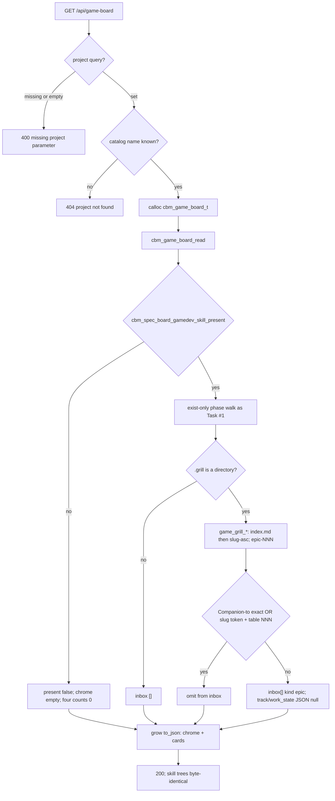

# Task #2 — C Inbox walk + conversion + HTTP bytes
Reading time: 2-3 min
Last updated: 2026-08-31 — spec-011-q5n-game-phase-board | Patterns: ✓

## What changed (plain language)

GET `/api/game-board` still uses the spec-010 path, 400/404 strings, and chrome keys. When `.gamedev/` is a directory and `.grill/` exists, Inbox is no longer always empty: C walks grill epics (index.md order, then unlisted plan dirs slug-ascending; within a plan, epic-NNN numeric) and emits unconverted leftovers as `kind` epic cards. Converted means a Game artifact `Companion to:` token equals that epic `id`, or the plan slug is a token in roadmap.md and/or game_context.md and roadmap.md has a table cell `NNN` or `epic-NNN`. Closed plans stay. No `.grill/` → `inbox` `[]`. GET 200 does not write `.gamedev/`, `.grill/`, or create `.sdd-skill/`.

This task is C and HTTP Gherkin only. Game columns, clipboard, and Vitest paint are later tasks. `spec_board.c` was not edited.

## Files modified

| File | What it does | Lines ± |
|---|---|---|
| `src/ui/game_board.h` | Breadcrumb + Inbox comment; card struct unchanged from #1 | 56 (comment only) |
| `src/ui/game_board.c` | `game_grill_*` catalog + Game conversion; fill inbox after artifacts | 1426 (was 805; +621) |
| `tests/test_game_board.c` | 10 inbox / conversion / order / bytes Thens; `/tmp` fixtures | 1095 (was 708; +387) |
| `tests/test_httpd.c` | GET inbox objects + Companion-to omit + skill-tree bytes | game-board block `:3880`; +3 tests |

`http_server.c` handler, `spec_board.c`, `mcp.c`, and `Makefile.cbm` were not edited this task.

## Key decisions

| Decision | Why | ADR |
|---|---|---|
| New `game_grill_*` walk in `game_board.c`; copy spec-008 catalog algorithm, not symbols | spec_board helpers are static and bound to `active.json` / spec Companion-to | SDD-ADR-046 |
| Do not export `grill_*`; do not share `to_json` | Extract would touch closed spec-008 for a different omit rule | SDD-ADR-046 |
| Omit iff Companion-to exact path OR (slug token + roadmap table NNN) | Game conversion is not `source.grill_epic` | SDD-ADR-047 |
| Slug token in roadmap.md and/or game_context.md; NNN cell in roadmap.md only | Heading prose is not a cell; both sides required independently | SDD-ADR-047 |
| Do not read `active.json`; do not kebab-match; plan-folder cite without cell does not convert | False-empty Inbox / hide leftovers | US-004; SDD-ADR-047 |
| Companion-to token rule = spec-008; token never fopen'd | First `.grill/plans/`…`.md` on a `Companion to:` line | US-004 |
| Inbox cap 64 independent of phase caps | Filling Inbox must not steal Production slots | US-003 |
| All plans (draft and closed) | Silent win must not hide leftover grill | US-003 |
| present false → return before grill walk | Empty arrays + no extra IO | US-005 |
| Same GET; fopen `"rb"` only; no `spec_board.c` edit | IV.3 / I.2 / gamedev-free lock | spec-010/#1 |

SDD-ADR-050 (one-shot hook) and SDD-ADR-051 (clipboard) are later UI tasks.

## How GET read → inbox walk → omit → JSON works

HTTP still never `fopen`s `.gamedev/` or `.grill/`. Walk lives in `game_board.c`. Dispatch is GET only (`http_server.c:2295-2298`). Conversion does not call `grill_epic_converted` and does not read `active.json`.

## Debugging

| If this fails | File:line | Cause | Fix |
|---|---|---|---|
| Inbox empty but leftover grill exists | `game_board.c:1178-1180`, `:1132-1133` | `.grill` missing, or conversion matched | Dir check then omit only Companion-to exact or slug+NNN. Test `test_game_board.c:882` / `:714` |
| Companion-to exact path still in Inbox | `game_board.c:966-999`, `:1098-1101` | Token parse skipped or `strcmp` drifted | First `.grill/plans/`…`.md` on `Companion to:`; trailing notes after `.md` ignored; token never fopen'd. Test `:757` / `test_httpd.c:4070` |
| slug+table NNN still in Inbox | `game_board.c:902-919`, `:922-963`, `:1103-1108` | Token bounds or header/sep counted as cell | Slug `[A-Za-z0-9-]`; GFM `\|` data rows; cell `001` or `epic-001`. Test `:801` |
| kebab SYS-001-inbox hid the epic | `game_board.c:1090-1108` | Name fuzzy match leaked | No kebab. Folder name is not Companion-to. Test `:956` |
| plan-folder cite without NNN hid every epic | `game_board.c:1103-1108` | Slug-only treated as convert | Slug token and roadmap table cell. Test `:931` |
| table `001` without slug hid the epic | `game_board.c:1103-1105` | NNN cell alone converted | Both required. `game_context.md` may supply slug, never the cell. Test `:979` |
| closed plan leftover missing | `game_board.c:1171-1240` | Draft-only filter | All plans. Test `:833` |
| missing link dropped the epic (or SYS vanished) | `game_board.c:1111-1168`, fill_production | Converted on kebab / sit-beside skipped | Unconverted stays; SYS card still emitted. Test `:857` |
| Inbox order wrong | `game_board.c:816-896`, `:1232-1239` | Disk order or alpha NNN | index.md rows then unlisted slug-asc; within plan NNN numeric. Test `:904` |
| present false still walks `.grill/` | `game_board.c:1258-1260` | Grill ran before return | Helper false → return. Inbox stays 0 |
| GET 200 changed epic.md / index.md / state.md or created `.sdd-skill/` | `game_board.c:90` | Write mode or mkdir | `cbm_fopen` `"rb"` only. Tests `test_game_board.c:1008` / `test_httpd.c:4108` |
| GET 400 / 404 string drifted | `http_server.c:533-536`, `:540-542` | Handler edited | Same spec-board strings. Tests `test_httpd.c:4018` / `:3997` |
| spec-board has `gamedev_skill_present` | `spec_board.c` to_json | Extra key | File not this task. Test `test_httpd.c:3976` |
| MCP `game-board` tool / POST `/api/game-board` | `http_server.c:2295-2298` | New tool or POST branch | GET-only. `mcp.c` not edited |

## Project fit

- Before: Task #1 fills the three phase arrays from existing artifacts. `inbox` is always `[]`. Game tab still paints chrome only.
- After this task: same GET fills `inbox` with unconverted grill epics. Converted omitted. Chrome, 400/404, spec-board, and phase walk stay as Task #1. UI still does not paint columns.
- Next: Task #3 GameBoardTab four columns. Task #4 clipboard / no-drag. Task #5 remaining Vitest.

## Pattern Notes

Patterns: ✓. Same GET, same 400/404 strings, same heap `calloc` as `handle_game_board_get` (`:531-560`). fopen `"rb"` + `read_whole_file` matches spec-010 / spec-008 / Task #1 zero-write. Dir check still reuses `cbm_spec_board_gamedev_skill_present`. Local grow `to_json` (not shared with spec-board — SDD-ADR-046). Catalog algorithm copied as `game_grill_*`; `grill_fill_epics` / `grill_epic_converted` / `active.json` not called. No archive merge. No MCP tool. No POST. `spec_board.c` / `mcp.c` / `Makefile.cbm` / `http_server.c` untouched. Inbox cap 64 independent of phase caps. English labels stay out of C.

Constitution has I–IX only (no Section X). IX.2 still describes spec-010 empty column arrays. The filled-Inbox sentence waits for spec close (plan note for @planner). No constitution gap this task.

Breadcrumbs on `game_board.h`, `game_board.c`, `test_game_board.c`, and `test_httpd.c` game-board block (`:3880-3885`). `http_server.c` handler (`:522-530`) still carries spec-010 breadcrumbs — that file was not this task.

## Quick refs

- Spec US-003 / US-004 / US-006 (C/HTTP half): `.sdd-skill/specs/spec-011-q5n-game-phase-board/spec.md`
- Plan Inbox + conversion: `.sdd-skill/specs/spec-011-q5n-game-phase-board/plan.md`
- ADR: SDD-ADR-046 (new walk, no shared JSON); SDD-ADR-047 (slug token + table NNN)
- Tests: `scripts/test.sh --suites game_board,httpd` (28 game_board + 8 httpd Gherkin; 125 passed / 1 skipped)
- Constitution: I.2 (no cycle writes), II.1 (`cbm_` C11), IV.3 (same GET), V.3 (C tests), VI.2 (loopback unchanged), VII.2 (breadcrumbs), IX.2 (spec-010 chrome / gamedev-free lock)
