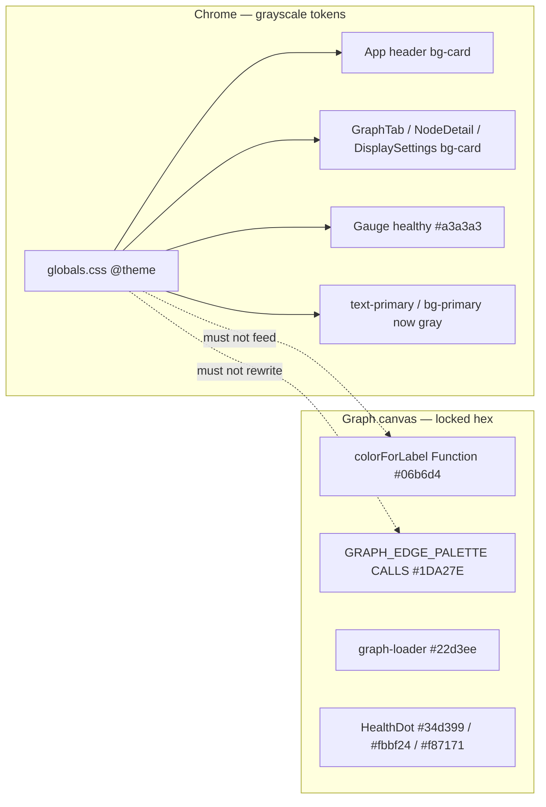

# Task #2 — Grayscale chrome tokens + palette lock (TD-004)
Reading time: 2-3 min
Last updated: 2026-08-29 — spec-001-w3q-executive-dashboard | Patterns: ✓

## What changed (plain language)

The shell (header, buttons, cards, Control, graph sidebars and menus) is now dark gray with four distinct surface levels. Teal is no longer the product accent.

The 3D graph stayed colorful on purpose. Node labels and edge types still use the same hex maps as before this spec. Health dots and Control warning/error bars stay green / amber / red.

## Files modified

| File | What it does | Lines ± |
|---|---|---|
| `graph-ui/src/styles/globals.css` | Chrome `@theme` tokens: gray primary/accent/ring; `--color-hover`; graph-loader `#22d3ee` left alone | +28 / −19 |
| `graph-ui/src/App.tsx` | Header uses `bg-card` instead of hardcoded teal-black | +8 / −1 |
| `graph-ui/src/components/ControlTab.tsx` | Exports `gaugeFillColor`; healthy fill `#a3a3a3`; >50 amber / >80 red stay | +15 / −1 |
| `graph-ui/src/components/GraphTab.tsx` | Sidebar / toolbar chrome → `bg-card` (canvas untouched) | +9 / −2 |
| `graph-ui/src/components/NodeDetailPanel.tsx` | Detail panel chrome → `bg-card`; chips still `colorForLabel` | +8 / −1 |
| `graph-ui/src/components/DisplaySettingsMenu.tsx` | Settings popover chrome → `bg-card` | +8 / −1 |
| `graph-ui/src/components/StatsTab.tsx` | HealthDot tooltip + index/ADR modals → `bg-card`; HealthDot hex unchanged | +7 / −7 |
| `graph-ui/src/components/EdgeLines.tsx` | Exports `GRAPH_EDGE_PALETTE`; CALLS / default hex unchanged | +12 / −0 |
| `graph-ui/src/lib/colors.test.ts` | Locks `colorForLabel("Function") === "#06b6d4"` and the rest of `LABEL_COLORS` | +39 / −0 |
| `graph-ui/src/lib/chrome-tokens.test.ts` | File-level proof: no teal in `@theme`; distinct surfaces; edge + gauge locks | +95 / −0 |

`colors.ts` was not edited (plan D4). Dashboard files land in Task #4 and must start on these tokens.

## Key decisions

| Decision | Why | ADR |
|---|---|---|
| Rewrite `--color-primary` / `--color-accent` / `--color-ring` to gray | TD-004: those tokens painted every button and link teal | SDD-ADR-005 / plan D8 |
| Distinct `--color-background` / `--color-card` / `--color-hover` / `--color-border` | US-004: primary actions must stay findable on grayscale | plan D8 |
| Gauge healthy `#a3a3a3`; keep `#eab308` / `#e05252` | Healthy fill was chrome teal; thresholds are semantic health | plan D8 |
| Do not edit `colors.ts`; lock hex in tests | Graph deep-link Gherkin: Function stays `#06b6d4` | SDD-ADR-005 / plan D4 |
| Export `GRAPH_EDGE_PALETTE` only | Prove CALLS `#1DA27E` and default `#1C8585` without changing values | plan D4 |
| Graph sidebar/menus are chrome, not canvas | `#0b1920` panels were shell; 3D scene must not be restyled | constitution III / plan D8 |
| No second `--color-primary` under GraphTab | Nodes read `colorForLabel`, not the CSS var | SDD-ADR-005 (alt rejected) |

## How chrome and graph color stay split

Before: one teal (`#1DA27E`) served as both button accent and CALLS edge color. After: chrome is gray; teal lives only in graph maps + comments + tests.

## Debugging

| If this fails | File:line | Cause | Fix |
|---|---|---|---|
| Header / buttons / cards look teal again | `globals.css:18-30` | `--color-primary` / `--color-accent` / `--color-ring` restored to `#1DA27E` / `#1C8585` | Restore gray tokens (`#d4d4d4` / `#737373` / `#a3a3a3`); run `chrome-tokens.test.ts` |
| Surfaces look flat (no card vs page) | `globals.css:12-28` | background / card / hover / border collapsed to one hex | Four distinct values; test asserts `Set` size 4 |
| Header still teal-black | `App.tsx:80` | leftover `bg-[#0b1920]` / `bg-[#0e2028]` | Use `bg-card` (same for GraphTab:402, NodeDetailPanel:122, DisplaySettingsMenu:108, StatsTab:63) |
| Graph nodes went gray | `colors.ts:19-20` | `colorForLabel` imported CSS vars or `LABEL_COLORS.Function` was "aligned" to primary | `colorForLabel` must stay a hex map; Function is `#06b6d4` (`colors.test.ts:26-27`) |
| CALLS edges went gray | `EdgeLines.tsx:35` / `61-64` | someone "fixed" the graph map to match chrome | `GRAPH_EDGE_PALETTE.CALLS` must stay `#1DA27E`; default `#1C8585` |
| Graph loader constellation went gray | `globals.css:52-60` | loader fill/stroke pointed at `--color-primary` | Keep hardcoded `#22d3ee` (constellation, not chrome) |
| Gauge lost red / amber | `ControlTab.tsx:14-17` | `gaugeFillColor` always returns gray | `pct > 80` → `#e05252`; `pct > 50` → `#eab308`; else `#a3a3a3` |
| HealthDot went gray / teal | `StatsTab.tsx:39-42` | semantic hex replaced by `text-primary` | Keep `#34d399` / `#fbbf24` / `#f87171` / `#555` |
| FilterPanel / Sidebar look gray | `FilterPanel.tsx` / `Sidebar.tsx` `text-primary` | expected — those controls are chrome | Do not re-teal `text-primary` to "fix" them |

## Project fit

- Before: lab teal on every chrome surface; same hex also colored CALLS edges. Home is still the four-tab App until Tasks #4/#5.
- After: executive grayscale shell; graph palette locked in CI. Account routing is unchanged.
- Next: Task #3 `formatIndexedAt`; then Task #4 Dashboard (must use these tokens from the start); Task #5 default route + TabBar delete.

## Quick refs

- Spec US-004: `.sdd-skill/specs/spec-001-w3q-executive-dashboard/spec.md`
- Plan D4 / D8: `.sdd-skill/specs/spec-001-w3q-executive-dashboard/plan.md`
- ADR: `.sdd-skill/baseline/ARCHITECTURE_ADR.md` — SDD-ADR-005
- Tests: `graph-ui/src/lib/colors.test.ts`, `graph-ui/src/lib/chrome-tokens.test.ts` — `cd graph-ui && npx vitest run src/lib/colors.test.ts src/lib/chrome-tokens.test.ts`
- Constitution: III (chrome grayscale vs graph categorical), II.2 (tokens in `globals.css`), VII.2 (breadcrumbs)
