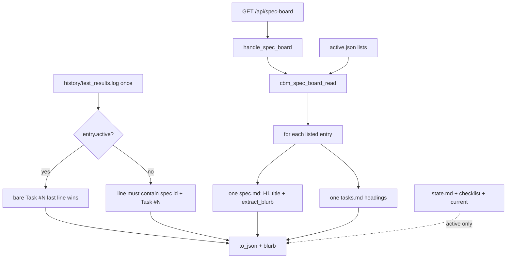

# Task #2 — Enrich every listed spec + dual done matcher
Reading time: 2-3 min
Last updated: 2026-08-30 — spec-005-v2m-spec-card-expand | Patterns: ✓

## What changed (plain language)

Every listed spec now carries a title, a short objective, and its task list on the same GET the Kanban already polls. The active spec still shows agent, checklist, and current task. Done flags differ: the active card still trusts a bare Task #N line; other cards only mark a task done when that spec’s id is on the same log line.

Missing or unreadable files empty that one card. The rest of the board stays up. Nothing is written into `.sdd-skill/`.

## Files modified

Working-tree `git diff --stat` vs last commit (Task #1 extract + this task, uncommitted):

| File | What it does | Lines ± |
|---|---|---|
| `src/ui/spec_board.h` | Dual-matcher note on `done`; Task #2 breadcrumbs | +22 / −10 |
| `src/ui/spec_board.c` | One `spec.md` + `tasks.md` per entry; log once; dual matcher | +266 / −43 |
| `tests/test_spec_board.c` | Full-read Then + idle comment | +503 / −3 |

`handle_spec_board` already calls read + to_json. Not edited.

## Key decisions

| Decision | Why | ADR |
|---|---|---|
| Same GET; enrich every listed spec | Todo/Done cards need title/blurb/tasks without a second fetch | SDD-ADR-024 |
| Active keeps bare `Task #N` last-line-wins | Compact fixture still PASS/FAIL; do not unify matchers | SDD-ADR-026 |
| Non-active needs spec id + `Task #N` | A bare PASS must not mark another spec’s task | SDD-ADR-026 |
| One `spec.md` open (title + blurb same buffer) | Do not fopen twice per poll | SDD-ADR-028 |
| One shared `test_results.log` applied to all | Naive fopen; no mtime cache | SDD-ADR-028 |
| `state.md` / checklist / `current` stay active-only | Non-active cards are title/blurb/tasks only | SDD-ADR-024 |

## How read, log, and JSON work

Live GET now includes real title/blurb/tasks when those files exist. `extract_blurb` is called from `read_spec_md` on the same buffer.

## Debugging

| If this fails | File:line | Cause | Fix |
|---|---|---|---|
| Listed spec still has empty title/blurb | `spec_board.c:289-313` | `spec.md` missing or `read_whole_file` NULL | One open at `:291-292`. Fail → both fields `""` (`:293-296`). Sibling loop continues (`:668-674`) |
| KPI text in blurb on live GET | `spec_board.c:311`, `:469-472` | Extract not used, or H2 stop skipped | Same buffer as title. Full-read test `:469`. No `## Executive Summary` → `""` |
| Non-active task marked done from bare `Task #N` | `spec_board.c:556-568` | Matcher treated non-active as active | `qualified = e->active \|\| strstr(line, e->id)` (`:558`). Test `:510` |
| Active compact PASS/FAIL drifted | `spec_board.c:558`, `:564` | Active required a spec id | Active stays bare `Task #N`; last line wins. Fixture `:186` |
| Missing `tasks.md` still has tasks | `spec_board.c:496-502` | Invented headings | `read_whole_file` NULL → return; `task_count` stays 0. Test `:604` |
| Unreadable `spec.md` still has blurb | `spec_board.c:37-39`, `:293-296` | Directory opened as text | `cbm_fopen` rb fails on a dir. Fixture `sb_spec_md_as_dir` (`test_spec_board.c:66-71`, test `:645`) |
| Ghost spec fails the whole board | `spec_board.c:640-645`, `:672-674` | Missing file treated as fatal | `sdd_skill_present` stays true. Ghost title/blurb `""`. Test `:559` |
| Agent / checklist on a Todo card | `spec_board.c:676-697` | Active-only block ran for all | `if (!e->active) continue` before state/checklist. Test `:551-552` |
| Log re-opened per spec | `spec_board.c:664-666`, `:674` | fopen inside the loop | One `read_whole_file` then `apply_test_results_log` per entry |
| Idle ids without files now have tasks | `test_spec_board.c:167-173` | Enrich invented data | No files → `task_count==0`, blurb `""` |

## Project fit

- Before: GET listed planned/draft/done ids, but only the active spec got a title, tasks, and log flags. Task #1 added the blurb field and helper; live values stayed empty.
- After this task: every listed spec is filled from one `spec.md` and one `tasks.md`. The shared log marks done with two rules. Degrade is per entry. HTTP wrapper unchanged.
- Next: Task #3 is the expand UI (Set of open cards, blurb region, Todo pending-only filter). Task #4 is the full Vitest Gherkin table.

## Pattern Notes

Patterns: ✓. Same best-effort `cbm_fopen` rb as Task #1 `read_spec_title` / `adr_read_extract`: missing or unreadable → omit that field, never write `.sdd-skill/`. Dual matcher is SDD-ADR-026 (two paths in one apply helper), not a second undocumented rule. Caps 64/48, heap board, `cbm_` prefix, `handle_spec_board` thin wrapper unchanged. Breadcrumbs on `spec_board.h`, `spec_board.c`, `test_spec_board.c`.

IX.5 already locks reader-only skill files. No new constitution gap this task.

## Quick refs

- Spec US-003 / US-005 / US-006: `.sdd-skill/specs/spec-005-v2m-spec-card-expand/spec.md`
- Plan enrich + dual matcher: `.sdd-skill/specs/spec-005-v2m-spec-card-expand/plan.md`
- ADR: SDD-ADR-024 (same GET + enrich all), SDD-ADR-026 (dual done), SDD-ADR-028 (one spec.md + one log)
- Tests: `scripts/test.sh --suites spec_board` (18 passed)
- Constitution: I.2 (no cycle writes), II.1 (`cbm_` C11), IV.3 (existing GET), V.3 (C tests), VII.2 (breadcrumbs), IX.5 (reader-only skill files)
