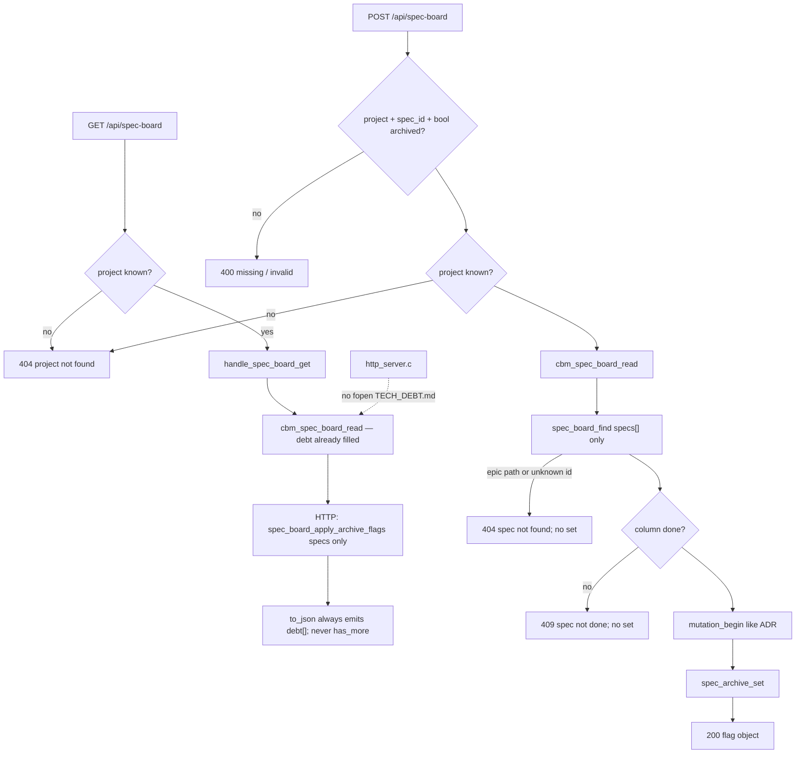

# Task #2 — HTTP GET additive + POST leftover locks
Reading time: 2-3 min
Last updated: 2026-09-02 — spec-015-s5k-specs-debt-and-path | Patterns: ✓

## What changed (plain language)

The Specs board GET is still the same URL. Task #1 already fills `debt` inside the skill-file reader, so this task did not add a second open of TECH_DEBT.md in HTTP. Live 200 bodies now prove that `debt` is always present (id + title only; empty array when nothing is open), that `has_more` is absent, and that archive flags still land only on spec cards.

Archive POST is unchanged leftover: if `spec_id` is a grill epic path that is not in `specs[]`, the reply is 404 `spec not found`. Nothing is stored. GET leaves TECH_DEBT.md, `active.json`, and `.grill/index.md` byte-identical. Game GET tests stay green without a `debt` key. The Specs chrome strip is a later task.

## Files modified

| File | What it does | Lines ± |
|---|---|---|
| `tests/test_httpd.c` | GET 200 open-heading `debt` + no `has_more`; 17th omitted; leftover POST epic 404; GET unknown project 404; GET bytes include TECH_DEBT.md; mixed GET asserts `"debt":[]` | +~160 (this task) |

`http_server.c` and `spec_board.c` / `.h` were not edited this task (GET still read → specs-only archive merge → `to_json`; parse is Task #1). graph-ui, MCP, store, and `Makefile.cbm` were not edited.

## Key decisions

| Decision | Why | ADR |
|---|---|---|
| Same GET `/api/spec-board`; always-emit `"debt":[{id,title}]`; cap 16; no `has_more` | No second poll; Gherkin `debt is []` is a present empty array | SDD-ADR-065, IV.3 |
| HTTP does not fopen TECH_DEBT.md | Skill IO stays in `cbm_spec_board_read`; HTTP already owns SQLite archive merge | SDD-ADR-066 |
| Archive merge loops `specs[]` only | Leftover store rows must not stamp `debt[]` or invent cards | SDD-ADR-030, SDD-ADR-065 |
| POST `spec_board_find` stays `specs[]` only | Epic path is not a spec; same 404 string as any unknown spec_id | SDD-ADR-035, SDD-ADR-065 |
| No distinct debt error string | A new copy would be a new contract | plan breadcrumb 17 |
| Zero skill writes | GET and epic-id POST are read-only on `.sdd-skill/` and `.grill/` | I.2, US-006 |
| Prove existing dispatch in tests | Prefer locking Gherkin over rewriting GET | Task #2 notes |

## How GET and POST work (no TECH_DEBT fopen in HTTP)

HTTP never `fopen`s TECH_DEBT.md. Debt parse is only inside `cbm_spec_board_read` (Task #1). POST 404 returns before `cbm_store_spec_archive_set`. Other methods on this path still fall through (no 405). GET `/api/game-board` is unchanged.

## Debugging

| If this fails | File:line | Cause | Fix |
|---|---|---|---|
| GET 200 missing `debt` | `http_server.c:508-511` | Wrapper skipped `to_json` or Task #1 emit dropped | Same dispatch: read → merge → `to_json`. Parse is Task #1 (`spec_board.c:1699-1710`). Test `test_httpd.c:4541` |
| `has_more` on GET 200 | `spec_board.c:1699-1710` | Overflow field leaked | Never emit `has_more`. Tests `:4566` / `:4579` |
| 17th open id in GET JSON | `spec_board.c:1477` | Shared cap or HTTP re-parse | Own cap 16 in read. Test `:4579` |
| GET unknown project is not 404 | `http_server.c:497-499` | Different error string or 200 empty board | `{"error":"project not found"}`. Test `:4447` |
| POST epic id is 200 | `http_server.c:815-826`, `:910-914` | `spec_board_find` walked `epics[]` | Loop `spec_count` only. Same 404 as unknown spec. Test `:4388` |
| POST epic 404 still wrote `spec_archive` | `http_server.c:910-914`, `:940` | `set` ran before find miss | 404 `free(board)` then return. Test `:4428-4429` |
| `"epic not found"` appeared | `http_server.c:913` | New error string | Must stay `spec not found`. Test `:4428` |
| Archive merge stamped `debt[]` | `http_server.c:465-474` | Merge walked `debt` / `epics[]` | Specs only. Test `:4568-4569` |
| HTTP opened TECH_DEBT.md | `http_server.c` (no match) | Skill IO leaked into GET | Fill stays in `cbm_spec_board_read`. Test `:4468` |
| `TECH_DEBT.md` / `active.json` / `index.md` bytes changed on GET | `http_server.c` (no `fopen` of skill trees) | Handler wrote skill files | Snapshot around GET. Test `:4468` (`:4519`) |
| epic.md bytes changed on POST 404 | `http_server.c:910-914` | Handler wrote skill files | Snapshot around POST. Test `:4388` (`:4435-4436`) |
| Game GET required a `debt` key | `http_server.c:2540-2542` | Cross-board leak | `/api/game-board` unchanged. Existing game tests stay green |
| Sibling `/api/tech-debt` appeared | `http_server.c:2524-2535` | New path | Same GET+POST `/api/spec-board`. Other methods fall through |

## Project fit

- Before: Task #1 filled additive `debt` in the C reader. Live GET already serialized that key. HTTP Gherkin for debt, GET bytes including TECH_DEBT.md, and POST epic 404 leftover were not locked.
- After this task: GET 200 proves always-present `debt` (open heading + cap 16, no `has_more`). Unknown project stays 404. POST with an epic path is still 404 `spec not found` with no store write. Archive merge never stamps `debt[]`. HTTP still does not fopen TECH_DEBT.md. The Specs strip is still absent.
- Next: Task #3 SpecBoardTab strip + EpicCard wrap + i18n. Task #4 maps remaining Vitest Gherkin.

## Pattern Notes

Patterns: ✓. Same GET family as spec-006/008 (IV.3, SDD-ADR-030/035/065): `cbm_spec_board_read` → archive merge on `specs[]` only → `cbm_spec_board_to_json`. No TECH_DEBT `fopen` in `http_server.c` (SDD-ADR-066). POST still `spec_board_find` on `specs[]`; epic id uses the existing `spec not found` string (SDD-ADR-035 leftover). 404/409/400 still return before lock and before `set`. 200 POST remains the flag object, not the board. Zero skill writes (I.2). No sibling `/api/tech-debt`, no MCP debt tool, no `has_more` / `gamedev_skill_present`. GET `/api/game-board` not required to change. Heap `cbm_spec_board_t` + yyjson unchanged. Fixtures under `/tmp`. Breadcrumbs on `test_httpd.c` (helpers + spec-015 GET tests). Production HTTP/C reader not this task.

Constitution has I–IX only (no Section X). IX.2 does not mention Specs debt chrome yet — true; this is spec-015 HTTP leftover. Same-GET additive is locked by SDD-ADR-065. No constitution gap this task (IX debt sentence waits for spec close).

## Quick refs

- Spec US-001 (HTTP) / US-005 (game GET lock) / US-006: `.sdd-skill/specs/spec-015-s5k-specs-debt-and-path/spec.md`
- Plan API + Testing Strategy: `.sdd-skill/specs/spec-015-s5k-specs-debt-and-path/plan.md`
- ADR: SDD-ADR-065 (same GET + always-emit `debt[{id,title}]` + cap 16; POST/merge spec-only); SDD-ADR-066 (parse in `spec_board.c`; HTTP stays merge)
- Tests: `scripts/test.sh --suites httpd` (119 passed)
- Constitution: I.2 (no cycle writes), II.1 (`cbm_` C11), IV.3 (existing HTTP family), V.3 (C tests), VI.2 (loopback unchanged), VII.2 (breadcrumbs), IX.2 (spec-006/008 merge/POST stay spec-only)
