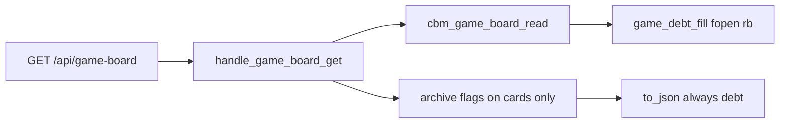

# Task #2 — HTTP GET additive + POST leftover locks
Reading time: 2-3 min
Last updated: 2026-09-03 — spec-017-b4w-game-debt-chrome | Patterns: ✓

## What changed (plain language)

GET `/api/game-board` already includes `debt` from Task #1. This task proves the HTTP leftover: the same GET returns that array, never `has_more`, never creates `backlog.md`, and leaves skill files byte-identical. Specs GET still reads TECH_DEBT.md only. POST archive of a done artifact does not touch `backlog.md`. A debt id is not an archive target (existing card-not-found 404). `http_server.c` was not edited.

## Files modified

| File | What it does | Lines |
|---|---|---|
| `tests/test_httpd.c` | GET open-comment / cap / hide / bytes / absent-create; spec-board leftover; POST leftover + debt-id 404 | + HTTP Gherkin |

`http_server.c`, `spec_board.c`, graph-ui, MCP, and Makefile.cbm were not edited.

## Key decisions

| Decision | Why | ADR |
|---|---|---|
| No HTTP fopen of backlog.md | Read stays in `cbm_game_board_read` | SDD-ADR-073 |
| Archive merge stays four card arrays | Debt ids are not persistable | SDD-ADR-072 |
| Specs GET leftover uses TECH_DEBT.md | Game tag must not appear on spec-board debt | SDD-ADR-073 |

## How GET stays one path

## Debugging

| If this fails | File:line | Cause | Fix |
|---|---|---|---|
| GET 200 missing `debt` | `game_board.c` to_json | Task #1 key dropped | Always emit |
| GET created backlog.md | `http_server.c` | HTTP wrote | Do not fopen in HTTP |
| Specs debt has `debt:gate-*` | `spec_board.c` | Opened backlog.md | TECH_DEBT.md only |
| POST debt id 200 | `http_server.c` find | Debt taught as card | Card arrays only |

## Project fit

- Before: Task #1 filled `debt` in C. HTTP Gherkin was unproven.
- After: GET/POST leftover locks are green. Strip is Task #3.
- Next: Task #3 GameBoardTab strip.

## Pattern Notes

Patterns: ✓. Same GET family; HTTP does not fopen skill files; bytes tests match spec-016 leftover. No constitution gap.

## Quick refs

- Spec US-001 HTTP / US-004 / US-005: `.sdd-skill/specs/spec-017-b4w-game-debt-chrome/spec.md`
- Tests: `scripts/test.sh --suites httpd` (131 passed / 1 skipped)
