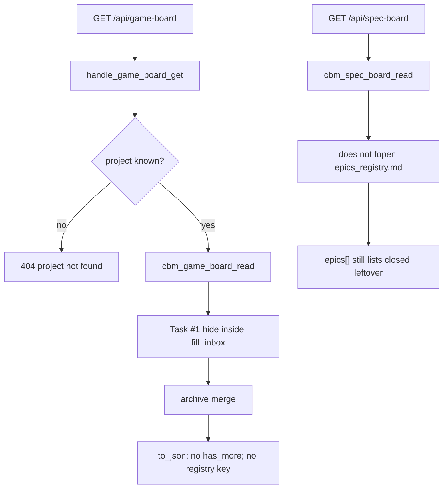

# Task #2 — HTTP GET leftover locks
Reading time: 2-3 min
Last updated: 2026-09-02 — spec-016-d9v-game-inbox-registry | Patterns: ✓

## What changed (plain language)

GET `/api/game-board` still reads the board the same way. Hidden leftovers are already missing from `inbox[]` because Task #1 omitted them in C. This task only locks that HTTP still does not open `epics_registry.md`, does not emit `has_more` or a registry key, still 404s an unknown project, does not create the registry file, and leaves skill-tree bytes unchanged. Specs Todo still lists a grill epic even when Game’s registry marks it `closed`.

`http_server.c` was not edited.

## Files modified

| File | What it does | Lines |
|---|---|---|
| `tests/test_httpd.c` | GET omit + no create + bytes + spec-board leftover; existing 404/POST stay | 5752 |

`src/ui/http_server.c`, `spec_board.c`, and graph-ui were not edited.

## Key decisions

| Decision | Why | ADR |
|---|---|---|
| No registry fopen in HTTP | Skill IO stays in `game_grill_fill_inbox` | SDD-ADR-069 / 070 |
| Hide = omit from `inbox[]`; no new JSON key | Same GET; old UIs keep working | SDD-ADR-069 |
| Spec-board GET still lists a closed leftover | Specs conversion does not read the registry | grill ADR-005; US-006 |
| Absent GET must not create the file | CBM never writes `.gamedev/` | constitution I.2 |

## How GET stays the same

## Debugging

| If this fails | File:line | Cause | Fix |
|---|---|---|---|
| GET 200 still lists a hide-set leftover | `http_server.c:614-615`; `test_httpd.c:5007` | fill_inbox not reached or present check failed | Hide is Task #1. HTTP only calls read. Test `:5007` |
| `has_more` / `"registry"` / `epics_registry` in body | `game_board.c` to_json | New key leaked | Never emit. Test `:5055-5056` |
| Unknown project is not 404 | `http_server.c:604-606` | Error string changed | `{"error":"project not found"}`. Test `:4837` (`missing`) |
| GET created `epics_registry.md` | `http_server.c` / `game_board.c` | Write leaked | fopen `"rb"` only. Test `:5084` |
| GET changed registry / state / index / active.json | `http_server.c:614` | Skill write | Bytes lock. Test `:5007` |
| Specs Todo omitted a closed leftover | `spec_board.c` | spec_board opened the registry | Do not edit spec_board. Test `:5150` |
| POST inbox epic is 200 | `http_server.c` find | Inbox became persistable | Stay 404 `card not found`. Test `:5070` (existing) |

## Project fit

- Before: HTTP already dispatched read → merge → to_json. Hide was Companion-to/roadmap only.
- After this task: same dispatch. HTTP tests prove registry omit, no create, bytes, spec-board leftover.
- Next: Task #3 InboxCard wrap (`break-all`); Artifact id stays truncated.

## Pattern Notes

Patterns: ✓. Same leftover-lock style as spec-015 Task #2 (HTTP does not fopen the skill file). Same GET omit. Existing 404/POST tests stay registered. Breadcrumbs on the new helper block in `test_httpd.c`. No constitution gap.

## Quick refs

- Spec US-001 (HTTP) / US-006: `.sdd-skill/specs/spec-016-d9v-game-inbox-registry/spec.md`
- ADR: SDD-ADR-069, SDD-ADR-070
- Tests: `scripts/test.sh --suites httpd` (122 passed / 1 skipped)
- Constitution: I.2, IV.3, V.3, VI
