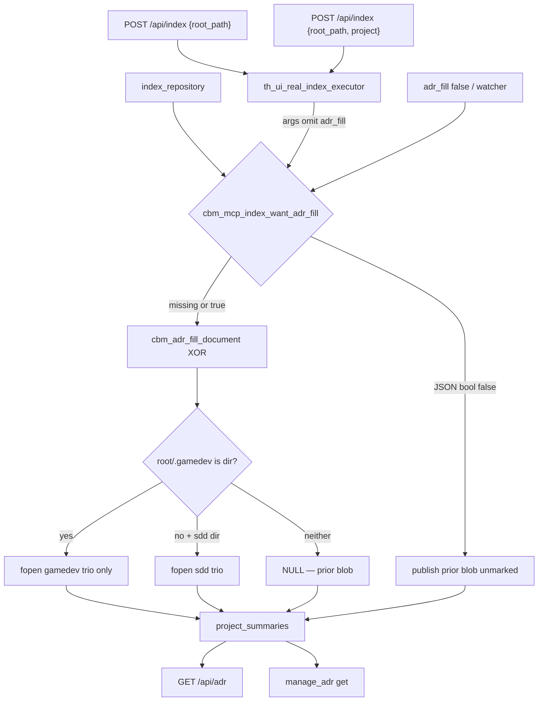

# Task #2 — HTTP + MCP + watcher Gherkin (gamedev XOR)
Reading time: 2-3 min
Last updated: 2026-08-31 — spec-013-r9w-adr-fill-gamedev-trio | Patterns: ✓

## What changed (plain language)

Dashboard Reindex, first create-index, and `index_repository` now fill ADR from the gamedev trio when the folder has a `.gamedev/` directory. Leftover sdd-skill Purpose/Stack/Decisions do not appear. Hand-written notes in the manual region survive. Background jobs that pass `adr_fill: false` still leave the blob unmarked.

No new endpoint. The same helper Task #1 changed is what the existing persist path already calls. This task only added live job tests.

## Files modified

| File | What it does | Lines ± |
|---|---|---|
| `tests/test_httpd.c` | `ui_adr_fill_gamedev_tree` + leftover sdd writer + 9 job Gherkin | 5394; new block `:3192` |
| `tests/test_mcp.c` | `mcp_write_gamedev_tree` + 3 MCP Gherkin | 11239; new block `:6453` |

`adr_fill.c`, pipeline, discover, mcp production, HTTP handlers, and graph-ui were not edited.

## Key decisions

| Decision | Why | ADR |
|---|---|---|
| Tests only; reuse POST `/api/index` + `index_repository` | Trio choice is inside the helper | SDD-ADR-058 |
| New tree helpers write `.gamedev/` (and leftover sdd separately) | spec-004 `ui_adr_fill_tree` must stay sdd-only | plan risk |
| Watcher Gherkin is `adr_fill: false` persist | Same as spec-004; do not start a live auto_watch poll | SDD-ADR-019 |
| Unreadable HTTP uses directory-at-path, not chmod 0 | `.gamedev` is not ALWAYS_SKIP; mode-000 fails semantic_manifest | SDD-ADR-022, SDD-ADR-061 |
| Both skill dirs gone: unmarked leftover stays unmarked | Helper NULL; job success | SDD-ADR-060 |
| POST `/api/adr` 32768 and admission 409/202 unchanged | Not this spec | SDD-ADR-020, spec-003 |

## How a job picks the trio

GET `/api/adr` and `manage_adr` get read the same blob. Next user-triggered index refreshes generated and keeps the MANUAL span.

## Debugging

| If this fails | File:line | Cause | Fix |
|---|---|---|---|
| Dual-tree GET has `PURPOSE-SDD-*` | `test_httpd.c:3262` | XOR lost or fixture grew mixed relatives | `ui_adr_fill_gamedev_tree` + leftover sdd (`:3200`, `:3219`); helper must not fopen sdd |
| Create `{root_path}` unmarked with `.gamedev/` | `test_httpd.c:3374` | Bare POST skipped fill | Same executor as Reindex; name from path |
| Add `.gamedev/` still shows `PURPOSE-SDD-MVP1` | `test_httpd.c:3433` | Second job did not overwrite generated | One Reindex; `# Keep notes` stays in MANUAL |
| Empty `.gamedev/` filled leftover sdd | `test_httpd.c:3532` | Empty dir treated as missing | Dir present → markers, no `PURPOSE-SDD-EMPTYDIR` |
| Remove `.gamedev/` still shows gamedev extract | `test_httpd.c:3572` | Dir left behind or fill skipped | Next Reindex uses sdd (`PURPOSE-SDD-RESTORED`) |
| Both dirs gone invented `CBM-GENERATED` | `test_httpd.c:3617` | NULL path not taken | Content stays `# Last gamedev generated leftover` |
| Unreadable Purpose still copied / job failed | `test_httpd.c:3661` | chmod 0 hashed by discover | Directory-at-path at `game_context.md` (`:3684-3689`); job 202 then success |
| `PURPOSE-HAND-EDIT-GAME` survives Reindex | `test_httpd.c:3716` | Fill skipped or trio missing canonical | POST `/api/adr` then Reindex; GET has `PURPOSE-CANONICAL-GAME` |
| MCP get misses `PURPOSE-MCP-GAME` | `test_mcp.c:6479` | `adr_fill` false or sdd trio opened | `index_repository` without false; store matches GET |
| `# New notes` gone after next index | `test_mcp.c:6529` | MANUAL span dropped | Whole-doc update; splice keeps MANUAL |
| `adr_fill: false` wrote gamedev markers | `test_mcp.c:6599` | Gate ignored JSON bool false | Blob stays `# Before watch` |

## Project fit

- Before: Task #1 XOR was unit-only. Live create/Reindex/`index_repository` on a Game path were unproven.
- After: 9 HTTP + 3 MCP job tests cover dual-tree, create, switch, remove, both-gone, partial, empty dir, unreadable, replace, MCP same-blob, manage_adr survive, watcher skip. spec-004 sdd HTTP fixtures stay green.
- Next: Task #3 AdrTab generic stamp + warning (no `gamedev-skill` chrome).

## Pattern Notes

Patterns: ✓. Same job path as spec-004: real executor, `http_wait_index_done`, `http_seed_adr`, `adr_fill: false` for watcher. New helpers sit next to `ui_adr_fill_tree` and do not change that sdd-only writer. Unreadable HTTP uses the directory-at-path fallback from SDD-ADR-022 because `.gamedev` stays on the graph (SDD-ADR-061). No production hook change.

Constitution IX.5 still names the sdd trio. Same close-time recommendation as Task #1 — not a Task #2 defect.

## Quick refs

- Spec US-001 / US-002 / US-003 / US-005 / US-006: `.sdd-skill/specs/spec-013-r9w-adr-fill-gamedev-trio/spec.md`
- Plan: `.sdd-skill/specs/spec-013-r9w-adr-fill-gamedev-trio/plan.md`
- ADR: SDD-ADR-058 (XOR), SDD-ADR-060 (NULL), SDD-ADR-061 (no ALWAYS_SKIP), SDD-ADR-019 (flag)
- Tests: `scripts/test.sh --suites httpd` (117 passed / 1 skipped); `--suites mcp` (201 passed / 2 skipped)
- Constitution: I.2, IV.3 (no new endpoint), V.3, VII.2, IX.5 (sdd wording still incomplete)
