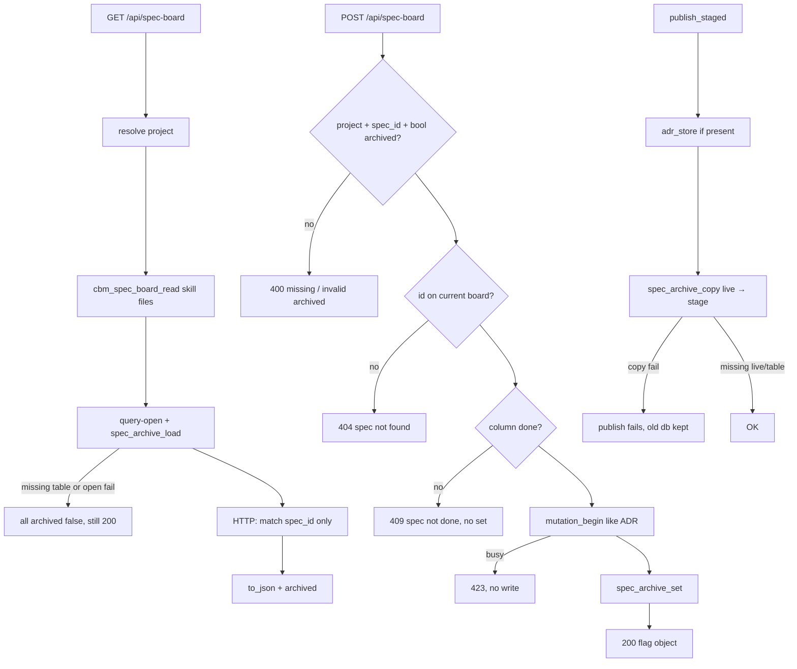

# Task #2 — HTTP POST + GET merge + C Gherkin + publish copy
Reading time: 2-3 min
Last updated: 2026-08-30 — spec-006-k3n-spec-archive | Patterns: ✓

## What changed (plain language)

The Specs board GET now paints an `archived` yes/no on every card. That flag comes from the project cache database after the skill files are read — not from rewriting `active.json` or spec.md. A leftover flag for a folder the board no longer lists does not invent a card. A leftover true flag on a Todo card stays in JSON but does not change the column.

Archive and Unarchive are POST on the same `/api/spec-board` path. Success returns only the project, spec id, and flag — not the whole board. A Todo spec is rejected and nothing is stored. After a full Reindex dump, flags are copied from the live database onto the new file so hidden Done cards do not come back. The Specs UI is still later tasks.

## Files modified

| File | What it does | Lines ± |
|---|---|---|
| `src/ui/http_server.c` | GET merge after read; POST mutate + 423 lock; dispatch GET/POST | +~220 (this task; file also has prior specs) |
| `src/ui/spec_board.h` | `bool archived` on the entry; read must leave 0 | +~8 (this task) |
| `src/ui/spec_board.c` | `to_json` emits `"archived"`; read never sets it | +~15 (this task; file also has spec-005) |
| `src/pipeline/pipeline.c` | `publish_staged` copies `spec_archive` live→stage after ADR | +~20 (this task) |
| `tests/test_httpd.c` | GET merge / POST 200/409/404/400/423 / publish copy | +~430 (this task) |
| `tests/test_spec_board.c` | `to_json` false/true; read stays all false | +~60 (this task) |

`store.c` APIs are Task #1. graph-ui, MCP, `adr_fill`, and `sqlite_writer.c` were not edited.

## Key decisions

| Decision | Why | ADR |
|---|---|---|
| POST on existing `/api/spec-board` | GET-only could not mutate; a sibling path is a new endpoint | SDD-ADR-030, IV.3 |
| Merge in HTTP after `cbm_spec_board_read` | Reader stays skill-file only; no SQLite in `spec_board.c` | SDD-ADR-030 |
| 200 is `{project, spec_id, archived}` | UI must refetch GET anyway; do not couple POST to board shape | SDD-ADR-031 |
| Mutation lock like ADR save | Persist must not land on a file `publish_staged` is about to replace | plan / `handle_adr_save` |
| 409 / 404 / 400 before lock and before `set` | Failed archive must write nothing | US-006 |
| `publish_staged` copy after ADR write | Full dump rebuilds without this table; incremental clone already keeps it | SDD-ADR-033 |
| Missing table / open fail on GET → all false, 200 | Query-open skips DDL; do not 500 a pre-table `.db` | SDD-ADR-029, SDD-ADR-030 |
| Zero skill writes | Archive is CBM-owned | I.2, US-001 / US-005 |

## How GET merge, POST, and publish copy work

`spec_board.c` never opens the store. POST does not return `sdd_skill_present` / `specs`. Other HTTP methods on this path fall through (no 405).

## Debugging

| If this fails | File:line | Cause | Fix |
|---|---|---|---|
| GET `archived` always false after a set | `http_server.c:454-460`, `:498-499` | Query-open or load failed (degrades) | `spec_board_apply_archive_flags` after read. Missing table is empty, not 500. Test `test_httpd.c:3310` |
| GET invents `spec-099-zzz-gone` | `http_server.c:462-469` | Merge appended store rows | Apply onto matching `e->id` only. Test `:3330` |
| Leftover Todo lost `"archived":true` or changed column | `http_server.c:462-469` | Merge skipped non-done or rewrote column | Flag apply is id-only. Test `:3331-3332` |
| `to_json` omits `"archived"` | `spec_board.c:752-756` | Format string dropped the key | Every spec emits `"archived"`. Test `test_spec_board.c:794` |
| Read invents `archived` true | `spec_board.c` (no store include) | SQLite leaked into the reader | `cbm_spec_board_read` leaves 0. Test `:818` |
| POST 200 is the full board | `http_server.c:642-643` | Returned `to_json` | Flag object only. Test `test_httpd.c:3366-3367` |
| 409 still persisted | `http_server.c:605-609` | `set` ran before the done check | 409 before lock and before `set`. Test `:3402` |
| Todo POST is 200 | `http_server.c:605-608` | Column check skipped | `column != "done"` → `{"error":"spec not done"}` |
| Unknown `spec_id` is not 404 | `http_server.c:600-603` | Orphan POST wrote a row | `spec_board_find` miss → `spec not found`. Test `:3447` |
| `archived:"yes"` is not 400 | `http_server.c:563-566` | String accepted as bool | `yyjson_is_bool` or `invalid archived`. Test `:3495` |
| Missing `project` is not 400 | `http_server.c:568-580` | Empty counted as present | Empty string is missing. Test `:3472` |
| Unknown project is not 404 | `http_server.c:588-590` | Different error string | Same `project not found` as GET. Test `:3520` |
| 423 still wrote | `http_server.c:612-616` | `set` before `mutation_begin` | Same lock as `handle_adr_save:1119`. Test `:3545` |
| Flags vanish after Reindex dump | `pipeline.c:1799-1808` | Copy skipped or treated fail as OK | After ADR write; copy fail fails publish. Test `test_httpd.c:3575` |
| `active.json` bytes changed on 200 or 409 | `test_httpd.c:3352-3371`, `:3415-3433` | Handler wrote skill files | Zero `fopen` write under `.sdd-skill/`. Snapshot around both POSTs |
| Sibling `/api/spec-archive` appeared | `http_server.c:2213-2224` | New path | Path match then GET vs POST. Other methods fall through |

## Project fit

- Before: Task #1 added `spec_archive` set/load/copy. GET still had no flag. POST did not exist. A full dump publish would drop the table.
- After this task: GET merges flags onto listed ids. POST mutates with the plan’s error strings and a flag-object 200. `publish_staged` copies flags live→stage after the ADR write. Specs chrome is still absent.
- Next: Task #3 SpecBoardTab filter + session Show archived + Archive/Unarchive. Task #4 maps remaining Vitest Gherkin.

## Pattern Notes

Patterns: ✓. POST is on the existing `/api/spec-board` family (IV.3) — no sibling path, no MCP tool. Merge is a static apply in `http_server.c` after `cbm_spec_board_read`; `spec_board.c` has no `store.h` and never sets `archived`. 200 is the flag object (SDD-ADR-031), not `cbm_spec_board_to_json`. Mutation lock + 423 string match `handle_adr_save`. 409/404/400 return before lock and before `set`. `publish_staged` copies after `adr_store`; `adr_fill` untouched (SDD-ADR-033). GET degrade (missing table/open) stays 200 all-false, same class as Task #1 load probe. yyjson + `cbm_json_escape` + heap `cbm_spec_board_t` match prior HTTP. Fixtures under `/tmp`. Breadcrumbs on `http_server.c` (apply/get/post), `spec_board.h`, `spec_board.c`, `pipeline.c` (`publish_staged`), `test_httpd.c`, `test_spec_board.c`.

Constitution has I–IX only (no Section X). IX.2 still says Archive is not part of spec-005 — true; this is spec-006 HTTP. IX.5 fill/fence unchanged. Persist + merge + 200 body + copy hook are locked by SDD-ADR-029..033. No constitution gap this task (IX archive sentence waits for spec close).

## Quick refs

- Spec US-001 (POST 200) / US-005 / US-006: `.sdd-skill/specs/spec-006-k3n-spec-archive/spec.md`
- Plan API + Testing Strategy: `.sdd-skill/specs/spec-006-k3n-spec-archive/plan.md`
- ADR: SDD-ADR-030 (same path + HTTP merge); SDD-ADR-031 (flag object); SDD-ADR-033 (publish copy)
- Tests: `scripts/test.sh --suites spec_board,httpd` (105 passed, 1 skipped)
- Constitution: I.2 (no cycle writes), II.1 (`cbm_` C11), IV.3 (existing HTTP family), V.3 (C tests), VI.2 (loopback unchanged), VII.2 (breadcrumbs), IX.2 (Archive not in spec-005), IX.5 (`adr_fill` not this task)
