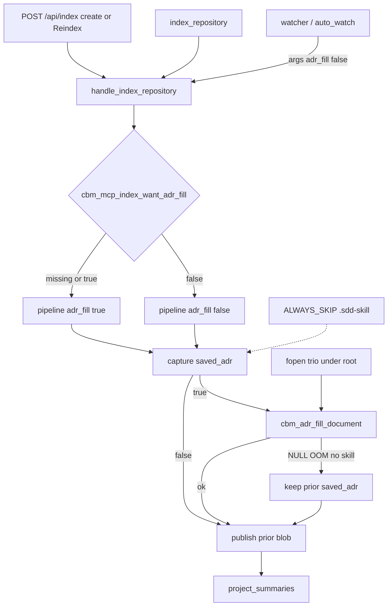

# Task #2 — Pipeline hook + `.sdd-skill` skip
Reading time: 2-3 min
Last updated: 2026-08-30 — spec-004-j8k-adr-parse-on-reindex | Patterns: ✓

## What changed (plain language)

A user-triggered index (Dashboard Reindex, first create, or `index_repository`) now splices the Task #1 helper into the saved ADR after capture and before the store write. Background watcher jobs pass a false flag and leave the blob alone.

The skill folder is skipped during discover, so those three files are not graph File nodes. Fill still reads them with fopen. HTTP/MCP job Gherkin and the ADR tab stamp are not this task.

## Files modified

| File | What it does | Lines ± |
|---|---|---|
| `src/pipeline/pipeline.h` | `adr_fill` accessors + apply / would_change | +18 |
| `src/pipeline/pipeline.c` | Default false; splice after capture; OOM keeps prior | +48 |
| `src/pipeline/pipeline_incremental.c` | Same splice on persist; force-full if fill would change | +56 / −5 |
| `src/discover/discover.c` | `ALWAYS_SKIP_DIRS` += `.sdd-skill` | +5 |
| `src/mcp/mcp.h` | `cbm_mcp_index_want_adr_fill` | +4 |
| `src/mcp/mcp.c` | Default true unless `adr_fill: false`; set on pipeline | +~30 fill (file also has prior admit hunks) |
| `src/daemon/application.c` | Watcher args encode false; equality strips the key | +~40 fill |
| `src/daemon/application_internal.h` | Watcher-args / equal test seams | +5 |
| `tests/test_adr_fill.c` | Five flag true/false / would_change tests | +~104 |
| `tests/test_discover.c` | Dir skip + trio not File nodes | +34 |
| `tests/test_mcp.c` | Gate defaults true | +10 |
| `tests/test_daemon_application.c` | Watcher false + strip subscribe | +36 |
| `tests/repro/repro_invariant_discovery_fqn.c` | GREEN `.sdd-skill` | +1 |

No HTTP body-cap or AdrTab chrome in this task.

## Key decisions

| Decision | Why | ADR |
|---|---|---|
| Capture-then-splice, then one publish | Restore and parse must not fight | SDD-ADR-019 |
| Intent flag, not incremental vs full | User Reindex can take the incremental persist path and must still fill | SDD-ADR-019 |
| `cbm_pipeline_new` → false | Direct `cbm_pipeline_run` tests stay inert | SDD-ADR-019 |
| `index_repository` true unless JSON `adr_fill: false` | HTTP/MCP share this handle; flag not on the tool schema | SDD-ADR-019, US-005 |
| Watcher args false; strip in args-equal | Subscribe to an in-flight user job still works | SDD-ADR-019 |
| Force-full when fill would change ADR | Trio is ALWAYS_SKIP so it never dirties the manifest | SDD-ADR-023 |
| Fill NULL / OOM keeps prior blob | Parse must not fail the index job | US-003 |
| `.sdd-skill` in ALWAYS_SKIP | Fill is out-of-graph fopen; I.2 no write-back | SDD-ADR-023 |

## How user vs watcher is decided



User-triggered is the job intent. A Dashboard Reindex that takes `try_incremental_or_delete_db` still fills. A watcher incremental on the same persist path does not. A no-change incremental forces a full rebuild only when fill would change the stored ADR.

## Debugging

| If this fails | File:line | Cause | Fix |
|---|---|---|---|
| Watcher incremental writes `CBM-GENERATED` | `application.c:3399` | Watcher args omitted `adr_fill: false` | `application_build_index_args(..., require_live_watch)`; test seam at `:3580` |
| Watcher still fills after false args | `mcp.c:1561-1563` | Gate treated a non-bool or ignored false | Only JSON bool false turns want off; hook is `:8189` |
| User Reindex / `index_repository` leaves unmarked | `mcp.c:8189` | Pipeline left at `new()` default | Must `set_adr_fill` from `cbm_mcp_index_want_adr_fill` |
| Full persist unmarked with skill + flag true | `pipeline.c:1997` | Apply not called after capture | Splice before `publish_generation`; NULL fill keeps prior (`:334-335`) |
| Incremental persist unmarked with flag true | `pipeline_incremental.c:2898` | Apply skipped on the dump path | Same apply after capture; staging clone is `:2278-2290` |
| Unchanged-tree Reindex skips fill | `pipeline_incremental.c:2448` / `:2523` | Trio never dirties the manifest | `adr_fill_would_change` must force full |
| Fill OOM / no-skill fails the job | `pipeline.c:330-335` | NULL treated as fatal | Return; leave `*saved_adr`; pipeline rc stays success |
| `cbm_pipeline_new` starts with fill on | `pipeline.c:277` | Default flipped | Must stay false |
| Watcher cannot subscribe to a user job | `application.c:1583` | `adr_fill` kept in args-equal | Strip the key in `normalize_defaults` |
| Trio files appear as File nodes | `discover.c:57` / `:351` | Dir not in ALWAYS_SKIP | `cbm_should_skip_dir(".sdd-skill")` |
| `adr_fill` listed on the MCP tool | `mcp.c:391-408` | Flag leaked into schema | Keep it watcher-only; not a tool property |

## Project fit

- Before: `cbm_adr_fill_document` existed and was unit-tested. Index restore wrote `saved_adr` as-is. `.sdd-skill` was walkable because `.md` is a language.
- After: User-triggered persist splices when the flag is true. Watcher args force false. Skill dir is skipped. GET `/api/adr` after a live HTTP/MCP job is Task #3.
- Next: Task #3 HTTP + MCP + watcher Gherkin (critical path). Task #4 AdrTab stamp + warning can run in parallel (needs the marker string only).

## Pattern Notes

Patterns: ✓. Shared handle + flag matches spec-003 `cbm_identity_admit` (one gate for HTTP/MCP). Skip list matches existing ALWAYS_SKIP. Apply is best-effort fopen like Task #1 / spec_board; no write to cycle files (I.2). Dedicated `cbm_mcp_index_want_adr_fill` is required because `cbm_mcp_get_bool_arg` defaults missing keys to false. Incremental force-full is the same persist hook, not a second fill path.

Constitution has I–IX only (no Section X). IX.2 names spec-004 but still does not lock the fence, the user-triggered-only gate, or “skill dir is not graph source.” Not a code defect this task.

```
📜 CONSTITUTION RECOMMENDATION
Observed: Task #2 now runs fill on user-triggered persist only, watcher args stay false, and `.sdd-skill` is ALWAYS_SKIP. IX.2 names spec-004 but is silent on the in-document fence and that gate.
Recommendation: Add to Section IX at spec close — "Generated/manual HTML comments are the in-document fence; fill runs on user-triggered index only; `.sdd-skill` is not graph source; skill-file reads are best-effort fopen and never write cycle files."
→ @planner evaluates, creates ADR if agreed
```

## Quick refs

- Spec US-001 / US-003 / US-005: `.sdd-skill/specs/spec-004-j8k-adr-parse-on-reindex/spec.md`
- Plan: `.sdd-skill/specs/spec-004-j8k-adr-parse-on-reindex/plan.md`
- ADR: SDD-ADR-019 (hook + flag), SDD-ADR-023 (ALWAYS_SKIP)
- Tests: `scripts/test.sh --suites adr_fill,discover,mcp,daemon_application,incremental`
- Constitution: I.2, II.1, V.3, VII.2, IX.2
