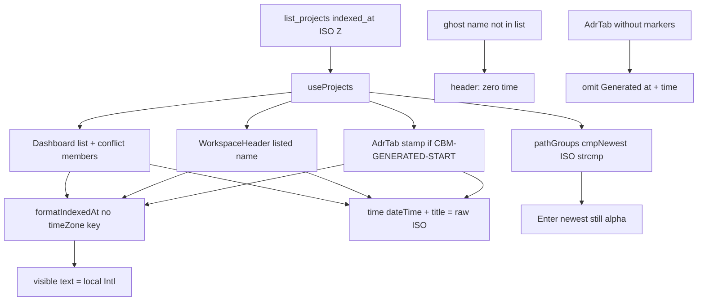

# Task #2 — Surface Gherkin: local text, raw ISO dateTime/title
Reading time: 2-3 min
Last updated: 2026-08-30 — spec-007-n6p-last-indexed-local | Patterns: ✓

## What changed (plain language)

Dashboard rows, the workspace header, and the ADR "Generated at" stamp now prove the same clock contract: what you read is the helper's local string; hover and the hidden machine timestamp stay the raw ISO from the list. A garbage `indexed_at` like `not-a-date` stays visible as that raw text — no invented clock.

Product screens were not rewritten. They already called `formatIndexedAt` inside `<time dateTime={indexed_at} title={indexed_at}>`. This task locked that in Vitest.

## Files modified

Working-tree `WorkspaceHeader.test.tsx` and `AdrTab.test.tsx` are untracked (created in earlier specs). `Dashboard.test.tsx` is tracked and also carries prior uncommitted work. Task #2 hunks below.

| File | What it does | Lines ± |
|---|---|---|
| `graph-ui/src/components/Dashboard.test.tsx` | List + conflict: `dateTime`/`title` raw ISO, text = helper; invalid raw; Enter still `alpha` | +16 invalid (`:135-150`); list `:111-117`; conflict `:448-457` |
| `graph-ui/src/components/WorkspaceHeader.test.tsx` | Listed helper + title; ghost still zero `time`; invalid raw | +13 invalid (`:83-95`); listed `:76-78`; ghost `:97-105` |
| `graph-ui/src/components/AdrTab.test.tsx` | Stamp helper + title; no-marker omits stamp; invalid raw; textarea no clock | +14 invalid (`:208-221`); stamp `:199-203`; no-marker `:223-235` |

Dashboard / WorkspaceHeader / AdrTab `.tsx` not edited this task (already wired). No C, HTTP, i18n, `pathGroups.ts`, or `colors.ts`. `colorForLabel("Function") === "#06b6d4"` locked in the suite run (`colors.test.ts:27`).

## Key decisions

| Decision | Why | ADR |
|---|---|---|
| Test-only; do not rewire the three surfaces | Graph already shows one helper; a second clock would drift | SDD-ADR-034 |
| Visible text = `formatIndexedAt(...)`; `dateTime` + `title` = raw `indexed_at` | Operator clock vs stored instant | SDD-ADR-034 + SDD-ADR-003 instant half |
| Invalid `not-a-date` stays raw on all three (AdrTab-with-markers) | Corrupt list rows stay honest; no invented datetime | US-006 |
| Ghost omits every `time`; no-marker AdrTab omits stamp | Same omit rules as spec-002 / spec-004 | SDD-ADR-013, US-003 / US-004 |
| Conflict newest still ISO-compares; Enter still `alpha` | Display TZ must not change grouping | SDD-ADR-016 |
| Host UTC: Dashboard `dateTime` still the raw ISO | Limit Case — local text may equal the old UTC pin | SDD-ADR-034 |

## How visible text vs dateTime split

Host UTC: helper text may match the old UTC-pinned string. `dateTime` is still the raw ISO (`Dashboard.test.tsx:111-112`). Tests compare text to `formatIndexedAt`, not a hardcoded wall clock.

## Debugging

| If this fails | File:line | Cause | Fix |
|---|---|---|---|
| List/conflict/header/stamp text !== `formatIndexedAt` | Dashboard `:248-249` / `:154-155`; header `:31-32`; AdrTab `:123-124` | Surface bypassed the helper or hardcoded a UTC string | Children must be `formatIndexedAt(indexed_at, lang)`. Tests `:113` / `:450` / `:78` / `:201` |
| `dateTime` or `title` shows formatted local text | same `<time>` attrs | Helper output written into attributes | Instant stays raw `indexed_at`. Tests `:111-112` / `:76-77` / `:199-200` |
| Valid ISO paints as the raw ISO string | `formatIndexedAt.ts:26-29` | `Date` parse NaN, or helper skipped | Valid ISO must hit helper `:30`. Invalid/empty is supposed to return raw |
| `not-a-date` invented a clock (Dashboard / header / AdrTab-with-markers) | helper `:27-28`; surfaces above | Formatter ran on Invalid Date, or a fallback datetime leaked | Text and `dateTime` must be `not-a-date`. Tests `:147-149` / `:91-93` / `:217-218` |
| Ghost header shows a `time` | `WorkspaceHeader.tsx:21,28` | Lookup matched the wrong name or `/api/index-status` | `projects.find` by exact `name`; omit when miss. Test `:97-105` |
| AdrTab without markers shows "Generated at" / a `time` | `AdrTab.tsx:113,120` | Gate used live `content` instead of `lastClean` | `hasGenerated && listed`. Test `:223-235` |
| ISO (or a formatted clock) appears in the ADR textarea | `AdrTab.tsx:77-81,144` | Chrome copied into `content` | POST `{project, content}` equals GET blob. Tests `:203` / `:219-220` |
| Conflict Enter opens `alpha-old` | `pathGroups.ts:17-26`; Dashboard `:141` | Display TZ leaked into newest pick | `cmpNewest` is ISO string then name. Test `:455-457` |
| Host-UTC Dashboard `dateTime` drifted off the ISO | Dashboard `:248` / test `:111` | Attribute used helper output | `dateTime` stays raw even when `localFmt === utcFmt` |
| Function hex drifted | `colors.test.ts:27` | `LABEL_COLORS` or CSS vars leaked | `colorForLabel("Function") === "#06b6d4"` |

## Project fit

- Before: Task #1 dropped the UTC pin on the helper. Screens already called it, but tests still allowed year/day/`not.toBe(iso)` and QUICK-DEBUG said Task #2 owned `dateTime` / `title`.
- After this task: three surfaces locked — local visible text, raw ISO attributes, invalid raw, ghost / no-marker omit, newest still `alpha`.
- Next: @review then @tester. Last impl task — Trigger B closeprep waits until @tester PASS. Do not write spec-summary or PROJECT-OVERVIEW here.

## Pattern Notes

Patterns: ✓. Same helper, same `<time dateTime title>` (IV.4, SDD-ADR-034). No second formatter. No C/HTTP/MCP/i18n (II.3, IV.3). Surfaces left wired. Newest still ISO strcmp (`pathGroups.ts` not opened). Graph hex locked in the suite run (III.2). Vitest + fetch-mock, no live daemon (V.1, V.4). English Then text (II.3). Breadcrumbs on all three edited tests (VII.2) — see below. Constitution has I–IX only (no Section X). IX is silent on display TZ — a sentence can wait for spec close; not a defect this task.

Breadcrumbs (`Dashboard.test.tsx` / `WorkspaceHeader.test.tsx` / `AdrTab.test.tsx` lines 1-7): `@sdd-task` Task #2 Surface Gherkin; `@sdd-spec` spec-007-n6p-last-indexed-local; `@sdd-decision` SDD-ADR-034; `@sdd-why` helper text + raw ISO attrs; `@human-debug` text !== helper → bypass; `dateTime` !== ISO → attrs rewritten.

## Quick refs

- Spec US-002–US-006 surfaces: `.sdd-skill/specs/spec-007-n6p-last-indexed-local/spec.md`
- Plan Gherkin → owner: `.sdd-skill/specs/spec-007-n6p-last-indexed-local/plan.md` (Testing Strategy)
- ADR: SDD-ADR-034 (display TZ); SDD-ADR-003 instant half + SDD-ADR-016 stay
- Tests: `cd graph-ui && npx vitest run src/components/Dashboard.test.tsx src/components/WorkspaceHeader.test.tsx src/components/AdrTab.test.tsx src/lib/colors.test.ts` (38 passed)
- Constitution: II.3 (no new i18n), III.2 (hex lock), IV.4 (existing `indexed_at`), V.1–V.2 / V.4 (Vitest + Gherkin map, no daemon), VII.2 (breadcrumbs)
