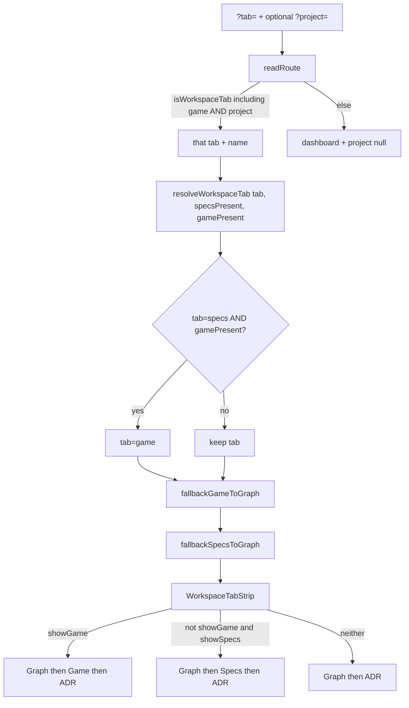

# Task #2 — TabId, route kernels, strip, i18n
Reading time: 2-3 min
Last updated: 2026-08-31 — spec-010-c4h-game-tab-silent-win | Path=full | Patterns: ✓

## What changed (plain language)

The address bar now accepts `?tab=game` when a project is also in the URL. The closed workspace set is Graph, Specs, ADR, and Game. A leftover `?tab=specs` on a gamedev path is meant to become Game, not Graph. A `?tab=game` without gamedev is meant to become Graph.

The tab strip can show Game (Graph then Game then ADR) when `showGame` is true. App does not pass that flag yet. There is still no Game pane.

## Files modified

Tracked i18n + types (+ i18n.test) together: +85 / −16. Route and strip files are untracked vs HEAD (full file length = this-task size).

| File | What it does | Lines ± |
|---|---|---|
| `graph-ui/src/lib/types.ts` | `WORKSPACE_TABS` + `game`; `isWorkspaceTab` / `TabId` | +28 / −6 (tracked). Const `:93` |
| `graph-ui/src/lib/i18n.ts` | `tabs.game` en+zh; `gameBoard` missing-state + phase labels | +30 / −5 (tracked). en `:18`, `:118-123`; zh `:130`, `:229-234` |
| `graph-ui/src/lib/i18n.test.ts` | Locks "Game", "state.md missing", three EN phase strings | +27 / −5 (tracked). `:87-96` |
| `graph-ui/src/lib/route.ts` | `readRoute` / `routeUrl`; `fallbackSpecsToGraph` kept; `fallbackGameToGraph` + `resolveWorkspaceTab` | NEW 61. Kernels `:40-43`, `:47-50`, `:54-61` |
| `graph-ui/src/lib/route.test.ts` | Closed set + `tab=game`; both fallbacks; resolve order | NEW 103. Lock `:24-26`; resolve `:93-101` |
| `graph-ui/src/components/WorkspaceTabStrip.tsx` | Additive `showGame`. Game wins if both flags true | NEW 71. Display `:37-41` |
| `graph-ui/src/components/WorkspaceTabStrip.test.tsx` | showGame order; omit when false; both-true Game wins; no disabled placeholder | NEW 171. `:71-91`, `:94-114`, `:117-130` |

`App.tsx` still spec-009 (`showSpecs={present}`, `fallbackSpecsToGraph` only). `GameBoardTab` does not exist. No C this task.

## Key decisions

| Decision | Why | ADR |
|---|---|---|
| `WORKSPACE_TABS = ["graph","specs","adr","game"]` | `readRoute` / `routeUrl("game", name)` must accept the id. Const order is not strip order | US-001 / US-006 |
| Keep `fallbackSpecsToGraph(tab, present)` signature | spec-009 omit-until-true stays a boolean kernel | SDD-ADR-043 |
| Sibling `fallbackGameToGraph` + `resolveWorkspaceTab` | Leftover `tab=specs` + gamedev → `game`, not Graph. Do not fold the two fallbacks | SDD-ADR-043 |
| Same `WorkspaceTabStrip`, additive `showGame` | Reuse the strip (US-006). Default false so App still compiles | US-006 |
| Game wins if both flags true | Defensive silent win. App must not pass both (Task #4) | grill ADR-001 |
| i18n now; chrome later | Labels exist for Task #3 pane. C still emits skill tokens | US-001 / US-003 / US-006 |
| Do not call `/api/skill-presence` | Presence stays GET `/api/game-board` in Task #4 | US-001 |

## How URL tab and presence become the strip

App this task still calls `fallbackSpecsToGraph` only (`App.tsx:83`, `:102`) and does not pass `showGame` (`:124-128` defaults false). Kernels exist unused by App until Task #4.

## Debugging

| If this fails | File:line | Cause | Fix |
|---|---|---|---|
| `?tab=game&project=alpha` reads as Dashboard | `types.ts:93`; `route.ts:25-26` | `WORKSPACE_TABS` missing `game` or parse inlined | Include `"game"`. Test `route.test.ts:24-26`, `:38-39` |
| `fallbackSpecsToGraph` gained args or returns something else | `route.ts:40-43` | Folded into one router | Keep `(tab, present): TabId`. Test `:75-81` (`game` + !present stays `game`) |
| `tab=specs` + gamedev lands Graph | `route.ts:54-61` | Silent-win step skipped or kernels first | `tab === "specs" && gamePresent` → `"game"` then Game then Specs kernels. Test `:93-96` |
| `tab=game` + !gamedev stays game | `route.ts:47-50` | Game kernel skipped | `tab === "game" && !present` → `"graph"`. Test `:84-85`, `:97` |
| Strip order Graph / Specs / Game / ADR | `WorkspaceTabStrip.tsx:37-41` | Used `WORKSPACE_TABS` const order | `showGame` → `["graph","game","adr"]`. Test `:71-86` |
| Both flags paint Specs and Game | `WorkspaceTabStrip.tsx:37-41` | Game-wins branch dropped | `showGame` first. Test `:117-130` |
| Missing `tabs.game` / phase labels / "state.md missing" | `i18n.ts:18`, `:118-123`, `:130`, `:229-234` | Keys omitted or EN drifted | en "Game"; "state.md missing"; "Pre-production" / "Production" / "Post-production & Launch". Test `i18n.test.ts:87-96` |
| Disabled Game placeholder when omitted | `WorkspaceTabStrip.tsx:37-41`, `:52-66` | Hidden tab left disabled | Omit. Do not `disabled`. Tests `:89-91`, `:94-114` |
| App shows Game this task | `App.tsx:124-128` | `showGame` wired early | App still spec-009. Silent-win is Task #4 |
| Game pane appears this task | — | `GameBoardTab` added early | Chrome is Task #3. File does not exist |

## Project fit

- Before: closed set was graph / specs / adr. Strip only had `showSpecs`. `fallbackSpecsToGraph` sent leftover `tab=specs` to Graph. GET `/api/game-board` exists (Task #1) but the URL and strip could not name Game.
- After this task: `tab=game` parses. Sibling kernels + `resolveWorkspaceTab` exist. Strip can show Game. i18n strings are locked. App still spec-009 — kernels unused by App this task.
- Next: Task #3 `GameBoardTab` chrome only. Task #4 App silent-win + dual fetch + deep-links. Task #5 leftover Vitest Gherkin.

## Pattern Notes

Patterns: ✓. Same `?tab=` + `?project=` (constitution IX.1). Same `fallbackSpecsToGraph(tab, present): TabId` as spec-009 (signature unchanged at `route.ts:40-43`). Same `WorkspaceTabStrip`, additive optional `showGame` (default false). Sibling kernels not folded (SDD-ADR-043). No `/api/skill-presence`. No second strip. No C. App `showSpecs={present}` and Enter Graph stay spec-009 until Task #4.

Constitution has I–IX only (no Section X). IX.2 still describes spec-009 Specs = sdd OR grill. The AND NOT gamedev sentence waits for spec close (plan note for @planner). No constitution gap this task.

Breadcrumbs on `types.ts`, `route.ts`, `route.test.ts`, `i18n.ts`, `i18n.test.ts`, `WorkspaceTabStrip.tsx`, `WorkspaceTabStrip.test.tsx`.

## Quick refs

- Spec US-001 / US-006: `.sdd-skill/specs/spec-010-c4h-game-tab-silent-win/spec.md`
- Plan ADR-043 kernels + strip: `.sdd-skill/specs/spec-010-c4h-game-tab-silent-win/plan.md`
- ADR: `.sdd-skill/baseline/ARCHITECTURE_ADR.md` — SDD-ADR-043
- Tests: `cd graph-ui && npx vitest run src/lib/route.test.ts src/components/WorkspaceTabStrip.test.tsx src/lib/i18n.test.ts` (23 passed; App 30 stayed green)
