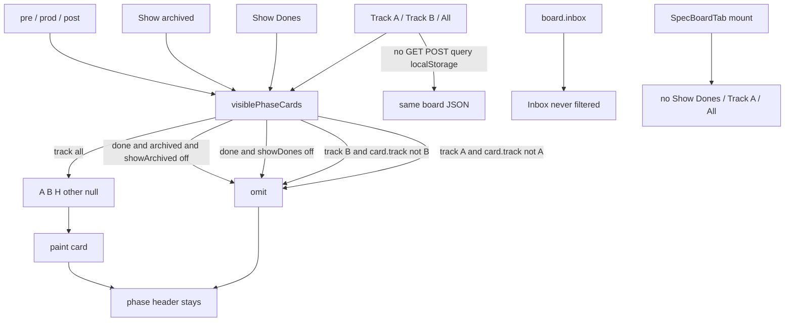

# Task #2 — Track filter, AND leftover, Specs lock, no-persist
Reading time: 2-3 min
Last updated: 2026-09-01 — spec-014-x7m-filters | Path=full | Patterns: ✓

## What changed (plain language)

Track A shows only Track A cards. Track B shows only Track B. All brings back A, B, H, and anything else, then Show Dones / Show archived still apply. An archived done card appears only when both toggles are on. Specs still has Show archived only — no Show Dones, Track A, or All.

Clicking a filter does not fetch or POST. Nothing is written to the URL or localStorage. Inbox stays visible under every combination. Last impl task; closeprep waits for @tester PASS.

## Files modified

`GameBoardTab.tsx` / `i18n.ts` / `SpecBoardTab.tsx` / `useGameBoard.ts` / `App.tsx` / `types.ts` / C were not this task. Chrome + `visiblePhaseCards` stay Task #1.

| File | What it does | Lines ± |
|---|---|---|
| `graph-ui/src/components/GameBoardTab.test.tsx` | Track A/B/All + AND leftover invert + Inbox + header-only + no-persist Gherkin | 2078 (was 1699). Track A `:1773`; both toggles `:1815`; Inbox `:1843`; B then All `:1874`; project/refetch `:1901`; header-only `:1931`; Show archived alone `:1992`; Track A+Dones `:2019`; no-persist `:2045`. Invert remount `:1339`; Unarchive `:1383`; project-change leftover `:1559` |
| `graph-ui/src/components/SpecBoardTab.test.tsx` | Specs mount lock: no Show Dones / Track A / All | 1035. Lock `:1019-1033` |

## Key decisions

| Decision | Why | ADR |
|---|---|---|
| Track exclusive `"A"` / `"B"` / `"all"`; All keeps A, B, H, other, null | Then Track, then dones/archived. H has no own button | SDD-ADR-062, SDD-ADR-064 |
| Archived done iff Show Dones AND Show archived | Invert spec-012 Show archived alone / remount / Unarchive / project-change | SDD-ADR-063 |
| Filter click: fetch spy + localStorage; no C fopen | Skill-file byte Then is N/A in Vitest; UI half is no GET/POST/query/key | SDD-ADR-062 |
| Specs lock in SpecBoardTab.test.tsx only | Do not edit SpecBoardTab.tsx; Game chrome must not leak | SDD-ADR-064; US-001/003 |
| Inbox still `board.inbox`; empty phase = header only | Leftover funnel never disappears; no "No specs yet" | SDD-ADR-062; US-004 |

## How Track, AND leftover, Specs lock, and no-persist run

Show archived alone still hides an archived done card. After Unarchive, the unarchived done stays only while Show Dones is on. Remount / `?project=` starts Show Dones off, Show archived off, All on.

## Debugging

| If this fails | File:line | Cause | Fix |
|---|---|---|---|
| Track A still shows B or H | `GameBoardTab.tsx:72`, `:466-467` | Filter not exclusive or All left on | `setTrackFilter("A")`. Drop `card.track !== "A"`. Test `:1773` |
| Track B hides H and All does not restore it | `GameBoardTab.tsx:73`, `:474-486` | All treated as A/B only | `track === "all"` keeps H / other / null. Test `:1874` |
| Track A + Show Dones paints a Track B done | `GameBoardTab.tsx:72-75` | Track applied after keep-done | Track first, then dones. Test `:2019` |
| Show archived alone reveals an archived done | `GameBoardTab.tsx:74-76` | AND missed or spec-012 leftover | Drop done+archived when `!showArchived`. Test `:1992` / invert `:1339` |
| Both toggles on still hide the archived done | `GameBoardTab.tsx:74-78` | Extra drop | Keep when `showDones && showArchived`. Test `:1815` |
| After Unarchive, card vanishes with Show archived off | `GameBoardTab.tsx:74-76`; test `:1383` | Unarchive still treated as archived | POST `archived: false` then refresh. Stays while Show Dones on |
| Project change keeps Track B / Show Dones | `GameBoardTab.tsx:398-403` | Reset skipped or localStorage | Reset three + expand. Test `:1901` / leftover invert `:1559` |
| GET refetch resets Track / Show Dones | `GameBoardTab.tsx:398-403` | New `board` treated as remount | Reset only on `project`. Test `:1901` |
| Filter click sends GET/POST or `?track=` | `GameBoardTab.tsx:445-487`; test `:127-156`, `:2045` | onClick fetched or wrote URL | Chrome only `setState`. No `track` / `show_dones` / `show_archived` |
| `localStorage` has `showDones` or `gameTrack` | test `:148-156`, `:2045` | Pref written | React state only. SDD-ADR-062 |
| Specs paints Show Dones / Track A / All | `SpecBoardTab.tsx:245-256`; test `:1019` | Game chrome copied | Show archived on Done only. Do not add Game keys |
| Inbox gone under Track / both toggles | `GameBoardTab.tsx:498-499` | Inbox ran through `visiblePhaseCards` | `board.inbox`. Test `:1843` |
| All-done phase lost the header / shows "No specs yet" | `GameBoardTab.tsx:352-378` | Empty-state copy leaked | Header + empty list. Show Dones stays in chrome. Test `:1931` |

## Project fit

- Before: Task #1 landed chrome + predicate + first-paint hide. Track click, leftover AND invert, Specs lock, and no-persist Gherkin were still pending.
- After this task: every remaining spec-014 Then has a Vitest. Silent win / Enter Graph / leftover `tab=specs`→game / Function `#06b6d4` stay. Last impl task.
- Next: @review then @tester. Closeprep waits for @tester PASS. Trigger A (NOT closeprep).

## Pattern Notes

Patterns: ✓.

- Same chrome/predicate as Task #1: `visiblePhaseCards` then Inbox `board.inbox`; exclusive Track onClick; `aria-pressed` not radiogroup (VII.1; SDD-ADR-064).
- Session lifetime like Specs Show archived (`SpecBoardTab.tsx:292`, `:298-303`) and Task #1 `lastProjectRef`: remount / `?project=` reset; GET refetch keeps; no localStorage (SDD-ADR-062).
- Invert leftover spec-012 cases in the same file (AND, remount, Unarchive, project change) — same problem, same predicate, not a second hide path (SDD-ADR-063).
- Specs lock is a test, not a SpecBoardTab.tsx edit (I.1, IV.3). Show archived stays `specBoard.showArchived` (SDD-ADR-057/064).
- Prefer existing GET/POST (IV.3). Filter click must not add query params. Vitest + fetch mock (V.1/V.4). No C this spec (V.3). Breadcrumbs on the two edited test files (VII.2).

Constitution has I–IX only (no Section X). IX.2 still describes spec-012 hide done+archived unless Show archived — true until close appends this spec. Not a gap this task.

## Quick refs

- Spec US-002 / US-003 / US-004: `.sdd-skill/specs/spec-014-x7m-filters/spec.md`
- Plan Track + AND leftover + Specs lock: same folder `plan.md`
- ADR: SDD-ADR-062 (client filter only); SDD-ADR-063 (AND hide); SDD-ADR-064 (aria-pressed trio + i18n split)
- Tests: `cd graph-ui && npx vitest run` → 276 passed
- Constitution: II.2–3, III.1–2, IV.3, V.1/V.3/V.4, VII.1–2, IX.2 (Show archived session; AND + Track supersede at close)
