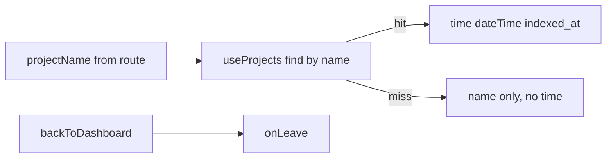

# Task #2 — Workspace header
Reading time: 2-3 min
Last updated: 2026-08-29 — spec-002-p8w-project-workspace | Patterns: ✓

## What changed (plain language)

Inside a project, the identity chip can show the same last-indexed clock as the Dashboard row. If the URL names a project that is not on the list, the name still shows and the clock is omitted. Leave is a back control; unsaved-ADR confirm is not wired yet.

This chip is not mounted in App yet. Task #5 will place it in the brand header.

## Files modified

| File | What it does | Lines ± |
|---|---|---|
| `graph-ui/src/components/WorkspaceHeader.tsx` | Name + optional `<time>` + leave | new |
| `graph-ui/src/components/WorkspaceHeader.test.tsx` | Listed time / ghost no time / onLeave | new |

## Key decisions

| Decision | Why | ADR |
|---|---|---|
| `useProjects` + `formatIndexedAt` | Same freshness as Dashboard; no second field | SDD-ADR-013 / SDD-ADR-003 |
| Ghost omits every `time` | Deep link must not invent index-status | US-005 Gherkin |
| `onLeave` callback only | Dirty confirm is App `requestNavigate` in Task #5 | SDD-ADR-012 |

## How last-indexed is chosen

## Debugging

| If this fails | File:line | Cause | Fix |
|---|---|---|---|
| Ghost shows a clock | `WorkspaceHeader.tsx` listed branch | Lookup matched the wrong name or a second API | `projects.find(p => p.name === projectName)` only; no index-status |
| Listed name has no time | `useProjects` still loading or name mismatch | Wait for list; compare exact `name` | Mock `list_projects` in tests |
| Leave does nothing | `onLeave` not passed | Task #5 must wire leave | Button `aria-label` is `backToDashboard` |

## Project fit

- Before: Graph header chip was name + × only.
- After: reusable identity cluster with freshness. Next: Specs strip (#3), AdrTab (#4), App compose (#5).

## Pattern Notes

Patterns: ✓. Same `<time dateTime>` as Dashboard. Same `useProjects` list-only. Same grayscale tokens. No schema RPC.

## Quick refs

- Spec US-005: `.sdd-skill/specs/spec-002-p8w-project-workspace/spec.md`
- Tests: `cd graph-ui && npx vitest run src/components/WorkspaceHeader.test.tsx`
